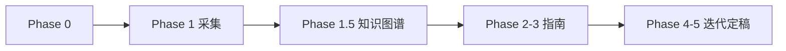

# 计组 × NotebookLM 学习 Skill

> **课程**：计算机组成与体系结构（H）
> **Notebook**：`e87c0462-b512-40df-8d6a-a0f5d4d30c81`
> **仓库根**：含 `notebooklm-raw/` 与 `guides/` 的项目目录

## 课程特点（区别于 AI H）

- **上课节奏**：每周 **周一、周三（实验课）** 为主，部分周有周二加课
- **课程总结文件命名**：`week<N>-周<X>-计组H.md`（如 `week1-周一-计组H.md`）
- **课件体系**：12 章（计算机系统概述 → 数据表示 → 运算部件 → 指令系统 → CPU → ILP → 流水线 → 互连网络 → 存储系统 → 线程级并行 → MIPS32 → 向量体系结构）
- **实验**：Lab1~Lab6（26-Arch 五级流水 RISC-V CPU）；**期末与 Lab4–6 强相关**（MMU/TLB/异常）
- **Lab 仓库（localServer）**：`/home/thesumst/Data2/development/ComputerOrganization/26-Arch`
- **Lab Wiki**：`https://github.com/26-Arch/26-Arch/wiki/`（Lab-1 … Lab-6、实验准备、实验讲解、上板 等）
- **个人报告**：`Doc/Lab{1..6}/report.md`（Lab1–6 已完成，待导入 NotebookLM）
- **资料根目录**：`E:\★Document\1_Study\2_6_2026springTerm\2_计算机组成与体系结构H\`

## 何时启用

- 新周次/新模块：设计 manifest → 采集 → 知识图谱 → 学习指南
- 补采：`supplement-*` batch 或 `--only` 续跑
- 整合迭代：Review 追问回写指南

**不启用**：纯概念答疑（无新周次产出）、与课程流水线无关的任务。

## 角色分工

| 角色 | 职责 |
|------|------|
| NotebookLM | 单问单答，标注来源 |
| `nlm-collect.py` | 认证、代理、采集、重试、落盘 |
| Agent | manifest、通读 raw、知识图谱、叙事整合、追问回写 |
| 用户 | Review、定稿、**Windows 侧 NotebookLM 登录**（见下方认证 SOP） |

**原则**：Agent 以 raw 为素材，必须补：全景节、叙事衔接、易混对比、追问直观块。

## 六阶段流程

```
Phase 0   资料盘点（本地目录 + NotebookLM source 对齐）
Phase 1   采集（manifest + nlm-collect.py → notebooklm-raw/）
Phase 1.5 通读全部 *.answer.md → knowledge-graph.md  ★不可跳过
Phase 2   按图谱写 guides/计组-Week*-学习指南.md
Phase 3   叙事线、mermaid、追问块  ★不可跳过
Phase 4   用户 Review 迭代
Phase 5   定稿（checklist.md）
```



## Phase 0：资料盘点

1. 对齐本地 `2_计算机组成与体系结构H/` 与 NotebookLM source list
2. **Lab 来源核对**（计组特有，期末前必做）：
   - Wiki 10 页是否已 `source add`（见 `guides/计组课程-16周内容梳理.md` §7.1）
   - `26-Arch/Doc/Lab{1..6}/report.md` 是否已导入
   - 课件 `4_Lab/*.pdf` 与 Wiki 要求是否一致
3. 更新 `guides/计组课程-16周内容梳理.md` 进度
4. 标注缺失周次 / 缺失 Lab 来源

## Phase 1：采集

### 命令（在仓库根目录执行）

```bash
cd <repo>
NLM=.cursor/skills/jizu-course-notebooklm/scripts/nlm-collect.py

# 预览
python $NLM notebooklm-raw/manifests/<module>.json --dry-run

# 完整采集
python $NLM notebooklm-raw/manifests/<module>.json --delay 8

# 续跑 / 补采
python $NLM notebooklm-raw/manifests/<module>.json \
  --resume notebooklm-raw/<module>/runs/latest

python $NLM notebooklm-raw/manifests/<module>.json \
  --only <batch-id> --resume notebooklm-raw/<module>/runs/latest

# 合并补采 run
python $NLM merge-runs <src_run> <dst_run>
```

### Manifest 设计原则

- **一个 batch = 一个 chat**（`clear_conversation: true`）
- 复杂主题拆开（如流水线冒险 / 转发 / 分支预测各一问）
- 字段：`id`, `layer`, `priority`, `title`, `prompt`, `clear_conversation`
- 模板：`templates/manifest-template.json`

### Prompt 必含

中文；点名周次+课件编号；要求标注来源；L1 要类比、L3 要数值例、鼓励画图（计组体系结构图很重要）；禁止一 prompt 多问。

### 采集产出

```
notebooklm-raw/<module>/runs/<ts>/
  run.meta.json, run.log, *.prompt.txt, *.answer.md
notebooklm-raw/<module>/runs/latest → 最近 completed run
```

完成判定：存在非空 `*.answer.md`。详见 `docs/raw-data.md`。

## Phase 1.5：知识图谱（必须先于指南正文）

1. **通读** `runs/latest/*.answer.md` 全部 batch
2. **审计**与课纲偏差（NotebookLM 可能混入其他周内容）
3. 产出 `notebooklm-raw/<module>/knowledge-graph.md`：

| 必填节 | 内容 |
|--------|------|
| 认知阶梯 | mermaid flowchart，顺序≠采集顺序 |
| 节点清单 | 认知目标 \| batch \| 关键素材 \| Agent 须补充 |
| 叙事承接表 | 章节 \| 要回答 \| 承接 \| 引出 \| raw |
| batch→章节映射 | 整合深度标注 |
| 课纲审计 | 偏差说明 |

## Phase 2–3：整合学习指南

**详细规范**：`docs/integration-guide.md`（叙事、课本对照、追问答案、mermaid、资料索引）

**硬性要求**（金标准：`guides/计组-Week1-3-学习指南.md` + `guides/计组-Week13-14-学习指南.md`）：

- 元信息头：**主要来源**、**对应课件**、**教材章节**（唐朔飞 + P&H RISC-V）
- §1.4 课本与课件速查 + §2 各节前四列对照表；课件以 `guides/计组课程-16周内容梳理.md` §1.2 为准
- 每个大模块先有**全景节** + **学完你能**（3–5 条），再进细节
- 章级「叙事线」+ 节级「本节要回答」+ **小结 → 下一节承接**
- ≥3 张 mermaid、≥2 组易混对比表、≥3 处追问且每条含 **`> **答**：`**
- 有 Lab 的周次：§3 引用 Wiki / `4_Lab/`；文末 **§资料索引**
- 定稿跑 `docs/checklist.md`

**产出**：`guides/计组-Week{N}-学习指南.md` 或 `guides/计组-Week{N-M}-学习指南.md`

## Phase 4：用户追问补充

1. 追加 manifest batch：`supplement-<主题>`
2. `--only supplement-xxx --resume runs/latest`
3. 回写指南：`> **追问：**` / `> **直观理解：**` / 对比表

## Phase 5：定稿

跑 `docs/checklist.md`，更新 `guides/计组课程-16周内容梳理.md`，用户确认。

## 环境与排错

**认证 SOP（权威）**：`~/service/openclaw/workspace/skills/notebooklm-integration/docs/auth-sop.md`

| 侧 | 职责 |
|----|------|
| Windows | `fix_login_edge.py` 或桌面 `notebooklm-login.ps1` |
| WSL | `sync-auth.py`（`--force` / `--check`）；`nlm-collect.py` 已内置 |

**Agent 禁止**：`notebooklm login`、WSL 浏览器、从 WSL 调 Windows 登录、`sync-auth --refresh`。

其他：代理 `127.0.0.1:7897`、短 UUID、超时 → `docs/troubleshooting.md`。

## 本 Skill 目录

```
.cursor/skills/jizu-course-notebooklm/
├── SKILL.md
├── scripts/nlm-collect.py
├── docs/
│   ├── integration-guide.md   # 整合规范全文
│   ├── raw-data.md            # notebooklm-raw 说明与 git 策略
│   ├── checklist.md           # 定稿检查项
│   └── troubleshooting.md
└── templates/
    └── manifest-template.json
```

## 禁止事项

- 未通读 raw / 未产出知识图谱就写指南
- 大模块无全景节直接推导
- 只粘贴 NotebookLM 输出不做叙事串联
- 一次 prompt 问整周内容
- Agent 编造公式/电路图不标注来源
- Agent 在 WSL 尝试 `notebooklm login` 或浏览器登录（见 auth-sop.md）
