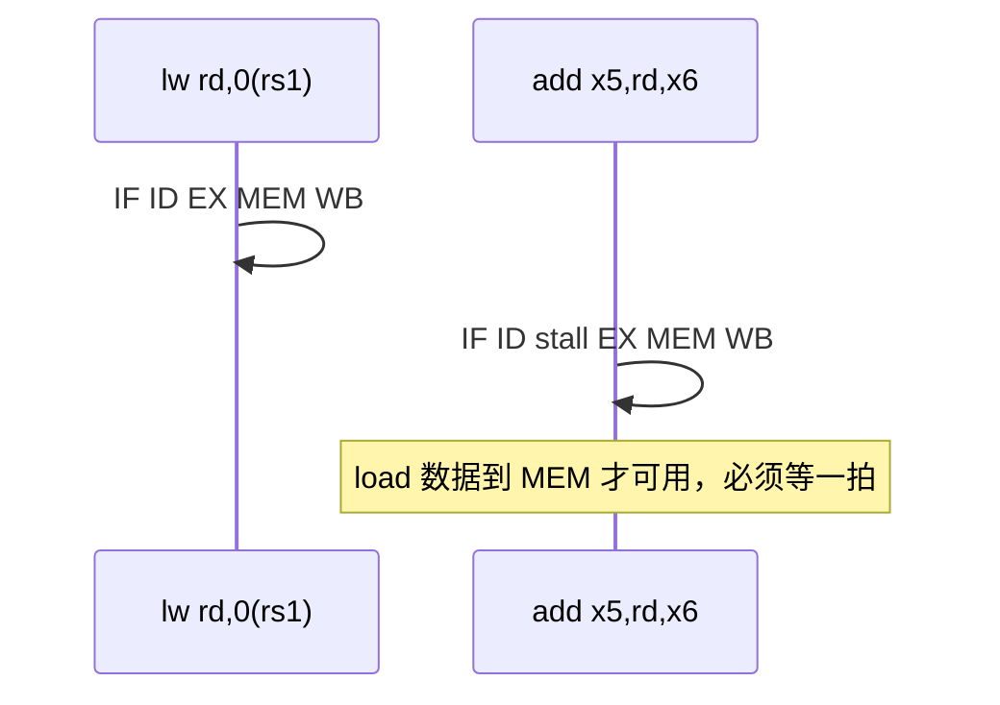
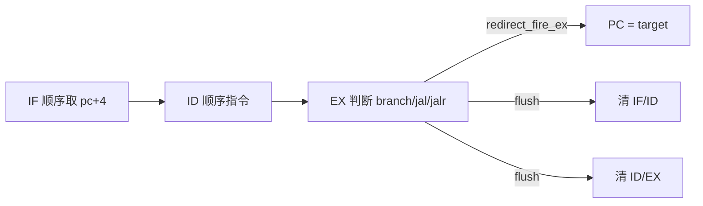
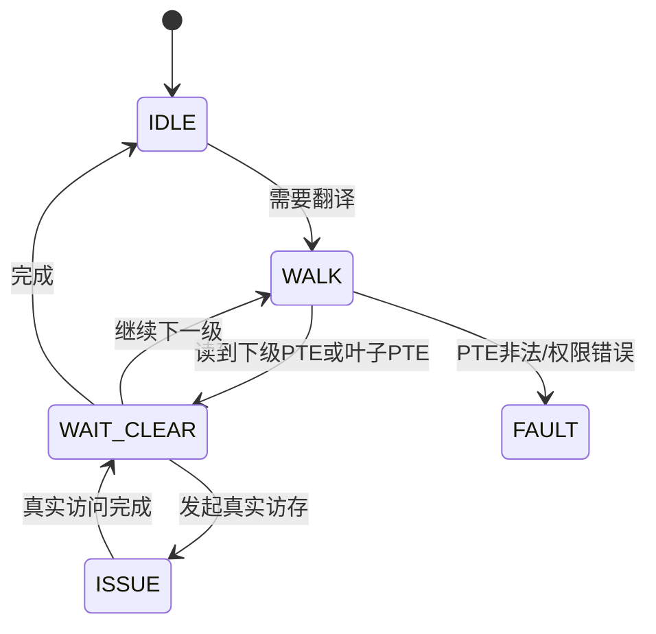
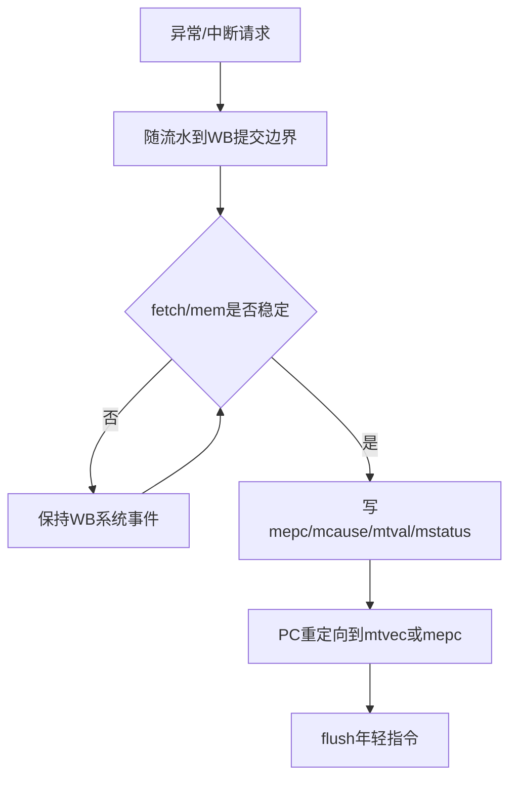

# 计组 Lab1-6 整合指南

> **课程**：计算机组成与体系结构（H）
> **覆盖实验**：Lab1 五级流水线、Lab2 Load/Store、Lab3 分支跳转、Lab4 CSR/SATP、Lab5 Sv39 MMU 与 ECALL/MRET、Lab6 异常/中断
> **主要来源**：26-Arch Wiki、课程 `4_Lab/` 讲义、朱文凯 Lab1-6 报告、NotebookLM Lab crossref raw、GitHub 副本代码核对
> **Lab 仓库**：用户给定 localServer 路径 `/home/thesumst/Data2/development/ComputerOrganization/26-Arch` 当前环境未挂载；已核对 Windows 同步模板 `/mnt/e/_ComputerLearning/20_ComputerOrganization/26-Arch` 与 GitHub `https://github.com/SummerS-tars/26-Arch`
> **报告来源**：`/mnt/e/★Document/1_Study/2_6_2026springTerm/2_计算机组成与体系结构H/4_Lab/Lab{1..6}/report.md`；GitHub 副本 `Doc/Lab{1..6}/report.md`
> **相关周次/课件**：Week1-3、Week7、Week10-12、Week15-16；课件 04/05/06/07b 与复习课
> **NotebookLM raw**：`notebooklm-raw/part1-week1-3/runs/latest/lab13-crossref.answer.md`、`part4-week10-11/runs/latest/lab45-crossref.answer.md`、`part5-week12/runs/latest/lab6-crossref.answer.md`、`part7-week15/runs/latest/lab-final-crossref.answer.md`
> **整合日期**：2026-06-24

---

## 0. 怎么使用本指南

这份指南把 Lab 从周次学习指南中单独拿出来：周次指南负责告诉你“相关 Lab 是哪个”，本指南负责解释“Lab 考什么、我的实现怎么落到代码、哪里容易错”。复习时建议按两条线使用：

1. **按实验顺序**：Lab1-3 先看五级流水、访存、控制流，理解 CPU 正常执行路径；Lab4-6 再看 CSR、MMU、异常/中断，理解特权架构和期末高频机制。
2. **按考点反查代码**：遇到转发、阻塞、SATP、页表遍历、ECALL/MRET、中断优先级等题目，直接跳到对应 Lab 的“重点机制拆解”和“关键代码路径”。
3. **待核对标记**：凡本地最终实现路径缺失或报告与 GitHub 当前代码存在边界差异处，本文明确标注“待核对”，不要把它当成已确认结论背诵。

---

## 1. Lab 总览：从五级流水到异常/中断

| Lab | 主线 | 考察知识点 | 我的实现来源 | 对应周次/课件 |
|-----|------|------------|--------------|---------------|
| Lab1 | 五级流水骨架 | IF/ID/EX/MEM/WB、RAW、转发、load-use 阻塞、Difftest 提交 | `Doc/Lab1/report.md`；`vsrc/src/core_hazard_unit.sv`、`core_forwarding_unit.sv` | Week1-2、Week7；课件 05/06 |
| Lab2 | Load/Store | 字节/半字/字访存、符号扩展、`valid/data_ok`、`strobe`、共享总线停顿 | `Doc/Lab2/report.md`；`vsrc/include/mem_helpers.sv`、`vsrc/src/core.sv` | Week2-3；课件 04/05 |
| Lab3 | 分支/跳转 | B/J 型控制流、EX 决断、flush、`jal/jalr` 写回、MMIO Difftest skip | `Doc/Lab3/report.md`；`vsrc/src/core_decode.sv`、`vsrc/src/core.sv` | Week3、Week7；课件 04/06 |
| Lab4 | CSR/SATP | 6 条 CSR 指令、CSR mask、`mcycle`、`sstatus` 视图、CSR flush、SATP | `Doc/Lab4/report.md`；`vsrc/src/core_csr.sv`、`core_decode.sv` | Week11；课件 07b |
| Lab5 | Sv39/MMU/trap | `ECALL`、`MRET`、特权级切换、Sv39 三级页表、取指/访存统一翻译 | `Doc/Lab5/report.md`；`vsrc/util/MMU.sv`、`SimTop.sv`、`VTop.sv`、`core_trap_ctrl.sv` | Week10-11；课件 07b |
| Lab6 | 异常/中断 | 非法指令、地址不对齐、软件/时钟/外部中断、精确异常、页错误路径 | `Doc/Lab6/report.md`；`vsrc/include/trap.sv`、`core_trap_ctrl.sv`、`core.sv` | Week11-12、Week15-16；课件 07b/复习 |


读图时抓一条主线：Lab1-3 解决“正常指令如何正确提交”；Lab4-6 解决“特权状态、地址翻译、异常中断如何改变正常路径但仍保持精确状态”。

---

## Part Lab1 - 五级流水与转发/阻塞

### 1.1 考察知识点

Lab1 考察的是最小可工作的五级流水线 CPU：指令从 IF（取指）到 WB（写回）稳定推进，段间寄存器保存每级状态，基础整数指令能被译码、执行并写回。真正的重点不是 ALU 加减，而是 **RAW（Read After Write，写后读相关）** 的处理：结果已经算出来但未写回时要转发，结果尚未产生时要阻塞并插入 bubble。

### 1.2 我的实现：关键模块与代码路径

报告中的实现拆分为 `core.sv`、`core_regfile.sv`、`core_decode.sv`、`core_alu.sv`、`core_hazard_unit.sv`、`core_forwarding_unit.sv`。GitHub 当前副本可核对到这些路径：

| 类型 | 路径 | 作用 |
|------|------|------|
| 报告 | `Doc/Lab1/report.md` | 五级流水骨架、转发/阻塞、Difftest 提交时序 |
| 转发 | `vsrc/src/core_forwarding_unit.sv` | EX/MEM 优先于 MEM/WB 的源操作数前递 |
| 阻塞 | `vsrc/src/core_hazard_unit.sv` | 检测 load-use hazard |
| 顶层 | `vsrc/src/core.sv` | PC、流水寄存器、stall/flush、Difftest 接线 |

### 1.3 重点机制拆解

**转发优先级**：MEM 阶段已有待写回值时优先转发，否则再看 WB 阶段；`rd=x0` 不转发，保证零寄存器语义。

```verilog
// vsrc/src/core_forwarding_unit.sv
if (reg_write_mem && rd_mem != 5'b0 && rd_mem == rs1_ex)
    op_a_forwarded = forward_data_mem;
else if (reg_write_wb && rd_wb != 5'b0 && rd_wb == rs1_ex)
    op_a_forwarded = wb_data;
else
    op_a_forwarded = rs1_data_ex;
```

**load-use 阻塞**：EX 阶段如果是 load，下一条 ID 指令马上读同一个 `rd`，数据要等 MEM 返回，转发来不及，必须保持 PC/IF_ID 并向 ID_EX 注入 bubble。

```verilog
// vsrc/src/core_hazard_unit.sv
load_use_hazard = mem_read_ex && (rd_ex != 5'b0) &&
                  ((rd_ex == rs1_id) || (rd_ex == rs2_id));
```

这段逻辑只负责“发现危险”，真正让流水线停住的是顶层控制：`load_use_hazard` 进入 `stall`，PC 和 `IF_ID` 因 `!stall` 不成立而保持；同时 `ID_EX` 被写成 `id_ex_bubble()`，让 load 后面的依赖指令晚一拍进入 EX。这样做的原因是 load 的值要到 MEM 收到 `dresp.data_ok` 后才真正可用，EX/MEM 这一拍还没有可转发的数据。

```verilog
// 伪代码：load-use 时的流水线动作
if (load_use_hazard) begin
    pc      <= pc;        // 保持取指地址
    IF_ID   <= IF_ID;     // 依赖指令留在 ID
    ID_EX   <= bubble;    // EX 插入空操作
end
```

这四个动作必须成组出现：只保持 PC 不注入 bubble，会让 EX 重复执行旧指令；只注入 bubble 不保持 `IF_ID`，依赖指令会被吞掉。课堂上讲流水线数据冒险时常说“停顿一个周期”，在代码里就具体落成了“前端保持 + 中间注泡 + 后端继续推进”。



读这张图时不要把 `stall` 理解成整条流水线完全冻结：前端保持是为了不丢依赖指令，后端继续推进是为了让 load 走到 MEM/WB 产生可用数据。正是这个“前停后走”的差异，解释了为什么 Lab1 报告中特别强调 `EX_MEM` 和 `MEM_WB` 在等待期间仍允许正常推进。

### 1.4 易错点与调试方法

- `iresp.data_ok` 到来前 `ireq.valid/addr` 要保持稳定；报告中最早的“5000 周期无提交”就是取指握手错位。
- WB 阶段被 stall 保持时，`DifftestInstrCommit.valid` 不能持续为 1，否则同一条指令会重复提交。
- Difftest 读取寄存器堆时，要考虑 WB 同拍写回的旁路，否则提交状态会晚一拍。

### 1.5 与周次/课件指南的对应

Lab1 对应 Week1-2 的冯·诺依曼/数据通路预览，也对应 Week7 的流水线冒险专题。课件重点看 05 中央处理器与 06 指令流水线。

---

## Part Lab2 - Load/Store 与访存握手

### 2.1 考察知识点

Lab2 把 Lab1 的“空 MEM 段”变成真实访存：实现 `ld/sd/lb/lh/lw/lbu/lhu/lwu/sb/sh/sw/lui`，理解 RISC-V Load/Store 架构、访存宽度、符号/零扩展、字节写使能，以及 `ibus`/`dbus` 共享内存时的流水线停顿。

### 2.2 我的实现：关键模块与代码路径

| 类型 | 路径 | 作用 |
|------|------|------|
| 报告 | `Doc/Lab2/report.md` | 访存通路、共享总线停顿、store forwarding |
| 访存 helper | `vsrc/include/mem_helpers.sv` | 访存宽度、strobe、load 扩展、对齐检查 |
| 顶层 MEM | `vsrc/src/core.sv` | `dreq.valid/addr/size/strobe/data` 生成 |
| 总线转换 | `vsrc/util/DBusToCBus.sv` | DBus 请求转 CBus，`ready && last` 作为 data_ok |

### 2.3 重点机制拆解

**写 strobe 与数据对齐**：地址低位保留，写哪些 byte 由 `strobe` 控制，写数据按地址低位左移。

```verilog
// vsrc/include/mem_helpers.sv
3'b000:  store_strobe_from_funct3 = 8'b0000_0001 << addr_low;
3'b001:  store_strobe_from_funct3 = 8'b0000_0011 << addr_low;
3'b010:  store_strobe_from_funct3 = 8'b0000_1111 << addr_low;
```

```verilog
// vsrc/include/mem_helpers.sv
shifted_data = raw_data >> {addr_low, 3'b0};
3'b000: extend_load_data = {{56{shifted_data[7]}}, shifted_data[7:0]};
3'b100: extend_load_data = {56'b0, shifted_data[7:0]};
```

**MEM 阶段发起请求**：顶层根据当前 MEM 指令生成 DBus 请求；异常访存不应继续访问内存。

```verilog
// vsrc/src/core.sv
assign regular_mem_access_mem = ex_mem_q.inst_valid && !ex_mem_q.exception_valid &&
    !ex_mem_q.is_amo && (ex_mem_q.mem_read || ex_mem_q.mem_write);
assign dreq.valid  = regular_mem_access_mem || amo_bus_access_mem;
assign dreq.addr   = ex_mem_q.alu_result;
assign dreq.strobe = regular_mem_access_mem ?
    (ex_mem_q.mem_write ? store_strobe_mem : 8'b0) :
    (amo_write_phase_mem ? store_strobe_mem : 8'b0);
```

**`valid/data_ok` 握手与 `mem_wait`**：访存不是“组合读内存”，而是请求/响应协议。`dreq.valid` 表示 MEM 阶段有有效访存，`dresp.data_ok` 表示本次数据返回或写入完成；在两者之间，地址、写掩码和写数据都必须保持稳定。

```verilog
// vsrc/src/core.sv
assign mem_wait = regular_mem_access_mem ? !dresp.data_ok :
    (amo_access_mem && !amo_done_mem);
assign stall = load_use_hazard || fetch_wait || mem_access_mem || system_wb_waiting;
```

这里 `mem_wait` 与 `mem_access_mem` 的配合对应课堂上的“结构冒险/访存长延迟”：当 DBus 正在占用共享内存时，前端取指不能随意推进，否则 IF 可能和 MEM 抢同一个 CBus/RAM，PC、`IF_ID`、`ID_EX` 的时序也会错位。报告中“指令被跳过/执行两次”的现象，本质就是握手协议与流水线有效位没有对齐。

| 访存类型 | `funct3` | `size` | store `strobe` | load 扩展 |
|----------|----------|--------|----------------|-----------|
| byte | `000/100` | 1B | `0000_0001 << addr[2:0]` | `lb` 符号扩展，`lbu` 零扩展 |
| half | `001/101` | 2B | `0000_0011 << addr[2:0]` | `lh` 符号扩展，`lhu` 零扩展 |
| word | `010/110` | 4B | `0000_1111 << addr[2:0]` | `lw` 符号扩展，`lwu` 零扩展 |
| double | `011` | 8B | `1111_1111` | `ld` 直接取 64 位 |

这张表对应课件里的 Load/Store ISA 语义：ISA 层规定“取多少字节、是否符号扩展”，微结构层则用 `size/strobe/data` 把语义翻译成总线信号。尤其要注意地址低位没有被清零，低位既参与选择写哪些 byte，也参与 load 后的右移截取。

### 2.4 易错点与调试方法

- 不要把地址低位清零；报告明确指出 `addr` 保留原始地址，对齐靠 `data` 移位和 `strobe`。
- store 写数据也需要 forwarding，否则地址算对但写入旧 `rs2`。
- `mem_wait` 与前端取指等待叠加时，要保证每条指令只推进一次、只提交一次。

### 2.5 与周次/课件指南的对应

Lab2 对应 Week2 的数据通路与 Week3 的 Load/Store ISA 语义；也为 Week4 的大小端、对齐与数据表示提供实验直觉。

---

## Part Lab3 - 分支/跳转、Flush 与 MMIO

### 3.1 考察知识点

Lab3 把 CPU 从“顺序流”扩展成能处理控制流：实现分支、跳转、比较、移位、`auipc`、`jal`、`jalr`。核心是控制冒险：如果 EX 阶段才知道跳转成立，IF/ID 和 ID/EX 中的顺序路径指令就必须被 flush。

### 3.2 我的实现：关键模块与代码路径

| 类型 | 路径 | 作用 |
|------|------|------|
| 报告 | `Doc/Lab3/report.md` | EX 决断、flush、`WB_PC4`、MMIO skip |
| 译码 | `vsrc/src/core_decode.sv` | `is_branch/is_jump/is_jalr/use_pc/WB_PC4` |
| 顶层控制 | `vsrc/src/core.sv` | `next_pc`、`redirect_fire_ex`、flush 条件 |
| 转发 | `vsrc/src/core_forwarding_unit.sv` | `forward_data_mem` 支持 `pc+4` |

### 3.3 重点机制拆解

**`jal/jalr` 译码与写回**：`jalr` 标记为 jump + jalr，写回来源为 `WB_PC4`。

```verilog
// vsrc/src/core_decode.sv
7'b1100111: begin
    decode_out.reg_write = 1'b1;
    decode_out.is_jump   = 1'b1;
    decode_out.is_jalr   = 1'b1;
    decode_out.wb_sel    = WB_PC4;
end
```

**EX 阶段重定向与 misaligned 检测**：`jalr` 目标最低位清零；跳转目标非 4 字节对齐会进入异常路径。

```verilog
// vsrc/src/core.sv
assign redirect_target_raw_ex = id_ex_q.is_jalr ? (rs1_forwarded_ex + id_ex_q.imm) :
    (id_ex_q.pc + id_ex_q.imm);
assign redirect_target_ex = id_ex_q.is_csr ? (id_ex_q.pc + 64'd4) :
    (id_ex_q.is_jalr ? (redirect_target_raw_ex & ~64'd1) : redirect_target_raw_ex);
assign redirect_fire_ex = redirect_valid_ex && !fetch_wait && !mem_wait;
```

**flush 范围为什么是前级**：当前实现把分支比较、`jal/jalr` 目标计算放在 EX 阶段，是为了复用 EX 阶段已经完成的 forwarding 结果。代价是当 EX 才发现要跳转时，IF 和 ID 中已经各有一条按顺序取来的年轻指令，因此 `redirect_fire_ex` 不只是改 `pc`，还必须清 `IF_ID` 和 `ID_EX`。



图中 EX 往回打的两条 flush 线，对应课堂“控制冒险”的精确含义：错误路径不是未来才会取，而是已经进入前级。如果只改 PC，不清前级，Difftest 看到的通常不是“立刻 PC 错”，而是几拍后某个错误路径写回污染了架构状态。

**MMIO 与 Difftest Skip**：Lab3 报告强调 `skip` 不能写宽。MMIO（Memory-Mapped I/O，内存映射 I/O）的设备状态由外设决定，参考模型不一定能复现，所以设备区访存需要跳过 Difftest；但普通内存访问仍要严格对比。实现上应按“是访存 + 地址落入低地址设备区”收窄条件，而不是对所有 load/store 或所有指令跳过。

> **课堂对应**：`jal/jalr` 的 `pc+4` 写回体现的是 ISA 层链接语义；EX 决断和 flush 体现的是流水线控制冒险；MMIO skip 则对应系统结构中“同一地址空间挂外设，但外设副作用不属于普通内存一致状态”的边界。

### 3.4 易错点与调试方法

- 只改 PC 不够，错误路径指令已经在流水线里，必须 flush。
- `jal/jalr` 的 bug 不一定在跳转地址，也可能在链接地址 `pc+4` 的 forwarding。
- Lab3 报告中最隐蔽的问题是 `load-use hazard` 与 `mem_wait` 堆叠时，正在等待的 load 被错误 bubble 掉。
- MMIO 的 Difftest skip 要足够窄：只跳过设备区访存，不要把所有访存或所有指令都 skip。

### 3.5 与周次/课件指南的对应

Lab3 对应 Week3 的 B/J 型指令与 Week7 的控制冒险。复习课件 04 时看指令格式，复习课件 06 时看 flush 与分支代价。

---

## Part Lab4 - CSR 指令、SATP 与全局状态

### 4.1 考察知识点

Lab4 是后半学期的入口：CSR（Control and Status Register，控制状态寄存器）不是普通 GPR，它保存特权级、trap 入口、中断使能、异常原因、地址翻译配置等全局状态。考察重点包括 6 条 CSR 指令的读-改-写语义、写 mask、`mcycle` 自增、`sstatus` 作为 `mstatus` 子集，以及 CSR 改变后为什么要 flush 流水线。

### 4.2 我的实现：关键模块与代码路径

| 类型 | 路径 | 作用 |
|------|------|------|
| 报告 | `Doc/Lab4/report.md` | CSR 指令范围、mask、Difftest CSR 旁路 |
| CSR 模块 | `vsrc/src/core_csr.sv` | CSR 读写、mask、trap/mret 组合视图 |
| 译码 | `vsrc/src/core_decode.sv` | `CSRRW/CSRRS/CSRRC` 与立即数版本 |
| 顶层 | `vsrc/src/core.sv` | CSR 控制字段流水传递、CSR 后重定向 |

### 4.3 重点机制拆解

**CSR 指令译码**：`funct3[1:0]` 区分 write/set/clear；立即数版本由 `funct3[2]` 标记。

```verilog
// vsrc/src/core_decode.sv
decode_out.is_csr       = (decode_out.funct3 != 3'b000);
decode_out.wb_sel       = WB_CSR;
decode_out.csr_addr     = instr[31:20];
decode_out.csr_uses_imm = decode_out.funct3[2];
case (decode_out.funct3[1:0])
    2'b01: decode_out.csr_op = CSR_OP_WRITE;
    2'b10: decode_out.csr_op = CSR_OP_SET;
    2'b11: decode_out.csr_op = CSR_OP_CLEAR;
endcase
```

**CSR 写入与 Difftest 提交视图**：`core_csr.sv` 同时维护 registered CSR 和提交当拍的 view，避免 Difftest 看到晚一拍状态。

```verilog
// vsrc/src/core_csr.sv
case (wop)
    CSR_OP_SET:   write_next = write_old | wdata;
    CSR_OP_CLEAR: write_next = write_old & ~wdata;
    default:      write_next = wdata;
endcase
```

**CSR mask 与只读/视图行为**：`mstatus/mtvec/mip/medeleg/mideleg` 等 CSR 不是 64 位任意写入，写入值会先经过 mask；`sstatus` 不是独立状态，而是 `mstatus` 的 S 模式字段视图。这样做对应课堂里的 WARL/WLRL 思想：软件可以写 CSR，但硬件只承诺保存合法位或可写位。

```verilog
// vsrc/src/core_csr.sv
CSR_MSTATUS: mstatus_q <= write_next & MSTATUS_MASK;
CSR_SSTATUS: mstatus_q <= (mstatus_q & ~SSTATUS_WRITABLE_MASK) |
                          (write_next & SSTATUS_WRITABLE_MASK);
CSR_MTVEC:   mtvec_q   <= write_next & MTVEC_MASK;
CSR_MIP:     mip_q     <= write_next & MIP_MASK;
```

这段代码的关键不是 mask 数值本身，而是“读写一个 CSR 可能实际改的是另一个底层寄存器的子集”：写 `sstatus` 最终更新 `mstatus` 的部分位，读 `sstatus` 也由 `mstatus & SSTATUS_MASK` 得到。Difftest CSR 视图因此必须使用提交当拍的 view，否则第一条 CSR 写提交后，参考模型已经更新，DUT 输出却仍是旧值。

**SATP 注意点**：报告与 NotebookLM raw 都强调 SATP 是 Week11 高频点。当前 GitHub 代码中 `CSR_SATP` 可读写并导出给 MMU；但 `satp` 的 WARL 合法化细节在代码片段中表现为直接写入。

| 维度 | 当前代码可核对 | 期末/规范需要理解 | 状态 |
|------|----------------|-------------------|------|
| 读写路径 | `CSR_SATP: satp_q <= write_next` | 写入后影响 MMU 翻译根页表 | 已核对 |
| `mode` | MMU 检查 `satp[63:60] == 8` | Bare/Sv39 等模式合法化 | 待核对 |
| `asid/ppn` | MMU 使用 `satp[43:0] << 12` | ASID、PPN 位宽与 WARL 约束 | 待核对 |

复习时要把“实验能跑”与“规范问 WARL 机制”分开理解：本实现的直接写入足以驱动 Lab5 的 Sv39，但不能据此推断所有非法 `satp` 写入都会被硬件完整合法化。

### 4.4 易错点与调试方法

- CSR 指令不要伪装成普通 ALU 指令；它写的是全局状态。
- CSR 改变后不建议依赖 forwarding，报告采用保守 flush，目标为 `pc+4`。
- `CSRRS/CSRRC` 在 `rs1=x0` 或 `zimm=0` 时只读不写。
- Difftest CSR mismatch 常常是提交视图晚一拍，而不是 CSR 值计算错。

### 4.5 与周次/课件指南的对应

Lab4 对应 Week11 的 SATP、SFENCE.VMA、WARL、CSR 状态位，是期末后半部分的高权重实验基础。

---

## Part Lab5 - ECALL/MRET、Sv39 MMU 与页表遍历

### 5.1 考察知识点

Lab5 是期末最重要的实验之一：它把“普通流水线 CPU”变成支持特权级和虚拟地址的 CPU。核心考点包括 `ECALL` 进入 trap、`MRET` 返回、`mstatus.MPP/MPIE/MIE` 更新、`mepc/mtvec/mcause` 写入、Sv39 虚拟地址拆分、三级页表遍历、PTE 权限检查、取指和访存都经过地址翻译。

### 5.2 我的实现：关键模块与代码路径

| 类型 | 路径 | 作用 |
|------|------|------|
| 报告 | `Doc/Lab5/report.md` | ECALL/MRET、特权级、MMU、镜像处理、板端时序 |
| MMU | `vsrc/util/MMU.sv` | Sv39 page walk、权限检查、page fault 响应 |
| 顶层接入 | `vsrc/SimTop.sv`、`vsrc/VTop.sv` | `CBusArbiter -> MMU -> ICache/RAM/MMIO` |
| trap 控制 | `vsrc/src/core_trap_ctrl.sv` | WB 提交边界处理 trap/mret |
| CSR | `vsrc/src/core_csr.sv` | trap/mret 更新 CSR 与特权状态 |

### 5.3 重点机制拆解

**MMU 插入位置**：取指 IBus 和数据 DBus 先仲裁成 CBus，再进入单一 MMU。这样 IF 与 MEM 共用同一套地址翻译。

```verilog
// vsrc/SimTop.sv
CBusArbiter mux(
    .ireqs({icreq, dcreq}),
    .iresps({icresp, dcresp}),
    .oreq(mmu_ireq),
    .oresp(mmu_iresp)
);

MMU mmu(
    .ireq(mmu_ireq),
    .iresp(mmu_iresp),
    .oreq(icache_ireq),
    .oresp(icache_iresp),
    .priv_mode(core_priv_mode),
    .satp(core_satp)
);
```

为什么放在仲裁之后？课堂上 Sv39 是“地址翻译机制”，不是“只给 load/store 用的功能单元”。用户态程序的第一条取指地址就是虚拟地址，系统调用保存上下文时的数据地址也是虚拟地址；若 IF 和 MEM 各自绕开或各自实现一套 MMU，就会出现一边能翻译、一边不能翻译，或者两套页表 walk 状态不一致。单一 MMU 放在 CBus 后面，正好把取指和访存统一成一种“带访问类型的内存请求”。

**Sv39 启用条件与三级遍历**：M 模式或 `satp.mode=0` 旁路；U/S 模式且 `satp.mode=8` 时从 `satp.ppn << 12` 开始走三级页表。

```verilog
// vsrc/util/MMU.sv
assign translate_en = (priv_mode != PRIV_M) && (satp[63:60] == 4'd8);
pte_addr_q <= ({8'b0, satp[43:0], 12'b0}) +
    (vpn_index(ireq.addr, 2'd2) << 3);
```

**页表遍历状态机**：读到叶子 PTE 后拼出物理地址；非法 PTE、权限错误或 superpage 对齐错误进入 page fault。

```verilog
// vsrc/util/MMU.sv
if (pte_invalid(pte_data)) begin
    state_q <= STATE_FAULT;
end else if (leaf_pte) begin
    if (superpage_misaligned(pte_data, level_q) ||
        pte_permission_fault(pte_data, saved_req_q.access, priv_mode_ctx_q)) begin
        state_q <= STATE_FAULT;
    end else begin
        translated_addr_q <= leaf_paddr;
        resume_state_q    <= STATE_ISSUE;
        state_q           <= STATE_WAIT_CLEAR;
    end
end
```

**板端空拍**：报告中提到的 `STATE_WAIT_CLEAR` 可在代码中核对到，用于隔开连续 PTE 读取和最终访存响应，避免板端 `ready/last` 多拍被误判。

PTE（Page Table Entry，页表项）权限检查可以按下面的判题顺序记忆：先看 `V` 位和 `R/W` 组合是否合法，再看是否叶子；若是叶子，再按访问类型检查 `R/W/X`、按用户态检查 `U`，store 还要看 `D` 位。当前代码中 `pte_permission_fault` 明确要求 store 同时满足 `W=1` 和 `D=1`，所有访问都要求 `A=1`。

```verilog
// vsrc/util/MMU.sv
pte_permission_fault = !pte[6] ||
    (need_r && !pte[1]) ||
    (need_w && (!pte[2] || !pte[7])) ||
    (need_x && !pte[3]) ||
    ((priv == PRIV_U) && !pte[4]);
```

这与课堂 Sv39 的层次对应如下：VA 先拆成 `VPN[2:0] + page offset`，每一级 PTE 的 PPN 给出下一级页表或叶子物理页；权限位决定“这个翻译是否允许当前访问”。Lab 报告中提到的 A/D 位镜像处理属于测试镜像兼容，硬件是否完整自动置 A/D 位仍列为待核对。



读这张状态图时重点看 `STATE_WAIT_CLEAR`：它不是 Sv39 规范中的抽象状态，而是板级实现为适配 BRAM `ready/last` 时序加入的工程状态。规范层面的 page walk 是“读 PTE → 判断 → 下一层或最终访问”，工程层面还要保证连续两次总线请求之间不会把上一拍响应误认成下一拍响应。

**ECALL/MRET 与 MMU 的协作**：`ECALL` 从 U/S/M 模式进入 M 模式 trap，`MRET` 根据 `mstatus.MPP` 恢复特权级；MMU 又根据 `priv_mode` 与 `satp.mode` 决定是否翻译。也就是说，`mret` 之后第一条用户态取指同时检验三件事：`mepc` 是否正确、`mstatus.MPP/MIE/MPIE` 是否正确、MMU 是否开始按 `satp` 翻译。

```text
ECALL 提交: 写 mepc/mcause/mstatus -> priv=M -> PC=mtvec -> flush
MRET  提交: priv=mstatus.MPP      -> PC=mepc  -> flush -> 下一次取指按新 priv 翻译
```

### 5.4 易错点与调试方法

- `ECALL/MRET` 不能当普通 CSR 指令；它们同时改多个 CSR、特权级和 PC。
- trap 重定向必须绑定 flush，否则年轻指令可能在错误特权级/错误 PC 下提交。
- 取指和访存都要翻译；只翻译一侧会在用户态第一条指令或上下文保存时失败。
- 仿真 `kernel.bin` 与上板 `kernel.coe` 要同步；报告中上板卡在 `userinit ok` 后，根因是 BRAM 初始化没有更新。
- A/D 位、SUM/MXR、PTE 权限是期末常考；报告中 A/D 位通过镜像兼容处理，硬件完整更新策略待核对。

### 5.5 与周次/课件指南的对应

Lab5 对应 Week10-11 虚拟内存、SATP、TLB、页表遍历。课件 07b 是主线；Week16 复习中的 TLB reach、大页、页表遍历开销也与本 Lab 直接相关。

---

## Part Lab6 - 异常/中断、页错误与精确提交

### 6.1 考察知识点

Lab6 把同步异常和异步中断统一到精确 trap 语义里。考察点包括非法指令、指令地址不对齐、load/store 地址不对齐、`ecall`、机器软件/时钟/外部中断、`mepc/mcause/mtval/mstatus` 更新、中断使能与优先级，以及异常发生时如何避免错误访存副作用。

报告明确写到“本次没有实现 Bonus 的缺页异常”；但 GitHub 当前代码中已有 MMU `page_fault` 响应、`CAUSE_*_PAGE_FAULT` 常量和 MEM 阶段页错误接入。是否属于 Lab6 提交范围或后续 Lab+/主线改动，需待核对。期末复习仍应掌握页错误的触发和 trap 流程。

### 6.2 我的实现：关键模块与代码路径

| 类型 | 路径 | 作用 |
|------|------|------|
| 报告 | `Doc/Lab6/report.md` | 异常/中断覆盖范围、WB 精确 trap、调试坑 |
| trap 常量 | `vsrc/include/trap.sv` | `mcause` 编码、中断 pending bit、`ecall_cause` |
| trap 控制 | `vsrc/src/core_trap_ctrl.sv` | 中断仲裁、提交边界、CSR trap/mret 控制 |
| 顶层异常路径 | `vsrc/src/core.sv` | misaligned、page fault、系统事件随流水传递 |
| CSR 更新 | `vsrc/src/core_csr.sv` | trap/mret 对 `mstatus/mepc/mcause/mtval` 的更新 |

### 6.3 重点机制拆解

**异常检测**：跳转目标不对齐、访存不对齐、PMP access fault 在 EX/MEM 形成异常信息，随流水到 WB 提交。

```verilog
// vsrc/src/core.sv
assign control_target_misaligned_ex = id_ex_q.inst_valid &&
    (id_ex_q.is_jump || (id_ex_q.is_branch && branch_taken_ex)) &&
    (redirect_target_raw_ex[1:0] != 2'b00);
assign mem_misaligned_ex = id_ex_q.inst_valid &&
    (id_ex_q.mem_read || id_ex_q.mem_write || id_ex_q.is_amo) &&
    mem_addr_misaligned(alu_result_ex, mem_size_from_funct3(id_ex_q.funct3));
```

**中断 pending 与优先级**：硬件 `swint/trint/exint` 与 CSR 中 `mip/mie` 合并后仲裁，优先级为外部 > 时钟 > 软件。

```verilog
// vsrc/src/core_trap_ctrl.sv
assign hw_mip = (swint ? MIP_MSIP : 64'b0) |
    (trint ? MIP_MTIP : 64'b0) |
    (exint ? MIP_MEIP : 64'b0);
assign interrupt_pending_mask_wb = (csr_mip_irq_q | hw_mip) & csr_mie_irq_q &
    (MIP_MSIP | MIP_MTIP | MIP_MEIP);
always_comb begin
    if (interrupt_pending_mask_wb[11])
        interrupt_cause_wb = CAUSE_IRQ_EXTERNAL;
    else if (interrupt_pending_mask_wb[7])
        interrupt_cause_wb = CAUSE_IRQ_TIMER;
    else
        interrupt_cause_wb = CAUSE_IRQ_SW;
end
```

这里有两个容易混淆的层次：`hw_mip` 是当前引脚输入形成的硬件 pending，只在 core 内部参与仲裁；`csr_mip_irq_q` 是 CSR 中可见的 pending 状态。报告明确说硬件 pending 不直接写入 Difftest 可见的 `mip`，否则 Lab4/Lab5 的 CSR 对比会被外部中断线扰动。

| 事件来源 | 同步/异步 | 典型 `mcause` | `mepc` 写入 | `mtval` 写入 |
|----------|-----------|---------------|-------------|--------------|
| 非法指令 | 同步异常 | `2` | 异常指令 PC | 当前实现多为 0；非法指令值是否完整写入待核对 |
| 指令地址不对齐 | 同步异常 | `0` | 跳转/分支指令 PC | 错误目标地址 |
| load/store 不对齐 | 同步异常 | `4/6` | 访存指令 PC | 错误访存地址 |
| page fault | 同步异常 | `12/13/15` | 触发取指/访存的 PC | 取指 PC 或访存地址 |
| 软件/时钟/外部中断 | 异步中断 | `0x800...3/7/b` | `pc+4` | 0 |

这张表就是精确 trap 的开卷抓手：同步异常归因于“当前指令”，所以 `mepc` 指向当前指令；异步中断在一条普通指令提交后响应，所以 `mepc=pc+4`。`mtval` 则只在异常需要附加错误地址/信息时有意义。

**WB 提交边界**：系统事件在 WB 等待 fetch/mem 稳定后再 redirect，保证异常指令之前已提交、之后年轻指令被清掉。

```verilog
// vsrc/src/core_trap_ctrl.sv
assign system_pending_wb = commit_valid_wb &&
    (exception_valid_wb || is_ecall_wb || is_mret_wb || is_sret_wb || interrupt_request_wb);
assign system_redirect_ready_wb = !fetch_wait_q && !mem_wait_q;
assign system_wb_waiting = system_pending_wb && !system_redirect_ready_wb;
assign commit_fire_wb = commit_valid_wb && !system_wb_waiting;
assign system_redirect_fire_wb = trap_commit_wb || mret_commit_wb || sret_commit_wb;
```



图后要注意 `system_redirect_ready_wb = !fetch_wait_q && !mem_wait_q` 这个门控：trap/mret 已到 WB 时，如果前端或访存通道还在等待，系统事件会先保持在 WB，不马上改 PC。这样避免一边还有未完成总线响应，一边已经切换 CSR/特权级/PC，导致错误路径继续产生副作用。

**页错误路径与报告范围**：Lab6 报告写明“未实现 Bonus 的缺页异常”，但当前 GitHub 主线可见 `MMU.sv` 产生 `page_fault`，`core.sv` 把取指 page fault 转成 `CAUSE_INST_PAGE_FAULT`，把 MEM 阶段 page fault 转成 `CAUSE_LOAD_PAGE_FAULT` 或 `CAUSE_STORE_PAGE_FAULT`。因此本指南把页错误作为当前主线代码路径解释，同时保留“是否属于 Lab6 提交范围”的待核对。

### 6.4 易错点与调试方法

- 地址不对齐异常后要屏蔽 `dreq.valid`，否则错误 store 可能产生内存副作用；报告中还提到若异常访存仍参与 `mem_access_mem`，会因等不到 `data_ok` 卡死。
- 硬件 pending 不应直接写进 Difftest 可见的 `mip`，否则 Lab4/Lab5 CSR 比对会被破坏。
- system event 不能在前级被 flush 掉，要确保异常指令能继续流到 WB。
- `sfence.vma` 当前实现作为 no-op 放行，适用于这个简单 MMU 模型；若题目问 TLB 一致性，需要回到课程语义而不是只背当前实现。

### 6.5 与周次/课件指南的对应

Lab6 对应 Week11-12 的异常、中断、TLB 管理，也与 Week15-16 复习中的中断/DMA/虚存题相关。期末重点是“写寄存器 + 跳转 + flush”的精确异常模型，而不是单独背某个信号名。

---

## 7. 高频考法与复习建议

| 高频题型 | 应答抓手 | 对应 Lab |
|----------|----------|----------|
| 判断转发还是阻塞 | 结果是否已经产生；ALU 结果可转发，load-use 通常要停一拍 | Lab1 |
| 访存字节使能 | `funct3 + addr_low -> strobe`，load 反向截取并符号/零扩展 | Lab2 |
| 分支 flush | EX 决断后错误路径已进入前级，必须清 IF/ID 和 ID/EX | Lab3 |
| CSR 指令语义 | 读旧值写 rd，按 write/set/clear 写 CSR；CSR 改全局状态需 flush | Lab4 |
| SATP/Sv39 | `mode/asid/ppn`，VA 拆 VPN[2:0]，PTE 权限与 page fault | Lab4-5 |
| ECALL/MRET | `ecall` 写 `mepc/mcause/mstatus` 并跳 `mtvec`；`mret` 从 `mepc` 返回并恢复 `MIE/MPIE/MPP` | Lab5 |
| 异常/中断 | 同步异常来自当前指令；异步中断在提交边界响应；精确状态靠 WB 统一处理 | Lab6 |
| 页错误 | PTE 无效、权限不符、superpage 对齐错或访问类型不允许；当前报告中缺页异常实现范围待核对 | Lab5-6 |

复习建议：

1. 先画一张“五级流水 + WB 提交边界”图，把普通提交、CSR 提交、trap 提交都放到同一个时间点理解。
2. 对 Lab4-6 用“状态寄存器被谁改、PC 跳到哪里、年轻指令怎么处理”三问法复盘。
3. 开卷时优先查本文代码路径，再回到周次/课件指南查概念解释。

---

## 8. 资料索引

| 类型 | 路径 / 链接 | 说明 |
|------|-------------|------|
| 本指南 | `guides/计组-Lab1-6-整合指南.md` | Lab 专章化整合入口 |
| Week1-3 | `guides/计组-Week1-3-学习指南.md` | 仅保留 Lab1-3 轻量 ref |
| 16 周索引 | `guides/计组课程-16周内容梳理.md` | Lab ↔ 周次 ↔ 期末关联表 |
| NotebookLM raw | `notebooklm-raw/part1-week1-3/runs/latest/lab13-crossref.answer.md` | Lab1-3 crossref |
| NotebookLM raw | `notebooklm-raw/part4-week10-11/runs/latest/lab45-crossref.answer.md` | Lab4-5 crossref |
| NotebookLM raw | `notebooklm-raw/part5-week12/runs/latest/lab6-crossref.answer.md` | Lab6 crossref |
| NotebookLM raw | `notebooklm-raw/part7-week15/runs/latest/lab-final-crossref.answer.md` | 期末 Lab4-6 总表 |
| 报告 | `4_Lab/Lab{1..6}/report.md` | Windows 课程目录中的个人报告 |
| GitHub | `https://github.com/SummerS-tars/26-Arch` | 本次用于代码核对的个人副本 |
| 核心代码 | `vsrc/src/core.sv` | PC、流水寄存器、访存、异常路径 |
| CSR | `vsrc/src/core_csr.sv`、`vsrc/include/csr.sv` | CSR 状态与位定义 |
| MMU | `vsrc/util/MMU.sv` | Sv39 页表遍历与 page fault |
| Trap | `vsrc/src/core_trap_ctrl.sv`、`vsrc/include/trap.sv` | 异常/中断提交控制 |

### 待核对 / 待补采

- `/home/thesumst/Data2/development/ComputerOrganization/26-Arch` 在当前 WSL 环境不存在；已改用 Windows 课程报告和 GitHub 副本核对。若后续 localServer 恢复，应复核代码路径是否与 GitHub 当前副本完全一致。
- NotebookLM source 中是否已逐份导入 `Doc/Lab{1..6}/report.md` 待核对；如未导入，后续应补采“Lab1-6 个人报告机制复盘”raw，再回写本指南中每个 Lab 的报告出处。
- Lab4 的 `satp` WARL 合法化：课程/NotebookLM raw 强调是 Week11 考点，当前代码核对到 `CSR_SATP` 基本读写，合法化细节待核对。
- Lab6 报告声明未实现 Bonus 缺页异常；GitHub 当前副本已有 page fault 路径。需确认它属于 Lab6 后续补充、Lab+，还是最终主线合入。
