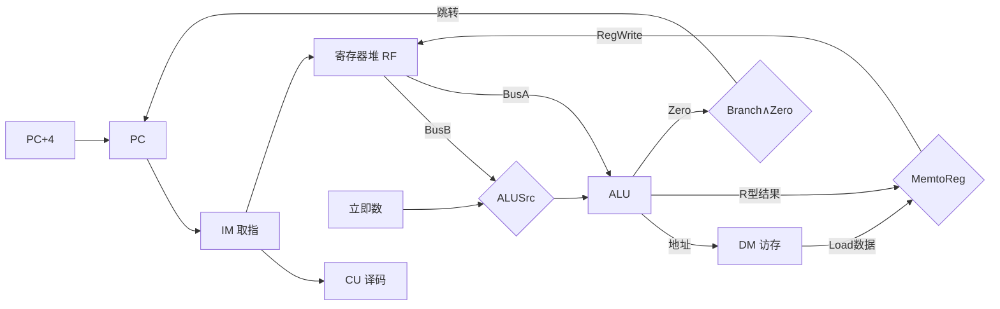
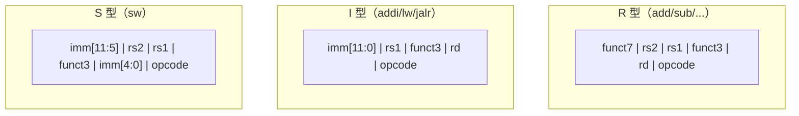
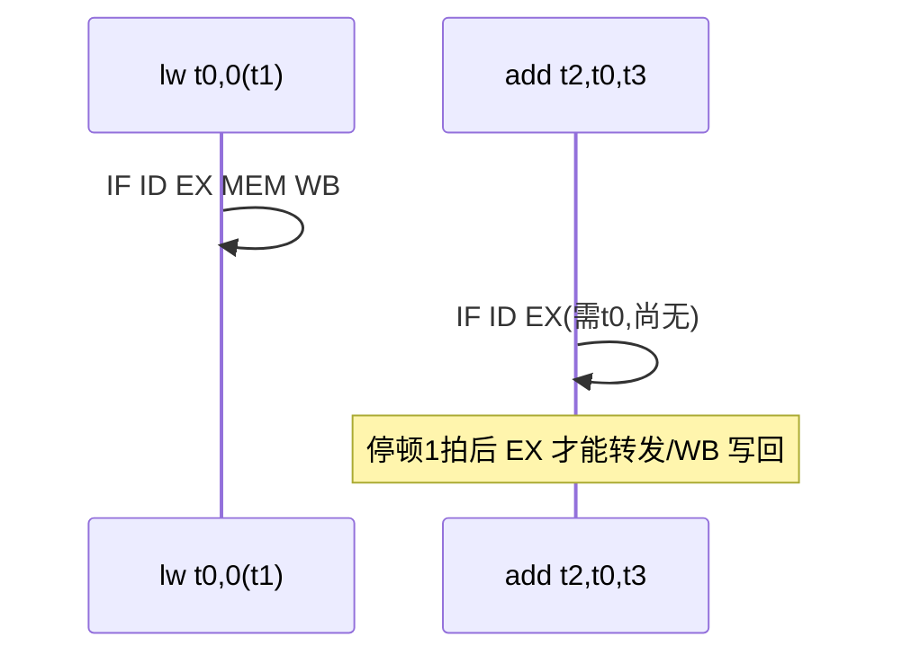

# Week 1–3 学习指南：冯·诺依曼、数据通路、CISC/RISC 与 Lab1–3

> **课程**：计算机组成与体系结构（H）
> **覆盖周次**：Week 1（系统概述/冯·诺依曼）、Week 2（单周期数据通路）、Week 3（指令系统/CISC-RISC）
> **主要来源**：Week 1–3 课程记录、课件 01/04/05、NotebookLM 分层问答
> **对应课件**：`1_计算机系统概述.pdf`、`4_指令系统.pdf`、`5_中央处理器.pdf`（单周期数据通路部分）
> **教材章节**：唐朔飞《计算机组成原理》第 2 版 **第 1、4、5 章**；Patterson《计算机组成与设计》RISC-V 版 **第 1、2、4 章**
> **原始采集**：`notebooklm-raw/part1-week1-3/runs/20260616-150636/`（6 批）
> **知识图谱**：`notebooklm-raw/part1-week1-3/knowledge-graph.md`
> **生成日期**：2026-06-16（初版）
> **术语格式**：术语表及正文**首次出现**时，专业名词采用 **中文（English）**；英文缩写采用 **缩写（English full name，中文）**，便于对照英文课件、教材与开卷试题。

---

## 0. 术语表

| 术语 | 大白话 |
|------|--------|
| **体系结构** | 程序员「看得见」的约定：指令集、数据类型、寻址方式 |
| **组成 / 微体系结构** | 程序员「看不见」的实现：数据通路、控制器怎么布线 |
| **ISA（Instruction Set Architecture，指令集体系结构）** | 软硬件之间的契约接口 |
| **存储程序** | 程序与数据都以二进制形式放在内存里，CPU 自动逐条取指执行 |
| **Load/Store（取数/存数架构）** | 只有 load/store 能访存；运算指令只操作寄存器 |
| **关键路径** | 单周期 CPU 时钟周期必须 ≥ 最慢指令（通常是 `lw`）的延迟 |
| **RAW（Read After Write，写后读相关）** | 真数据相关：后面指令要读的寄存器，正是前面指令尚未写回的结果 |
| **转发 (Forwarding)** | 不等 WB（Write Back，写回），直接从 EX/MEM（执行/访存段间寄存器）或 MEM/WB（访存/写回段间寄存器）把结果前递给后续指令 |

（来源：w13-mistakes-bridge、w2-datapath-controls）

### 高频缩写速查

| 缩写 | 解释 |
|------|------|
| **CPU** | Central Processing Unit，中央处理器 |
| **ALU** | Arithmetic Logic Unit，算术逻辑单元 |
| **CU** | Control Unit，控制器 |
| **ISA** | Instruction Set Architecture，指令集体系结构 |
| **PC** | Program Counter，程序计数器 |
| **RF** | Register File，寄存器堆 |
| **IM / DM** | Instruction Memory / Data Memory，指令存储器 / 数据存储器 |
| **IF / ID / EX / MEM / WB** | Instruction Fetch / Instruction Decode / Execute / Memory Access / Write Back，取指 / 译码或读寄存器 / 执行 / 访存 / 写回 |
| **CISC / RISC** | Complex / Reduced Instruction Set Computer，复杂 / 精简指令集计算机 |
| **RISC-V / MIPS** | 两类教学常用 ISA；本课程 Lab 以 RISC-V 为准，MIPS 多作课件对照 |
| **RV32I** | RISC-V 32-bit Integer base ISA，RISC-V 32 位整数基础指令集 |
| **MMIO** | Memory-Mapped I/O，内存映射输入输出 |
| **Difftest** | Differential Testing，差分测试：把自研 CPU 与参考模型逐指令对比状态 |

---

## 1. 知识地图（L0）

### 1.1 前三周在学什么？

计组(H) 前半学期以 **xv6 CPU 项目**驱动：先搭五级流水线骨架，再逐步补访存、分支与控制冒险。Week 1 建立「跑通 Hello World 需要哪些部件」的系统观；Week 2 紧扣 **Lab1**，讲清单周期数据通路与控制信号；Week 3 讲 **RISC-V ISA** 设计哲学，为 Lab2（访存）与 Lab3（分支）定「CPU 能懂的语言」。（来源：L0-positioning、Week 1–3 课程记录、课件 01/04/05）

### 1.2 与后续课程的关系

这是一种 **「先实战、后回溯」** 的安排：前三周完成流水线 CPU 雏形后，Week 4 起回溯数据表示、多周期演进；再往后进入存储层次（Cache/虚存）、异常与多核。具备 Lab1–3 经验后，后续讲 Cache 一致性、MMU 时更容易理解设计动机。（来源：L0-positioning）

**学完你能**：

1. 画出冯·诺依曼五大部件及 IF（取指）→WB（写回）数据流
2. 说出 RegWrite、ALUSrc、MemtoReg、Branch 各控制什么，并填出 `add`/`lw` 的真值
3. 解释为何单周期 CPU 主频受 `lw` 限制
4. 对比 CISC 与 RISC 在访存、指令长度上的差异，说出 RV32I 六种格式各干什么
5. 说明 Lab1 转发与 Lab3 冲刷分别解决哪类冒险，并判断 load-use 何时必须停顿

### 1.3 叙事线

### 1.4 课本与课件速查

| 指南节 | Week | 课件 | 唐朔飞（第 2 版） | P&H RISC-V |
|--------|------|------|-------------------|------------|
| §2.1 冯·诺依曼 | Week 1 | 课件 **01** 计算机系统概述 | **第 1 章** 概论（§1.2 层次结构、§1.3 硬件组成） | **第 1 章** Abstractions（§1.3 硬件、§1.4 性能） |
| §2.2 单周期通路 | Week 2 | 课件 **05** 中央处理器 | **第 5 章** 中央处理器（§5.2 单周期 CPU 数据通路） | **第 4 章** The Processor（§4.3 Single-Cycle） |
| §2.3 CISC/RISC | Week 3 | 课件 **04** 指令系统 | **第 4 章** 指令系统（§4.1–4.3 格式与寻址） | **第 2 章** Instructions（§2.3–2.7 格式与寻址） |
| §3 Lab1–3 | 实验 | `4_Lab/` + [26-Arch Wiki](https://github.com/26-Arch/26-Arch/wiki/) | — | 附录 A RISC-V 指令集（查 opcode/funct） |

> **阅读建议**：课堂以 **项目驱动** 为主，课件顺序与 Week 1–3 授课顺序不完全一致（先通路后 ISA 回溯）；复习时可按上表「指南节 → 课件/课本」对照，不必死跟课件编号顺序。

---

## 2. 核心知识

### 2.1 冯·诺依曼架构与五级流水线（Week 1）

> **本节要回答**：五大部件各干什么？「存储程序」意味着什么？五级流水各阶段做什么？

| 来源 | 位置 | 本节对应主题 |
|------|------|-------------|
| **课件 01** | 冯·诺依曼、计算机层次结构 | 五部件、存储程序、IF–WB 预览 |
| **唐朔飞** | **第 1 章** §1.2 层次结构、§1.3 硬件组成 | 运算器/控制器/存储器/IO、程序与数据同存 |
| **P&H RISC-V** | **第 1 章** §1.3 硬件组成、§1.4 性能 | 系统观、吞吐 vs 延迟直觉 |
| **课程记录** | `week1-周一-计组H.md`、`week1-周二-计组H.md` | xv6 CPU 项目、Hello World 系统观 |

#### 2.1.1 为什么先讲冯·诺依曼：把“程序怎么自动跑”说清楚

Week 1 的重点不是背“五大部件”，而是先回答一个系统问题：人写好的程序如何不靠人工逐步操作，就能被机器连续执行？**冯·诺依曼架构（Von Neumann Architecture）** 给出的核心答案是 **存储程序（stored program）**：指令和数据都以二进制形式放在同一类存储器中，CPU 通过 PC（Program Counter，程序计数器）自动取下一条指令。

这会带来两个重要后果：第一，程序本身也可以像数据一样被存储、装载和修改；第二，CPU 的执行过程可以抽象成“取指 → 解释 → 执行 → 更新状态”的循环。后面单周期、多周期、流水线 CPU 都是在实现这个循环，只是把它拆分和并行化的方式不同。（来源：w1-von-neumann、课件 01、唐第 1 章）

#### 2.1.2 五大部件：分别解决程序执行中的哪类问题

| 部件 | 英文 / 缩写 | 解决的问题 |
|------|-------------|------------|
| 运算器 | ALU（Arithmetic Logic Unit，算术逻辑单元） | 程序中的加减、逻辑、比较等“算”由谁完成。 |
| 控制器 | CU（Control Unit，控制器） | 当前指令该取哪些操作数、打开哪些写使能、下一条 PC 去哪里。 |
| 存储器 | Memory，存储器 | 指令和数据放在哪里，CPU 如何按地址读取或写入。 |
| 输入设备 | Input，输入 | 外部信息如何进入计算机，例如键盘、串口、文件输入。 |
| 输出设备 | Output，输出 | 计算结果如何离开计算机，例如屏幕、串口、文件输出。 |

> **直观理解**：运算器像“算术执行单元”，控制器像“调度员”，存储器像“统一仓库”，输入/输出让机器和外界交换信息。冯·诺依曼模型的厉害之处，是把这些部件组织成一套可以自动重复执行指令的闭环。

#### 2.1.3 存储程序：为什么指令和数据可以同存

**存储程序** 的定义很短：程序即指令序列，与数据同存于内存；CPU 按 PC 自动、逐条取指执行，无需人工逐步干预。真正要理解的是它解决了“程序装入后如何自动运行”的问题。

> **边界说明：** 同存不等于 CPU 会把指令和数据混着乱用。某个二进制位串在物理上只是内存内容，**它被当成指令还是数据，取决于 CPU 当前用什么路径访问它**：PC 取指路径读到它，它就是待译码的指令；Load/Store（取数/存数）路径读写它，它就是程序数据。后续引入 I-Cache/D-Cache 分离，也是为了提高并行访问效率，不是否定“存储程序”这个抽象。

#### 2.1.4 五级流水线：把一条指令的工作拆成五段

流水线要解决的问题是吞吐率：如果每条指令都完整走完再开始下一条，硬件大部分时间在等；把执行拆成多个阶段后，多条指令可以在不同阶段重叠推进。Week 1 只需要先建立阶段语义，冒险处理在 Lab1–3 和 Week 7 再深化。阶段名来自英文动作，表格和图节点里的缩写都按“全称 + 中文职责”读。

| 阶段缩写 | 英文全称 | 中文名 | 为什么这么命名 / 做什么 |
|----------|----------|--------|--------------------------|
| IF | Instruction Fetch | 取指 | 从 Instruction Memory 取出当前 PC 指向的指令，同时准备顺序地址 PC+4。 |
| ID | Instruction Decode | 译码 / 读寄存器 | Decode 指令字段，读 Register File 中的源寄存器，并产生后续控制信号。 |
| EX | Execute | 执行 | 用 ALU 做算术逻辑、地址计算或分支目标计算，是主要“执行”阶段。 |
| MEM | Memory Access | 访存 | Load/Store 在这里访问 Data Memory；非访存指令通常只透传结果。 |
| WB | Write Back | 写回 | 把 ALU 或内存读出的结果写回目的寄存器，更新架构状态。 |

下面的图要回答“PC 取出的同一条指令在五级流水中按什么顺序推进”。实线表示一条指令顺序推进，虚线表示写回或分支目标会影响前面的部件，真正的 RAW（Read After Write，写后读相关）和控制冒险处理在 §3 和后续 Week 7 再展开。

> **读图提示：** 先沿实线从左到右读“正常路径”：PC 选地址，IF（Instruction Fetch，取指）取出指令，ID（Instruction Decode，译码）读寄存器，EX（Execute，执行）计算，MEM（Memory Access，访存）访问数据，WB（Write Back，写回）更新寄存器。再看虚线：WB 写回的值可能被后续指令读取；EX 算出的分支目标可能改变 PC，因此会和后续的停顿、转发、冲刷联系起来。

> **小结 → 下一节**：五部件 + 存储程序回答了「计算机怎么自动跑程序」；下一节落到 **单周期硬件**：一条指令在一个时钟内走完取指→写回，控制信号决定各 MUX 选哪路。

---

### 2.2 单周期数据通路与控制信号（Week 2）

> **本节要回答**：单周期 CPU 有哪些模块？RegWrite 等信号控制什么？为何 `lw` 决定主频？

| 来源 | 位置 | 本节对应主题 |
|------|------|-------------|
| **课件 05** | 单周期 CPU 数据通路、控制信号 | PC/RF/ALU/DM/CU、RegWrite/ALUSrc/MemtoReg/Branch |
| **唐朔飞** | **第 5 章** §5.2 单周期 CPU 的设计 | 数据通路图、控制信号真值、关键路径 |
| **P&H RISC-V** | **第 4 章** §4.3 A Single-Cycle Implementation | 单周期通路、各指令类型控制逻辑 |
| **课程记录** | `week2-周一-计组H.md`、`week2-周三-计组H.md` | Lab1 衔接、Load 关键路径 |

#### 2.2.1 先看问题：一条指令在一个周期内要走完什么？

**单周期 CPU（Single-cycle CPU）** 的约束很朴素：每条指令从取指、译码、执行、访存到写回，都必须在同一个时钟周期内完成。硬件不能说“这条 `lw` 慢一点，下个周期再读内存”；时钟边沿一到，所有需要更新的状态都要已经准备好。

因此本节不是先背模块名，而是回答三个问题：数据从哪里来、经过哪些组合逻辑、最后写回哪个状态部件。数据通路（datapath）描述“数据能走哪些路”，控制单元（control unit）负责根据指令选择“这次到底走哪条路”。（来源：w2-datapath-controls、课件 05、唐第 5 章 §5.2）

#### 2.2.2 核心模块逐个解释：谁存状态，谁做组合计算？

| 模块 | 时序 / 组合 | 作用与输入输出 |
|------|-------------|----------------|
| **PC（Program Counter，程序计数器）** | 时序状态 | 保存当前指令地址；输入是下一条 PC（通常 PC+4 或分支目标），在时钟边沿更新。 |
| **IM（Instruction Memory，指令存储器）** | 组合读 | 以 PC 为地址读出 32 位指令码；它给 CU 提供 opcode/funct，也给 RF 提供寄存器编号字段。 |
| **RF（Register File，寄存器堆）** | 双读组合，写入时序 | 根据 rs1/rs2 读出两个源操作数；在 RegWrite=1 且时钟边沿到来时，把写回数据写入 rd。 |
| **ALU（Arithmetic Logic Unit，算术逻辑单元）** | 组合逻辑 | 对两个操作数做加减、逻辑运算或地址计算；输出结果，并常给分支判断提供 Zero 标志。 |
| **DM（Data Memory，数据存储器）** | 读组合，写时序 | `lw` 用 ALU 算出的地址读数据；`sw` 在 MemWrite=1 时把寄存器数据写入内存。 |
| **CU（Control Unit，控制单元）** | 组合译码 | 读取指令中的 opcode/funct，生成 RegWrite、ALUSrc、MemtoReg、Branch、MemWrite 等控制信号。 |

> **边界说明：** 抓住“状态 vs 组合”很重要：PC、RF 写口、DM 写口会在时钟边沿改变状态；IM、ALU、CU 和各个 MUX 更多是在一个周期内部把输入组合成输出。单周期的时钟周期必须长到足以让这些组合结果稳定下来。

#### 2.2.3 控制信号：不是“记名字”，而是选择数据从哪走

控制信号可以按两类理解：一类是 **MUX 选择信号**，决定某个输入口选哪一路；另一类是 **写使能信号**，决定周期末是否真的改状态。这样记比孤立背 0/1 更可靠。

| 信号 | =1 时 | =0 时 |
|------|-------|-------|
| **RegWrite** | 允许写目标寄存器（R 型、`lw`） | 禁止写（`sw`、`beq`） |
| **ALUSrc** | ALU 第二操作数 = 立即数 | 第二操作数 = 寄存器 BusB |
| **MemtoReg** | 写回数据来自 DM | 写回数据来自 ALU |
| **Branch** | 且 Zero=1 时 PC←分支目标 | 顺序 PC+4 |
| **MemWrite** | 允许把数据写入 DM（`sw`） | 不写数据存储器 |

- **RegWrite / MemWrite** 是写使能：它们回答“周期末要不要改变 RF 或 DM”。
- **ALUSrc / MemtoReg** 是 MUX 选择：它们回答“ALU 第二操作数来自寄存器还是立即数”“写回数据来自 ALU 还是 DM”。
- **Branch** 通常还要和 ALU 的 **Zero** 一起使用：`beq` 只有在 Branch=1 且比较结果相等时，PC 才改走分支目标。

#### 2.2.4 为什么单独拿 lw 讲关键路径？

**Load Word（`lw`，按字读取）** 是把数据存储器中的一个 word 读入寄存器的指令，典型形式是 `lw rd, offset(rs1)`。程序中的算术逻辑大多发生在寄存器里，所以 `lw` 常用来先把内存中的数组元素、结构体字段或局部变量搬进 CPU，再交给 ALU 运算。

`lw` 常被拿来讲关键路径，不是因为它“最常执行”，而是因为它在单周期数据通路里经过的模块最多：取指要读 IM，译码要读 RF，执行要用 ALU 算有效地址，访存要读 DM，最后还要写回 RF。这条链路串起来通常比 `add` 更长，所以单周期 CPU 的时钟周期必须覆盖它。（来源：w2-datapath-controls）

| 指令 | 主要路径 | 为什么较短 / 较长 |
|------|----------|------------------|
| `add rd, rs1, rs2` | PC → IM → RF → ALU → RF | 不访问 DM；ALU 结果直接写回寄存器。 |
| `lw rd, offset(rs1)` | PC → IM → RF → ALU → DM → RF | 多了数据存储器读，且仍要写回寄存器，通常成为最长路径。 |

> **直观理解**：关键路径是“最慢硬件路径”，不是“出现频率最高的指令”。哪怕某个程序很少执行 `lw`，单周期 CPU 的时钟也仍要按能完成 `lw` 的最坏情况来定。

#### 2.2.5 怎么读这张数据通路图？

先带着 `lw` 的路径读图：PC 取出指令，RF 读出基址寄存器，ALUSrc 选择立即数偏移，ALU 算出数据地址，DM 读出数据，MemtoReg 选择 DM 输出，RegWrite 允许写回 RF。图中的实线表示主数据流，菱形 MUX 表示“这一步由控制信号选路”，Branch 分支路径是条件路径，不是每条指令都会走。

> **读图提示：** 不要把所有箭头都理解成同一条指令同时使用。`add` 会走 ALU → MemtoReg → RF，但不会读 DM；`sw` 会写 DM，但不会写 RF；`beq` 主要用 ALU 的 Zero 和 Branch 决定 PC，不关心 MemtoReg。

#### 2.2.6 真值表与解题模板

**常见指令控制信号真值**（MemWrite 单周期 `sw` 专用；`beq` 不写寄存器；`×` 表示该指令不使用该选择结果）：

| 指令 | RegWrite | ALUSrc | MemtoReg | Branch | MemWrite |
|------|:--------:|:------:|:--------:|:------:|:--------:|
| `add` | 1 | 0 | 0 | 0 | 0 |
| `lw` | 1 | 1 | 1 | 0 | 0 |
| `sw` | 0 | 1 | × | 0 | 1 |
| `beq` | 0 | 0 | × | 1 | 0 |

做控制信号题可以按固定模板：

1. 先判断指令是否写寄存器：写 rd 则 RegWrite=1，`sw`/`beq` 通常为 0。
2. 再判断 ALU 第二操作数：R 型来自 rs2；地址计算或立即数运算来自立即数。
3. 再判断写回来源：`lw` 来自 DM，R 型/立即数运算来自 ALU。
4. 最后判断是否改内存或改 PC：`sw` 置 MemWrite，条件分支置 Branch 并结合 Zero。

#### 2.2.7 直观理解与易错点

> **直观理解**：把单周期 CPU 想成「一条指令跑完一整圈」——短指令也要等到统一时钟边沿，长指令则决定这圈至少要多长。

易错点：

- 不要把 **IM/DM** 和后续存储系统里的 **I-Cache/D-Cache** 混为一谈；这里先把它们当作教学用的指令/数据存储器接口，Cache 是 Week 10–12 的存储层次主题。
- 不要把关键路径理解成“最常执行的指令”；它指硬件延迟最长的组合路径。
- 不要只背 RegWrite/ALUSrc 的名字；每个信号都要能指到某个 MUX 或写使能。

> **小结 → 下一节**：通路回答「硬件怎么执行位模式」；下一节回答 **位模式从哪来**——CISC/RISC 设计哲学与 RISC-V 六种指令格式。

---

### 2.3 CISC/RISC 与 RISC-V 指令格式（Week 3）

> **本节要回答**：CISC 与 RISC 设计目标有何不同？RV32I 六种格式？Load/Store 架构好处？

| 来源 | 位置 | 本节对应主题 |
|------|------|-------------|
| **课件 04** | CISC vs RISC、RISC-V 六种格式 | 设计哲学对比、R/I/S/B/U/J 位域 |
| **唐朔飞** | **第 4 章** §4.1 指令格式、§4.2 寻址方式 | 定长/变长、Load/Store 架构 |
| **P&H RISC-V** | **第 2 章** §2.2–2.7 指令格式与寻址 | RV32I 六种格式、立即数编码 |
| **RISC-V 规范** | `riscv-spec.pdf` 第 2 卷 §2.2–2.6 | opcode/funct3/funct7 权威定义 |
| **课程记录** | `week3-周一/周二/周三-计组H.md` | CISC/RISC 权衡、Lab2/3 铺垫 |

#### 2.3.1 为什么要区分 CISC 与 RISC：指令集也在做工程权衡

指令集设计要解决的是“软件想表达的操作，硬件要用多复杂的规则来理解”。**CISC（Complex Instruction Set Computer，复杂指令集计算机）** 倾向于让一条指令做更多事，减少程序中的指令条数；**RISC（Reduced Instruction Set Computer，精简指令集计算机）** 倾向于让每条指令简单、规则、容易流水化。二者不是“谁绝对先进”，而是在代码密度、译码复杂度、流水线实现和历史兼容之间做取舍。

| 维度 | CISC（Complex Instruction Set Computer，以 x86 为代表） | RISC（Reduced Instruction Set Computer，以 RISC-V 为代表） |
|------|----------------------------------------------------------|-------------------------------------------------------------|
| 设计目标 | 单条指令功能强、程序条数少，兼容历史软件生态。 | 指令简单规则，便于硬布线译码、流水线和编译器优化。 |
| 指令长度 | 可变长，x86 可出现 1–15 字节指令。 | 多数基础指令固定 32 位，压缩扩展另说。 |
| 寻址方式 | 寻址模式复杂，部分运算可直接带内存操作数。 | 寄存器、立即数、基址+偏移为主，规则少。 |
| 访存规则 | 运算指令可直接访存，单条指令语义更重。 | **Load/Store（取数/存数）**：只有 load/store 访问内存。 |
| 控制实现 | 常见微程序或复杂译码，把复杂指令拆成内部微操作。 | 更适合硬布线/组合译码，控制路径更规整。 |

#### 2.3.2 RV32I 为什么强调“字段位置固定”

**RV32I（RISC-V 32-bit Integer base ISA，RISC-V 32 位整数基础指令集）** 是 RISC-V 最基础的 32 位整数指令集。Lab1–3 主要围绕它实现取指、译码、运算、访存和分支，所以读格式时不要只记 R/I/S/B/U/J 六个字母，而要看它们如何降低硬件译码成本。

核心设计是：`rs1`、`rs2`、`rd` 等寄存器字段尽量放在固定 bit 段。这样 ID（Instruction Decode，译码）阶段可以用同一套寄存器读端口和写回编号提取逻辑；即使 S/B/J 型立即数被拆散，也是在为“寄存器字段固定”让路。

| 类型 | 全称/用途 | 关键字段 | 复习时抓什么 |
|------|-----------|----------|--------------|
| **R 型** | Register，寄存器-寄存器运算 | funct7, rs2, rs1, funct3, rd, opcode | `add/sub/and/or` 等都读两个寄存器、写一个寄存器。 |
| **I 型** | Immediate，立即数运算 / Load / JALR | imm[11:0], rs1, funct3, rd, opcode | `addi` 和 `lw` 都读 rs1、写 rd，但写回来源不同。 |
| **S 型** | Store，存数 | imm 拆分，rs2, rs1 固定 | `sw` 读 rs1 作基址、读 rs2 作待写数据，不写 rd。 |
| **B 型** | Branch，条件分支 | imm 拆分，rs2, rs1 固定 | 比较两个寄存器，偏移按 2 字节对齐编码。 |
| **U 型** | Upper immediate，高位立即数 | imm[31:12], rd, opcode | `lui/auipc` 生成高位常量或 PC 相对地址。 |
| **J 型** | Jump，跳转并链接 | imm 拆分，rd, opcode | `jal` 写返回地址到 rd，同时修改 PC。 |

#### 2.3.3 Load/Store 架构为什么适合流水线

Load/Store 架构要解决的是访存延迟和运算延迟混在一起后难以控制的问题。RISC-V 规定普通 ALU 指令只操作寄存器，内存访问集中到 `lw`、`sw`、`lb`、`lh` 等 Load/Store 指令。这样做的好处是：数据相关主要看寄存器号，访存集中出现在 MEM（Memory Access，访存）阶段，流水线 hazard 检测更规则。

对 Lab2 来说，这个规则直接落到实现：`lw` 用 rs1 + offset 算地址，再从数据总线读回 rd；`sw` 用 rs1 + offset 算地址，把 rs2 的值按 `strobe` 字节使能写出去。运算指令不直接碰数据存储器，因此控制信号和转发判断都更清晰。（来源：w3-cisc-risc-isa）

#### 2.3.4 怎么读 RV32I 位域布局图

下面的图要回答“为什么不同格式看起来不一样，硬件译码却还能共用许多字段”。它只保留字段相对位置，重点看 rs1、rs2、rd 尽量落在固定 bit 段；立即数在 S/B/J 等格式中会被拆开，是为了减少译码硬件绕线，而不是为了让人手写更方便。

> **读图提示：** 先横向对齐 `rs1`、`rs2`、`rd`：R 型、S 型、B 型都能用固定位置读源寄存器；I 型和 U/J 型没有 `rs2`，但 `rd` 仍方便提取。再看立即数：S 型把 12 位立即数拆成两段，是为了 **rs1、rs2 仍落在与 R 型相同的 bit 位置**——Lab2 写 `sw` 译码时，读基址寄存器和源寄存器的电路可与 R 型共用。

> **小结 → 下一节**：ISA 定好了「CPU 能懂的语言」；Lab1–3 在 RTL 里验证通路、访存与控制冒险是否按这套语义工作。

---

## 3. Lab1–3 与课堂对照

Lab1–3 不是课外附加题，而是把前三周概念压到 RTL 实现里验证：Lab1 验证 IF→WB 五级流水能否稳定推进，Lab2 验证 Load/Store 语义和总线握手，Lab3 验证分支跳转会如何改变 PC 并清掉错误路径。读 Lab 表时要把“实现要点”理解成“为了维持 ISA 语义，硬件必须额外处理什么情况”。

| 来源 | 位置 | 说明 |
|------|------|------|
| **Lab Wiki** | [26-Arch Wiki](https://github.com/26-Arch/26-Arch/wiki/) Lab-1 ~ Lab-3 | 实验要求、上板、调试 |
| **课件** | `4_Lab/Lab1–3*.pdf` | 实验讲义与验收标准 |
| **个人报告** | `26-Arch/Doc/Lab{1..3}/report.md` | 实现要点与踩坑记录 |

| 实验 | 验证的课堂知识 | 实现要点 |
|------|---------------|----------|
| **Lab1** 五级流水与转发 | IF（Instruction Fetch，取指）–WB（Write Back，写回）架构、RAW（Read After Write，写后读相关）、转发、停顿 | **转发**：如果前序 ALU 结果已经在 EX/MEM 或 MEM/WB 流水寄存器中，就旁路给后续 EX 使用；**停顿**：如果结果尚未产生（典型 load-use），保持 PC 和 IF/ID，向 ID/EX 插入气泡，避免后续指令读到旧值。 |
| **Lab2** Load/Store | Load/Store（取数/存数）语义、总线握手、对齐 | `LB/LH/LW` 需要按访问宽度做字节选择与符号/零扩展；`valid` 表示 CPU 发起一次总线请求，`dataOk` 表示数据阶段完成，流水线要在等待期间冻结相关阶段；`strobe` 是写字节使能，决定 `SB/SH/SW` 到底写哪些 byte。 |
| **Lab3** 分支与跳转 | B/J 型语义、控制冒险、MMIO（Memory-Mapped I/O，内存映射输入输出） | **冲刷（Flush）**：EX 判定跳转/分支成立后，IF/ID、ID/EX 中已经取到的顺序路径指令必须变成无效气泡；**Difftest Skip（差分测试跳过）**：对 UART/Timer 等 MMIO 地址，参考模型未必有同样外设副作用，需要跳过或特殊处理该次状态对比。 |

（来源：lab13-crossref）

#### 3.1 Lab1：转发和停顿分别解决什么

**转发（Forwarding / Bypassing）** 解决的是“结果已经算出来，只是还没写回 RF（Register File，寄存器堆）”的问题。比如 `add` 的 ALU 结果在 EX 末已经可用，下一条指令在 EX 需要它时，可以从 EX/MEM 或 MEM/WB 直接送过去。

**停顿（Stall）** 解决的是“结果还没产生”的问题。最典型的是 **load-use 冒险**：`lw` 的数据要到 **MEM 末 / WB 初** 才从数据存储器返回，下一条若在 EX 就要用该寄存器，EX/MEM 转发也来不及——必须 **插 1 拍气泡**（或等效阻塞 PC、IF/ID，并让 ID/EX 无效）。

下面的时序图要回答“为什么 `lw` 后紧跟使用者时，单靠转发不够”。看图时注意 `add` 进入 EX 的时刻早于 `lw` 数据可用的时刻，因此要停一拍。

#### 3.2 Lab2：valid/dataOk 与 strobe 不是孤立信号

`valid`/`dataOk` 是总线握手的最小直觉：CPU 把一次访存请求送出去时拉起 `valid`，外部存储系统在数据可用或写入完成时返回 `dataOk`。在 `dataOk` 到来前，相关流水级不能继续消耗错误数据，因此 `mem_wait` 往往要和 Lab1 的停顿逻辑合并考虑。

`strobe` 是按字节写使能，解决“32 位数据总线上只写 1 字节或 2 字节时，哪些 byte 真的改写”的问题。`SB` 只打开 1 个 byte lane，`SH` 打开 2 个，`SW` 打开 4 个；同时地址低位决定打开哪几个位置。Load 指令则要反过来根据地址低位选出对应字节/半字，再做符号扩展或零扩展。

#### 3.3 Lab3：冲刷和 Difftest Skip 都是在守住“可见状态”

分支跳转的难点不在于算目标地址，而在于流水线已经提前取了顺序路径指令。若 EX（Execute，执行）阶段才知道分支成立，IF/ID 和 ID/EX 中的错误路径指令就不能继续提交，所以要 **冲刷（Flush）** 成无效气泡，避免它们写寄存器或写内存。

**MMIO（Memory-Mapped I/O，内存映射输入输出）** 把外设寄存器映射到普通地址空间，CPU 用 Load/Store 访问它们。但外设读写可能有副作用，参考模型和真实外设状态未必同步；因此遇到约定的 MMIO 地址时，Difftest（Differential Testing，差分测试）通常需要 Skip 或特殊同步，判断标准是“这条指令的架构状态是否能被参考模型可靠复现”。

> **易错提醒：** 调试常考点包括 load-use（转发不够须停顿 1 拍）、`mem_wait` 与停顿叠加、分支错误路径必须冲刷、MMIO 地址访问不能机械地做普通 Difftest 对比。

> **直观理解**：转发解决「结果已在流水线里、只是还没写回 RF」；load-use 是「下一条等得太急，结果根本还没产生」——二者不要混为一谈。

---

## 4. 易混淆概念

这些概念容易混，是因为它们常出现在同一张图或同一个实验里。复习时先问“这是软件可见的规则，还是硬件内部实现”，再问“它影响的是单条指令延迟、整体吞吐，还是可见状态”。

| 对比组 | 为什么容易混 | 判断依据 |
|--------|--------------|----------|
| 体系结构 vs 组成 | 都在描述“计算机长什么样”。 | **体系结构** 是程序员可见约定，例如 ISA（Instruction Set Architecture，指令集体系结构）、寄存器、寻址方式；**组成/微体系结构** 是实现这些约定的电路，例如单周期通路、流水寄存器、转发网络。 |
| 响应时间 vs 吞吐率 | 流水线常让人误以为“每条指令更快”。 | 响应时间是单个任务从开始到结束的耗时；吞吐率是单位时间完成多少任务。五级流水主要提高吞吐率，不保证单条指令延迟缩短。 |
| ISA vs 微体系结构 | 同一门课会同时讲 RISC-V 和 CPU 数据通路。 | ISA 规定 `lw/add/beq` 等指令语义；微体系结构决定用单周期、多周期还是五级流水来实现。同一 RISC-V 程序可在不同 CPU 上运行。 |
| CISC vs RISC | 容易被简化成“复杂 vs 简单”的口号。 | CISC（Complex Instruction Set Computer，复杂指令集计算机）倾向复杂指令和强兼容；RISC（Reduced Instruction Set Computer，精简指令集计算机）倾向固定、规则、Load/Store，便于流水。 |
| RAW vs 结构冒险 vs 控制冒险 | 都会导致流水线不能直接推进。 | RAW（Read After Write，写后读相关）是数据还没写回；结构冒险是同一硬件资源被争用；控制冒险是分支/跳转导致 PC 路径不确定。 |
| 大端 vs 小端 | 都是把多字节数据放进连续地址。 | 大端把 MSB（Most Significant Byte，最高有效字节）放低地址；小端把 LSB（Least Significant Byte，最低有效字节）放低地址。Week 4 数据表示和 Lab2 字节访问会再用。 |

（来源：w13-mistakes-bridge）

---

## 5. 与后续模块衔接

- **Week 4 数据表示**：回溯 ISA 定义的数据类型如何在寄存器和内存中编码，例如有符号整数、浮点数、大小端与对齐。Lab2 的 `LB/LH/LW` 符号扩展会在这里得到理论解释。
- **Week 7 流水线专题**：把 Week 1 的 IF/ID/EX/MEM/WB 预览正式展开，系统讨论 RAW、结构冒险、控制冒险、转发、停顿与冲刷。冯·诺依曼“指令数据同存”的抽象在实现上可能导致取指和访存争资源，后续用 I/D Cache 分离缓解。
- **存储系统与 Lab4+**：在 Lab1–3 CPU 上叠加 CSR（Control and Status Register，控制状态寄存器）、MMU（Memory Management Unit，内存管理单元）、异常与 TLB。前三周通路决定“正常指令怎么提交”，后面模块则处理 Cache miss、地址翻译和异常时如何保持精确状态。

---

## 6. 自检问题

读完本章你应能：

1. 画出冯·诺依曼五大部件，并说明存储程序为什么能让 CPU 自动逐条执行。
2. 沿 IF（Instruction Fetch，取指）→ID（Instruction Decode，译码）→EX（Execute，执行）→MEM（Memory Access，访存）→WB（Write Back，写回）说出一条指令的数据流。
3. 给定 `add/lw/sw/beq`，能判断 RegWrite、ALUSrc、MemtoReg、Branch、MemWrite 的取值和原因。
4. 解释为何单周期 CPU 主频受 `lw` 限制，并区分关键路径与指令出现频率。
5. 对比 CISC（Complex Instruction Set Computer）与 RISC（Reduced Instruction Set Computer）在指令长度、访存规则、译码复杂度上的差异。
6. 说明 RV32I（RISC-V 32-bit Integer base ISA）六种格式中 rs1/rs2/rd 固定位置对译码硬件有什么好处。
7. 判断 Lab1 转发/停顿、Lab2 valid/dataOk/strobe、Lab3 冲刷/Difftest Skip 分别在解决什么问题。

---

## 7. 追问块

> **追问 1**：单周期 CPU 中，执行 `add` 与 `lw` 时 RegWrite、MemtoReg、ALUSrc 应各取何值？
>
> **答**：题目场景是比较 R 型寄存器运算和 Load 指令在同一条单周期通路中的选路。判断依据是：是否写 rd、ALU 第二操作数来自哪里、写回数据来自哪里。`add rd, rs1, rs2` 写 rd，所以 RegWrite=1；第二操作数来自 rs2，所以 ALUSrc=0；写回 ALU 结果，所以 MemtoReg=0。`lw rd, offset(rs1)` 也写 rd，所以 RegWrite=1；ALU 要用立即数 offset 算地址，所以 ALUSrc=1；写回来自 DM（Data Memory，数据存储器），所以 MemtoReg=1。

> **追问 2**：Lab1 中 load-use 冒险为何有时转发不够、必须停顿？
>
> **答**：题目场景是 `lw t0, 0(t1)` 后面紧跟 `add t2, t0, t3`，后一条在 EX 阶段立刻需要 `t0`。判断依据是结果是否已经产生：ALU 指令的结果在 EX 末已有，通常能从 EX/MEM 转发；但 `lw` 的有效数据要到 MEM 段末尾才从 DM 读出，下一条进入 EX 时还没有可转发的数据。结论是必须停顿 1 拍，保持 PC 和 IF/ID，并向后续流水级插入气泡，等数据可用后再转发或写回。

> **追问 3**：RISC-V 坚持 Load/Store 架构，对 Lab2 实现 `sw` 的 S 型立即数编码有什么影响？
>
> **答**：题目场景是实现 `sw rs2, imm(rs1)`：它既要读 rs1 算地址，又要读 rs2 作为待写数据，还要携带偏移立即数。判断依据是 RV32I 希望 rs1/rs2 字段尽量固定，方便 ID 阶段复用寄存器读端口。因此 S 型把 imm 拆成 imm[11:5] 与 imm[4:0]，把中间位置留给 rs2、rs1、funct3。结论是 Lab2 译码时不能把 S 型当作“没有 rd 的 R 型”，而要专门拼接立即数，同时保留固定位置读取 rs1/rs2。

> **追问 4**：Lab3 访问 MMIO 地址时，为什么 Difftest 不能总是逐条严格对比？
>
> **答**：题目场景是 CPU 用普通 Load/Store 访问 UART、Timer 等 MMIO（Memory-Mapped I/O，内存映射输入输出）地址。判断依据是这些地址背后不是普通内存，而是外设寄存器，读写可能清中断、推进设备状态或返回实时值；参考模型未必模拟同样外设副作用。结论是 Difftest（Differential Testing，差分测试）遇到约定 MMIO 地址时需要 Skip 或特殊同步，否则错误可能来自“参考模型与外设环境不同”，不一定是 CPU 数据通路错。

---

## 8. 资料索引

| 类型 | 文件 / 路径 | 说明 |
|------|-------------|------|
| 课程记录 | `week1-周一/周二-计组H.md` | Week 1 系统概述、xv6 项目 |
| 课程记录 | `week2-周一/周三-计组H.md` | Week 2 单周期数据通路 |
| 课程记录 | `week3-周一/周二/周三-计组H.md` | Week 3 CISC/RISC、ISA 格式 |
| 课件 | `3_课件/1_计算机系统概述.pdf` | 冯·诺依曼、层次结构 |
| 课件 | `3_课件/4_指令系统.pdf` | CISC/RISC、RV32I 六种格式 |
| 课件 | `3_课件/5_中央处理器.pdf` | 单周期数据通路、控制信号 |
| 教材 | 唐朔飞《计算机组成原理》第 2 版 | **第 1 章** 概论；**第 4 章** 指令系统；**第 5 章** §5.2 单周期 CPU |
| 教材 | Patterson《计算机组成与设计》RISC-V 版 | **第 1 章** 系统概述；**第 2 章** 指令；**第 4 章** §4.3 单周期实现 |
| 参考 | `riscv-spec.pdf`、`RISC-V-Reader-Chinese-v2p1.pdf` | 指令编码权威对照 |
| 实验 | `4_Lab/`、`26-Arch/Doc/Lab{1..3}/` | Lab1–3 讲义与报告 |
| 知识图谱 | `notebooklm-raw/part1-week1-3/knowledge-graph.md` | 整合前置 |
| 原始问答 | `notebooklm-raw/part1-week1-3/runs/latest/*.answer.md` | 6 批完整 raw |
| 周次索引 | `guides/计组课程-16周内容梳理.md` | 课纲对照 |
