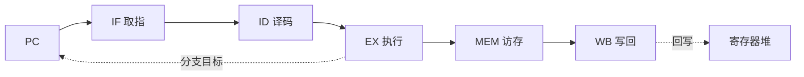

# Week 1–3 学习指南：冯·诺依曼、数据通路、CISC/RISC 与 Lab1–3

> **课程**：计算机组成与体系结构（H）
> **覆盖周次**：Week 1（系统概述/冯·诺依曼）、Week 2（单周期数据通路）、Week 3（指令系统/CISC-RISC）
> **原始采集**：`notebooklm-raw/part1-week1-3/runs/20260616-150636/`（6 批）
> **知识图谱**：`notebooklm-raw/part1-week1-3/knowledge-graph.md`
> **生成日期**：2026-06-16（初版）

---

## 0. 术语表

| 术语 | 大白话 |
|------|--------|
| **体系结构** | 程序员「看得见」的约定：指令集、数据类型、寻址方式 |
| **组成 / 微体系结构** | 程序员「看不见」的实现：数据通路、控制器怎么布线 |
| **ISA** | 软硬件之间的契约接口 |
| **存储程序** | 程序与数据都以二进制形式放在内存里，CPU 自动逐条取指执行 |
| **Load/Store** | 只有 load/store 能访存；运算指令只操作寄存器 |
| **关键路径** | 单周期 CPU 时钟周期必须 ≥ 最慢指令（通常是 `lw`）的延迟 |
| **RAW** | 真数据相关：后面指令要等前面指令写回寄存器 |
| **转发 (Forwarding)** | 不等 WB，直接从 EX/MEM 或 MEM/WB 把结果前递给后续指令 |

（来源：w13-mistakes-bridge、w2-datapath-controls）

---

## 1. 知识地图（L0）

### 1.1 前三周在学什么？

计组(H) 前半学期以 **xv6 CPU 项目**驱动：先搭五级流水线骨架，再逐步补访存、分支与控制冒险。Week 1 建立「跑通 Hello World 需要哪些部件」的系统观；Week 2 紧扣 **Lab1**，讲清单周期数据通路与控制信号；Week 3 讲 **RISC-V ISA** 设计哲学，为 Lab2（访存）与 Lab3（分支）定「CPU 能懂的语言」。（来源：L0-positioning）

### 1.2 与后续课程的关系

这是一种 **「先实战、后回溯」** 的安排：前三周完成流水线 CPU 雏形后，Week 4 起回溯数据表示、多周期演进；再往后进入存储层次（Cache/虚存）、异常与多核。具备 Lab1–3 经验后，后续讲 Cache 一致性、MMU 时更容易理解设计动机。（来源：L0-positioning）

### 1.3 叙事线

---

## 2. 核心知识

### 2.1 冯·诺依曼架构与五级流水线（Week 1）

> **本节要回答**：五大部件各干什么？「存储程序」意味着什么？五级流水各阶段做什么？

**五大部件**（来源：w1-von-neumann）

| 部件 | 职责 |
|------|------|
| 运算器 ALU | 算术/逻辑运算 |
| 控制器 CU | 取指、译码、发控制信号 |
| 存储器 | 统一存放指令与数据（二进制，形式无别） |
| 输入 / 输出 | 人机交互 |

**存储程序**：程序即指令序列，与数据同存于内存；上电后自动、逐条取指执行，无需人工逐步干预。

**五级流水线预览**（Lab1 骨架，Week 7 专题深化）：

| 阶段 | 功能 |
|------|------|
| IF | 按 PC 取指，算 PC+4 |
| ID | 译码，读寄存器堆 |
| EX | ALU 运算或算分支目标 |
| MEM | Load/Store 访存 |
| WB | 结果写回寄存器 |

---

### 2.2 单周期数据通路与控制信号（Week 2）

> **本节要回答**：单周期 CPU 有哪些模块？RegWrite 等信号控制什么？为何 `lw` 决定主频？

**核心模块**（来源：w2-datapath-controls）：PC（时序）、IM（组合读）、寄存器堆（双读同步写）、ALU（组合）、DM（读组合/写时序）、CU（译码生成控制信号）。

**四类控制信号**：

| 信号 | =1 时 | =0 时 |
|------|-------|-------|
| **RegWrite** | 允许写目标寄存器（R 型、`lw`） | 禁止写（`sw`、`beq`） |
| **ALUSrc** | ALU 第二操作数 = 立即数 | 第二操作数 = 寄存器 BusB |
| **MemtoReg** | 写回数据来自 DM | 写回数据来自 ALU |
| **Branch** | 且 Zero=1 时 PC←分支目标 | 顺序 PC+4 |

**`lw` 为何是关键路径**：取指 → 读寄存器 → ALU 算地址 → 读 DM → 写 RF，五步串行全走完；单周期时钟周期必须覆盖这条最长链，较快指令（如纯 R 型）会浪费周期。（来源：w2-datapath-controls）

---

### 2.3 CISC/RISC 与 RISC-V 指令格式（Week 3）

> **本节要回答**：CISC 与 RISC 设计目标有何不同？RV32I 六种格式？Load/Store 架构好处？

**设计哲学对比**（来源：w3-cisc-risc-isa）

| 维度 | CISC (x86) | RISC (RISC-V) |
|------|------------|---------------|
| 目标 | 指令功能强、程序条数少 | 指令简单、利于流水、降 CPI |
| 长度 | 可变（1–15 字节） | 固定 32 位 |
| 寻址 | 复杂多样 | 寄存器/立即数/偏移为主 |
| 访存 | 运算指令可直接访存 | **仅 Load/Store 访存** |
| 控制 | 常微程序 | 硬布线/组合逻辑 |

**RV32I 六种格式**（rs1/rs2/rd 位置固定，简化译码）：

| 类型 | 用途 | 关键字段 |
|------|------|----------|
| R | 寄存器运算 | funct7, rs2, rs1, funct3, rd, opcode |
| I | 立即数运算 / Load / JALR | imm[11:0], rs1, funct3, rd |
| S | Store | imm 拆分，保持 rs1/rs2 位置 |
| B | 条件分支 | imm 打乱编码，偏移 ×2 对齐 |
| U | LUI / AUIPC | imm[31:12] 高位立即数 |
| J | JAL | 大范围 PC 相对跳转 |

**Load/Store 架构优势**：运算与访存分离 → 相关判断主要靠寄存器号；执行时间更规整，利于流水与后续乱序。（来源：w3-cisc-risc-isa）

---

## 3. Lab1–3 与课堂对照

| 实验 | 验证的课堂知识 | 实现要点 |
|------|---------------|----------|
| **Lab1** 五级流水与转发 | IF–WB 架构、RAW、转发、停顿 | EX/MEM、MEM/WB 前递；无法转发时插气泡（保持 PC、IF/ID） |
| **Lab2** Load/Store | Load/Store 语义、总线握手、对齐 | LB/LH/LW 等宽度与符号扩展；`valid`/`dataOk` 握手；`strobe` 字节使能 |
| **Lab3** 分支与跳转 | B/J 型语义、控制冒险、MMIO | EX 定跳转后 Flush IF/ID、ID/EX；MMIO 地址 Difftest Skip |

（来源：lab13-crossref）

**调试常考点**：load-use 相关（转发不够须停顿 1 拍）；`mem_wait` 与停顿叠加；分支错误路径必须冲刷。

---

## 4. 易混淆概念

| 对比组 | 正确理解 |
|--------|----------|
| 体系结构 vs 组成 | 前者程序员可见（ISA）；后者硬件实现细节 |
| 响应时间 vs 吞吐率 | 单任务耗时 vs 单位时间完成任务数；流水提高吞吐但不缩短单指令延迟 |
| ISA vs 微体系结构 | 契约接口 vs 具体电路（同一 ISA 可有不同实现） |
| 大端 vs 小端 | MSB 在低地址 vs LSB 在低地址（Week 4 数据表示会再用） |

（来源：w13-mistakes-bridge）

---

## 5. 与后续模块衔接

- **Week 4**：回溯 ISA 定义的数据类型（有符号整数、浮点）在内存中的编码与对齐
- **Week 7**：流水线专题；冯·诺依曼「指令数据同存」带来结构冒险 → 哈佛架构（I/D Cache 分离）缓解
- **Lab4+**：在 Lab1–3 CPU 上叠加 CSR、MMU、异常——前三周通路是后续一切的基础

---

## 6. 自检问题

读完本章你应能：

1. 画出冯·诺依曼五大部件及 IF→WB 数据流
2. 说出 RegWrite、ALUSrc、MemtoReg、Branch 各控制什么
3. 解释为何单周期 CPU 主频受 `lw` 限制
4. 对比 CISC 与 RISC 在访存、指令长度上的差异
5. 说明 Lab1 转发与 Lab3 冲刷分别解决哪类冒险

---

## 7. 追问块

> **追问 1**：单周期 CPU 中，执行 `add` 与 `lw` 时 RegWrite、MemtoReg、ALUSrc 应各取何值？
>
> **追问 2**：Lab1 中 load-use 冒险为何有时转发不够、必须停顿？（提示：load 的数据要到 MEM 末/WB 初才可用）
>
> **追问 3**：RISC-V 坚持 Load/Store 架构，对 Lab2 实现 `sw` 的 S 型立即数编码有什么影响？（提示：imm 拆分以保持 rs1/rs2 位域固定）
