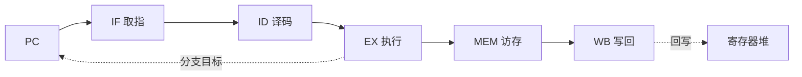
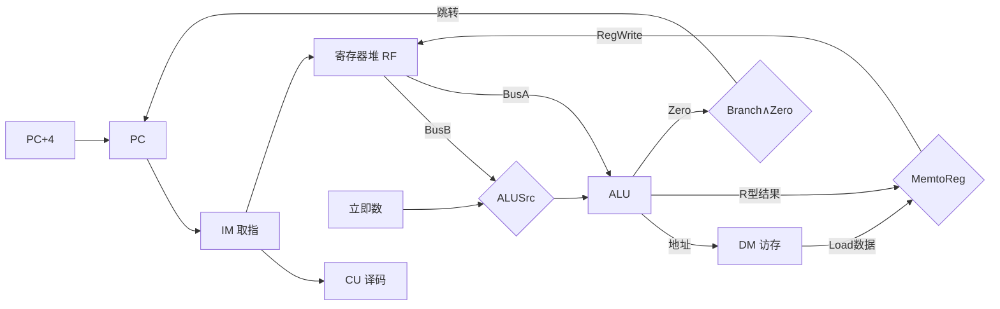
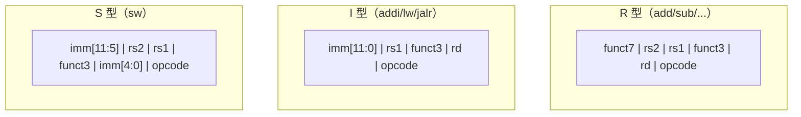
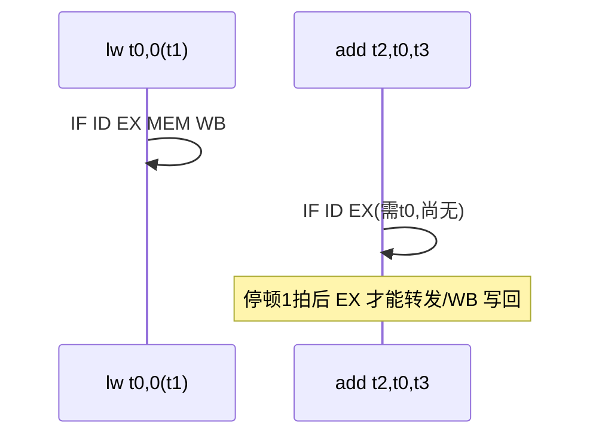

# Week 1–3 学习指南：冯·诺依曼、数据通路、CISC/RISC 与 Lab1–3

> **课程**：计算机组成与体系结构（H）
> **覆盖周次**：Week 1（系统概述/冯·诺依曼）、Week 2（单周期数据通路）、Week 3（指令系统/CISC-RISC）
> **主要来源**：Week 1–3 课程记录、课件 01/04/05、NotebookLM 分层问答
> **对应课件**：`1_计算机系统概述.pdf`、`4_指令系统.pdf`、`5_中央处理器.pdf`（单周期数据通路部分）
> **教材章节**：唐朔飞《计算机组成原理》第 2 版 **第 1、4、5 章**；Patterson《计算机组成与设计》RISC-V 版 **第 1、2、4 章**
> **原始采集**：`notebooklm-raw/part1-week1-3/runs/20260616-150636/`（6 批）
> **知识图谱**：`notebooklm-raw/part1-week1-3/knowledge-graph.md`
> **生成日期**：2026-06-16（初版）
> **术语格式**：术语表及正文**首次出现**时，专业名词采用 **中文（English）**；英文缩写采用 **缩写（English full name，中文）**，便于对照英文课件、教材与开卷试题。

---

## 0. 术语表

| 术语 | 大白话 |
|------|--------|
| **体系结构** | 程序员「看得见」的约定：指令集、数据类型、寻址方式 |
| **组成 / 微体系结构** | 程序员「看不见」的实现：数据通路、控制器怎么布线 |
| **ISA** | 软硬件之间的契约接口 |
| **存储程序** | 程序与数据都以二进制形式放在内存里，CPU 自动逐条取指执行 |
| **Load/Store** | 只有 load/store 能访存；运算指令只操作寄存器 |
| **关键路径** | 单周期 CPU 时钟周期必须 ≥ 最慢指令（通常是 `lw`）的延迟 |
| **RAW** | 真数据相关：后面指令要等前面指令写回寄存器 |
| **转发 (Forwarding)** | 不等 WB，直接从 EX/MEM 或 MEM/WB 把结果前递给后续指令 |

（来源：w13-mistakes-bridge、w2-datapath-controls）

### 高频缩写速查

| 缩写 | 解释 |
|------|------|
| **CPU** | Central Processing Unit，中央处理器 |
| **ALU** | Arithmetic Logic Unit，算术逻辑单元 |
| **CU** | Control Unit，控制器 |
| **ISA** | Instruction Set Architecture，指令集体系结构 |
| **PC** | Program Counter，程序计数器 |
| **RF** | Register File，寄存器堆 |
| **IM / DM** | Instruction Memory / Data Memory，指令存储器 / 数据存储器 |
| **RISC / CISC** | Reduced / Complex Instruction Set Computer，精简 / 复杂指令集计算机 |
| **RISC-V / MIPS** | 两类教学常用 ISA；本课程 Lab 以 RISC-V 为准，MIPS 多作课件对照 |

---

## 1. 知识地图（L0）

### 1.1 前三周在学什么？

计组(H) 前半学期以 **xv6 CPU 项目**驱动：先搭五级流水线骨架，再逐步补访存、分支与控制冒险。Week 1 建立「跑通 Hello World 需要哪些部件」的系统观；Week 2 紧扣 **Lab1**，讲清单周期数据通路与控制信号；Week 3 讲 **RISC-V ISA** 设计哲学，为 Lab2（访存）与 Lab3（分支）定「CPU 能懂的语言」。（来源：L0-positioning、Week 1–3 课程记录、课件 01/04/05）

### 1.2 与后续课程的关系

这是一种 **「先实战、后回溯」** 的安排：前三周完成流水线 CPU 雏形后，Week 4 起回溯数据表示、多周期演进；再往后进入存储层次（Cache/虚存）、异常与多核。具备 Lab1–3 经验后，后续讲 Cache 一致性、MMU 时更容易理解设计动机。（来源：L0-positioning）

**学完你能**：

1. 画出冯·诺依曼五大部件及 IF→WB 数据流
2. 说出 RegWrite、ALUSrc、MemtoReg、Branch 各控制什么，并填出 `add`/`lw` 的真值
3. 解释为何单周期 CPU 主频受 `lw` 限制
4. 对比 CISC 与 RISC 在访存、指令长度上的差异，说出 RV32I 六种格式各干什么
5. 说明 Lab1 转发与 Lab3 冲刷分别解决哪类冒险，并判断 load-use 何时必须停顿

### 1.3 叙事线

### 1.4 课本与课件速查

| 指南节 | Week | 课件 | 唐朔飞（第 2 版） | P&H RISC-V |
|--------|------|------|-------------------|------------|
| §2.1 冯·诺依曼 | Week 1 | 课件 **01** 计算机系统概述 | **第 1 章** 概论（§1.2 层次结构、§1.3 硬件组成） | **第 1 章** Abstractions（§1.3 硬件、§1.4 性能） |
| §2.2 单周期通路 | Week 2 | 课件 **05** 中央处理器 | **第 5 章** 中央处理器（§5.2 单周期 CPU 数据通路） | **第 4 章** The Processor（§4.3 Single-Cycle） |
| §2.3 CISC/RISC | Week 3 | 课件 **04** 指令系统 | **第 4 章** 指令系统（§4.1–4.3 格式与寻址） | **第 2 章** Instructions（§2.3–2.7 格式与寻址） |
| §3 Lab1–3 | 实验 | `4_Lab/` + [26-Arch Wiki](https://github.com/26-Arch/26-Arch/wiki/) | — | 附录 A RISC-V 指令集（查 opcode/funct） |

> **阅读建议**：课堂以 **项目驱动** 为主，课件顺序与 Week 1–3 授课顺序不完全一致（先通路后 ISA 回溯）；复习时可按上表「指南节 → 课件/课本」对照，不必死跟课件编号顺序。

---

## 2. 核心知识

### 2.1 冯·诺依曼架构与五级流水线（Week 1）

> **本节要回答**：五大部件各干什么？「存储程序」意味着什么？五级流水各阶段做什么？

| 来源 | 位置 | 本节对应主题 |
|------|------|-------------|
| **课件 01** | 冯·诺依曼、计算机层次结构 | 五部件、存储程序、IF–WB 预览 |
| **唐朔飞** | **第 1 章** §1.2 层次结构、§1.3 硬件组成 | 运算器/控制器/存储器/IO、程序与数据同存 |
| **P&H RISC-V** | **第 1 章** §1.3 硬件组成、§1.4 性能 | 系统观、吞吐 vs 延迟直觉 |
| **课程记录** | `week1-周一-计组H.md`、`week1-周二-计组H.md` | xv6 CPU 项目、Hello World 系统观 |

**五大部件**（来源：w1-von-neumann、课件 01、唐第 1 章）

| 部件 | 职责 |
|------|------|
| 运算器 ALU | 算术/逻辑运算 |
| 控制器 CU | 取指、译码、发控制信号 |
| 存储器 | 统一存放指令与数据（二进制，形式无别） |
| 输入 / 输出 | 人机交互 |

**存储程序**：程序即指令序列，与数据同存于内存；上电后自动、逐条取指执行，无需人工逐步干预。

**五级流水线预览**（Lab1 骨架，Week 7 专题深化）：

| 阶段 | 功能 |
|------|------|
| IF | 按 PC 取指，算 PC+4 |
| ID | 译码，读寄存器堆 |
| EX | ALU 运算或算分支目标 |
| MEM | Load/Store 访存 |
| WB | 结果写回寄存器 |

> **小结 → 下一节**：五部件 + 存储程序回答了「计算机怎么自动跑程序」；下一节落到 **单周期硬件**：一条指令在一个时钟内走完取指→写回，控制信号决定各 MUX 选哪路。

---

### 2.2 单周期数据通路与控制信号（Week 2）

> **本节要回答**：单周期 CPU 有哪些模块？RegWrite 等信号控制什么？为何 `lw` 决定主频？

| 来源 | 位置 | 本节对应主题 |
|------|------|-------------|
| **课件 05** | 单周期 CPU 数据通路、控制信号 | PC/RF/ALU/DM/CU、RegWrite/ALUSrc/MemtoReg/Branch |
| **唐朔飞** | **第 5 章** §5.2 单周期 CPU 的设计 | 数据通路图、控制信号真值、关键路径 |
| **P&H RISC-V** | **第 4 章** §4.3 A Single-Cycle Implementation | 单周期通路、各指令类型控制逻辑 |
| **课程记录** | `week2-周一-计组H.md`、`week2-周三-计组H.md` | Lab1 衔接、Load 关键路径 |

**核心模块**（来源：w2-datapath-controls、课件 05、唐第 5 章 §5.2）

**核心模块**：PC（时序）、IM（组合读）、寄存器堆（双读同步写）、ALU（组合）、DM（读组合/写时序）、CU（译码生成控制信号）。

**四类控制信号**：

| 信号 | =1 时 | =0 时 |
|------|-------|-------|
| **RegWrite** | 允许写目标寄存器（R 型、`lw`） | 禁止写（`sw`、`beq`） |
| **ALUSrc** | ALU 第二操作数 = 立即数 | 第二操作数 = 寄存器 BusB |
| **MemtoReg** | 写回数据来自 DM | 写回数据来自 ALU |
| **Branch** | 且 Zero=1 时 PC←分支目标 | 顺序 PC+4 |

**`lw` 为何是关键路径**：取指 → 读寄存器 → ALU 算地址 → 读 DM → 写 RF，五步串行全走完；单周期时钟周期必须覆盖这条最长链，较快指令（如纯 R 型）会浪费周期。（来源：w2-datapath-controls）

**常见指令控制信号真值**（MemWrite 单周期 `sw` 专用；`beq` 不写寄存器）：

| 指令 | RegWrite | ALUSrc | MemtoReg | Branch | MemWrite |
|------|:--------:|:------:|:--------:|:------:|:--------:|
| `add` | 1 | 0 | 0 | 0 | 0 |
| `lw` | 1 | 1 | 1 | 0 | 0 |
| `sw` | 0 | 1 | × | 0 | 1 |
| `beq` | 0 | 0 | × | 1 | 0 |

> **直观理解**：把单周期 CPU 想成「一条指令跑完一整圈」——`add` 只用到 ALU→RF；`lw` 必须多走 DM 读口，所以时钟只能按最慢的 `lw` 定节拍，快的指令在周期后半段空转。

> **小结 → 下一节**：通路回答「硬件怎么执行位模式」；下一节回答 **位模式从哪来**——CISC/RISC 设计哲学与 RISC-V 六种指令格式。

---

### 2.3 CISC/RISC 与 RISC-V 指令格式（Week 3）

> **本节要回答**：CISC 与 RISC 设计目标有何不同？RV32I 六种格式？Load/Store 架构好处？

| 来源 | 位置 | 本节对应主题 |
|------|------|-------------|
| **课件 04** | CISC vs RISC、RISC-V 六种格式 | 设计哲学对比、R/I/S/B/U/J 位域 |
| **唐朔飞** | **第 4 章** §4.1 指令格式、§4.2 寻址方式 | 定长/变长、Load/Store 架构 |
| **P&H RISC-V** | **第 2 章** §2.2–2.7 指令格式与寻址 | RV32I 六种格式、立即数编码 |
| **RISC-V 规范** | `riscv-spec.pdf` 第 2 卷 §2.2–2.6 | opcode/funct3/funct7 权威定义 |
| **课程记录** | `week3-周一/周二/周三-计组H.md` | CISC/RISC 权衡、Lab2/3 铺垫 |

**设计哲学对比**（来源：w3-cisc-risc-isa、课件 04、唐第 4 章）

| 维度 | CISC (x86) | RISC (RISC-V) |
|------|------------|---------------|
| 目标 | 指令功能强、程序条数少 | 指令简单、利于流水、降 CPI |
| 长度 | 可变（1–15 字节） | 固定 32 位 |
| 寻址 | 复杂多样 | 寄存器/立即数/偏移为主 |
| 访存 | 运算指令可直接访存 | **仅 Load/Store 访存** |
| 控制 | 常微程序 | 硬布线/组合逻辑 |

**RV32I 六种格式**（rs1/rs2/rd 位置固定，简化译码）：

| 类型 | 用途 | 关键字段 |
|------|------|----------|
| R | 寄存器运算 | funct7, rs2, rs1, funct3, rd, opcode |
| I | 立即数运算 / Load / JALR | imm[11:0], rs1, funct3, rd |
| S | Store | imm 拆分，保持 rs1/rs2 位置 |
| B | 条件分支 | imm 打乱编码，偏移 ×2 对齐 |
| U | LUI / AUIPC | imm[31:12] 高位立即数 |
| J | JAL | 大范围 PC 相对跳转 |

**Load/Store 架构优势**：运算与访存分离 → 相关判断主要靠寄存器号；执行时间更规整，利于流水与后续乱序。（来源：w3-cisc-risc-isa）

**RV32I 位域布局**（rs1/rs2/rd 位置固定 → 译码器硬件简单）：

> **直观理解**：S 型把 12 位立即数拆成两段，是为了 **rs1、rs2 仍落在与 R 型相同的 bit 位置**——Lab2 写 `sw` 译码时，读基址寄存器和源寄存器的电路可与 R 型共用。

> **小结 → 下一节**：ISA 定好了「CPU 能懂的语言」；Lab1–3 在 RTL 里验证通路、访存与控制冒险是否按这套语义工作。

---

## 3. Lab1–3 与课堂对照

| 来源 | 位置 | 说明 |
|------|------|------|
| **Lab Wiki** | [26-Arch Wiki](https://github.com/26-Arch/26-Arch/wiki/) Lab-1 ~ Lab-3 | 实验要求、上板、调试 |
| **课件** | `4_Lab/Lab1–3*.pdf` | 实验讲义与验收标准 |
| **个人报告** | `26-Arch/Doc/Lab{1..3}/report.md` | 实现要点与踩坑记录 |

| 实验 | 验证的课堂知识 | 实现要点 |
|------|---------------|----------|
| **Lab1** 五级流水与转发 | IF–WB 架构、RAW、转发、停顿 | EX/MEM、MEM/WB 前递；无法转发时插气泡（保持 PC、IF/ID） |
| **Lab2** Load/Store | Load/Store 语义、总线握手、对齐 | LB/LH/LW 等宽度与符号扩展；`valid`/`dataOk` 握手；`strobe` 字节使能 |
| **Lab3** 分支与跳转 | B/J 型语义、控制冒险、MMIO | EX 定跳转后 Flush IF/ID、ID/EX；MMIO 地址 Difftest Skip |

（来源：lab13-crossref）

**load-use 冒险**（Lab1 最常踩坑）：`lw` 的数据要到 **MEM 末 / WB 初** 才写入 RF，下一条若在 EX 就要用该寄存器，EX/MEM 转发也来不及——必须 **插 1 拍气泡**（或等效阻塞 IF/ID）。

**调试常考点**：load-use（转发不够须停顿 1 拍）；`mem_wait` 与停顿叠加；分支错误路径必须冲刷。

> **直观理解**：转发解决「结果已在流水线里、只是还没写回 RF」；load-use 是「下一条等得太急，结果根本还没产生」——二者不要混为一谈。

---

## 4. 易混淆概念

| 对比组 | 正确理解 |
|--------|----------|
| 体系结构 vs 组成 | 前者程序员可见（ISA）；后者硬件实现细节 |
| 响应时间 vs 吞吐率 | 单任务耗时 vs 单位时间完成任务数；流水提高吞吐但不缩短单指令延迟 |
| ISA vs 微体系结构 | 契约接口 vs 具体电路（同一 ISA 可有不同实现） |
| 大端 vs 小端 | MSB 在低地址 vs LSB 在低地址（Week 4 数据表示会再用） |

（来源：w13-mistakes-bridge）

---

## 5. 与后续模块衔接

- **Week 4**：回溯 ISA 定义的数据类型（有符号整数、浮点）在内存中的编码与对齐
- **Week 7**：流水线专题；冯·诺依曼「指令数据同存」带来结构冒险 → 哈佛架构（I/D Cache 分离）缓解
- **Lab4+**：在 Lab1–3 CPU 上叠加 CSR、MMU、异常——前三周通路是后续一切的基础

---

## 6. 自检问题

读完本章你应能：

1. 画出冯·诺依曼五大部件及 IF→WB 数据流
2. 说出 RegWrite、ALUSrc、MemtoReg、Branch 各控制什么
3. 解释为何单周期 CPU 主频受 `lw` 限制
4. 对比 CISC 与 RISC 在访存、指令长度上的差异
5. 说明 Lab1 转发与 Lab3 冲刷分别解决哪类冒险

---

## 7. 追问块

> **追问 1**：单周期 CPU 中，执行 `add` 与 `lw` 时 RegWrite、MemtoReg、ALUSrc 应各取何值？
>
> **答**：`add` → RegWrite=1, ALUSrc=0, MemtoReg=0；`lw` → RegWrite=1, ALUSrc=1, MemtoReg=1。区别在 ALUSrc（立即数偏移 vs 第二寄存器）和 MemtoReg（写回来自 DM 而非 ALU）。

> **追问 2**：Lab1 中 load-use 冒险为何有时转发不够、必须停顿？
>
> **答**：`lw` 的有效数据在 MEM 段才从 DM 读出，最早 WB 初才进 RF。若下一条在 EX 就要读该寄存器，EX/MEM 段尚无结果可转发，只能阻塞 1 拍（见 §3 时序图）。

> **追问 3**：RISC-V 坚持 Load/Store 架构，对 Lab2 实现 `sw` 的 S 型立即数编码有什么影响？
>
> **答**：`sw` 不能走 R 型「rs2 在固定 bit 段」的格式，必须用 S 型把 imm 拆成 imm[11:5] 与 imm[4:0]，使 rs1/rs2 位域与 R/I 型对齐，译码与寄存器读端口可复用。

---

## 8. 资料索引

| 类型 | 文件 / 路径 | 说明 |
|------|-------------|------|
| 课程记录 | `week1-周一/周二-计组H.md` | Week 1 系统概述、xv6 项目 |
| 课程记录 | `week2-周一/周三-计组H.md` | Week 2 单周期数据通路 |
| 课程记录 | `week3-周一/周二/周三-计组H.md` | Week 3 CISC/RISC、ISA 格式 |
| 课件 | `3_课件/1_计算机系统概述.pdf` | 冯·诺依曼、层次结构 |
| 课件 | `3_课件/4_指令系统.pdf` | CISC/RISC、RV32I 六种格式 |
| 课件 | `3_课件/5_中央处理器.pdf` | 单周期数据通路、控制信号 |
| 教材 | 唐朔飞《计算机组成原理》第 2 版 | **第 1 章** 概论；**第 4 章** 指令系统；**第 5 章** §5.2 单周期 CPU |
| 教材 | Patterson《计算机组成与设计》RISC-V 版 | **第 1 章** 系统概述；**第 2 章** 指令；**第 4 章** §4.3 单周期实现 |
| 参考 | `riscv-spec.pdf`、`RISC-V-Reader-Chinese-v2p1.pdf` | 指令编码权威对照 |
| 实验 | `4_Lab/`、`26-Arch/Doc/Lab{1..3}/` | Lab1–3 讲义与报告 |
| 知识图谱 | `notebooklm-raw/part1-week1-3/knowledge-graph.md` | 整合前置 |
| 原始问答 | `notebooklm-raw/part1-week1-3/runs/latest/*.answer.md` | 6 批完整 raw |
| 周次索引 | `guides/计组课程-16周内容梳理.md` | 课纲对照 |
