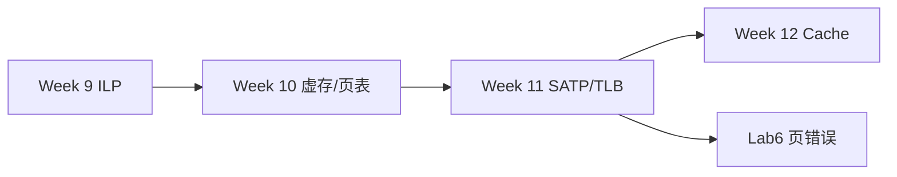
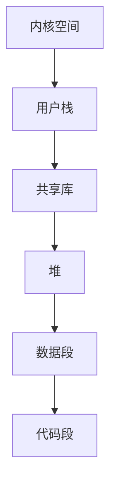

# Week 10–11 学习指南：虚拟存储 + SATP/TLB

> **课程**：计算机组成与体系结构（H）
> **覆盖周次**：Week 10（虚存/页表）、Week 11（SATP/TLB/SFENCE.VMA）
> **主要来源**：Week 10–11 课程记录、课件 07、NotebookLM 分层问答
> **对应课件**：`7_层次结构存储系统.pdf`
> **教材章节**：唐朔飞《计算机组成原理》第 2 版 **第 7 章**；Patterson RISC-V 版 **第 5 章** §5.6–5.7 虚存
> **原始采集**：`notebooklm-raw/part4-week10-11/runs/20260616-144926/`（6 批）
> **知识图谱**：`notebooklm-raw/part4-week10-11/knowledge-graph.md`
> **整合日期**：2026-06-16（初版）

---

## 0. 术语表

| 术语 | 大白话 |
|------|--------|
| **虚拟地址 VA** | 程序「以为」自己在用的地址 |
| **物理地址 PA** | 内存条上真实的单元地址 |
| **VPN / PPN** | 虚页号 / 物理页号 |
| **PTE** | 页表项，存 VPN→PPN 映射与权限 |
| **SATP** | 监管者用来开启分页、指向根页表的 CSR |
| **TLB** | 页表项的快表，避免每次走三级页表 |
| **SFENCE.VMA** | 刷 TLB 的指令 |
| **WARL** | 写入任意值、读回合法值（SATP Mode 典型） |

---

## 1. 知识地图（L0）

### 1.1 这两周在学什么？

Week 9 还在挖 **ILP**（指令怎么重叠执行）；从 Week 10 起，课程视角转向 **存储层次**——处理器算得再快，数据搬不动就是「存储墙」。Week 10 建立**虚拟存储**概念；Week 11 落到 RISC-V **Sv39 硬件机制**（SATP、TLB、SFENCE.VMA）。

（来源：Week 10–11 课程记录、课件09）

### 1.2 为何期末重点考这里？

前半学期流水线/数据通路已在 **Lab1–3** 中深度实践；而 **Cache 映射、TLB、虚实地址转换、一致性** 等涉及复杂软硬件协同，笔试更适合考查量化分析。（来源：L0-positioning raw、Week 8 期末范围说明）

**学完你能**：

1. 画出 Sv39 三级 Page Walk 流程
2. 手算给定 VA/satp 的 PA
3. 说出 SFENCE.VMA 四种组合各失效什么
4. 解释 Lab5 中为何 trap 在 WB 处理
5. 区分 TLB miss 与 Page Fault 的处理路径

### 1.3 叙事线



### 1.4 课本与课件速查

| 指南节 | Week | 课件 | 唐朔飞（第 2 版） | P&H RISC-V |
|--------|------|------|-------------------|------------|
| §2.1 虚拟存储 | Week 10 | 课件 **07** 层次结构存储系统 | **第 7 章** §7.3 虚存 | **第 5 章** §5.6 虚存概述 |
| §2.2 Sv39 页表 | Week 10–11 | 课件 **07** | **第 7 章** §7.3.2 页表 | **第 5 章** §5.7 页表 |
| §2.3 SATP/TLB | Week 11 | 课件 **07** | **第 7 章** §7.3.3 TLB | **第 5 章** §5.7 TLB |
| §3 Lab4–5 | 实验 | `4_Lab/` + [26-Arch Wiki](https://github.com/26-Arch/26-Arch/wiki/) Lab-4/5 | — | CSR 附录 |

---

## 2. 核心知识

### 2.1 虚拟存储（Week 10）

> **本节要回答**：为什么需要虚存？逻辑地址、按需分页、页表各是什么？

| 来源 | 位置 | 本节对应主题 |
|------|------|-------------|
| **课件 07** | 虚存、存储墙 | 逻辑地址空间、页表 |
| **唐朔飞** | **第 7 章** §7.3 | 虚存基本概念 |
| **P&H RISC-V** | **第 5 章** §5.6 | 虚存动机 |
| **课程记录** | `week10-周三-计组H.md` | 存储墙、按需分页 |

**直觉**：每个进程拿到一张「额度很大的信用卡」（独立逻辑地址空间），真正访问时才从物理内存「拨款」；未用到的页留在磁盘。（来源：w10-virtual-memory）

| 概念 | 要点 |
|------|------|
| 存储墙 | 带宽/延迟跟不上算力；层次化存储缓解 |
| 逻辑地址空间 | 每进程独立、连续；简化链接加载 |
| 按需分页 | 缺页时才从磁盘调入 |
| 页表 | VPN→PPN 映射字典；含 V/R/W/X/U/A/D 等位 |



> **小结 → 下一节**：虚存提供大地址空间与隔离；硬件用 **多级页表** 把 VA 译成 PA——Sv39 是 RISC-V 课程与 Lab5 的实现标准。

---

### 2.2 Sv39 三级页表（Week 10–11）

> **本节要回答**：39 位虚址怎么拆？PTE 各位什么意思？怎么手算一次地址转换？

| 来源 | 位置 | 本节对应主题 |
|------|------|-------------|
| **课件 07** | Sv39、PTE 位域 | VPN 划分、Page Walk |
| **唐朔飞** | **第 7 章** §7.3.2 | 页表项结构 |
| **P&H RISC-V** | **第 5 章** §5.7 | RISC-V 分页 |
| **课程记录** | `week10-周三-计组H.md` | 地址转换手算 |

**Sv39 虚址划分**（39 位有效，高位符号扩展）：

| 位域 | 含义 |
|------|------|
| [38:30] | VPN[2] 根页表索引 |
| [29:21] | VPN[1] |
| [20:12] | VPN[0] |
| [11:0] | 页内偏移（4KB） |

**PTE 关键标志位**：V 有效；R/W/X 权限（全 0 表示指向下一级）；U 用户可访问；A 已访问；D 脏页。（来源：w10-sv39-page-table）

**Page Walk 步骤**：

1. 从 `satp.PPN` 得根页表物理基址
2. 用 VPN[2] 索引读 PTE2 → 若非叶子则 PPN 作 L1 基址
3. 同理 L1→L0
4. `PA = LeafPTE.PPN << 12 | offset`

**手算例**（来源：raw）：`satp.PPN=0x80000`，`VA=0x8_0000_2ABC` → 逐级索引得 `PA=0x9_0000_0ABC`。

```mermaid
flowchart TD
    VA[虚拟地址 VA] --> VPN2[VPN2 索引根页表]
    VPN2 --> PTE2[PTE2]
    PTE2 --> VPN1[VPN1 索引 L1]
    VPN1 --> PTE1[PTE1]
    PTE1 --> VPN0[VPN0 索引 L0]
    VPN0 --> LEAF[叶子 PTE → PPN]
    LEAF --> PA[PA = PPN<<12 | offset]
    SATP[satp.PPN] --> VPN2
```

> **小结 → 下一节**：每次 Page Walk 要多次访存；**TLB + SATP** 缓存最近映射，并靠 SFENCE.VMA 在映射变更时保持一致。

---

### 2.3 SATP、TLB 与 SFENCE.VMA（Week 11）

> **本节要回答**：SATP 三个字段？TLB 干什么？四种 SFENCE 范围？

| 来源 | 位置 | 本节对应主题 |
|------|------|-------------|
| **课件 07** | TLB、地址转换加速 | SATP、SFENCE |
| **唐朔飞** | **第 7 章** §7.3.3 | TLB 原理 |
| **P&H RISC-V** | **第 5 章** §5.7 | TLB 与页表遍历 |
| **课程记录** | `week11-周一/周三-计组H.md` | Lab4 SATP、ASID |

**SATP（Sv39）**：

| 字段 | 位 | 含义 |
|------|-----|------|
| MODE | 63–60 | 0=Bare，8=Sv39 |
| ASID | 59–44 | 区分进程，减少切换刷 TLB |
| PPN | 43–0 | 根页表物理页号 |

**WARL**：可写任意值，读回仅合法值（如不支持的 Mode 被忽略）。（来源：w11-satp-tlb-sfence）

**TLB**：页表项缓存；命中则跳过内存中的多级遍历。

**SFENCE.VMA 四种范围**：

| rs1 | rs2 | 失效范围 |
|-----|-----|----------|
| x0 | x0 | 全部 |
| x0 | ≠x0 | 指定 ASID 全部 |
| ≠x0 | x0 | 指定 VA 全局 |
| ≠x0 | ≠x0 | 指定 ASID + VA |

ASID 耗尽回收后必须 `SFENCE.VMA` 同步。

> **小结 → 下一节**：虚存解决容量与隔离；Week 12 用 **Cache** 解决译址后的访存速度，并与多核存储模型衔接。

---

## 3. Lab4–5 与课堂对照（期末向）

| 来源 | 位置 | 说明 |
|------|------|------|
| **Lab Wiki** | [26-Arch Wiki](https://github.com/26-Arch/26-Arch/wiki/) Lab-4、Lab-5 | CSR、MMU、Trap |
| **课件** | `4_Lab/Lab4–5*.pdf` | 实验要求 |
| **个人报告** | `26-Arch/Doc/Lab{4..5}/report.md` | Page Walk、精确异常 |

| 模块 | Lab 实现要点 | 课堂/笔试考点 |
|------|-------------|---------------|
| CSR/SATP | 6 条 CSR；satp 64 位；读-改-写语义 | WARL、ASID |
| Sv39 MMU | FSM Page Walk；巨页 | VPN 划分、PTE 位域 |
| Trap | WB 提交边界改特权级；冲刷流水 | 精确异常、MPP/MPIE |
| 刷新 | CSR/Trap 后刷新；CSR 不转发 | 为何 satp 变更必须 flush |

**开卷易考**（来源：lab45-crossref、报告-Lab4/5）：

- 硬件须置 **A/D** 位，否则 Page Fault
- **SUM** 位：S 模式访问 U 页；**MXR**：X 页是否可读
- Difftest 用 **VA**，MMIO 用 **PA**
- MMU 状态机板端握手：PTE 读间插空拍

---

## 4. 易混淆概念

| 对比组 | 正确理解 |
|--------|----------|
| VA vs PA | CPU 用 VA，MMU 译成 PA 才访存 |
| 页 vs 页框 | 虚存划分单位 vs 物理内存划分单位 |
| TLB miss vs Page Fault | 前者快表未命中；后者页不在内存，需 OS 调入 |
| SFENCE 全局 vs 局部 | 见 §2.3 四组合 |

---

## 5. 与前后模块衔接

- **Lab6**：页错误（inst/load/store）走异常路径；需配置 `satp`、`mstatus.SUM`
- **Week 12**：虚存解决容量，Cache 解决速度；**VIPT** 可并行索引 Cache 与查 TLB

---

## 6. 自检问题

读完本章你应能：

1. 画出 Sv39 三级 Page Walk 流程
2. 手算给定 VA/satp 的 PA
3. 说出 SFENCE.VMA 四种组合各失效什么
4. 解释 Lab5 中为何 trap 在 WB 处理

---

## 7. 追问块

> **追问 1**：若 `satp` 在运行中被修改，流水线中已取指、已译码的指令会怎样？为什么必须 flush？
>
> **答**：已取指/译码指令仍按**旧页表**翻译地址，会继续访问错误物理页。修改 `satp` 后必须 **冲刷流水线** 并从新 PC 重新取指，保证后续指令在新地址空间下执行——Lab5 trap 与 CSR 写后 flush 同源。

> **追问 2**：2MB 巨页与 4KB 页在 VPN 划分上有何不同？
>
> **答**：巨页叶子 PTE 出现在 **L1**（VPN[0] 并入页内偏移），只需两级 Walk；4KB 页叶子在 **L0**，需三级 Walk。巨页 TLB Reach 更大但可能浪费物理页内部空间。

> **追问 3**：TLB miss 但页在内存中，与 Page Fault 的处理有何不同？
>
> **答**：TLB miss 仍可由硬件 **Page Walk** 完成（多次内存访问）；Page Fault 是 PTE 无效或权限违例，须 **陷入 OS** 调入页或杀进程——延迟量级差几个数量级。

---

## 8. 资料索引

| 类型 | 文件 / 路径 | 说明 |
|------|-------------|------|
| 课程记录 | `week10-周三-计组H.md` | Week 10 虚存 |
| 课程记录 | `week11-周一/周三-计组H.md` | Week 11 SATP/TLB |
| 课件 | `3_课件/7_层次结构存储系统.pdf` | 虚存、TLB、Cache |
| 教材 | 唐朔飞第 2 版 **第 7 章** | 存储系统 |
| 教材 | Patterson RISC-V **第 5 章** §5.6–5.7 | 虚存与页表 |
| 实验 | `4_Lab/Lab4–5/`、`26-Arch/Doc/Lab{4..5}/` | CSR、MMU |
| 知识图谱 | `notebooklm-raw/part4-week10-11/knowledge-graph.md` | 整合前置 |
| 原始问答 | `notebooklm-raw/part4-week10-11/runs/latest/*.answer.md` | 6 批 raw |
| 周次索引 | `guides/计组课程-16周内容梳理.md` | 课纲对照 |
