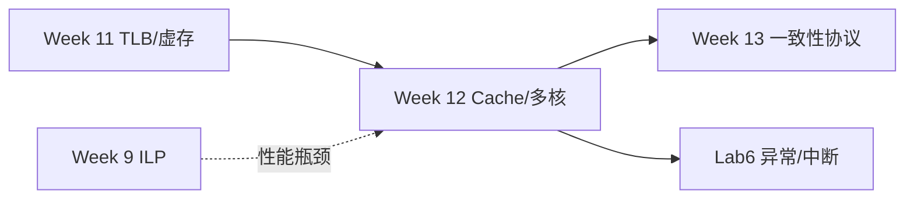
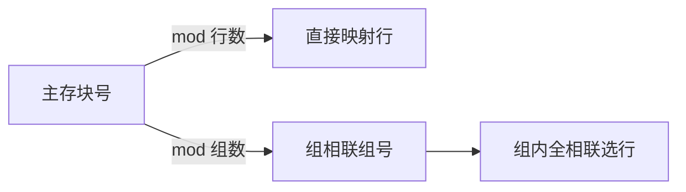
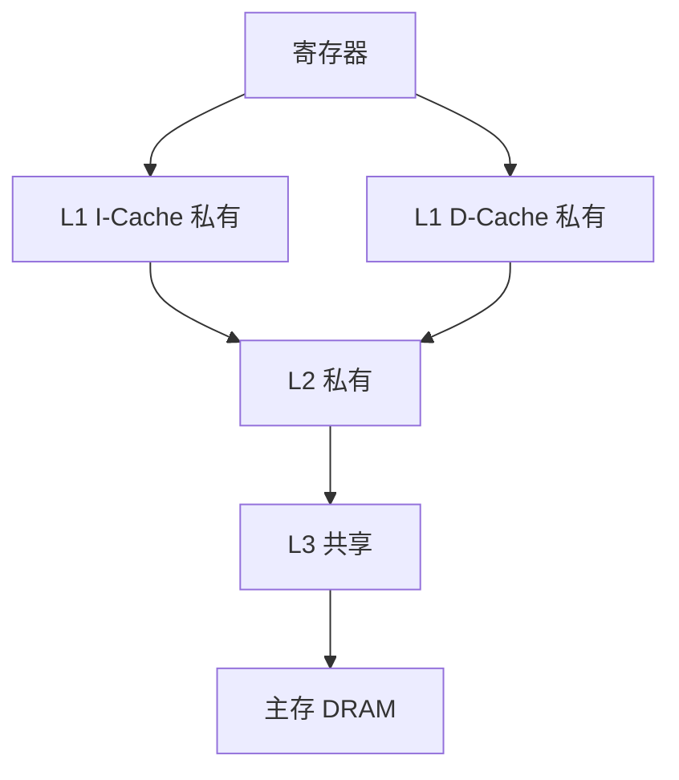

# Week 12 学习指南：多核 Cache 组织 + 写策略

> **课程**：计算机组成与体系结构（H）
> **覆盖周次**：Week 12（Cache 映射、写策略、多核存储模型、一致性契约）
> **原始采集**：`notebooklm-raw/part5-week12/runs/20260616-152241/`（5 批）
> **知识图谱**：`notebooklm-raw/part5-week12/knowledge-graph.md`
> **生成日期**：2026-06-16（初版）

---

## 0. 术语表

| 术语 | 大白话 |
|------|--------|
| **Tag / Index / Offset** | 主存地址拆成「身份牌 / 行号 / 块内偏移」 |
| **写直达 (WT)** | 写 Cache 同时写主存，主存始终最新 |
| **写回 (WB)** | 只改 Cache，脏块换出时才写主存 |
| **UMA** | 各核访问任意物理内存延迟差不多（集中式共享） |
| **NUMA** | 本地内存快、远程内存慢（分布式共享） |
| **一致性 (Coherence)** | 多核对**同一地址**的读写顺序要「说得通」 |
| **连贯性 (Consistency)** | **不同地址**之间，程序员看到的全局访存顺序 |
| **TLP** | 多核/多线程并行，区别于单核 ILP |

---

## 1. 知识地图（L0）

### 1.1 这周在学什么？

Week 10–11 用虚存和 TLB 解决单核「地址空间够大」；Week 12 转向 **线程级并行（TLP）**——多核各有私有 Cache，却共享主存。课程先讲 **Cache 怎么映射、怎么写**，再定义多核必须遵守的 **一致性/连贯性契约**，为 Week 13 的 MSI/MESI 协议铺路。（来源：L0-positioning、课件10）

### 1.2 为何期末重点考这里？

流水线已在 Lab1–3 深度实践；而 **Cache 映射手算、写策略、多核存储模型** 理论性强、量化分析适合笔试，是考查「系统视角」的核心。（来源：L0-positioning）

### 1.3 叙事线

---

## 2. 核心知识

### 2.1 Cache 映射与地址划分

> **本节要回答**：直接映射、组相联、全相联各怎么找行？地址怎么拆位？

| 映射方式 | 规则 | 特点 |
|----------|------|------|
| **直接映射** | 行号 = 块号 mod 总行数 | 硬件简单，易冲突缺失 |
| **组相联** | 组号 = 块号 mod 组数；组内任意行 | 折中方案，N 路常见 |
| **全相联** | 可放任意行；无 Index，Tag 并行比 | 冲突最少，比较器贵 |

**地址三段**：Tag（区分同索引的不同块）| Index（定位行/组）| Offset（块内字节）。（来源：w12-cache-org）

**手算例**（32 位地址，Cache 64 KB，块 16 B，直接映射）：

1. Offset：$16\text{B}=2^4$ → **4 位**
2. 行数：$64\text{KB}/16\text{B}=4\text{K}=2^{12}$ → Index **12 位**
3. Tag：$32-12-4=$ **16 位**

| Tag (31–16) | Index (15–4) | Offset (3–0) |
|:---:|:---:|:---:|
| 16 位 | 12 位 | 4 位 |

**改 4 路组相联**：组数 $4\text{K}/4=1\text{K}$ → Index **10 位**，Tag **18 位**。（来源：w12-cache-org）

---

### 2.2 写策略与多级 Cache

> **本节要回答**：写命中时主存何时更新？现代多核 Cache 怎么分层？

| 策略 | 行为 | 优缺点 |
|------|------|--------|
| **写直达** | 写命中同时写 Cache + 主存 | 主存始终一致；主存慢，CPI 高 |
| **写回** | 只写 Cache，置脏位；替换时才写回 | 省带宽；多核需协议保证一致性 |

**多级结构**（来源：w12-write-policy）：

L1 分指令/数据 Cache；L2 通常核私有；L3 片上共享，缓解「内存墙」。

---

### 2.3 多核存储模型与一致性契约

> **本节要回答**：UMA/NUMA 有何区别？一致性 vs 连贯性各管什么？

| 模型 | 要点 |
|------|------|
| **UMA** | 总线/交换网络统一内存，各核延迟相近 |
| **NUMA** | 本地内存快、远程慢；统一编址 |

多核 + 私有 Cache + 乱序/写缓冲 → 各核看到的访存顺序可能与程序序不同。Week 12 先立 **契约**（程序员能假设什么），Week 13 再讲硬件如何用总线监听/目录协议（MSI/MESI）兑现。（来源：L0、w12-mistakes-bridge）

| 概念 | 范围 |
|------|------|
| **一致性** | **同一**存储单元，多副本读写顺序 |
| **连贯性** | **不同**单元间的全局可见顺序（SC / TSO 等） |

**与 Week 11 衔接**：各核 TLB 私有；OS 改页表后须 `sfence.vma` 同步——这是虚存层面的「一致性」。（来源：w12-mistakes-bridge）

---

## 3. Lab6 与课堂对照（期末向）

Week 12 主课是 Cache/多核；Lab6 聚焦 **中断与异常**，但与存储/访存考点交叉。（来源：lab6-crossref）

| 模块 | 课堂/Wiki | Lab6 实现要点 |
|------|-----------|---------------|
| 异常流程 | mepc/mcause/mstatus/mtvec；冲刷流水 | **WB 阶段**统一 trap → 精确异常 |
| 地址场景 | DiffTest 用 VA；MMIO 用 PA | 对齐异常时 MEM 屏蔽 `dreq.valid` |
| 中断使能 | `mie` ∧ `mip`；特权级 | 硬件 pending 仲裁，不强行写 CSR |
| 时钟中断 | `mtime`/`mtimecmp` 为 **MMIO** | 优先级：外部 > 时钟 > 软件 |
| 控制流 | trap/mret 须冲刷、重定向 PC | 等 `fetch_wait`/`mem_wait` 再重定向 |

**开卷易考**：精确异常为何在 WB；byte/half/word 对齐规则；trap 与总线握手的配合。

---

## 4. 易混淆概念

| 对比组 | 正确理解 |
|--------|----------|
| 一致性 vs 连贯性 | 前者管**同一地址**副本；后者管**不同地址**间全局序 |
| SC vs 放松一致性 | SC 严格程序序+全局可见；TSO/PSO 允许乱序，靠屏障同步 |
| ILP vs TLP | ILP 单线程内重叠执行；TLP 多核多任务流突破 ILP 瓶颈 |
| 写直达 vs 写回 | WT 主存即时更新；WB 脏块延迟写回，需一致性协议 |
| TLB miss vs Cache miss | 前者页表项；后者数据块——层次不同 |

---

## 5. 与前后模块衔接

- **Week 11**：虚存解容量；TLB 加速翻译 → Week 12 Cache 解速度
- **Week 13**：MSI/MESI 等协议**实现** Week 12 的一致性目标
- **Lab4–5**：MMU Page Walk、trap 框架 → Lab6 补中断/对齐/MMIO

---

## 6. 自检问题

读完本章你应能：

1. 给定主存地址位宽、Cache 容量、块大小，手算 Tag/Index/Offset
2. 说明直接映射与 4 路组相联的 Index 位差异
3. 对比写直达与写回对带宽和一致性的影响
4. 区分一致性、连贯性，并各举一个多核场景
5. 解释 Lab6 为何在 WB 处理 trap

---

## 7. 追问块

> **追问 1**：二维数组按行遍历 vs 按列遍历，哪种 Cache 友好？（提示：空间局部性、块大小）
>
> **追问 2**：核 A 写回脏块的同时核 B 读同一地址，若无一致性协议会怎样？
>
> **追问 3**：修改 `satp` 后除刷流水线外，多核还需做什么 TLB 同步？
