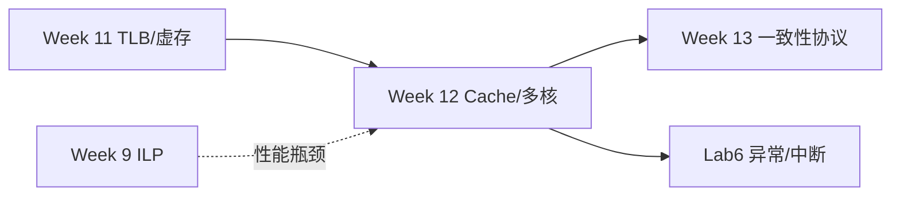
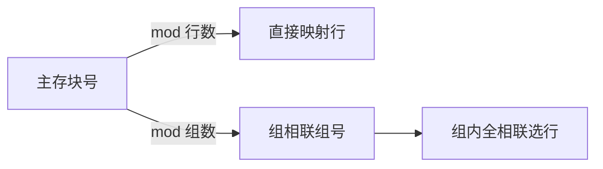
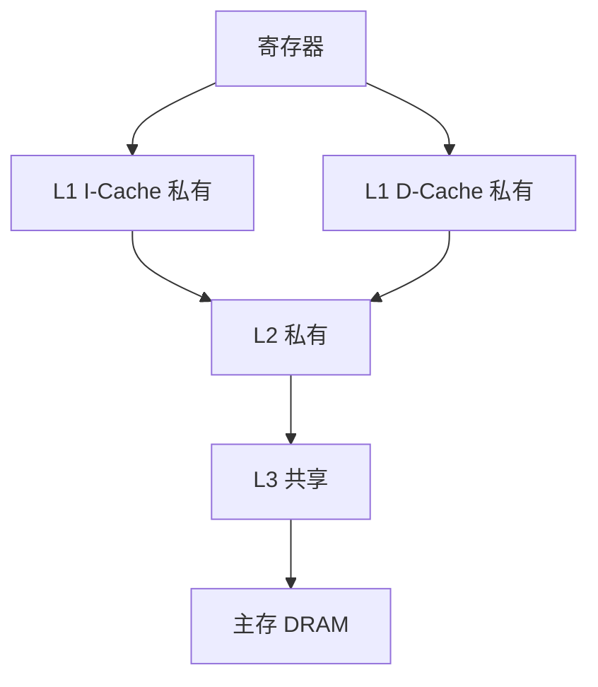

# Week 12 学习指南：多核 Cache 组织 + 写策略

> **课程**：计算机组成与体系结构（H）
> **覆盖周次**：Week 12（Cache 映射、写策略、多核存储模型、一致性契约）
> **主要来源**：Week 12 课程记录、课件 07、NotebookLM 分层问答
> **对应课件**：`7_层次结构存储系统.pdf`
> **教材章节**：唐朔飞《计算机组成原理》第 2 版 **第 7 章** §7.2–7.4；Patterson RISC-V 版 **第 5 章** §5.1–5.5 Cache
> **原始采集**：`notebooklm-raw/part5-week12/runs/20260616-152241/`（5 批）
> **知识图谱**：`notebooklm-raw/part5-week12/knowledge-graph.md`
> **整合日期**：2026-06-16（初版）；2026-06-24（二轮优化）
> **术语格式**：术语表及正文**首次出现**时，专业名词采用 **中文（English）**；英文缩写采用 **缩写（English full name，中文）**，便于对照英文课件、教材与开卷试题。

---

## 0. 术语表

| 术语 | 大白话 |
|------|--------|
| **Tag / Index / Offset** | 主存地址拆成「身份牌 / 行号 / 块内偏移」 |
| **写直达 (WT)** | 写 Cache 同时写主存，主存始终最新 |
| **写回 (WB)** | 只改 Cache，脏块换出时才写主存 |
| **写分配 (Write Allocate)** | 写缺失时先把块调入 Cache，再在 Cache 中写 |
| **不写分配 (No Write Allocate)** | 写缺失时直接写下层存储，不把块调入 Cache |
| **UMA (Uniform Memory Access)** | 各核访问任意物理内存延迟差不多（均匀访存 / 集中式共享） |
| **NUMA (Non-Uniform Memory Access)** | 本地内存快、远程内存慢（非均匀访存 / 分布式共享） |
| **一致性 (Coherence)** | 多核对**同一地址**的读写顺序要「说得通」 |
| **连贯性 (Consistency)** | **不同地址**之间，程序员看到的全局访存顺序 |
| **TLP** | 多核/多线程并行，区别于单核 ILP |

### 高频缩写速查

| 缩写 | 解释 |
|------|------|
| **AMAT** | Average Memory Access Time，平均访存时间 |
| **LRU / LFU** | Least Recently/Frequently Used，最近最少使用 / 最不经常使用替换 |
| **TLP** | Thread-Level Parallelism，线程级并行 |
| **UMA** | Uniform Memory Access，均匀访存 |
| **NUMA** | Non-Uniform Memory Access，非均匀访存 |
| **MSI / MESI** | Modified-Shared-Invalid / Modified-Exclusive-Shared-Invalid，缓存一致性状态协议 |
| **MMIO** | Memory-Mapped I/O，内存映射输入输出 |

---

## 1. 知识地图（L0）

### 1.1 这周在学什么？

Week 10–11 用虚存和 TLB 解决单核「地址空间够大」；Week 12 转向 **线程级并行（TLP）**——多核各有私有 Cache，却共享主存。课程先讲 **Cache 怎么映射、怎么写**，再定义多核必须遵守的 **一致性/连贯性契约**，为 Week 13 的 MSI/MESI 协议铺路。（来源：L0-positioning、课件10）

### 1.2 为何期末重点考这里？

流水线已在 Lab1–3 深度实践；而 **Cache 映射手算、写策略、多核存储模型** 理论性强、量化分析适合笔试，是考查「系统视角」的核心。（来源：L0-positioning）

**学完你能**：

1. 给定地址位宽、Cache 容量、块大小，手算 Tag/Index/Offset
2. 说明直接映射与 4 路组相联的 Index 位差异
3. 对比写直达与写回对带宽和一致性的影响
4. 区分一致性、连贯性，并各举一个多核场景
5. 解释 Lab6 为何在 WB 处理 trap

### 1.3 叙事线

### 1.4 课本与课件速查

| 指南节 | Week | 课件 | 唐朔飞（第 2 版） | P&H RISC-V |
|--------|------|------|-------------------|------------|
| §2.1 Cache 映射 | Week 12 | 课件 **07** | **第 7 章** §7.2.2 映射 | **第 5 章** §5.2 映射 |
| §2.2 写策略 | Week 12 | 课件 **07** | **第 7 章** §7.2.3 替换与写 | **第 5 章** §5.3 写策略 |
| §2.3 多核契约 | Week 12 | 课件 **07**、**08** 预告 | **第 7 章** §7.4；**第 8 章** 引言 | **第 5 章** §5.4 多级 Cache |
| §3 Lab6 | 实验 | `4_Lab/Lab6` + [26-Arch Wiki](https://github.com/26-Arch/26-Arch/wiki/Lab-6) | — | Trap 在 WB |

---

## 2. 核心知识

### 2.1 Cache 映射、替换与地址划分

> **本节要回答**：直接映射、组相联、全相联各怎么找行？地址怎么拆位？替换策略何时介入？

| 来源 | 位置 | 本节对应主题 |
|------|------|-------------|
| **课件 07** | 直接/组相联/全相联、替换 | Tag/Index/Offset、LRU/LFU |
| **唐朔飞** | **第 7 章** §7.2.2 | Cache 地址映射 |
| **P&H RISC-V** | **第 5 章** §5.2 | 映射手算 |
| **课程记录** | `week12-周一/周二/周三-计组H.md` | 映射手算练习 |

#### 2.1.1 先看问题：Cache 为什么要“映射”？

Cache（高速缓存）比主存小得多，不能把所有主存块都放进来。因此硬件必须回答两个问题：第一，某个主存块允许放到 Cache 的哪些位置；第二，CPU 给出一个地址时，怎样快速判断目标块是否已经在 Cache 中。映射方式负责第一个问题，Tag/Index/Offset 地址划分负责第二个问题。（来源：w12-cache-org）

> **直观理解：** 直接映射像“每本书只能放固定书架格”；组相联像“先到指定书架，再在这一格附近任选一个空位”；全相联像“全图书馆都能放，但找起来要全馆比对标签”。

| 映射方式 | 规则 | 特点 |
|----------|------|------|
| **直接映射** | 行号 = 块号 mod 总行数 | 硬件简单，易冲突缺失 |
| **组相联** | 组号 = 块号 mod 组数；组内任意行 | 折中方案，N 路常见 |
| **全相联** | 可放任意行；无 Index，Tag 并行比 | 冲突最少，比较器贵 |

**地址三段**：Tag（标记，区分同索引的不同主存块）| Index（索引，定位行或组）| Offset（块内偏移，定位块内字节）。（来源：w12-cache-org）

#### 2.1.2 示例题：直接映射地址拆位

**题目场景**：给定 Cache 参数，判断一个物理地址的 Tag/Index/Offset 位数。

**已知**：32 位地址，Cache 64 KB，块 16 B，直接映射。

**求**：Offset、Index、Tag 各多少位。

**公式**：Offset 位 = $\log_2(\text{块大小})$；Index 位 = $\log_2(\text{行数})$；Tag 位 = 地址位宽 − Index − Offset。

1. Offset：$16\text{B}=2^4$ → **4 位**
2. 行数：$64\text{KB}/16\text{B}=4\text{K}=2^{12}$ → Index **12 位**
3. Tag：$32-12-4=$ **16 位**

| Tag (31–16) | Index (15–4) | Offset (3–0) |
|:---:|:---:|:---:|
| 16 位 | 12 位 | 4 位 |

**改 4 路组相联**：组数 $4\text{K}/4=1\text{K}$ → Index **10 位**，Tag **18 位**。（来源：w12-cache-org）

> **结果解释：** 组相联把多行合成一组，组数变少，所以 Index 位减少；剩下的高位都归 Tag，用于同组内并行比较。

> **易错提醒：** Cache 容量若指数据容量，行数 = 数据容量 / 块大小；不要把 Tag、Valid、Dirty 等元数据也算进行数。题目若另说“总容量含标记位”，才需要额外处理。

#### 2.1.3 图解三种映射：Index 定位什么？

下面的图要解决“三种映射方式的 Index 到底定位什么”。MA 是 Memory Address 中的主存块号；图中的直接映射行、组相联组号、全相联选行分别对应表格三种规则。

> **读图提示：** 直接映射没有选择余地，主存块号 mod 行数就是唯一位置；组相联先用 mod 组数找组，再在组内任选一路；全相联没有 Index，靠 Tag 并行比较和替换策略决定位置。

#### 2.1.4 替换策略：只有“一组里满了”才需要选牺牲块

替换策略解决的是 Cache miss 时“新块要放进来，但候选位置已满”的问题。直接映射没有选择，唯一行被替换；全相联在全 Cache 内选；N 路组相联只在目标组的 N 路里选。

| 策略 | 依据 | 常见误读 |
|------|------|----------|
| LRU（Least Recently Used，最近最少使用） | 淘汰最长时间没被访问的块 | 不是访问次数最少 |
| LFU（Least Frequently Used，最不经常使用） | 淘汰访问次数最少的块 | 需要并列时再用 LRU 等规则 |
| Random | 随机选牺牲块 | 硬件简单但可预测性差 |

**替换小题模板**：

| 项 | 内容 |
|----|------|
| **题目场景** | 2 路组相联，某组已有 A(freq=3,last=早)、B(freq=1,last=晚)，访问 C miss |
| **已知** | 使用 LFU，freq 并列时按 LRU |
| **求** | 替换谁 |
| **步骤** | 比较 freq：A=3，B=1；B 最少使用，直接淘汰 B |
| **结果解释** | last 只在 freq 并列时才参与 |

> **易错提醒：** 替换策略不改变 Tag/Index/Offset 位数；它只在“同一 Index/组内多个候选行”之间做选择。

> **小结 → 下一节**：映射定「块放哪」；**写策略**定命中/缺失时主存何时更新——多核下写回更常见但需一致性协议配合。

---

### 2.2 写策略、多级 Cache 与 AMAT

> **本节要回答**：写命中/写缺失时主存何时更新？现代多核 Cache 怎么分层？AMAT 怎么把命中率变成时间？

| 来源 | 位置 | 本节对应主题 |
|------|------|-------------|
| **课件 07** | 写直达/写回、多级 Cache、AMAT | L1/L2/L3 结构、平均访存时间 |
| **唐朔飞** | **第 7 章** §7.2.3 | 写策略 |
| **P&H RISC-V** | **第 5 章** §5.3–5.4 | WT/WB、多级、AMAT |
| **课程记录** | `week12-周一/周二/周三-计组H.md` | 写回与带宽 |

#### 2.2.1 写命中：写直达 vs 写回

写策略要解决“CPU 写了一个 Cache 行后，下层主存什么时候看到新值”。这个问题在单核里影响带宽和延迟，在多核里直接引出 Week13 的一致性协议。

| 策略 | 行为 | 优缺点 |
|------|------|--------|
| **写直达** | 写命中同时写 Cache + 主存 | 主存始终一致；主存慢，CPI 高 |
| **写回** | 只写 Cache，置脏位；替换时才写回 | 省带宽；多核需协议保证一致性 |

> **边界说明：** 写回并不是“永远不写主存”，而是把主存更新推迟到脏块替换、被他核请求或协议要求写回时。Week13 MESI 中的 M 态正是“本 Cache 独占且主存已过期”的写回状态。

#### 2.2.2 写缺失：写分配 vs 不写分配

写命中只回答“块已在 Cache 中怎么办”；写缺失还要决定是否把目标块调入 Cache。

| 组合 | 行为 | 常见搭配 |
|------|------|----------|
| 写回 + 写分配 | 先把块调入 Cache，再写并置 Dirty | 现代 CPU 常见，利用后续局部性 |
| 写直达 + 不写分配 | 直接写下层存储，不污染 Cache | 写流式数据时可减少无用装入 |

> **易错提醒：** “写直达/写回”描述命中后下层何时更新；“写分配/不写分配”描述写缺失时是否装入 Cache。开卷题常把两组概念混问。

#### 2.2.3 AMAT 示例：命中时间、缺失率、缺失代价各是什么？

**AMAT（Average Memory Access Time，平均访存时间）** 把 Cache 的命中行为折算成平均时间：

$$AMAT = HitTime + MissRate \times MissPenalty$$

| 项 | 含义 |
|----|------|
| HitTime | 命中时访问 Cache 的时间 |
| MissRate | 访问中未命中的比例 |
| MissPenalty | miss 后从下层取回块并继续执行的额外代价 |

**题目场景**：L1 D-Cache 命中时间 1 ns，缺失率 3%，缺失代价 80 ns。

**求**：平均一次数据访问时间。

**步骤**：$AMAT = 1 + 0.03 \times 80 = 3.4ns$。

**结果解释**：缺失率看起来只有 3%，但缺失代价远大于命中时间，因此 AMAT 会明显高于 1 ns。

> **易错提醒：** 若题目同时给 TLB 与 Cache，要先看地址翻译是否命中。TLB miss 的 Page Walk 惩罚不应混进单纯 Cache AMAT，除非题目明确要求“完整访存平均时间”。

#### 2.2.4 多级结构：为什么 L1 私有、L3 共享？

**多级结构**（来源：w12-write-policy）：

下面的图要解决“L1/L2/L3 与主存的层级关系”。L1 I-Cache / D-Cache 分别是一级指令/数据 Cache；DRAM 是主存。

L1 分指令/数据 Cache；L2 通常核私有；L3 片上共享，缓解「内存墙」。

> **读图提示：** 越靠近寄存器越快越小，越靠近 DRAM 越慢越大；私有 Cache 带来速度，也带来 Week13 一致性问题，因为同一主存块可能同时存在于多个核的 L1/L2 中。

> **小结 → 下一节**：多核各有私有 Cache 后，须定义 **一致性/连贯性契约**——Week 13 讲硬件协议如何兑现。

---

### 2.3 多核存储模型与一致性契约

> **本节要回答**：UMA/NUMA 有何区别？一致性 vs 连贯性各管什么？

| 来源 | 位置 | 本节对应主题 |
|------|------|-------------|
| **课件 07**、**08** | UMA/NUMA、多核模型 | 存储模型、契约 |
| **唐朔飞** | **第 7 章** §7.4；**第 8 章** 引言 | 多核、一致性概念 |
| **P&H RISC-V** | **第 5 章** §5.4；**第 6 章** 引言 | 多核 Cache |
| **课程记录** | `week12-周一/周二/周三-计组H.md` | 一致性 vs 连贯性 |

| 模型 | 要点 |
|------|------|
| **UMA** | 总线/交换网络统一内存，各核延迟相近 |
| **NUMA** | 本地内存快、远程慢；统一编址 |

多核 + 私有 Cache + 乱序/写缓冲 → 各核看到的访存顺序可能与程序序不同。Week 12 先立 **契约**（程序员能假设什么），Week 13 再讲硬件如何用总线监听/目录协议（MSI/MESI）兑现。（来源：L0、w12-mistakes-bridge）

| 概念 | 范围 |
|------|------|
| **一致性** | **同一**存储单元，多副本读写顺序 |
| **连贯性** | **不同**单元间的全局可见顺序（SC / TSO 等） |

**与 Week 11 衔接**：各核 TLB 私有；OS 改页表后须 `sfence.vma` 同步——这是虚存层面的「一致性」。（来源：w12-mistakes-bridge）

> **小结 → 下一节**：Week 13 进入 **MESI/监听/目录** 等具体一致性协议实现。

---

## 3. Lab6 与课堂对照（期末向）

本节保留 Week12 复习所需的轻量对照；Lab6 的个人实现、代码路径、异常/中断提交细节见 [`计组-Lab1-6-整合指南.md`](计组-Lab1-6-整合指南.md) Part Lab6。

| 来源 | 位置 | 说明 |
|------|------|------|
| **Lab Wiki** | [26-Arch Wiki](https://github.com/26-Arch/26-Arch/wiki/Lab-6) | 中断、异常、对齐 |
| **课件** | `4_Lab/Lab6*.pdf` | Trap 在 WB |
| **个人报告** | `26-Arch/Doc/Lab6/report.md` | 精确异常实现 |

Week 12 主课是 Cache/多核；Lab6 聚焦 **中断与异常**，但与存储/访存考点交叉。（来源：lab6-crossref）

| 模块 | 课堂/Wiki | Lab6 实现要点 |
|------|-----------|---------------|
| 异常流程 | mepc/mcause/mstatus/mtvec；冲刷流水 | **WB 阶段**统一 trap → 精确异常 |
| 地址场景 | DiffTest 用 VA；MMIO 用 PA | 对齐异常时 MEM 屏蔽 `dreq.valid` |
| 中断使能 | `mie` ∧ `mip`；特权级 | 硬件 pending 仲裁，不强行写 CSR |
| 时钟中断 | `mtime`/`mtimecmp` 为 **MMIO** | 优先级：外部 > 时钟 > 软件 |
| 控制流 | trap/mret 须冲刷、重定向 PC | 等 `fetch_wait`/`mem_wait` 再重定向 |

**开卷易考**：精确异常为何在 WB；byte/half/word 对齐规则；trap 与总线握手的配合。

---

## 4. 易混淆概念

| 对比组 | 正确理解 |
|--------|----------|
| 一致性 vs 连贯性 | 前者管**同一地址**副本；后者管**不同地址**间全局序 |
| SC vs 放松一致性 | SC 严格程序序+全局可见；TSO/PSO 允许乱序，靠屏障同步 |
| ILP vs TLP | ILP 单线程内重叠执行；TLP 多核多任务流突破 ILP 瓶颈 |
| 写直达 vs 写回 | WT 主存即时更新；WB 脏块延迟写回，需一致性协议 |
| 写策略 vs 替换策略 | 写策略管写命中/写缺失如何更新层次；替换策略管 miss 且目标位置满时淘汰谁 |
| TLB miss vs Cache miss | 前者页表项；后者数据块——层次不同 |

---

## 5. 与前后模块衔接

- **Week 11**：虚存解容量；TLB 加速翻译 → Week 12 Cache 解速度
- **Week 13**：MSI/MESI 等协议**实现** Week 12 的一致性目标
- **Lab4–5**：MMU Page Walk、trap 框架 → Lab6 补中断/对齐/MMIO

---

## 6. 自检问题

读完本章你应能：

1. 给定主存地址位宽、Cache 容量、块大小，手算 Tag/Index/Offset
2. 说明直接映射与 4 路组相联的 Index 位差异
3. 判断组相联 miss 时 LRU/LFU 替换谁
4. 对比写直达/写回、写分配/不写分配的不同问题
5. 用 AMAT 公式计算平均访存时间，并说明 TLB miss 是否计入
6. 区分一致性、连贯性，并各举一个多核场景
7. 解释 Lab6 为何在 WB 处理 trap

---

## 7. 追问块

> **追问 1**：二维数组按行遍历 vs 按列遍历，哪种 Cache 友好？
>
> **答**：**按行遍历**（C 语言行主序）友好——相邻元素在同一 Cache 行，空间局部性好；按列遍历跨行步长大，易逐元素 miss。

> **追问 2**：核 A 写回脏块的同时核 B 读同一地址，若无一致性协议会怎样？
>
> **答**：B 可能从主存读到**过期数据**（A 的修改尚在 A 的 Cache 未写回），或两核 Cache 副本长期不一致——这正是 Week 13 一致性协议要解决的问题。

> **追问 3**：修改 `satp` 后除刷流水线外，多核还需做什么 TLB 同步？
>
> **答**：其他核的 **TLB 仍缓存旧映射**，须 IPI 触发各核执行 `SFENCE.VMA`（或等价 shootdown），否则不同核对同一 VA 可能译到不同 PA。

> **追问 4**：写回 Cache 中某行处于 Dirty，另一个核读同一地址时为什么不能只去主存？
>
> **答**：主存可能仍是旧值，最新值在持有 Dirty 行的私有 Cache 中。硬件必须通过一致性协议让拥有者写回或直接提供数据；否则读者会拿到过期数据。

---

## 8. 资料索引

| 类型 | 文件 / 路径 | 说明 |
|------|-------------|------|
| 课程记录 | `week12-周一/周二/周三-计组H.md` | Week 12 Cache/多核 |
| 课件 | `3_课件/7_层次结构存储系统.pdf` | Cache 映射、写策略 |
| 课件 | `3_课件/8_线程级并行.pdf` | 多核预告 |
| 教材 | 唐朔飞第 2 版 **第 7–8 章** | Cache 与多核引言 |
| 教材 | Patterson RISC-V **第 5 章** | Cache 全书 |
| 实验 | `4_Lab/Lab6/`、`26-Arch/Doc/Lab6/` | 中断/异常 |
| 知识图谱 | `notebooklm-raw/part5-week12/knowledge-graph.md` | 整合前置 |
| 原始问答 | `notebooklm-raw/part5-week12/runs/latest/*.answer.md` | 5 批 raw |
| 周次索引 | `guides/计组课程-16周内容梳理.md` | 课纲对照 |
