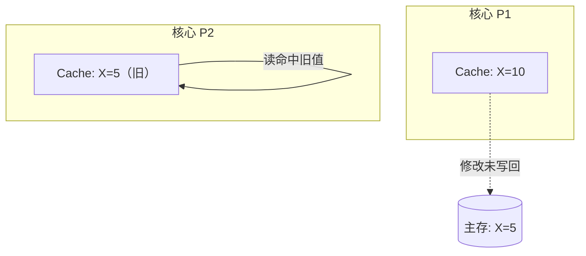
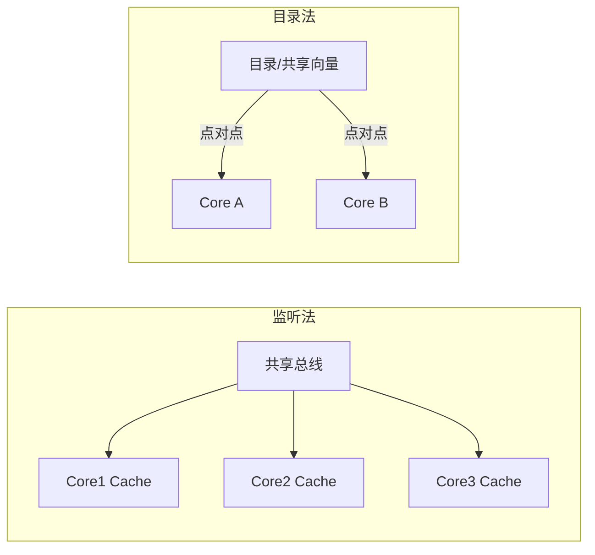
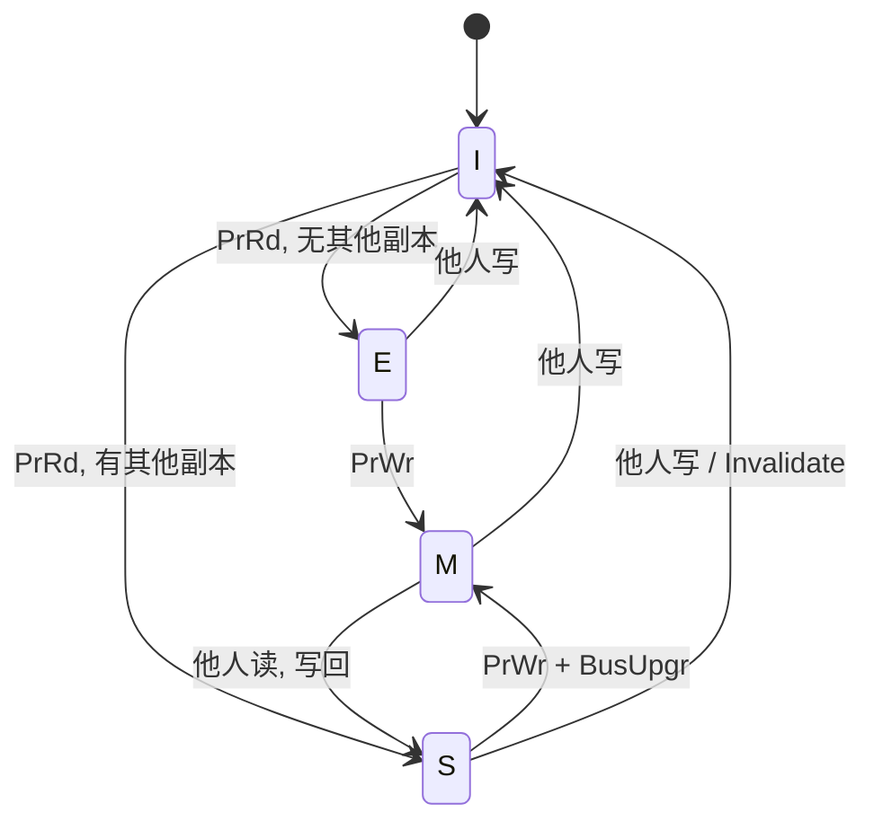

# Week 13–14 学习指南：缓存一致性 + MESI/NUMA

> **课程**：计算机组成与体系结构（H）
> **覆盖周次**：Week 13（一致性协议）、Week 14（分布式架构/MESI/NUMA）
> **主要来源**：Week 13–14 课程记录、课件 08、NotebookLM 分层问答
> **对应课件**：`8_线程级并行.pdf`
> **教材章节**：唐朔飞《计算机组成原理》第 2 版 **第 8 章**；Patterson RISC-V 版 **第 6 章** §6.2–6.5 多核一致性
> **原始采集**：`notebooklm-raw/part6-week13-14/runs/20260616-145543/`（6 批）
> **知识图谱**：`notebooklm-raw/part6-week13-14/knowledge-graph.md`
> **整合日期**：2026-06-16（初版）
> **术语格式**：术语表及正文**首次出现**时，专业名词采用 **中文（English）**；英文缩写采用 **缩写（English full name，中文）**，便于对照英文课件、教材与开卷试题。

---

## 0. 术语表

| 术语 | 大白话 |
|------|--------|
| **Cache Coherence（一致性）** | 多核对**同一地址**的读写，最终能读到「最新那份」 |
| **Memory Consistency（连贯性）** | 多核对**不同地址**操作的**全局可见顺序**约定（如 SC） |
| **Snooping（监听法）** | 各核盯着共享总线广播，自行判断是否失效/更新 |
| **Directory（目录法）** | 用目录记录「谁有这份副本」，点对点发消息 |
| **Write Invalidate（写作废）** | 写之前广播「作废」，其他副本标 Invalid |
| **Write Update（写更新）** | 写之后广播新数据，强制他人同步更新 |
| **MESI** | Modified / Exclusive / Shared / Invalid 四态协议 |
| **NUMA** | 内存分布在各节点，访存延迟「非均匀」 |

### 高频缩写速查

| 缩写 | 解释 |
|------|------|
| **MSI** | Modified-Shared-Invalid，三态缓存一致性协议 |
| **MESI** | Modified-Exclusive-Shared-Invalid，四态缓存一致性协议 |
| **UMA / NUMA** | Uniform / Non-Uniform Memory Access，均匀 / 非均匀访存 |
| **NoC** | Network-on-Chip，片上网络 |
| **TLP** | Thread-Level Parallelism，线程级并行 |
| **SIMD / MIMD** | Single Instruction Multiple Data / Multiple Instruction Multiple Data，单指令多数据 / 多指令多数据 |

---

## 1. 知识地图（L0）

### 1.1 这两周在学什么？

Week 12 解决了**单核** Cache 的映射、替换与写策略；进入 Week 13，每颗核心自带私有 Cache，同一变量可能在多份副本里各写各的——**缓存一致性**成为多核系统的第一道门槛。Week 13 讲清问题动机与协议分类（监听/目录、写作废/写更新）；Week 14 落到 **MESI 状态机**、**分布式架构**与 **NUMA** 扩展性。

（来源：L0-positioning、课件 8_线程级并行、Week 13–14 课程记录）

### 1.2 为何期末重点考这里？

Lab1–6 聚焦**单核**五级流水 CPU，难以在实验中考核多核一致性状态机；而一致性逻辑严密、对比题与状态转换推导非常适合笔试。（来源：L0-positioning）

**学完你能**：

1. 用双核读写时序解释「为何写回策略下会读到旧值」
2. 对比监听法与目录法的通信方式、适用规模与瓶颈
3. 说明写作废为何比写更新更省总线带宽
4. 说出 MESI 四态含义，并推断 PrRd/PrWr/总线监听后的状态迁移
5. 解释 NUMA 下「本地内存快、远程内存慢」对程序布局的影响

### 1.3 叙事线

### 1.4 课本与课件速查

| 指南节 | Week | 课件 | 唐朔飞（第 2 版） | P&H RISC-V |
|--------|------|------|-------------------|------------|
| §2.1 一致性问题 | Week 13 | 课件 **08** 线程级并行 | **第 8 章** §8.1–8.2 | **第 6 章** §6.2 多核挑战 |
| §2.2 监听 vs 目录 | Week 13–14 | 课件 **08** | **第 8 章** §8.3 | **第 6 章** §6.3 监听协议 |
| §2.3 写更新 vs 写作废 | Week 13 | 课件 **08** | **第 8 章** §8.3.2 | **第 6 章** §6.3 |
| §2.4 MESI/NUMA | Week 14 | 课件 **08**、**7a** 互连网络 | **第 8 章** §8.4 MESI | **第 6 章** §6.4–6.5 |

---

## 2. 核心知识

### 2.1 缓存一致性问题（Week 13）

> **本节要回答**：多核为何会出现不一致？共享总线架构的瓶颈是什么？

| 来源 | 位置 | 本节对应主题 |
|------|------|-------------|
| **课件 08** | 多核 Cache 不一致 | 写回导致旧值 |
| **唐朔飞** | **第 8 章** §8.1–8.2 | 一致性问题的提出 |
| **P&H RISC-V** | **第 6 章** §6.2 | 多核与 Cache |
| **课程记录** | `week13-周一-计组H.md` | 双核读写时序 |

**直觉**：每个核心有自己的小推车（私有 Cache），仓库（主存）只有一份货。厨师 A 改了配方只放在推车上、没送回仓库，厨师 B 仍从自己的推车拿旧货——数据视图就分裂了。（来源：w13-coherence-problem）

**经典时序**（写回策略）：

| 步骤 | 动作 | 结果 |
|------|------|------|
| 1 | 主存 X=5；P1、P2 各读入 Cache | 两核 Cache 均为 5 |
| 2 | P1 写 X=10 | 可能只更新 P1 Cache，主存仍为 5 |
| 3 | P2 再读 X | 若命中本地 Cache → 仍读到 **5**（不一致） |

**共享总线瓶颈**（监听法前提）：核数增加 → 总线带宽争用、广播风暴、物理扇出受限；小规模 SMP（约 4–8 核）尚可，大规模需目录法。（来源：w13-coherence-problem）

> **小结 → 下一节**：问题明确后，硬件用**一致性协议**维护副本；首要分叉是**监听**还是**目录**。

---

### 2.2 监听法 vs 目录法（Week 13–14）

> **本节要回答**：两种协议如何工作？各自适用什么规模？

| 来源 | 位置 | 本节对应主题 |
|------|------|-------------|
| **课件 08** | 监听法、目录法 | 广播 vs 点对点 |
| **唐朔飞** | **第 8 章** §8.3 | 目录式与监听式 |
| **P&H RISC-V** | **第 6 章** §6.3 | Snooping |
| **课程记录** | `week13-周一`、`week14-周一-计组H.md` | 总线瓶颈、Mesh |

| 维度 | 监听法 (Snooping) | 目录法 (Directory) |
|------|-------------------|---------------------|
| 通信 | 共享总线**广播**，各 Cache 控制器监听 | **目录**记录块状态与持有者，**点对点**消息 |
| 适用 | 核少的小规模 SMP / UMA | 核多的 DSM / NUMA、Mesh 等非总线互连 |
| 优点 | 结构简单、小规模延迟低 | 可扩展性好，避免全局广播带宽枯竭 |
| 缺点 | 总线带宽与监听频率成瓶颈 | 目录状态机复杂，需额外目录存储 |

（来源：w13-directory-vs-snoop、w14-mesi-numa）

> **小结 → 下一节**：协议确定「谁该收到消息」后，写操作还需选择**更新他人副本**还是**作废他人副本**。

---

### 2.3 写更新 vs 写作废（Week 13）

> **本节要回答**：两种写维护策略的原理、带宽开销与典型应用？

| 来源 | 位置 | 本节对应主题 |
|------|------|-------------|
| **课件 08** | 写更新、写作废 | 带宽对比 |
| **唐朔飞** | **第 8 章** §8.3.2 | 写策略 |
| **P&H RISC-V** | **第 6 章** §6.3 | Invalidate 主流 |
| **课程记录** | `week13-周一-计组H.md` | 写作废时序 |

| 策略 | 写时动作 | 带宽 | 典型场景 |
|------|----------|------|----------|
| **写更新** (Write Update) | 广播**新数据**，强制他人同步更新 | **高**（每次写都广播） | 读远多于写、对读延迟极敏感的场景 |
| **写作废** (Write Invalidate) | 广播**作废**，他人标 Invalid；读时再缺失获取 | **低**（连续写仅首次需总线事务） | **现代通用 CPU 主流**（MSI/MESI） |

**写作废时序**（来源：w13-write-update-invalidate）：

1. P1、P2 均持有 X=0（Shared）
2. P1 要写 X=1 → 先发总线 **Invalidate X**
3. P2 将本地 X 标为 **Invalid**；P1 获独占并写入 1
4. P2 再读 X → Cache miss → 从 P1 或主存取新值

> **直观理解**：写更新像「群发最新版文档」；写作废像「群发作废通知，谁要看再重新下载」——多数程序写少读多，后者更省总线。

> **小结 → 下一节**：写作废 + 监听/目录 → 具体状态机；课程重点为 **MESI**（MSI 加上独占态 E）。

---

### 2.4 MESI 协议与 NUMA（Week 14）

> **本节要回答**：四态各表示什么？何时转换？大规模多核如何扩展？

| 来源 | 位置 | 本节对应主题 |
|------|------|-------------|
| **课件 08**、**7a** | MESI、NUMA、互连 | 状态机、分布式 |
| **唐朔飞** | **第 8 章** §8.4 | MESI 协议 |
| **P&H RISC-V** | **第 6 章** §6.4–6.5 | 一致性协议 |
| **课程记录** | `week14-周一/周三-计组H.md` | 目录式、NUMA |

**MESI 四态**（来源：w14-mesi-numa）：

| 状态 | 含义 |
|------|------|
| **M** Modified | 本 Cache **唯一**副本，且**已修改**（主存过期 Dirty） |
| **E** Exclusive | 本 Cache **唯一**副本，且与主存**一致**（Clean） |
| **S** Shared | 可能多核共有，均与主存一致 |
| **I** Invalid | 块无效 |

**转换直觉**：

- **PrRd 缺失**：无其他副本 → **E**；有其他副本 → **S**
- **PrWr**：在 **E/M** 可直接写（E→M）；在 **S** 需 BusUpgr 作废他人 → **M**
- **总线监听**：**M** 态见他人读 → 写回主存 → **S**；见他人写 → **I**

**E vs M 易混**：E 是「独家且干净」，写不必发总线；M 是「独家且脏」，替换时需写回。（来源：w1314-mistakes-bridge）

**NUMA 与分布式架构**：

- 存储器物理分布在各节点（核 + 私有 Cache + 本地内存分片），片内 Mesh/Crossbar 互连
- **NUMA**：访问本地内存快，远程内存慢 → 数据应靠近使用它的核
- 非总线互连下监听失效 → **目录式一致性**用共享向量只通知相关核，消除广播风暴（来源：w14-mesi-numa）

> **小结 → 下一节**：一致性保证同地址最新值；Week 15 将 I/O/DMA 纳入「谁与主存/Cache 同步」的更大图景。

---

## 3. Lab 与课堂对照

本课程 Lab 为**单核** RISC-V CPU，**不实现**多核一致性硬件；Week 13–14 内容纯理论/笔试向。

| 课堂概念 | 与 Lab 关系 | 期末/工程意义 |
|----------|-------------|---------------|
| 写回 Cache | Lab Cache 模块可能采用写回 | 理解不一致根源 |
| 总线监听 | Lab 无多核总线 | 状态转换手算题 |
| MESI | 不实现 | 对比 E/M、推导 Bus Snoop 后状态 |
| NUMA | 不实现 | 多线程程序数据局部性优化 |

**延伸**：Week 15 **DMA** 直访主存时，若 Cache 有脏副本，需 flush/invalidate 协同——一致性思维从「核间」延伸到「核与设备」。（来源：L0-positioning）

---

## 4. 易混淆概念

| 对比组 | 正确理解 |
|--------|----------|
| **Coherence vs Consistency** | 一致性管**同地址**最新值；连贯性管**所有地址**操作的全局可见顺序 |
| **Snooping vs Directory** | 广播 vs 点对点；小规模 SMP vs 大规模 NUMA |
| **Invalidate vs Update** | 作废后延迟获取 vs 每次写都推送新数据 |
| **E vs M** | 独家 Clean vs 独家 Dirty；E 写无需总线，M 替换需写回 |

（来源：w1314-mistakes-bridge）

---

## 5. 与前后模块衔接

- **Week 12**：Cache 映射/写回/写直达 → 多核每核一份 Cache 放大不一致风险
- **Week 15**：I/O 与 DMA；主存与 Cache 副本协同
- **假共享**（L0 提及）：不同变量落在同一 Cache line，一核写导致他核 line 失效——属性能优化话题，raw 未展开，待补采

---

## 6. 自检问题

读完本章你应能：

1. 画出双核读写导致不一致的时序
2. 填出监听 vs 目录对比表并说明各自瓶颈
3. 对比连续写场景下写作废与写更新的总线事务次数
4. 给定 MESI 初态与 PrRd/PrWr/总线事件，推断下一状态
5. 解释 NUMA 下为何要把线程绑核且数据就近分配

---

## 7. 追问块

> **追问 1**：若系统采用**写更新**而非写作废，P1 连续 100 次写同一变量，总线上会发生什么？与 MESI 下写作废对比如何？
>
> **答**：写更新会广播 **100 次新数据**，总线带宽爆炸。MESI 写作废下首次写发 Invalidate，后续 99 次若他人已 Invalid 则**无需总线事务**——写密集场景带宽优势巨大。

> **追问 2**：某块处于 **E** 态，P1 执行 PrWr 后状态？若此时 P2 在总线上发起对该块的读，P1 需要哪些动作？
>
> **答**：PrWr 后 **E→M**（独占脏）。P2 总线读时，P1 监听须 **写回主存**（若 M）并降为 **S**，或从 M 直接供给数据后转 **S**——保证 P2 读到最新值。

> **追问 3**：一致性（Coherence）保证了「读 X 能见到最新 X」，为何仍可能出现「线程 A 写 X、写 Y，线程 B 先看到 Y 再看到 X」？这与哪个概念有关？
>
> **答**：这是 **Memory Consistency（连贯性）** 问题——一致性不管**不同地址**间的全局可见顺序。宽松模型下写缓冲/乱序可导致 B 观察到与程序序不同的交叉；需 Fence 或 SC 模型约束。

> **直观理解**：把 MESI 想成「房产证」——**S** 是多人共有产权；**E** 是你独家持有且与登记簿一致；**M** 是你独家持有但已改建未报备；**I** 是产权证作废，下次交易须重新办证。

---

## 8. 资料索引

| 类型 | 文件 / 路径 | 说明 |
|------|-------------|------|
| 课程记录 | `week13-周一/周三-计组H.md` | Week 13 一致性 |
| 课程记录 | `week14-周一/周三-计组H.md` | Week 14 MESI/NUMA |
| 课件 | `3_课件/8_线程级并行.pdf` | 监听/目录/MESI |
| 课件 | `3_课件/7_互连网络.pdf` | Mesh、互连参数 |
| 教材 | 唐朔飞第 2 版 **第 8 章** | 线程级并行 |
| 教材 | Patterson RISC-V **第 6 章** | 多核一致性 |
| 知识图谱 | `notebooklm-raw/part6-week13-14/knowledge-graph.md` | 整合前置 |
| 原始问答 | `notebooklm-raw/part6-week13-14/runs/latest/*.answer.md` | 6 批 raw |
| 周次索引 | `guides/计组课程-16周内容梳理.md` | 课纲对照 |
