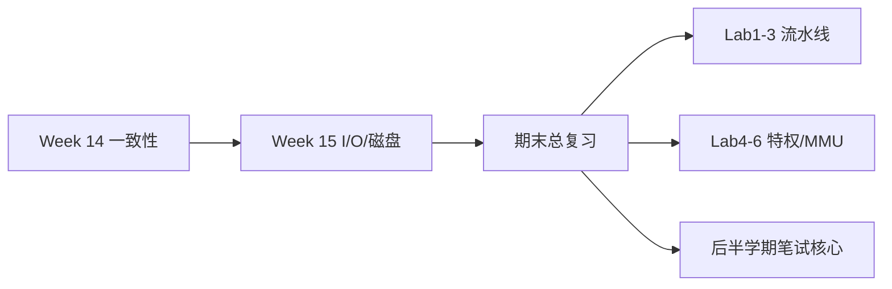
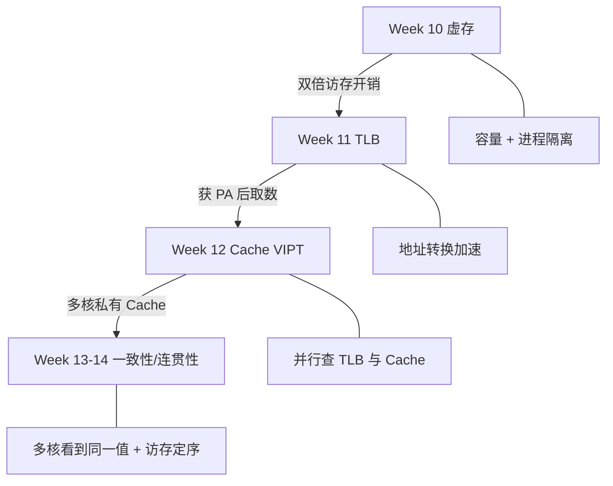

# Week 15 学习指南：I/O 与磁盘 + 期末总复习

> **课程**：计算机组成与体系结构（H）
> **覆盖周次**：Week 15（I/O/磁盘/RAID、期末复习课）
> **主要来源**：Week 15 课程记录、课件 10、NotebookLM 分层问答
> **对应课件**：`10_向量体系结构.pdf`（I/O 与存储层次延伸）、全学期复习
> **教材章节**：唐朔飞《计算机组成原理》第 2 版 **第 9 章** I/O（§9.1–9.3）；Patterson RISC-V 版 **第 5 章** §5.5 I/O、**第 6 章** 复习对照
> **原始采集**：`notebooklm-raw/part7-week15/runs/20260616-150120/`（5 批）
> **知识图谱**：`notebooklm-raw/part7-week15/knowledge-graph.md`
> **整合日期**：2026-06-16（初版）
> **术语格式**：术语表及正文**首次出现**时，专业名词采用 **中文（English）**；英文缩写采用 **缩写（English full name，中文）**，便于对照英文课件、教材与开卷试题。

---

## 0. 术语表

| 术语 | 大白话 |
|------|--------|
| **吞吐率** | 单位时间传多少数据（MB/s） |
| **响应时间** | 从发请求到拿到结果的等待（ms） |
| **寻道时间** | 磁头移到目标磁道，磁盘最大瓶颈 |
| **旋转延迟** | 等盘片转到目标扇区，约半圈时间 |
| **RAID (Redundant Array of Independent Disks)** | 多盘组队：提速和/或容错 |
| **AMAT (Average Memory Access Time)** | 平均访存时间，Cache 量化核心 |
| **MMIO (Memory-Mapped I/O)** | 内存映射输入输出：把外设寄存器映射进地址空间 |
| **WARL** | 写任意值、读回合法值（CSR 典型） |

### 高频缩写速查

| 缩写 | 解释 |
|------|------|
| **RAID** | Redundant Array of Independent Disks，独立磁盘冗余阵列 |
| **DMA** | Direct Memory Access，直接内存访问 |
| **MMIO** | Memory-Mapped I/O，内存映射输入输出 |
| **AMAT** | Average Memory Access Time，平均访存时间 |
| **PCIe** | Peripheral Component Interconnect Express，高速外设互连总线 |
| **CSR** | Control and Status Register，控制状态寄存器 |

---

## 1. 知识地图（L0）

### 1.1 这周在学什么？

Week 15 是**收官周**：周一补 **I/O 与磁盘/RAID**（存储层次最底层）；复习课把 **Week 10–14 存储链**与**全学期考点**串成期末地图。前半学期流水线已在 Lab1–3 深度实践；**期末笔试重心偏后半学期**——Cache、TLB、虚实转换、多核一致性等更适合开卷逻辑题。（来源：L0-final-scope、Week 8 范围说明）

### 1.2 考试怎么考？

- **形式**：开卷，占总成绩 **30%**；重思路与量化，非死记
- **必现**：流水线冒险、Tomasulo/ROB（Lab 未覆盖的笔试点）、Cache 分析、Sv39 地址转换、MESI/一致性
- **策略**：刷往年卷与课堂练习纸（难题多在后半）；回归**亲自写的 Lab 报告**理解设计坑（来源：L0-final-scope、w15-study-priority）

**学完你能**：

1. 估算一次随机磁盘读的平均延迟（给 RPM 与寻道时间）
2. 说出 RAID 0/1/5/10 各自的速度、容错、空间特点
3. 画出 Week 10→14 四步存储链并说明每步解决什么
4. 列出期末极高优先级主题及对应 Lab
5. 解释 Lab5 中 satp 变更后为何必须 flush 流水线

### 1.3 叙事线

### 1.4 课本与课件速查

| 指南节 | Week | 课件 | 唐朔飞（第 2 版） | P&H RISC-V |
|--------|------|------|-------------------|------------|
| §2.1 I/O 性能 | Week 15 | 课件 **10**（I/O 延伸） | **第 9 章** §9.1 I/O 方式 | **第 5 章** §5.5 I/O |
| §2.2 磁盘/RAID | Week 15 | 课件 **10** | **第 9 章** §9.2–9.3 磁盘 | **第 5 章** §5.5 |
| §2.3 MMIO | Week 15 | `4_Lab/Lab3` | — | MMIO 与总线 |
| §2.4 存储链复习 | Week 15 复习 | 课件 **07**、**08** | **第 7–8 章** | **第 5–6 章** |

---

## 2. 核心知识

### 2.1 I/O 性能：吞吐 vs 响应（Week 15）

> **本节要回答**：为什么 I/O 设计总在「快」与「等」之间取舍？

| 来源 | 位置 | 本节对应主题 |
|------|------|-------------|
| **课件 10** | 吞吐 vs 响应 | I/O 性能指标 |
| **唐朔飞** | **第 9 章** §9.1 | I/O 控制方式 |
| **P&H RISC-V** | **第 5 章** §5.5 | I/O 系统 |
| **课程记录** | `week15-周一-计组H.md` | 流媒体 vs 交易 |

**直觉**：卡车运整盘硬盘——吞吐极高、响应极慢；细网线传少量数据——延迟短、吞吐低。视频播放用**缓冲**掩盖高延迟换高吞吐；在线交易则必须压低响应时间。（来源：w15-io-disk-raid）

| 场景 | 侧重 | 手段 |
|------|------|------|
| 流媒体 | 吞吐 | 预读缓冲 |
| 交易系统 | 响应 | 减少 I/O 路径延迟 |
| CPU 访存 | 两者 | Cache 提速、虚存扩容量 |

> **小结 → 下一节**：I/O 指标建立后，看 **磁盘机械特性** 与 **RAID** 如何在容量/速度/可靠性间权衡。

---

### 2.2 磁盘访问与 RAID（Week 15）

> **本节要回答**：随机读一个扇区要等多久？RAID 各级别差在哪？

| 来源 | 位置 | 本节对应主题 |
|------|------|-------------|
| **课件 10** | 磁盘结构、RAID | 寻道/旋转/传输 |
| **唐朔飞** | **第 9 章** §9.2–9.3 | 磁盘与 RAID |
| **P&H RISC-V** | **第 5 章** §5.5 | 存储设备 |
| **课程记录** | `week15-周一-计组H.md` | 访问时间手算 |

**磁盘访问时间** = 寻道 + 旋转延迟 + 传输（后两项通常远小于寻道）。（来源：w15-io-disk-raid）

**数值例**：7200 RPM（一圈 ≈ 8.33 ms）、平均寻道 10 ms、传一扇区 0.1 ms → 随机访问 ≈ **14.27 ms**（10 + 4.17 + 0.1）。

| RAID | 做法 | 速度 | 容错 | 空间利用 |
|------|------|------|------|----------|
| **0** 条带 | 切片分散多盘 | 最快 | 无，一盘坏全崩 | 100% |
| **1** 镜像 | 互为备份 | 读可并行 | 高 | 50% |
| **5** 分布式校验 | 数据和校验分散 | 较好 | 容忍单盘坏 | 较高 |
| **6** 双校验 | 两套校验 | 写开销大 | 容忍两盘坏 | 较高 |
| **10 (1+0)** | 先镜像再条带 | 快且稳 | 高 | 50% |

> **小结 → 下一节**：磁盘是存储层次最底；**MMIO** 把 I/O 设备接回 Lab 已实现的访存/总线模型。

---

### 2.3 MMIO 补链（Lab3 向）

MMIO 将外设映射到地址空间；总线 **Valid/Ready** 握手与 Lab2 访存时序一脉相承。Difftest 对 MMIO 用 **PA** 并 Skip，普通访存用 **VA**——期末中优先级，配合 Lab3 报告。（来源：w15-study-priority）

| 来源 | 位置 | 说明 |
|------|------|------|
| **Lab Wiki** | [26-Arch Wiki Lab-3](https://github.com/26-Arch/26-Arch/wiki/Lab-3) | MMIO、Difftest |
| **课件** | `4_Lab/Lab3*.pdf` | 握手与 Skip |

> **小结 → 下一节**：周三复习课把 **Week 10–14 存储链** 与全学期考点串成期末地图。

---

### 2.4 后半学期存储链（复习核心）

> **本节要回答**：Week 10→14 每步解决什么问题？

| 周次 | 解决问题 | 关键机制 |
|------|----------|----------|
| Week 10 | 主存不够、多进程隔离 | 页表、按需分页 |
| Week 11 | 页表遍历太慢 | TLB、SATP、SFENCE.VMA |
| Week 12 | TLB 与 Cache 串行延迟 | VIPT 并行索引 |
| Week 13–14 | 多核数据不一致 | MESI/目录、SC vs 松弛模型 |

细节见 `guides/计组-Week10-11-学习指南.md`。（来源：w15-review-backend）

---

## 3. 期末复习优先级

| 优先级 | 主题 | 配合 Lab |
|--------|------|----------|
| **极高** | 流水线数据/控制冒险、转发与冲刷 | Lab1、Lab3 |
| **极高** | Cache 映射、缺失率、AMAT | Lab2 |
| **极高** | Sv39 页表遍历、TLB | Lab5 |
| **极高** | MESI/MOESI、假共享 | — |
| **高** | Tomasulo、ROB、乱序提交 | — |
| **高** | 异常/中断 Trap 流程、CSR | Lab4、Lab6 |
| **高** | 阿姆达尔定律、CPU 性能公式 | — |
| **中** | MMIO、IEEE 754、补码溢出 | Lab3 |
| **了解** | 互连网络拓扑参数 | — |

（来源：w15-study-priority、L0-final-scope）

---

## 4. Lab4–6 与期末对照

| 来源 | 位置 | 说明 |
|------|------|------|
| **Lab Wiki** | [26-Arch Wiki](https://github.com/26-Arch/26-Arch/wiki/) Lab-4 ~ Lab-6 | 期末高相关 |
| **课件** | `4_Lab/Lab4–6*.pdf` | CSR、MMU、Trap |
| **个人报告** | `26-Arch/Doc/Lab{4..6}/report.md` | 开卷现场笔记 |

| 实验 | 实现能力 | 期末考题类型 |
|------|----------|--------------|
| **Lab 4** | 6 条 CSR 指令；mstatus/mtvec/mepc/mcause/satp；读写掩码 | CSR 功能、**WARL**、特权状态位 |
| **Lab 5** | M/U 切换；ECALL/MRET；**Sv39 MMU** 三级 Walk；取指/访存统一翻译 | **页表遍历手算**、**SATP** 结构、精确异常下 **Flush** |
| **Lab 6** | 同步异常（非法指令、不对齐、ECALL）；异步中断；MIE/MPIE | Trap 入出流程、**SFENCE.VMA**、**mcause** 编码 |

**Lab1–3 角色**（优先级清单补全）：Lab1 数据冒险与转发；Lab2 总线握手；Lab3 控制冒险冲刷与 MMIO。（来源：lab-final-crossref、w15-study-priority）

---

## 5. 易混淆概念

| 对比组 | 正确理解 |
|--------|----------|
| 吞吐 vs 响应 | 可同时优化但常冲突；缓冲换吞吐、直连换响应 |
| 寻道 vs 旋转延迟 | 寻道是磁头横移；旋转是等扇区转到头下 |
| RAID 0 vs RAID 1 | 0 求速度无冗余；1 求可靠牺牲容量 |
| TLB miss vs Page Fault | 快表未命中仍可走页表；缺页需 OS 从磁盘调入 |
| 一致性 vs 连贯性 | 同地址同值 vs 不同地址操作的可见顺序 |
| 精确异常 vs 中断 | 同步、与指令绑定 vs 异步、可屏蔽 |

---

## 6. 与全课程衔接

- **前半学期**：单周期→流水线→ILP，Lab1–3 是期末流水线题的「肌肉记忆」
- **后半学期**：虚存→Cache→多核，Lab4–6 是特权与 MMU 题的「现场笔记」
- **Week 15 新块**：磁盘/RAID 接在存储层次最底，回答「数据最终落哪里、多慢、怎么容错」

---

## 7. 自检问题

读完本章你应能：

1. 估算一次随机磁盘读的平均延迟（给 RPM 与寻道时间）
2. 说出 RAID 0/1/5/10 各自的速度、容错、空间特点
3. 画出 Week 10→14 四步存储链并说明每步解决什么
4. 列出期末极高优先级主题及对应 Lab
5. 解释 Lab5 中 satp 变更后为何必须 flush 流水线

---

## 8. 追问块

> **追问 1**：RAID 5 坏一盘时，重建期间再坏第二盘会怎样？与 RAID 6 的设计动机有何关系？
>
> **答**：RAID 5 重建时再坏第二盘 → **数据不可恢复**（校验盘也丢失）。RAID 6 用**双校验**容忍同时坏两盘，换更高写开销换重建窗口内的安全性。

> **追问 2**：若 TLB 命中但 Cache 缺失，AMAT 公式中应计入哪些项？
>
> **答**：**不计页表遍历**（TLB 已给 PPN）；AMAT = TLB命中时间 + Cache命中时间 + MissRate×MissPenalty（仅 Cache 层）。若 TLB miss 才需加 Page Walk 惩罚。

> **追问 3**：开卷考遇到 Tomasulo 时序题，ROB 与保留站各自负责什么？为何需要顺序提交？
>
> **答**：**RS** 等操作数就绪并发射到功能单元；**ROB** 按程序序排队，队首才提交写回架构状态。顺序提交保证**精确异常**与可见的程序序语义。

---

## 9. 资料索引

| 类型 | 文件 / 路径 | 说明 |
|------|-------------|------|
| 课程记录 | `week15-周一/周三-计组H.md` | I/O、期末复习 |
| 课件 | `3_课件/10_向量体系结构.pdf` | I/O 延伸、存储层次 |
| 课件 | `3_课件/7_层次结构存储系统.pdf`、`8_线程级并行.pdf` | 复习对照 |
| 教材 | 唐朔飞第 2 版 **第 9 章** | I/O 系统 |
| 教材 | Patterson RISC-V **第 5–6 章** | I/O 与多核复习 |
| 实验 | `4_Lab/`、`26-Arch/Doc/Lab{1..6}/` | 全 Lab 对照 |
| 前序指南 | `guides/计组-Week10-11` … `Week13-14` | 存储链细节 |
| 知识图谱 | `notebooklm-raw/part7-week15/knowledge-graph.md` | 整合前置 |
| 原始问答 | `notebooklm-raw/part7-week15/runs/latest/*.answer.md` | 5 批 raw |
| 周次索引 | `guides/计组课程-16周内容梳理.md` | 课纲对照 |
