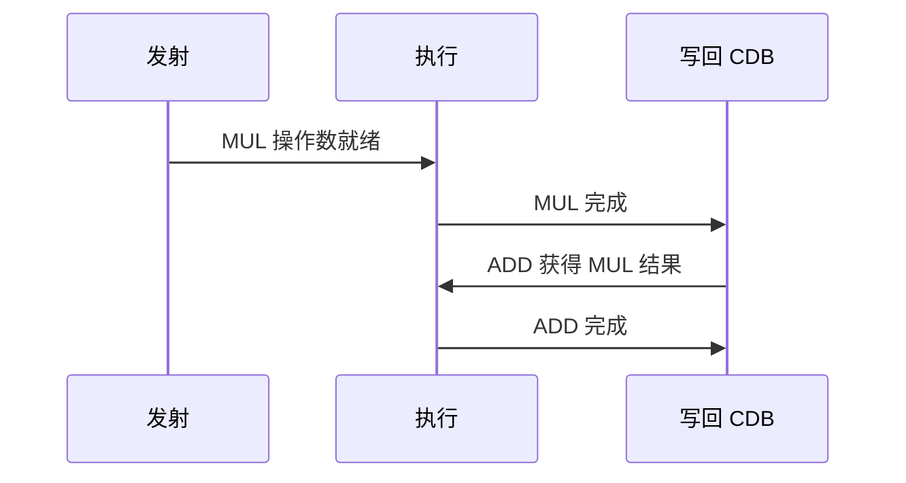
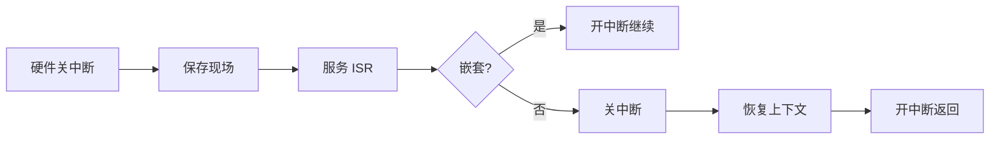

# Week 16 学习指南：期末复习指导（开卷）

> **课程**：计算机组成与体系结构（H）
> **覆盖周次**：Week 16（最后一周期末复习课）
> **主要来源**：Week 16 课程记录、复习 PPT、NotebookLM 分层问答
> **对应课件**：eLearning 复习 PPT、全学期课件回顾（`6_指令流水线`、`7_层次结构存储系统`、`8_线程级并行` 等）
> **教材章节**：唐朔飞《计算机组成原理》第 2 版 **第 5–8 章** 复习；Patterson RISC-V 版 **第 4–6 章**；参考《计算机体系结构：量化研究方法》
> **原始采集**：`notebooklm-raw/part8-week16/runs/20260619-171058/`（6 批）
> **知识图谱**：`notebooklm-raw/part8-week16/knowledge-graph.md`
> **课程记录**：`week16-周一-计组H.md`、`week16-周三-计组H.md`
> **整合日期**：2026-06-19（初版）；2026-06-24（二轮优化）
> **术语格式**：术语表及正文**首次出现**时，专业名词采用 **中文（English）**；英文缩写采用 **缩写（English full name，中文）**，便于对照英文课件、教材与开卷试题。

---

## 0. 术语表

| 术语 | 大白话 |
|------|--------|
| **TLB Reach (Translation Lookaside Buffer Reach)** | TLB 一次能「罩住」的虚拟地址范围 = 项数 × 页大小 |
| **保留站 RS (Reservation Station)** | Tomasulo 里暂存未执行指令的「工位」，带 Tag |
| **Qi** | 寄存器状态表：该寄存器的最新结果在哪个 RS 上 |
| **CDB (Common Data Bus)** | 公共数据总线，功能单元写回结果时广播 |
| **连贯性** | 不同地址的访存谁先谁后对多核可见 |
| **Fence** | 强制内存操作顺序的栅栏指令 |
| **周期挪用** | DMA（Direct Memory Access，直接内存访问）抢一个总线周期传一字再还给 CPU |
| **AMAT (Average Memory Access Time)** | 平均访存时间，衡量 Cache 命中/缺失后的平均代价 |

### 高频缩写速查

| 缩写 | 解释 |
|------|------|
| **ILP** | Instruction-Level Parallelism，指令级并行 |
| **RS** | Reservation Station，保留站 |
| **CDB** | Common Data Bus，公共数据总线 |
| **ROB** | Reorder Buffer，重排序缓冲区 |
| **TLB** | Translation Lookaside Buffer，地址转换后备缓冲 |
| **AMAT** | Average Memory Access Time，平均访存时间 |
| **MESI** | Modified-Exclusive-Shared-Invalid，四态缓存一致性协议 |
| **DMA** | Direct Memory Access，直接内存访问 |
| **NoC / PCIe** | Network-on-Chip / Peripheral Component Interconnect Express，片上网络 / 高速外设互连 |
| **RAID** | Redundant Array of Independent Disks，独立磁盘冗余阵列 |

---

## 1. 知识地图（L0）

### 1.1 这周在学什么？

Week 16 是**最后一周期末复习指导课**（06-15 周一内容完整，06-17 周三主要为考试/实验提醒）。老师明确：开卷考占 **30%**，复习重心在**体系结构**（实验已覆盖「组成」），勿只刷 Lab 不看书面概念。（来源：L0-w16-review-scope、week16-周一-计组H）

**学完你能**：

1. 对 `MUL.D`→`ADD.D` 同写 F0 填写 Qi 与 RS 的 Qj/Qk
2. 计算 64 项 DTLB、4KiB vs 2MiB 页的 TLB Reach 与扫 1GiB miss 次数
3. 用 AMAT 公式手算平均访存时间
4. 说明加锁后/解锁前 Fence 的原因及 MESI 四态含义
5. 写出单向环平均延迟直觉并对比 DMA 与中断 trade-off

### 1.2 五大复习板块

| 板块 | 期末态度 | 详见 |
|------|----------|------|
| Tomasulo 动态调度 | **必考** | §2 |
| Cache / AMAT / 映射 | 计算题常客 | §3；Week 12 指南 |
| TLB Reach / 大页 | 量化对比 | §4；Week 10–11 指南 |
| MESI / Fence / 原子 | 概念 + 场景 | §5；Week 13–14 指南 |
| 互连参数 / 中断 / DMA | 易漏考点 | §6；Week 15 I/O 指南 |

### 1.3 推荐节奏（3–4 天）

每天围绕**一个板块串联**，刷往年随堂练习（≈ 真题难度），配合 Lab4–6 报告回顾特权/MMU/Trap。（来源：L0-w16-review-scope）

> **与 Week 15 指南关系**：Week 15 已收 I/O/磁盘/RAID 与全学期优先级；Week 16 深化 **Tomasulo、TLB Reach 计算、互连/DMA**，请两章对照使用。

### 1.4 课本与课件速查

| 指南节 | 对应周次 | 课件 | 唐朔飞（第 2 版） | P&H RISC-V |
|--------|----------|------|-------------------|------------|
| §2 Tomasulo | Week 8 | **5b** 指令级并行 | **第 5 章** ILP | **第 5 章** §5.1–5.3 |
| §3 Cache/AMAT | Week 12 | **07** 层次存储 | **第 7 章** §7.2 | **第 5 章** §5.1–5.3 |
| §4 TLB Reach | Week 10–11 | **07** | **第 7 章** §7.3.3 | **第 5 章** §5.7 |
| §5 MESI/Fence | Week 13–14 | **08** 线程级并行 | **第 8 章** §8.4 | **第 6 章** §6.4–6.5 |
| §6 互连/DMA | Week 15–16 | **7a** 互连、**10** I/O | **第 9 章** §9.1 | **第 5 章** §5.5 |

---

## 2. Tomasulo 算法（必考）

> **本节要回答**：保留站如何消除 WAR/WAW？时序表怎么填？

| 来源 | 位置 | 本节对应主题 |
|------|------|-------------|
| **课件 5b** | Tomasulo、CDB | 保留站、Qi |
| **唐朔飞** | **第 5 章** 动态调度 | RAW/WAR/WAW |
| **P&H RISC-V** | **第 5 章** §5.2–5.3 | Tomasulo 算法 |
| **课程记录** | `week16-周一-计组H.md` | 必考、时序表 |

### 2.1 三类相关：先判断真依赖，再处理假相关

Tomasulo 题的第一步不是填表，而是先判断每条边属于 RAW、WAR 还是 WAW。RAW 是真实数据流，必须等生产者；WAR/WAW 多数来自复用同一个寄存器名，Tomasulo 用保留站 Tag 和 Qi 表来消除。

| 类型 | 能否消除 | Tomasulo 做法 |
|------|----------|---------------|
| **RAW** | 否（真依赖） | RS 中 Qj/Qk≠0 则等待源操作数 |
| **WAR** | 是（假相关） | 发射时把就绪操作数拷入 Vj/Vk，后续写不覆盖 RS 内旧值 |
| **WAW** | 是（假相关） | Qi 始终指向**最后发射**写该寄存器的 RS |

（来源：w16-tomasulo）

### 2.2 分析模板（MUL → ADD 同写 F0）

指令（乘法 6 周期，加法 2 周期）：
1. `MUL.D F0, F2, F4`
2. `ADD.D F0, F0, F6`

**题目场景**：两条浮点指令都写 F0，且第二条还读 F0。要求判断 Tomasulo 发射后寄存器状态表 Qi 与保留站 Qj/Qk。

**已知**：乘法先发射到 Mult1，加法后发射到 Add1；乘法尚未写回。

**求**：MUL 执行中、ADD 已发射时的关键状态。

| 寄存器 Qi | F0 | F2 | F4 | F6 |
|-----------|-----|-----|-----|-----|
| 指向 | **Add1** | 0 | 0 | 0 |

| RS | Busy | Op | Qj | Qk |
|----|------|-----|-----|-----|
| Mult1 | Yes | MUL | 0 | 0 |
| Add1 | Yes | ADD | **Mult1** | 0 |

**要点**：F0 的 Qi 指向 Add1（后发射者），消除 WAW；Add1 的 Qj=Mult1 等待 RAW。（来源：w16-tomasulo）

> **结果解释：** `ADD.D` 的源 F0 读到的不是寄存器文件旧值，而是“将来由 Mult1 产生的值”；与此同时，架构寄存器 F0 的最终写者应是后发射的 Add1。一个字段保 RAW，一个字段消 WAW。

> **易错提醒：** 如果 ADD 发射时把 F0 的旧值直接填进 Vj，就会破坏 `MUL.D`→`ADD.D` 的 RAW；如果忘记把 Qi[F0] 改成 Add1，又会让乘法写回时错误覆盖最终 F0。

### 2.3 考试时序表思路：按发射、执行、写回、提交四步查

1. **发射**：每周期最多发射一条（视 RS 空闲）
2. **执行**：Qj=Qk=0 且功能单元空闲才开始
3. **写回**：上 CDB 广播；**同一周期 CDB 通常只能服务一条** → 注意竞争
4. **提交**：若题目含 ROB，队首完成且无异常才能提交；写回完成不等于架构状态可见

> **读图提示：** 图中 CDB 是关键串行资源：MUL 写回后 ADD 才能把 Qj 清零并开始执行。如果同一周期多个功能部件完成，先排 CDB，再顺延依赖它的后续执行。

> **直观理解**：不必纠结某一格信号是否与标准答案完全一致；展现「等操作数 → CDB 广播 → Qi 更新 → ROB 顺序提交」逻辑即得分。

> **小结 → 下一节**：动态调度提高 ILP；**Cache/AMAT** 是另一类必算题型。

---

## 3. Cache 与 AMAT

> **本节要回答**：AMAT 怎么算？LFU 替换怎么模拟？

| 来源 | 位置 | 本节对应主题 |
|------|------|-------------|
| **课件 07** | AMAT、替换策略 | 映射与缺失 |
| **唐朔飞** | **第 7 章** §7.2 | Cache 性能 |
| **P&H RISC-V** | **第 5 章** §5.1–5.3 | AMAT |
| **课程记录** | `week16-周一-计组H.md` | LFU 序列练习 |

**公式**：$AMAT = HitTime + MissRate \times MissPenalty$

**示例题：AMAT 基础计算**

| 项 | 内容 |
|----|------|
| **题目场景** | L1 Cache 命中很快，但 miss 要访问下层存储 |
| **已知** | HitTime = 1ns，MissPenalty = 100ns，MissRate = 2% |
| **求** | AMAT |
| **步骤** | $AMAT = 1 + 0.02 \times 100 = 3ns$ |
| **结果解释** | 平均每次访问比命中时间多 2ns，来自少量但昂贵的 miss |

> **易错提醒：** MissRate 要用小数 0.02，不是 2；MissPenalty 是“额外代价”，若题目把下层总访问时间写成包含 HitTime，要按题面口径避免重复相加。

| 映射 | 冲突缺失 | 比较器成本 | 命中时间 |
|------|----------|------------|----------|
| 直接映射 | 高 | 最低 | 最短 |
| 组相联 | 中 | 中 | 中 |
| 全相联 | 最低 | 最高 | 最长 |

**LFU + LRU 退化**：每块维护 `freq`，命中则 +1；替换时淘汰 freq 最小者；freq 并列则按 LRU 选牺牲块。（来源：w16-cache-amat、week16-周一-计组H 序列 A,B,C,…）

**LFU 模拟模板**：

| 步骤 | 操作 |
|------|------|
| 1 | 先按 Index 找组；若 Tag 命中，对应块 `freq += 1` 并更新时间戳 |
| 2 | 若 miss 且组内有空行，直接装入，初始 `freq=1` |
| 3 | 若 miss 且组满，先找最小 `freq` |
| 4 | 若最小 `freq` 并列，再按 LRU 淘汰最久未访问者 |

> **易错提醒：** LFU 题最常错在“先看最近使用”。除非频次并列，否则不看 LRU。

> **小结 → 下一节**：Cache 加速数据访问；**虚存/TLB** 解决地址翻译开销与大页 Reach。

---

## 4. 虚拟内存与 TLB Reach

> **本节要回答**：大页为何能少 TLB miss？代价是什么？

| 来源 | 位置 | 本节对应主题 |
|------|------|-------------|
| **课件 07** | TLB、大页 | Reach 计算 |
| **唐朔飞** | **第 7 章** §7.3.3 | TLB |
| **P&H RISC-V** | **第 5 章** §5.7 | 页大小与 TLB |
| **课程记录** | `week16-周一-计组H.md` | 1GiB 扫描例题 |

#### 4.1 先看公式：Reach 是“能覆盖多少虚拟地址”

$$\text{TLB Reach} = \text{TLB 项数} \times \text{页面大小}$$

#### 4.2 示例题：64 项 DTLB 扫 1GiB 数组

| 项 | 内容 |
|----|------|
| **题目场景** | 顺序扫描 1GiB 数组，比较 4KiB 页与 2MiB 大页的 TLB 压力 |
| **已知** | DTLB 64 项；忽略预取和替换细节，粗略按每页首次访问一次 miss |
| **求** | TLB Reach 与 miss 次数数量级 |

**步骤**：

1. 4KiB 页：Reach = $64 \times 4KiB = 256KiB$；页数 $1GiB / 4KiB = 262,144$，约 **262,144** 次首次页 miss。
2. 2MiB 大页：Reach = $64 \times 2MiB = 128MiB$；页数 $1GiB / 2MiB = 512$，约 **512** 次首次页 miss。

**结果解释**：大页不让 Cache 行变大，也不减少真正读的数据量；它减少的是地址翻译层面的页数和 TLB miss 次数。

**大页缺点**：内部碎片；OS 管理复杂；**不减少** 64B Cache 行访问次数。（来源：w16-vm-tlb）

> **易错提醒：** “扫 1GiB 数组的 TLB miss 次数”不是严格等于页数，真实系统还有 TLB 替换、预取和访问模式；开卷题若未给这些细节，按页数数量级估算即可。

> **小结 → 下一节**：多核下即使 TLB/Cache 都命中，仍须 **一致性 + 连贯性 + Fence** 保证正确同步。

---

## 5. 一致性、连贯性与 MESI

> **本节要回答**：一致性 vs 连贯性差在哪？锁为什么要 Fence？

| 来源 | 位置 | 本节对应主题 |
|------|------|-------------|
| **课件 08** | MESI、Fence、AMO | 多核同步 |
| **唐朔飞** | **第 8 章** §8.4 | MESI |
| **P&H RISC-V** | **第 6 章** §6.4–6.5 | 内存模型 |
| **课程记录** | `week16-周一-计组H.md` | 自旋锁 |

| 概念 | 解决什么 |
|------|----------|
| **一致性** | 同一地址多副本是否同一值 |
| **连贯性** | 不同地址操作的**全局可见顺序** |

**MESI**：

| 状态 | 含义 |
|------|------|
| M | 独占且已改，与主存不一致 |
| E | 独占且干净 |
| S | 多核共享且干净 |
| I | 无效 |

> **读表提示：** M/E 都是“只有我有”，差别是主存是否最新；S 是“大家可读”，本地写前要先作废别人；I 是“不能用”，读写都要发起 miss 流程。

**自旋锁 + Fence**（宽松模型下访存可乱序）：
- **加锁后** Fence：临界区代码不能排到 Lock 之前
- **解锁前** Fence：临界区写必须在 Unlock 之前对其他核可见

**AMO / LR-SC**：硬件保证读-改-写不可分割。（来源：w16-coherence-fence）

> **小结 → 下一节**：互连拓扑与 **DMA/中断** 补全 I/O 链——易漏但可能考概念。

---

## 6. 互连网络、中断与 DMA

> **本节要回答**：互连题看哪些拓扑参数？中断为什么有“关-开-关-开”？DMA 省 CPU 但为何会拖慢有效 CPI？

| 来源 | 位置 | 本节对应主题 |
|------|------|-------------|
| **课件 7a** | 环、Mesh 拓扑 | 延迟参数 |
| **课件 10**、**唐第 9 章** | DMA、中断 | I/O 路径 |
| **P&H** | **第 5 章** §5.5 | I/O |
| **课程记录** | `week16-周一-计组H.md` | 关-开-关-开 |

### 6.1 互连拓扑

| 拓扑 | 平均延迟直觉（n 节点） |
|------|------------------------|
| 单向环 | ≈ n/4 |
| 双向环 | ≈ n/8 |
| 2D 网格 | 曼哈顿距离：行向 + 列向平均路径之和 |

**参数**：节点度、直径、对剖带宽、平均延迟。（来源：w16-interconnect-dma）

> **易错提醒：** 平均延迟是“典型任意两点通信距离”的直觉量，直径是最坏最远距离；对剖带宽看网络被切成两半时能同时穿过多少链路。

### 6.2 中断「关-开-关-开」

1. 进入：硬件**关中断** → 保存现场  
2. 服务中（若嵌套）：保存完后可**开中断**  
3. 退出前：**关中断** → 恢复上下文  
4. 返回：**开中断**

### 6.3 DMA

- **动机**：大批量 I/O 若每字节中断，CPU 开销爆炸
- **流程**：CPU 初始化 → DMA 直传主存 → 完成时**中断**通知 CPU
- **周期挪用**：DMA 与 CPU 争总线时抢 1 周期传 1 字

**示例题：DMA 对有效 CPI 的影响**

| 项 | 内容 |
|----|------|
| **题目场景** | CPU 执行程序时，DMA 周期挪用占走一部分内存总线周期 |
| **已知** | 原 CPI 为 1.5；每 100 个 CPU 周期中有 10 个周期被 DMA 挪用且 CPU 必须等待 |
| **求** | 有效 CPI 如何变化 |
| **步骤** | 同样完成 100 个原 CPU 周期的工作，现在需要 110 个实际周期；有效 CPI 近似乘以 $110/100$ |
| **结果解释** | 有效 CPI 从 1.5 变为约 1.65；DMA 减少 CPU 搬运指令开销，但会增加总线等待 |

> **易错提醒：** DMA 与中断不是二选一的完全替代：DMA 常在传输完成后仍用一次中断通知 CPU。题目问“逐字节中断 vs DMA”时，比较的是中间搬运阶段的 CPU 参与度。

（来源：w16-interconnect-dma；与 `guides/计组-Week15-学习指南.md` §2 I/O 衔接）

---

## 7. 易混淆概念

| 对比组 | 正确理解 |
|--------|----------|
| 组成 vs 体系结构 | Lab 练通路/流水；期末偏 Cache/VM/多核/互连 |
| TLB miss vs Page Fault | 前者走页表；后者 OS 调入页 |
| 一致性 vs 连贯性 | 同地址 vs 访存顺序 |
| 大页 vs 大 Cache 行 | 大页减地址转换 miss；访存仍按 64B 行 |
| 中断 vs DMA | 中断逐事件响应；DMA 块传后一次中断 |
| Tomasulo Qi vs Qj/Qk | Qi 在寄存器表；Qj/Qk 在 RS 等操作数 |

---

## 8. 与全课程衔接

- **Week 7–8** 流水线/ILP 理论 → Week 16 **Tomasulo 手算**落地  
- **Week 10–12** 虚存/TLB/Cache → Week 16 **Reach/AMAT 量化**  
- **Week 13–14** MESI → Week 16 **Fence/原子**补连贯性  
- **Week 15** 磁盘/RAID → Week 16 **DMA/中断**补 I/O 链  
- **Lab4–6**：开卷时对照 report 中的 SATP、Trap、SFENCE.VMA

---

## 9. 自检问题

1. 写出 64 项 DTLB、4KiB vs 2MiB 页的 Reach，并估算扫 1GiB 的 miss 次数
2. 对 `MUL.D F0,…` 后接 `ADD.D F0,…` 填写 Qi 与 Add1 的 Qj
3. AMAT：Hit 2ns、Penalty 80ns、Miss 5% → AMAT=?
4. 给定 LFU 访问序列，按 freq 优先、LRU 破平局模拟替换
5. 说明加锁后、解锁前各放一条 Fence 的原因
6. 单向 n 节点环的平均延迟表达式？双向环如何变化？
7. DMA 周期挪用占 10% 总线周期时，有效 CPI 如何估算？

---

## 10. 追问块

> **追问 1**：若同一周期 MUL 和 ADD 都完成，CDB 只能写回一条，时序表如何顺延？对 ADD 的 RAW 等待有何影响？
>
> **答**：两条结果**分两个周期**上 CDB（通常 MUL 优先或按 ROB 序）。ADD 若等 MUL 的 RAW，须多等 **1 个周期**才能捕获 MUL 结果并开始执行/写回。

> **追问 2**：2MiB 大页让 TLB miss 大降，为何数据库 OLTP 不一定适合全用大页？
>
> **答**：OLTP 工作集分散、分配粒度小，大页导致严重**内部碎片**与物理页浪费；且巨页分配/回收复杂，TLB 收益可能被内存压力抵消。

> **追问 3**：DMA 周期挪用频繁时，CPU 有效 CPI 如何恶化？与中断逐字节方案相比 trade-off 是什么？
>
> **答**：周期挪用使 CPU 频繁停顿等待总线 → **有效 CPI 上升**、吞吐下降。相对中断逐字节（CPU 参与每次传输），DMA 把 CPU 解放出来处理批量，总线争用是代价——适合大块连续 I/O。

---

## 11. 资料索引

| 类型 | 文件 / 路径 | 说明 |
|------|-------------|------|
| 课程记录 | `week16-周一/周三-计组H.md` | 期末复习指导 |
| 课件 | eLearning 复习 PPT；`3_课件/5b`、`07`、`08`、`7a`、`10` | 分板块对照 |
| 教材 | 唐朔飞第 2 版 **第 5–9 章** | Tomasulo 至 I/O |
| 教材 | Patterson RISC-V **第 4–6 章** | 处理器至多核 |
| 参考 | 《计算机体系结构：量化研究方法》 | 课堂提及 |
| 前序指南 | `guides/计组-Week15-学习指南.md` 等 | 全学期串联 |
| 实验 | `4_Lab/Lab{4..6}/`、`26-Arch/Doc/Lab*/` | 开卷对照 |
| 知识图谱 | `notebooklm-raw/part8-week16/knowledge-graph.md` | 整合前置 |
| 原始问答 | `notebooklm-raw/part8-week16/runs/latest/*.answer.md` | 6 批 raw |
| 周次索引 | `guides/计组课程-16周内容梳理.md` | 课纲对照 |

*本指南由 NotebookLM 分层问答（6 batch）+ Week 16 FiCS 记录整合。规则见 `.cursor/skills/jizu-course-notebooklm/SKILL.md`。*
