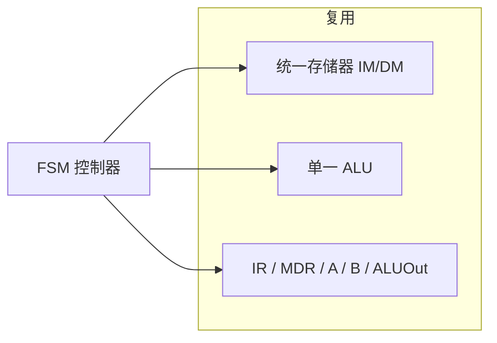

# Week 4–6 学习指南：数据表示 + 多周期 CPU

> **课程**：计算机组成与体系结构（H）
> **覆盖周次**：Week 4（整数表示）、Week 5（IEEE 754）、Week 6（多周期 FSM）
> **主要来源**：Week 4–6 课程记录、课件 02/05、NotebookLM 分层问答
> **对应课件**：`2_数据的机器级表示.pdf`、`5_中央处理器.pdf`（多周期部分）
> **教材章节**：唐朔飞《计算机组成原理》第 2 版 **第 2、5 章**；Patterson RISC-V 版 **第 3、4 章**
> **原始采集**：`notebooklm-raw/part2-week4-6/runs/20260616-151745/`（5 批）
> **知识图谱**：`notebooklm-raw/part2-week4-6/knowledge-graph.md`
> **整合日期**：2026-06-16（初版）
> **术语格式**：术语表及正文**首次出现**时，专业名词采用 **中文（English）**；英文缩写采用 **缩写（English full name，中文）**，便于对照英文课件、教材与开卷试题。

---

## 0. 术语表

| 术语 | 大白话 |
|------|--------|
| **补码** | 现代整数标准：减法变加法，符号位参与运算 |
| **移码** | 真值加偏置再编码；浮点阶码专用 |
| **大端/小端** | 多字节数据在内存中从高地址还是低地址放「低位」 |
| **对齐** | 数据起始地址是其长度的整数倍，否则可能多次访存 |
| **隐含位** | 规格化浮点尾数最高位 1 不存，精度多 1 位 |
| **CPI** | 每条指令平均时钟周期数 |
| **FSM** | 有限状态机；多周期 CPU 的控制核心 |

### 高频缩写速查

| 缩写 | 解释 |
|------|------|
| **CPI** | Cycles Per Instruction，每条指令平均时钟周期数 |
| **FSM** | Finite State Machine，有限状态机 |
| **CPU** | Central Processing Unit，中央处理器 |
| **ALU** | Arithmetic Logic Unit，算术逻辑单元 |
| **PC** | Program Counter，程序计数器 |
| **RF** | Register File，寄存器堆 |

---

## 1. 知识地图（L0）

### 1.1 这三周在学什么？

课程采用「**系统先行**」：Week 1–3 已用 Lab1 搭建五级流水 CPU，建立全局架构观；Week 4–6 才系统补讲**数据在机器里怎么表示**，以及**多周期 CPU** 如何用 FSM 复用硬件、权衡 CPI 与时钟频率。（来源：L0-positioning、课件 02）

**学完你能**：

1. 手算 8 位原/反/补码、4 位移码
2. 判断大小端内存布局、分析不对齐访存代价
3. 将十进制实数编码/解码为 IEEE 754 单/双精度
4. 解释单周期瓶颈，计算多周期混合程序 CPI
5. 画出多周期 CPU 硬件复用关系

### 1.3 叙事线

### 1.4 课本与课件速查

| 指南节 | Week | 课件 | 唐朔飞（第 2 版） | P&H RISC-V |
|--------|------|------|-------------------|------------|
| §2.1 整数表示 | Week 4 | 课件 **02** 数据的机器级表示 | **第 2 章** §2.1–2.2 整数编码 | **第 3 章** §3.2–3.4 有符号/无符号 |
| §2.2 大小端与对齐 | Week 4 | 课件 **02** | **第 2 章** §2.3 存储与排列次序 | **第 3 章** §3.5 字节编址 |
| §2.3 IEEE 754 | Week 5 | 课件 **02** | **第 2 章** §2.4 浮点数表示 | **第 3 章** §3.5–3.6 浮点 |
| §2.4 多周期 FSM | Week 6 | 课件 **05** 中央处理器 | **第 5 章** §5.3–5.4 多周期 CPU | **第 4 章** §4.4–4.5 多周期实现 |
| §3 Lab1–3 | 实验 | `4_Lab/` + [26-Arch Wiki](https://github.com/26-Arch/26-Arch/wiki/) | — | 附录 A 查指令编码 |

---

## 2. 核心知识

### 2.1 整数机器表示（Week 4）

> **本节要回答**：原码、反码、补码、移码各怎么编码？为何现代计算机用补码？

| 来源 | 位置 | 本节对应主题 |
|------|------|-------------|
| **课件 02** | 整数原/反/补/移码 | 编码规则、溢出直觉 |
| **唐朔飞** | **第 2 章** §2.1–2.2 | 补码运算、符号扩展 |
| **P&H RISC-V** | **第 3 章** §3.2–3.4 | 有符号/无符号、立即数 |
| **课程记录** | `week4-周一-计组H.md`、`week4-周三-计组H.md` | 回溯数据表示 |

| 编码 | 规则 | 手算例（-10，8 位） |
|------|------|---------------------|
| 原码 | 符号位 + 绝对值 | `1000 1010` |
| 反码 | 正同原码；负则数值位取反 | `1111 0101` |
| 补码 | 反码末位 +1（「取反加一」） | `1111 0110`；-123 → `1000 0101` |
| 移码 | 真值 + Bias（n 位 Bias=$2^{n-1}$） | n=4，-7+8=1 → `0001` |

**补码核心优势**：减法统一为加法；0 表示唯一；符号位参与运算。（来源：w4-integer-repr）

> **直观理解**：C 语言里 `if ((int)a < (unsigned)b)` 的诡异结果，根源是有符号/无符号比较时硬件按无符号解释补码位模式——排查要下沉到表示层，而非只看算法。

> **小结 → 下一节**：补码定好了「整数在寄存器里长什么样」；下一节看 **多字节在内存里怎么排**——大小端与对齐直接影响 Lab2 访存宽度。

---

### 2.2 大小端与数据对齐（Week 4）

> **本节要回答**：`0x12345678` 存到地址 100H 时长什么样？不对齐为何慢？

| 来源 | 位置 | 本节对应主题 |
|------|------|-------------|
| **课件 02** | 大小端、对齐 | 内存字节序、跨字访存 |
| **唐朔飞** | **第 2 章** §2.3 | 数据的存储和排列次序 |
| **P&H RISC-V** | **第 3 章** §3.5 | 字节编址与小端 |
| **课程记录** | `week4-周一/周三-计组H.md` | RISC-V 小端、对齐异常铺垫 |

**大小端**（`0x12345678` @ `100H`）：

| 地址 | 大端 | 小端 |
|------|------|------|
| 100H | `12` (MSB) | `78` (LSB) |
| 101H | `34` | `56` |
| 102H | `56` | `34` |
| 103H | `78` | `12` |

RISC-V 为小端。对齐规则：起始地址 mod 数据长度 = 0。32 位系统中 `int` 起始于地址 8 → 1 次访存；起始于 6 → 跨字边界，需 **2 次**访存再拼接。（来源：w4-integer-repr）

> **小结 → 下一节**：整数与字节序铺垫完毕；Week 5 进入 **浮点**——阶码用移码、尾数用隐含位，与整数补码是另一套规则。

---

### 2.3 IEEE 754 浮点数（Week 5）

> **本节要回答**：32/64 位怎么拆？特殊值如何判断？隐含位是什么？

| 来源 | 位置 | 本节对应主题 |
|------|------|-------------|
| **课件 02** | IEEE 754、FP16/BF16 | 单/双精度、特殊值 |
| **唐朔飞** | **第 2 章** §2.4 | 浮点数表示与运算 |
| **P&H RISC-V** | **第 3 章** §3.5–3.6 | 浮点格式、舍入 |
| **课程记录** | `week5-周一/周二/周三-计组H.md` | 实验板发放、量化格式 |

| 格式 | S | E | f | Bias | 真值 |
|------|---|---|---|------|------|
| FP32 | 1 | 8 | 23 | 127 | $(-1)^S \times 1.f \times 2^{E-127}$ |
| FP64 | 1 | 11 | 52 | 1023 | $(-1)^S \times 1.f \times 2^{E-1023}$ |

**数值例**：$0.5$ → `3F000000H`；$10.0$ → 阶码 1026，尾数全 0 → `4024000000000000H`。（来源：w5-ieee754）

**特殊值**（阶码 E 全 0 或全 1）：

| 条件 | 含义 | 例（FP32） |
|------|------|------------|
| E=0, f=0 | ±0 | `0x00000000` |
| E 全 1, f=0 | ±∞ | `0x7F800000` |
| E 全 1, f≠0 | NaN | `0x7F800001` |

**规格化 + 隐含位**：二进制规格化尾数最高位为 1，IEEE 754 不存储该位，有效精度 +1。（来源：w5-ieee754、w46-mistakes-bridge）

> **拓展（非期末核心）**：FP16（5 位阶码）范围窄；BF16（8 位阶码，与 FP32 同动态范围）常用于深度学习训练，可由 FP32 截断尾数得到。

> **小结 → 下一节**：数据表示补齐后，Week 6 回到 **CPU 执行模型**——用 FSM 把单周期拆成多拍，为流水线重叠执行铺路。

---

### 2.4 多周期 CPU 与 FSM（Week 6）

> **本节要回答**：单周期为何慢？多周期如何复用硬件？CPI 怎么算？

| 来源 | 位置 | 本节对应主题 |
|------|------|-------------|
| **课件 05** | 多周期 CPU、FSM | 硬件复用、状态编码 |
| **唐朔飞** | **第 5 章** §5.3–5.4 | 多周期数据通路与控制 |
| **P&H RISC-V** | **第 4 章** §4.4–4.5 | 多周期实现、CPI |
| **课程记录** | `week6-周三-计组H.md` | 性能公式、FSM 状态 |

**单周期局限**（来源：w6-multicycle-fsm）：

- 时钟周期 = 最长指令（`lw`）路径 → 短指令空等
- CPI 恒为 1，但频率极低
- 无法复用 ALU/存储器，硬件冗余

**多周期设计**：

- 取指与访存分属不同周期 → IM/DM 可合并
- 单一 ALU 分时做 PC+4、分支、运算
- FSM（Moore 机）：12 状态需 4 位编码；输出仅依赖当前状态

**性能公式**：执行时间 = 指令数 × **CPI** × 时钟周期

**CPI 手算**（混合比：Load 22%/5周期，Store 11%/4，R-type 49%/4，Branch 16%/3，Jump 2%/3）：

$CPI = 0.22×5 + 0.11×4 + 0.49×4 + 0.16×3 + 0.02×3 = 4.04$

多周期 CPI > 1，但时钟周期远短于单周期，整体仍更快。（来源：w6-multicycle-fsm）

> **小结 → 下一节**：多周期用时间换频率；Week 7 进一步 **重叠** 不同指令的各拍——流水线在短周期上逼近 CPI≈1。

---

## 3. Lab1–3 与课堂对照

| 来源 | 位置 | 说明 |
|------|------|------|
| **Lab Wiki** | [26-Arch Wiki](https://github.com/26-Arch/26-Arch/wiki/) Lab-1 ~ Lab-3 | 实验要求与调试 |
| **课件** | `4_Lab/Lab1–3*.pdf` | 讲义与验收 |
| **个人报告** | `26-Arch/Doc/Lab{1..3}/report.md` | 踩坑与验证 |

| 课堂概念 | Lab 中的体现 |
|----------|-------------|
| 补码/对齐 | 访存、比较指令的位模式解释 |
| 有符号陷阱 | 调试分支条件时 `(int)` vs `(unsigned)` |
| 单周期路径 | Lab1 最长路径决定频率上限 |
| 多周期 FSM | 理解 Lab3 控制流前身的「分步执行」思路 |
| 临时寄存器 | Week6 IR/MDR ↔ Week7 段间寄存器职能演变 |

---

## 4. 易混淆概念

| 对比组 | 正确理解 |
|--------|----------|
| 补码 vs 移码 | 补码用于定点整数运算；移码 = 真值+Bias，专用于浮点阶码比较 |
| 规格化 vs 隐含位 | 规格化是数学性质（最高位非 0）；隐含位是存储优化（不存那个 1） |
| 单周期 CPI vs 多周期 CPI | 前者恒 1 但周期极长；后者 >1 但周期短，吞吐常更优 |
| 临时寄存器 vs 段间寄存器 | 多周期锁存**当前指令**中间值；流水线传递**不同指令**间的数据/控制 |

---

## 5. 与前后模块衔接

- **前接**：Week1–3 Lab 已遇数据表示疑惑（C 比较、访存宽度），本周从底层补齐
- **后接**：Week7 流水线 = 理想 CPI≈1 + 短周期，通过重叠执行提升吞吐；Week6 的 Load 路径演变为 Load-Use 数据冒险（来源：w46-mistakes-bridge）

---

## 6. 自检问题

读完本章你应能：

1. 写出 -123 的 8 位补码
2. 画出 `0x12345678` 小端内存布局
3. 将 0.5 编码为 FP32 十六进制
4. 判断 `0x7F800001` 是 NaN 还是 +∞
5. 用给定混合比计算多周期 CPI

---

## 7. 追问块

> **追问 1**：为何 IEEE 754 阶码用移码而非补码？
>
> **答**：移码使指数按无符号整数比较大小即对应真值大小关系；补码在负数区间比较不直观。且 E=0 可专用于非规格化数/零，E 全 1 专用于无穷/NaN，编码空间划分清晰。

> **追问 2**：多周期 CPU 的 IR 与流水线 IF/ID 段间寄存器都「存指令」，职能有何本质区别？
>
> **答**：多周期 IR 锁存**当前正在执行**的那条指令，全周期复用；流水线 IF/ID 寄存器在**同一时刻**分别属于不同指令——IF 段取下一条的同时 ID 段译码上一条，实现指令级重叠。

> **追问 3**：若程序 90% 是 Load 指令，多周期 CPI 会逼近多少？这对 Week7 的 Load-Use 冒险意味着什么？
>
> **答**：Load 通常 5 周期 → CPI ≈ 0.9×5 + … ≈ **4.5+**。Load 占比高说明访存密集，流水线中 **Load-Use 数据冒险**更频繁，仅靠转发不够时必须插气泡，实际 CPI 还会高于理想值。

---

## 8. 资料索引

| 类型 | 文件 / 路径 | 说明 |
|------|-------------|------|
| 课程记录 | `week4-周一/周三-计组H.md` | Week 4 整数、大小端 |
| 课程记录 | `week5-周一/周二/周三-计组H.md` | Week 5 IEEE 754 |
| 课程记录 | `week6-周三-计组H.md` | Week 6 多周期 FSM |
| 课件 | `3_课件/2_数据的机器级表示.pdf` | 整数、浮点 |
| 课件 | `3_课件/5_中央处理器.pdf` | 多周期 CPU |
| 教材 | 唐朔飞《计算机组成原理》第 2 版 | **第 2 章** 数据表示；**第 5 章** §5.3–5.4 多周期 |
| 教材 | Patterson RISC-V 版 | **第 3 章** 运算；**第 4 章** §4.4–4.5 多周期 |
| 实验 | `4_Lab/`、`26-Arch/Doc/Lab{1..3}/` | Lab1–3 |
| 知识图谱 | `notebooklm-raw/part2-week4-6/knowledge-graph.md` | 整合前置 |
| 原始问答 | `notebooklm-raw/part2-week4-6/runs/latest/*.answer.md` | 5 批 raw |
| 周次索引 | `guides/计组课程-16周内容梳理.md` | 课纲对照 |
