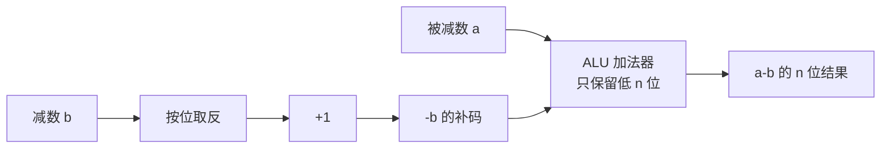
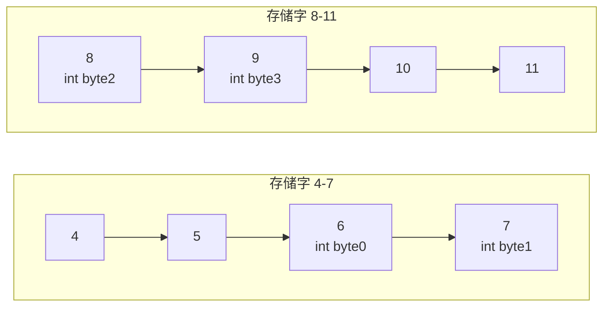
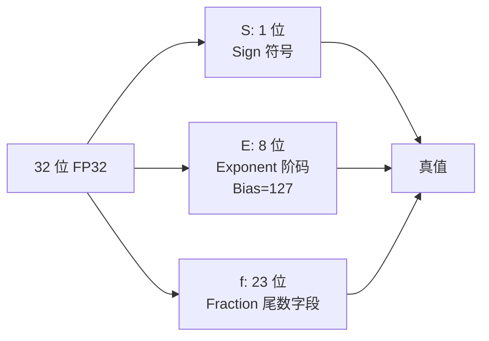
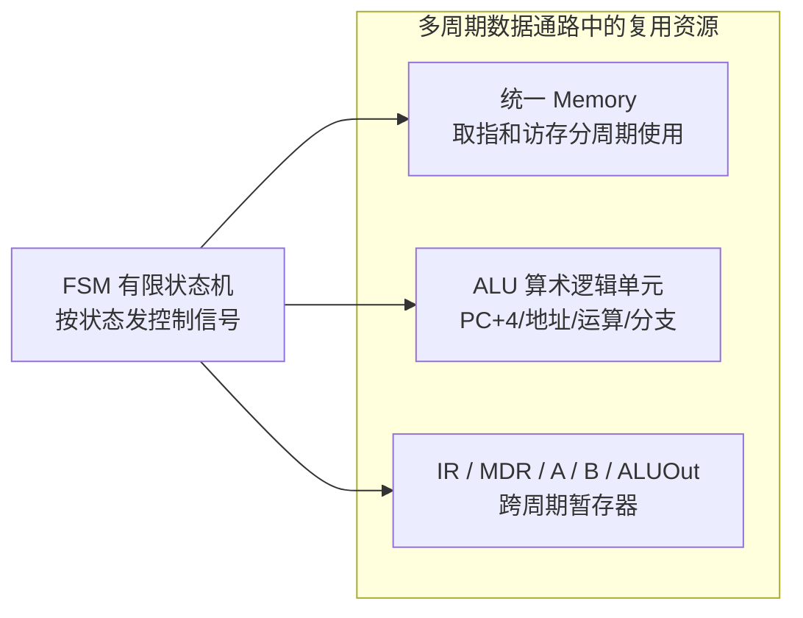
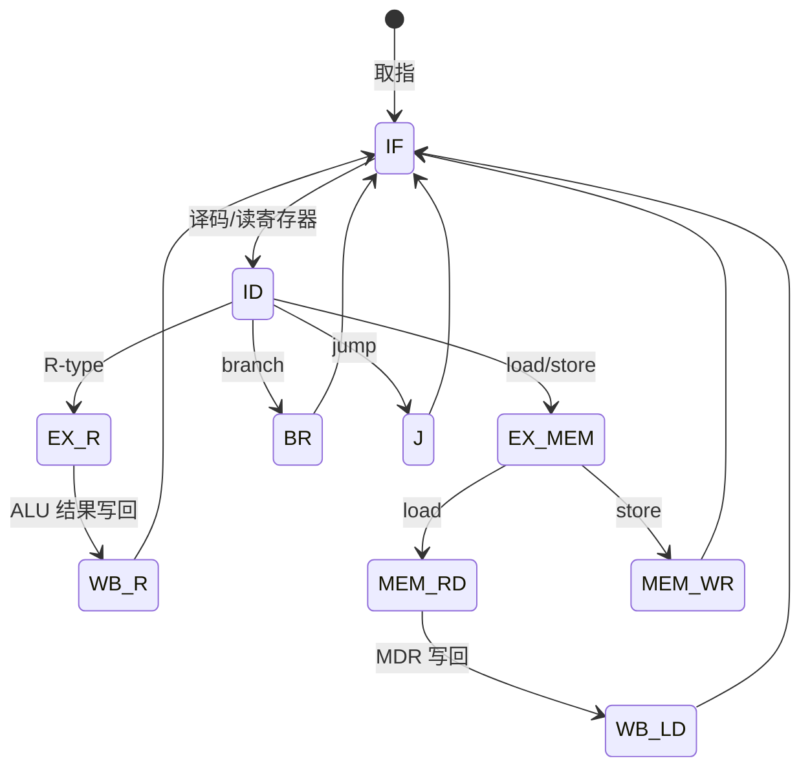

# Week 4–6 学习指南：数据表示 + 多周期 CPU

> **课程**：计算机组成与体系结构（H）
> **覆盖周次**：Week 4（整数表示）、Week 5（IEEE 754）、Week 6（多周期 FSM）
> **主要来源**：Week 4–6 课程记录、课件 02/05、NotebookLM 分层问答
> **对应课件**：`2_数据的机器级表示.pdf`、`5_中央处理器.pdf`（多周期部分）
> **教材章节**：唐朔飞《计算机组成原理》第 2 版 **第 2、5 章**；Patterson RISC-V 版 **第 3、4 章**
> **原始采集**：`notebooklm-raw/part2-week4-6/runs/20260616-151745/`（5 批）
> **知识图谱**：`notebooklm-raw/part2-week4-6/knowledge-graph.md`
> **整合日期**：2026-06-16（初版）；2026-06-24（二轮优化）
> **术语格式**：术语表及正文**首次出现**时，专业名词采用 **中文（English）**；英文缩写采用 **缩写（English full name，中文）**，便于对照英文课件、教材与开卷试题。

---

## 0. 术语表

| 术语 | 大白话 |
|------|--------|
| **补码（Two's Complement）** | 现代整数标准：把减法统一成加法，最高位既表示符号又参与普通加法 |
| **溢出（Overflow）** | 结果超出固定位宽能表示的范围；硬件低位仍给出位模式，但数学真值已不对 |
| **移码（Biased / Excess Code）** | 真值加偏置再编码；常用于浮点阶码，使指数大小可按无符号数比较 |
| **大端 / 小端（Big / Little Endian）** | 多字节数据在内存中按字节摆放时，最高有效字节或最低有效字节先放低地址 |
| **对齐（Alignment）** | 数据起始地址是其长度的整数倍；不对齐可能跨两个存储字，增加访存或触发异常 |
| **规格化（Normalization）** | 浮点尾数写成 `1.xxxx × 2^e` 的形式，保证表示唯一、精度集中 |
| **隐含位（Hidden Bit）** | IEEE 754 规格化数默认尾数最高位为 1，因此不存这一位，等于白赚 1 位精度 |
| **CPI（Cycles Per Instruction）** | 平均每条指令需要多少个时钟周期 |
| **FSM（Finite State Machine）** | 有限状态机；多周期 CPU 用它按“当前状态 + 指令类型”发控制信号 |

### 高频缩写速查

| 缩写 | 解释 |
|------|------|
| **CPI** | Cycles Per Instruction，每条指令平均时钟周期数 |
| **FSM** | Finite State Machine，有限状态机 |
| **IEEE 754** | IEEE Standard for Floating-Point Arithmetic，浮点数表示与舍入标准 |
| **CPU** | Central Processing Unit，中央处理器 |
| **ALU** | Arithmetic Logic Unit，算术逻辑单元 |
| **PC** | Program Counter，程序计数器 |
| **RF** | Register File，寄存器堆 |
| **MSB / LSB** | Most / Least Significant Byte，最高 / 最低有效字节；也常指最高 / 最低有效位 |
| **NaN / Inf** | Not a Number / Infinity，非数 / 无穷；IEEE 754 特殊值 |
| **IR / MDR** | Instruction Register / Memory Data Register，指令寄存器 / 存储器数据寄存器 |
| **A / B 暂存器** | 多周期 CPU 中锁存寄存器堆两个读口输出的临时寄存器 |
| **ALUOut** | ALU Output Register，ALU 输出寄存器；保存本周期 ALU 结果供后续周期使用 |

---

## 1. 知识地图（L0）

### 1.1 这三周在学什么？

课程采用「**系统先行**」：Week 1–3 已用 Lab1 搭建五级流水 CPU，建立全局架构观；Week 4–6 才系统补讲**数据在机器里怎么表示**，以及**多周期 CPU** 如何用 FSM 复用硬件、权衡 CPI 与时钟频率。（来源：L0-positioning、课件 02）

**学完你能**：

1. 手算 8 位原/反/补码、4 位移码
2. 判断大小端内存布局、分析不对齐访存代价
3. 将十进制实数编码/解码为 IEEE 754 单/双精度
4. 解释单周期瓶颈，计算多周期混合程序 CPI
5. 画出多周期 CPU 硬件复用关系

### 1.3 叙事线

### 1.4 课本与课件速查

| 指南节 | Week | 课件 | 唐朔飞（第 2 版） | P&H RISC-V |
|--------|------|------|-------------------|------------|
| §2.1 整数表示 | Week 4 | 课件 **02** 数据的机器级表示 | **第 2 章** §2.1–2.2 整数编码 | **第 3 章** §3.2–3.4 有符号/无符号 |
| §2.2 大小端与对齐 | Week 4 | 课件 **02** | **第 2 章** §2.3 存储与排列次序 | **第 3 章** §3.5 字节编址 |
| §2.3 IEEE 754 | Week 5 | 课件 **02** | **第 2 章** §2.4 浮点数表示 | **第 3 章** §3.5–3.6 浮点 |
| §2.4 多周期 FSM | Week 6 | 课件 **05** 中央处理器 | **第 5 章** §5.3–5.4 多周期 CPU | **第 4 章** §4.4–4.5 多周期实现 |
| §3 Lab1–3 | 实验 | `4_Lab/` + [26-Arch Wiki](https://github.com/26-Arch/26-Arch/wiki/) | — | 附录 A 查指令编码 |

---

## 2. 核心知识

### 2.1 整数机器表示（Week 4）

> **本节要回答**：原码、反码、补码、移码各怎么编码？为何现代计算机用补码？

| 来源 | 位置 | 本节对应主题 |
|------|------|-------------|
| **课件 02** | 整数原/反/补/移码 | 编码规则、溢出直觉 |
| **唐朔飞** | **第 2 章** §2.1–2.2 | 补码运算、符号扩展 |
| **P&H RISC-V** | **第 3 章** §3.2–3.4 | 有符号/无符号、立即数 |
| **课程记录** | `week4-周一-计组H.md`、`week4-周三-计组H.md` | 回溯数据表示 |

#### 2.1.1 先看问题：为什么“负数怎么存”会影响硬件？

机器里没有“负号”这个字符，只有固定位宽的 0/1。整数表示要解决两个问题：第一，如何让同一套加法器既能算加法又能算减法；第二，如何让比较、符号扩展、溢出判断在硬件里尽量简单。原码和反码适合解释“符号位 + 数值位”的直觉，但现代 CPU 的定点整数几乎都用 **补码（Two's Complement）**。（来源：w4-integer-repr、w46-mistakes-bridge）

| 编码 | 用途 / 规则 | 8 位手算例 |
|------|-------------|------------|
| 原码（Sign and Magnitude） | 最高位是符号位，后 7 位是绝对值 | `-10`：符号 `1` + `0001010` → `1000 1010` |
| 反码（One's Complement） | 正数同原码；负数保持符号位，数值位取反 | `-10`：`1000 1010` → `1111 0101` |
| 补码（Two's Complement） | 正数同原码；负数按“按位取反 + 1” | `-10`：`1111 0101 + 1` → `1111 0110` |
| 移码（Biased Code） | 真值 + Bias（偏置）后按无符号数编码 | 4 位 Bias=$2^{3}=8$，`-7+8=1` → `0001` |

> **直观理解**：补码像一个“模 $2^n$ 的圆环”。8 位里 `1111 1111` 既可以按无符号解释为 255，也可以按补码解释为 -1；加 1 后回到 `0000 0000`，正好模拟 `-1 + 1 = 0`。

#### 2.1.2 补码为什么能把减法变加法？

在 n 位补码系统中，机器只保留低 n 位，等价于按 $2^n$ 取模。要算 `a - b`，可以改成 `a + (-b)`；而 `-b` 的补码正是 $2^n-b$ 的低 n 位表示。这样 ALU（Arithmetic Logic Unit，算术逻辑单元）只需要做加法，符号位也跟普通位一起进入加法器。

下面的图要回答“补码负数为什么可以直接进同一个加法器”。`取反+1` 得到加法意义上的相反数，ALU 只做一件事：把两个 n 位输入相加并丢弃最高进位。

> **读图提示：** 从 `b` 到 `-b 的补码` 是编码变换，不是新增一个“减法器”；真正参与运算的只有右侧 ALU 加法器。最高进位被丢弃，是补码模 $2^n$ 运算的一部分。

#### 2.1.3 补码手算例：求 -123 的 8 位补码

| 项 | 内容 |
|----|------|
| **题目场景** | 8 位机器整数中，写出真值 `-123` 的补码位模式 |
| **已知** | 8 位补码范围为 `-128` 到 `+127`，`123_{10}=0111 1011_2` |
| **求** | `-123` 的 8 位补码 |
| **步骤 1** | 写出 `+123` 的 8 位二进制：`0111 1011` |
| **步骤 2** | 按位取反：`1000 0100` |
| **步骤 3** | 末位加 1：`1000 0101` |
| **结果解释** | `1000 0101` 可写作 `85H`；按补码解释是真值 `-123` |

> **易错提醒：** “取反加一”要对完整 8 位执行，不是只对数值位执行；补码的最高位也参与运算。检查时可把 `0111 1011 + 1000 0101 = 1 0000 0000`，低 8 位为 0，说明两者互为相反数。

#### 2.1.4 溢出怎么判断？

补码溢出只对**有符号解释**有意义。两个同号数相加，如果结果符号变了，就发生有符号溢出；异号相加不会溢出。

| 操作 | 8 位结果 | 是否溢出 | 原因 |
|------|----------|----------|------|
| `0100 0000`(+64) + `0100 0000`(+64) | `1000 0000` | 溢出 | 正 + 正 得到负号，数学结果 +128 超出 8 位补码上界 +127 |
| `1000 0000`(-128) + `1111 1111`(-1) | `0111 1111` | 溢出 | 负 + 负 得到正号，数学结果 -129 超出下界 -128 |
| `0111 1111`(+127) + `1111 1111`(-1) | `0111 1110` | 不溢出 | 异号相加，结果 +126 可表示 |

> **边界说明：** 同一位模式能被解释成有符号或无符号。`1000 0000` 按 8 位补码是 -128，按无符号是 128；判断溢出前必须先确认题目要求的解释口径。

#### 2.1.5 移码为什么适合浮点阶码？

移码（Biased Code）不主要用于整数加减，而是用于浮点阶码（Exponent）。它把可能为负的指数整体平移到非负区间，例如 IEEE 754 FP32 的 Bias 是 127，真实指数 `e=-1` 存成 `E=126`。这样硬件比较两个规格化浮点数阶码时，可以直接把阶码域当作无符号数比较，指数越大，编码通常也越大。

> **直观理解：** 移码像把温度计整体向右平移：`-7` 加 Bias 后变成一个非负刻度。它牺牲了补码那种“直接加减”的便利，换来“比较大小”和“保留全 0 / 全 1 阶码给特殊值”的清晰分区。

> **直观理解**：C 语言里 `if ((int)a < (unsigned)b)` 的诡异结果，根源是有符号/无符号比较时硬件按无符号解释补码位模式——排查要下沉到表示层，而非只看算法。

> **小结 → 下一节**：补码定好了「整数在寄存器里长什么样」；下一节看 **多字节在内存里怎么排**——大小端与对齐直接影响 Lab2 访存宽度。

---

### 2.2 大小端与数据对齐（Week 4）

> **本节要回答**：`0x12345678` 存到地址 100H 时长什么样？不对齐为何慢？

| 来源 | 位置 | 本节对应主题 |
|------|------|-------------|
| **课件 02** | 大小端、对齐 | 内存字节序、跨字访存 |
| **唐朔飞** | **第 2 章** §2.3 | 数据的存储和排列次序 |
| **P&H RISC-V** | **第 3 章** §3.5 | 字节编址与小端 |
| **课程记录** | `week4-周一/周三-计组H.md` | RISC-V 小端、对齐异常铺垫 |

#### 2.2.1 先看问题：寄存器里的一个 word 怎么落到内存字节？

寄存器里看 `0x12345678` 是一个 32 位整体，但内存通常按字节编址，地址 `100H`、`101H`、`102H`、`103H` 每格只能放 1 字节。于是必须约定 4 个字节按什么顺序放。**大端（Big Endian）** 把 MSB（Most Significant Byte，最高有效字节）放低地址；**小端（Little Endian）** 把 LSB（Least Significant Byte，最低有效字节）放低地址。（来源：w4-integer-repr）

| 字节 | 含义 |
|------|------|
| `12H` | MSB（最高有效字节），在数值书写 `0x12345678` 的最左侧 |
| `78H` | LSB（最低有效字节），在数值书写 `0x12345678` 的最右侧 |

#### 2.2.2 内存地址例：`0x12345678` 存到 `100H`

| 地址 | 大端 | 小端 |
|------|------|------|
| 100H | `12` (MSB) | `78` (LSB) |
| 101H | `34` | `56` |
| 102H | `56` | `34` |
| 103H | `78` | `12` |

> **读表提示：** 地址从上到下递增。看大端时，低地址先看到“人类书写顺序”的左端 `12H`；看小端时，低地址先看到最低有效字节 `78H`。RISC-V 采用小端，因此调试内存 dump 时常会看到字节顺序与十六进制书写顺序相反。

#### 2.2.3 对齐：为什么起始地址不是随便选？

**数据对齐（Alignment）** 要求数据的起始地址是数据长度的整数倍，即 `Addr mod Size = 0`。这不是格式洁癖，而是为了让硬件一次访存尽量覆盖完整数据。

下面的图要回答“为什么地址 6 的 4 字节 int 比地址 8 更麻烦”。假设一次按 4 字节存储字访问，边界是 `[4..7]`、`[8..11]`。

> **读图提示：** 如果 `int` 从地址 8 开始，4 个字节全在第二个存储字里，1 次访存即可；如果从地址 6 开始，前 2 字节在 `[4..7]`，后 2 字节在 `[8..11]`，硬件要读两次再拼接。有些 ISA 或实现还会对未对齐访存直接报异常。

| 场景 | 判断 | 访存代价 |
|------|------|----------|
| 32 位系统中 `int` 从地址 `8` 开始 | `8 mod 4 = 0`，对齐 | 通常 1 次访存 |
| 32 位系统中 `int` 从地址 `6` 开始 | `6 mod 4 = 2`，不对齐 | 可能 2 次访存 + 拼接，或触发未对齐异常 |

> **小结 → 下一节**：整数与字节序铺垫完毕；Week 5 进入 **浮点**——阶码用移码、尾数用隐含位，与整数补码是另一套规则。

---

### 2.3 IEEE 754 浮点数（Week 5）

> **本节要回答**：32/64 位怎么拆？特殊值如何判断？隐含位是什么？

| 来源 | 位置 | 本节对应主题 |
|------|------|-------------|
| **课件 02** | IEEE 754、FP16/BF16 | 单/双精度、特殊值 |
| **唐朔飞** | **第 2 章** §2.4 | 浮点数表示与运算 |
| **P&H RISC-V** | **第 3 章** §3.5–3.6 | 浮点格式、舍入 |
| **课程记录** | `week5-周一/周二/周三-计组H.md` | 实验板发放、量化格式 |

#### 2.3.1 先看问题：为什么浮点不能直接用补码？

整数编码解决的是“精确表示一个有限范围内的整数”。浮点要解决的是另一类问题：用固定位数同时表示很大的数、很小的小数和近似结果。IEEE 754（IEEE Standard for Floating-Point Arithmetic，浮点数标准）把一个数拆成 **符号位 S（Sign）**、**阶码 E（Exponent）**、**尾数字段 f（Fraction）** 三部分，用科学计数法的思路存储。（来源：w5-ieee754）

| 格式 | 总位数 | S（符号位） | E（阶码） | f（尾数字段） | Bias（偏置） | 规格化真值 |
|------|--------|-------------|-----------|---------------|--------------|------------|
| FP32（单精度） | 32 | 1 | 8 | 23 | 127 | $(-1)^S \times 1.f \times 2^{E-127}$ |
| FP64（双精度） | 64 | 1 | 11 | 52 | 1023 | $(-1)^S \times 1.f \times 2^{E-1023}$ |

> **边界说明：** 表里的公式只适用于规格化数，即 `E` 既不是全 0，也不是全 1。`E=0` 和 `E=全1` 是 IEEE 754 专门留出的特殊编码区。

#### 2.3.2 三个字段分别解决什么？

| 字段 | 解决的问题 | 读法 |
|------|------------|------|
| S（Sign，符号位） | 正负号 | `0` 表示正，`1` 表示负 |
| E（Exponent，阶码） | 数量级 / 小数点移动多少位 | 用移码存储；真实指数 `e = E - Bias` |
| f（Fraction，尾数字段） | 有效数字 | 规格化数实际尾数是 `1.f`，最高的 `1` 是隐含位 |

下面的图要回答“一个 FP32 位串应按什么顺序拆”。图中 S/E/f 是字段名，不是三个独立数字；E 需要减 Bias 后才是真实指数。

> **读图提示：** 先看 E 是否全 0 或全 1，决定走“普通规格化数”还是“特殊值”；普通数再按 `(-1)^S × 1.f × 2^(E-Bias)` 计算。不要把尾数字段 f 直接读成 `0.f`，规格化数前面有隐含的 `1.`。

#### 2.3.3 特殊值：零、非规格化、无穷和 NaN

特殊值的意义在于让硬件和程序能区分“太小接近 0”“溢出到无穷”“非法运算结果”等情况。这里期末核心是会判 `E` 和 `f`，非规格化数细节可轻量掌握。

| 条件 | 含义 | 例（FP32） |
|------|------|------------|
| `E=0, f=0` | ±0，符号由 S 决定 | `0x00000000` 是 +0 |
| `E=0, f≠0` | 非规格化数（Denormal / Subnormal） | 用于贴近 0 的极小数；没有隐含 1 |
| `E=全1, f=0` | ±Inf（Infinity，无穷） | `0x7F800000` 是 +∞ |
| `E=全1, f≠0` | NaN（Not a Number，非数） | `0x7F800001` 是 NaN |

> **易错提醒：** `Inf` 和 `NaN` 都要求阶码全 1，区别只看尾数字段 f 是否全 0。看到 `0x7F800001` 时，不要因为它“很大”就判成无穷；只要 f 非 0，就是 NaN。

#### 2.3.4 舍入：为什么浮点常常只是近似？

十进制小数转二进制时可能无限循环，例如 `0.1_{10}` 无法用有限二进制尾数精确表示。IEEE 754 需要舍入规则把无限或过长的尾数压进有限位宽。课堂复习时先掌握最常用的“就近舍入”（round to nearest，通常 ties to even），以及一个判断：浮点运算的结果不一定等于数学实数的精确结果。

> **直观理解：** 浮点数像科学计数法的“有限格子本”。阶码决定小数点移多远，尾数决定有效数字写多少位；格子不够时只能舍入，所以浮点适合近似实数，不适合金额、精确计数这类必须逐位准确的场景。

#### 2.3.5 示例题：把 `0.5` 编码为 FP32

| 项 | 内容 |
|----|------|
| **题目场景** | 按 IEEE 754 单精度格式编码十进制数 `0.5` |
| **已知** | FP32：S 1 位，E 8 位，f 23 位，Bias=127 |
| **求** | 32 位二进制字段和十六进制表示 |
| **步骤 1：转二进制并规格化** | `0.5_{10}=0.1_2=1.0_2 × 2^{-1}` |
| **步骤 2：符号位** | 正数，所以 `S=0` |
| **步骤 3：阶码** | 真实指数 `e=-1`，存储阶码 `E=e+127=126=01111110_2` |
| **步骤 4：尾数字段** | 规格化尾数是 `1.0`，隐含位 `1` 不存，f 全 0 |
| **结果** | `0 01111110 00000000000000000000000` = `0x3F000000` |
| **结果解释** | 代回公式：$(-1)^0 × 1.0 × 2^{126-127}=0.5$ |

> **易错提醒：** `0.5` 的真实指数是 `-1`，不是 `1`；阶码字段存的是 `-1 + 127 = 126`。尾数字段不写隐含的最高位 `1`。

#### 2.3.6 示例题：解码 `0x4024000000000000` 为 FP64

| 项 | 内容 |
|----|------|
| **题目场景** | 判断双精度位模式 `0x4024000000000000` 表示什么数 |
| **已知** | FP64：S 1 位，E 11 位，f 52 位，Bias=1023 |
| **求** | 十进制真值 |
| **步骤 1：字段拆分** | 该编码对应 `S=0`，`E=1026`，尾数为 `1.25`（即二进制 `1.01` 后补 0） |
| **步骤 2：指数还原** | `e=1026-1023=3` |
| **步骤 3：代入公式** | $(-1)^0 × 1.25 × 2^3 = 10.0$ |
| **结果解释** | 这是 `+10.0` 的 FP64 编码 |

> **边界说明：** 本题 raw 给出的是结论型例子，复习时关键是练会“先拆 S/E/f，再判断 E 是否特殊，最后代公式”的流程；不要直接背十六进制答案。

> **拓展（非期末核心）**：FP16（5 位阶码）范围窄；BF16（8 位阶码，与 FP32 同动态范围）常用于深度学习训练，可由 FP32 截断尾数得到。

> **小结 → 下一节**：数据表示补齐后，Week 6 回到 **CPU 执行模型**——用 FSM 把单周期拆成多拍，为流水线重叠执行铺路。

---

### 2.4 多周期 CPU 与 FSM（Week 6）

> **本节要回答**：单周期为何慢？多周期如何复用硬件？CPI 怎么算？

| 来源 | 位置 | 本节对应主题 |
|------|------|-------------|
| **课件 05** | 多周期 CPU、FSM | 硬件复用、状态编码 |
| **唐朔飞** | **第 5 章** §5.3–5.4 | 多周期数据通路与控制 |
| **P&H RISC-V** | **第 4 章** §4.4–4.5 | 多周期实现、CPI |
| **课程记录** | `week6-周三-计组H.md` | 性能公式、FSM 状态 |

#### 2.4.1 先看问题：为什么不满足于单周期 CPI=1？

单周期 CPU（Single-cycle CPU）听起来很美：每条指令 CPI=1。但它的时钟周期必须长到覆盖最慢指令，通常是 `lw` 的 `取指 → 读寄存器 → ALU 算地址 → 读数据存储器 → 写回`。这会让 `add`、`jump` 这类短指令也被迫等完整长周期。多周期 CPU（Multi-cycle CPU）把一条指令拆成多个短周期，让不同指令走不同拍数，并复用硬件。（来源：w6-multicycle-fsm）

| 设计 | CPI | 时钟周期 | 主要问题 / 优势 |
|------|-----|----------|----------------|
| 单周期 | 恒为 1 | 由最长指令决定，很长 | 短指令空等，资源难复用 |
| 多周期 | 大于 1，不同指令不同 | 可按一个阶段延迟设得更短 | 需要 FSM 控制和临时寄存器 |
| 流水线 | 理想接近 1 | 短周期 | 多条指令重叠，需处理冒险 |

> **易错提醒：** 不要只看 CPI。性能公式是 `执行时间 = 指令数 × CPI × 时钟周期`；多周期 CPI 变大，但时钟周期明显缩短，所以总执行时间可能更小。

#### 2.4.2 多周期硬件复用：IR/MDR/A/B/ALUOut 各解决什么？

多周期的核心矛盾是：一个周期只做一小步，但下一周期还要用上一周期的结果。因此必须增加临时寄存器，把跨周期需要的数据锁存下来。

| 临时寄存器 | 全称 / 含义 | 解决的问题 |
|------------|-------------|------------|
| **IR** | Instruction Register，指令寄存器 | 取指后锁住当前指令，后续译码、执行、访存都不怕存储器输出变化 |
| **MDR** | Memory Data Register，存储器数据寄存器 | `lw` 读出的内存数据先暂存，下一周期再写回 RF |
| **A / B** | 寄存器堆两个读口的暂存器 | 译码阶段读出的源操作数跨周期保存，供 ALU 后续使用 |
| **ALUOut** | ALU Output Register，ALU 输出寄存器 | 保存 ALU 的地址、运算结果或分支目标，供后续访存 / 写回 / PC 更新使用 |

下面的图要回答“多周期 CPU 如何用一套存储器和一个 ALU 分时完成不同任务”。图里 Memory 表示合并后的统一存储器；ALU 可在不同状态中做 PC+4、地址计算、算术逻辑或分支目标计算。

> **读图提示：** 复用不是“同一周期抢着用”。取指状态用 Memory 读指令，访存状态再用 Memory 读写数据；取指状态用 ALU 算 PC+4，执行状态再用 ALU 做地址或算术。IR/MDR/A/B/ALUOut 的作用就是把前一状态结果稳稳交给后一状态。

#### 2.4.3 FSM 如何发控制信号？

多周期控制器常用 FSM（Finite State Machine，有限状态机）：当前处在哪个状态，决定本周期打开哪些控制信号；当前状态再结合指令 opcode，决定下一周期跳到哪个状态。课件常以 Moore 机说明：输出只依赖当前状态，下一状态逻辑另由当前状态和指令字段决定。若有 12 个状态，状态编码至少需要 4 位，因为 $2^3=8<12\le 16=2^4$。（来源：w6-multicycle-fsm）

下面的状态图不是完整课件状态表，而是复习时最重要的路径骨架：所有指令先取指、译码，然后按指令类型分流。

> **读图提示：** 先看公共前缀 `IF → ID`，再按指令类型分支。`load` 比 `R-type` 多一个 `MEM_RD`，所以周期数更多；`store` 不需要写回寄存器；`branch/jump` 更新 PC 后回到取指。

#### 2.4.4 示例题：多周期 CPI 怎么算？

性能公式：

$$
执行时间 = 指令数 \times CPI \times 时钟周期
$$

| 项 | 内容 |
|----|------|
| **题目场景** | 某多周期 CPU 上运行一个混合程序，求平均 CPI |
| **已知** | Load 22%/5 周期，Store 11%/4 周期，R-type 49%/4 周期，Branch 16%/3 周期，Jump 2%/3 周期 |
| **求** | 平均每条指令需要多少周期 |
| **公式** | $CPI=\sum(指令比例 \times 该类指令周期数)$ |
| **步骤** | $0.22×5 + 0.11×4 + 0.49×4 + 0.16×3 + 0.02×3$ |
| **结果** | $CPI = 1.10 + 0.44 + 1.96 + 0.48 + 0.06 = 4.04$ |
| **结果解释** | 平均每条指令 4.04 个短周期；它不能直接和单周期 CPI=1 比，必须乘各自时钟周期 |

> **易错提醒：** 指令比例要先转成小数；所有比例应加和为 1。CPI 是加权平均，不是简单把 `5、4、4、3、3` 取算术平均。

#### 2.4.5 从多周期到流水线：同一套阶段，目标不同

多周期和流水线都会把指令拆成阶段，但目的不同：多周期让**同一条指令**分多拍复用硬件；流水线让**不同指令**在不同阶段重叠执行。Week 6 的 IR/MDR/A/B/ALUOut 是当前指令的临时寄存器，Week 7 的 IF/ID、ID/EX、EX/MEM、MEM/WB 是不同指令之间传递数据和控制的段间寄存器。（来源：w46-mistakes-bridge）

> **小结 → 下一节**：多周期用时间换频率；Week 7 进一步 **重叠** 不同指令的各拍——流水线在短周期上逼近 CPI≈1。

---

## 3. Lab1–3 与课堂对照

| 来源 | 位置 | 说明 |
|------|------|------|
| **Lab Wiki** | [26-Arch Wiki](https://github.com/26-Arch/26-Arch/wiki/) Lab-1 ~ Lab-3 | 实验要求与调试 |
| **课件** | `4_Lab/Lab1–3*.pdf` | 讲义与验收 |
| **个人报告** | `26-Arch/Doc/Lab{1..3}/report.md` | 踩坑与验证 |

| 课堂概念 | Lab 中的体现 |
|----------|-------------|
| 补码/对齐 | 访存、比较指令的位模式解释 |
| 有符号陷阱 | 调试分支条件时 `(int)` vs `(unsigned)` |
| 单周期路径 | Lab1 最长路径决定频率上限 |
| 多周期 FSM | 理解 Lab3 控制流前身的「分步执行」思路 |
| 临时寄存器 | Week6 IR/MDR ↔ Week7 段间寄存器职能演变 |

---

## 4. 易混淆概念

| 对比组 | 常见误解 | 正确理解 |
|--------|----------|----------|
| 补码 vs 移码 | 都是“负数编码”，可互换 | 补码用于定点整数运算，优势是加减统一；移码 = 真值 + Bias，主要服务浮点阶码比较和特殊编码分区。 |
| 符号位 vs 最高有效字节 | 符号位和 MSB 是一回事 | 符号位是补码或浮点 S 字段中的最高位；MSB（Most Significant Byte，最高有效字节）是多字节数的最高 8 位，用于讨论大小端。 |
| 规格化 vs 隐含位 | “规格化”就是“不存 1” | 规格化是数学形式 `1.x × 2^e`；隐含位是 IEEE 754 对规格化数的存储优化，不存小数点前的 `1`。 |
| Inf vs NaN | 阶码全 1 就是无穷 | 阶码全 1 且尾数字段 f 全 0 才是 Inf（Infinity，无穷）；阶码全 1 且 f 非 0 是 NaN（Not a Number，非数）。 |
| 单周期 CPI vs 多周期 CPI | CPI 小的一定更快 | 单周期 CPI=1 但时钟周期长；多周期 CPI>1 但周期短。必须比较 `CPI × 时钟周期`。 |
| 临时寄存器 vs 段间寄存器 | IR/MDR 和 IF/ID、ID/EX 只是名字不同 | 多周期临时寄存器锁存**当前指令**的中间值；流水线段间寄存器传递**不同指令**之间的数据和控制。 |

---

## 5. 与前后模块衔接

- **前接**：Week1–3 Lab 已遇数据表示疑惑（C 比较、访存宽度），本周从底层补齐
- **后接**：Week7 流水线 = 理想 CPI≈1 + 短周期，通过重叠执行提升吞吐；Week6 的 Load 路径演变为 Load-Use 数据冒险（来源：w46-mistakes-bridge）

> **读图提示：** 这条线不是说三种 CPU 谁“绝对更好”，而是说明性能优化的方向：先把最长路径拆短，再把不同指令的阶段重叠。Week 6 的多周期 FSM 是 Week 7 流水线的直接前置概念。

---

## 6. 自检问题

读完本章你应能：

1. 解释为什么补码可以让符号位参与加法，并写出 `-123` 的 8 位补码。
2. 判断补码加法是否溢出，说明“同号相加变异号”的判据。
3. 画出 `0x12345678` 在地址 `100H` 的大端 / 小端内存布局，并说明 MSB、LSB 含义。
4. 判断一个 4 字节 `int` 从地址 `6` 开始为什么不对齐，以及可能需要几次访存。
5. 将 `0.5` 编码为 FP32 十六进制，并能按 S/E/f 字段解释 `0x7F800001` 为什么是 NaN。
6. 说明 IR、MDR、A/B、ALUOut 各自锁存什么，以及 FSM 如何按状态发控制信号。
7. 用给定指令混合比计算多周期 CPI，并解释为什么不能只用 CPI 比较单周期和多周期。

---

## 7. 追问块

> **追问 1**：为何 IEEE 754 阶码用移码而非补码？
>
> **答**：移码使指数按无符号整数比较大小即可大致对应真实指数大小；补码虽然适合加减，却不适合把阶码字段直接拿来排序。IEEE 754 还需要把 `E=0` 留给零 / 非规格化数，把 `E=全1` 留给 Inf / NaN，移码更容易形成这种编码分区。

> **追问 2**：多周期 CPU 的 IR 与流水线 IF/ID 段间寄存器都「存指令」，职能有何本质区别？
>
> **答**：多周期 IR 锁存**当前正在执行**的那条指令，全周期复用；流水线 IF/ID 寄存器在**同一时刻**分别属于不同指令——IF 段取下一条的同时 ID 段译码上一条，实现指令级重叠。

> **追问 3**：若程序 90% 是 Load 指令，多周期 CPI 会逼近多少？这对 Week7 的 Load-Use 冒险意味着什么？
>
> **答**：Load 通常 5 周期 → CPI ≈ 0.9×5 + … ≈ **4.5+**。Load 占比高说明访存密集，流水线中 **Load-Use 数据冒险**更频繁，仅靠转发不够时必须插气泡，实际 CPI 还会高于理想值。

> **追问 4**：`0x7F800000` 和 `0x7F800001` 只差 1，为什么一个是 +∞，一个是 NaN？
>
> **答**：IEEE 754 特殊值先看阶码：二者阶码都全 1。再看尾数字段 f：`0x7F800000` 的 f 全 0，所以是 +Inf；`0x7F800001` 的 f 非 0，所以是 NaN。判题时不要按十六进制大小猜语义。

---

## 8. 资料索引

| 类型 | 文件 / 路径 | 说明 |
|------|-------------|------|
| 课程记录 | `week4-周一/周三-计组H.md` | Week 4 整数、大小端 |
| 课程记录 | `week5-周一/周二/周三-计组H.md` | Week 5 IEEE 754 |
| 课程记录 | `week6-周三-计组H.md` | Week 6 多周期 FSM |
| 课件 | `3_课件/2_数据的机器级表示.pdf` | 整数、浮点 |
| 课件 | `3_课件/5_中央处理器.pdf` | 多周期 CPU |
| 教材 | 唐朔飞《计算机组成原理》第 2 版 | **第 2 章** 数据表示；**第 5 章** §5.3–5.4 多周期 |
| 教材 | Patterson RISC-V 版 | **第 3 章** 运算；**第 4 章** §4.4–4.5 多周期 |
| 实验 | `4_Lab/`、`26-Arch/Doc/Lab{1..3}/` | Lab1–3 |
| 知识图谱 | `notebooklm-raw/part2-week4-6/knowledge-graph.md` | 整合前置 |
| 原始问答 | `notebooklm-raw/part2-week4-6/runs/20260616-151745/*.answer.md` | 5 批 raw；当前知识图谱记录的 completed run |
| 周次索引 | `guides/计组课程-16周内容梳理.md` | 课纲对照 |
