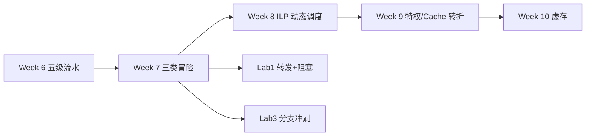
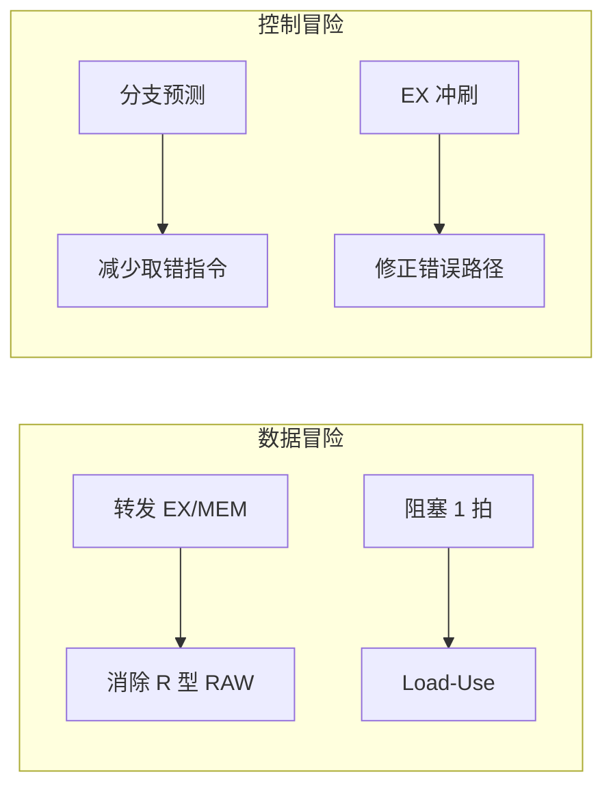
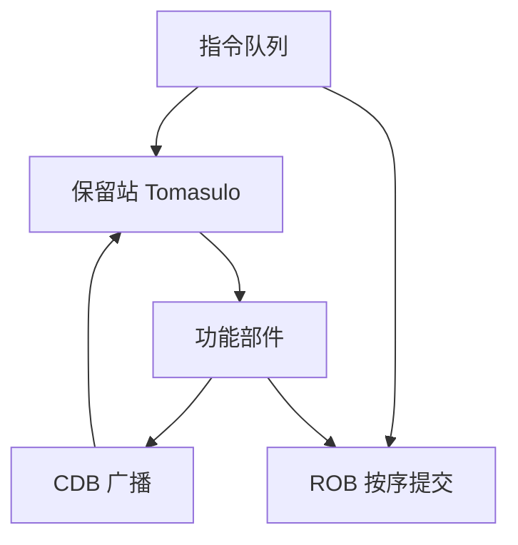

# Week 7–9 学习指南：流水线冒险 + ILP 动态调度

> **课程**：计算机组成与体系结构（H）
> **覆盖周次**：Week 7（流水线冒险）、Week 8（ILP/Scoreboard/Tomasulo）、Week 9（短周转折）
> **原始采集**：`notebooklm-raw/part3-week7-9/runs/20260616-151218/`（6 批）
> **知识图谱**：`notebooklm-raw/part3-week7-9/knowledge-graph.md`
> **生成日期**：2026-06-16（初版）

---

## 0. 术语表

| 术语 | 大白话 |
|------|--------|
| **冒险 (Hazard)** | 流水线里后续指令不能正确执行，必须停顿或补救 |
| **RAW / WAR / WAW** | 写后读（真相关）/ 读后写 / 写后写（后两者多为「假相关」） |
| **转发 (Forwarding)** | 结果还没写回寄存器，就从流水段寄存器旁路送到 ALU |
| **气泡 (Bubble)** | 插入空拍，相当于 NOP，用于阻塞或冲刷 |
| **ILP** | 指令级并行——多条指令重叠执行 |
| **保留站 (RS)** | 功能部件前的指令缓冲，等操作数就绪再发射 |
| **CDB** | 公共数据总线，结果产生后广播给所有等待者 |
| **ROB** | 重排序缓冲区，乱序执行但按序提交 |
| **BTB** | 分支目标缓冲，取指阶段就预测跳转地址 |

---

## 1. 知识地图（L0）

### 1.1 这三周在学什么？

Week 1–3 已在 Lab 中搭好五级流水线骨架；Week 7 系统讲解**三类冒险**及**转发/阻塞/分支预测**等静态解法。Week 8 向上引入 **ILP 动态调度**——记分牌与 Tomasulo 算法、寄存器重命名、CDB 与 ROB。Week 9 为五一前短周，课程从「指令怎么跑快」转向**特权架构与存储层次**预告。（来源：L0-positioning、w9-short-week）

### 1.2 期中 vs 期末怎么考？

**期中复习**仍列：流水线冒险与转发波形、Tomasulo 保留站推演、性能公式等。（来源：L0-positioning）

**期末笔试重心**：Week 8 明确后半学期（虚存/Cache/异常等）更适合笔试；流水线、记分牌、Tomasulo **主要通过 Lab1–3 考核**，但概念性推演（尤其 Tomasulo + ROB）仍可能出现在期末。（来源：L0-positioning、w79-mistakes）

### 1.3 叙事线

---

## 2. 核心知识

### 2.1 流水线冒险（Week 7）

> **本节要回答**：三类冒险是什么？转发能解决什么？Load-Use 为何必须阻塞？

**时空图与加速比**：横轴为时钟周期、纵轴为指令，可直观看到重叠与气泡。理想 $m$ 段流水线加速比 $S_p \approx m$。（来源：w7-pipeline-hazards）

| 冒险类型 | 成因 | 典型对策 |
|----------|------|----------|
| **结构冒险** | 多指令争用同一硬件（如单端口存储器） | 资源复制、停顿、哈佛架构 |
| **数据冒险** | 前后指令数据相关（RAW/WAR/WAW） | 转发为主；Load-Use 须阻塞 |
| **控制冒险** | 分支改变 PC，前端已取错误路径 | 冲刷、延迟槽、分支预测 |

**转发 vs 阻塞**：

- **转发**：从 EX/MEM 或 MEM/WB 旁路到 ALU，消除大部分 R 型 RAW，不必等 WB。（来源：w7-pipeline-hazards）
- **阻塞**：Load 结果下一拍才能用——**Load-Use 冒险**无法转发，须保持 PC/IF/ID、清空 ID/EX 插气泡。（来源：w7-pipeline-hazards）

**分支预测入门**：

| 策略 | 要点 |
|------|------|
| 静态预测 | 固定「总是跳」或「总是不跳」；循环中常预测跳转 |
| 2 位动态预测 | 连续错两次才翻转方向；循环准确率可达 90%+ |
| BTB | 缓存分支 PC→目标地址，IF 阶段即可预测 |

---

### 2.2 ILP 与动态调度（Week 8）

> **本节要回答**：为何双发射不能简单翻倍？Scoreboard 与 Tomasulo 差在哪？ROB 干什么？

**双发射三重限制**：双倍功能部件与寄存器端口、指令类型配对（如 ALU+访存）、数据相关导致更严重阻塞。（来源：w8-ilp-scheduling）

**寄存器重命名直觉**：逻辑寄存器名只是「储物柜编号」——WAR/WAW 是争用同一编号造成的**假相关**；映射到更大物理寄存器池后只保留真 RAW。（来源：w8-ilp-scheduling）

| 机制 | 控制方式 | 对 WAR/WAW | 核心组件 |
|------|----------|------------|----------|
| **记分牌 (Scoreboard)** | 集中式 | 遇冲突则**阻塞** | 功能部件状态表 |
| **Tomasulo** | 分布式 | **寄存器换名**消除假相关 | 保留站 + CDB |

- **CDB**：运算结果广播，所有等待该数据的 RS 同时捕获——硬件级全局转发。（来源：w8-ilp-scheduling）
- **ROB**：乱序执行、**顺序提交**；队首指令才真正写寄存器/访存，支持推测执行与**精确异常**。（来源：w8-ilp-scheduling）

---

### 2.3 Week 9 短周转折

> **本节要回答**：为何从 CPU 执行转向特权与存储？

五一前短周、荣誉班无期中。课程引入**特权架构**三大动机：高效处理外部输入、支持多任务 OS、内存隔离与虚存映射。同时以 **Cache 替换策略**（直接映射、组相联）量化分析，点出处理器与主存的速度鸿沟，为 Week 10 虚存与 Week 12 Cache 铺路。Lab 进度预告：Lab4（CSR）→ Lab6（中断/特权）。（来源：w9-short-week）

---

## 3. Lab1–3 与课堂对照

| 模块 | Lab 实现要点 | 课堂/考点对应 |
|------|-------------|---------------|
| **Lab1 数据冒险** | EX/MEM、MEM/WB 旁路 MUX | Week 7 转发，消除 R 型 RAW |
| **Lab1 Load-Use** | ID 检测 EX 段 Load 冲突；PC/IF/ID 保持，ID/EX 清零 | Week 7 阻塞插气泡 |
| **Lab2 访存** | mem_wait 握手、结构冒险 | 存储器端口争用 |
| **Lab3 控制冒险** | 分支 EX 决断；改 PC + 冲刷 ID/EX 等 | Week 7 控制冒险、延迟损失 |

**Lab3 分支因果链**：`beq`/`bne` 到 EX 才确定跳转 → 前端已预取 2–3 条错误指令 → 必须 **Flush** 保证架构状态正确。（来源：lab-pipeline-crossref）

---

## 4. 易混淆概念

| 对比组 | 正确理解 |
|--------|----------|
| RAW vs WAR/WAW | RAW 是真数据流，必须保序；WAR/WAW 多为同名假相关 |
| Scoreboard vs Tomasulo | 前者集中阻塞；后者 RS+换名，可乱序消除假相关 |
| 静态 vs 动态分支预测 | 前者不记历史；后者 BHT/BTB，准确率更高 |
| 精确 vs 不精确异常 | 精确：现场等同顺序执行到该指令；乱序无 ROB 则不精确 |
| RS vs ROB | RS 管发射与等操作数；ROB 管按序提交与异常回滚 |

（来源：w79-mistakes）

---

## 5. 与前后模块衔接

- **前接**：Week 1–3 单周期/ISA + Lab1–3 五级流水实践
- **期中复习外延**（非本周核心）：IEEE 754、中断协作、阿姆达尔定律、循环展开（来源：L0-positioning）
- **后接**：Week 10 虚存/页表；Week 12 Cache；Lab4 CSR → Lab6 页错误与特权

---

## 6. 自检问题

读完本章你应能：

1. 区分结构/数据/控制三类冒险并各举一例
2. 说明 Load-Use 为何不能仅靠转发，画出 1 拍阻塞时空图
3. 对比 Scoreboard 与 Tomasulo 对 WAR/WAW 的处理
4. 解释 CDB 与 ROB 在 Tomasulo 中的分工
5. 对照 Lab1/Lab3 说出转发 MUX 与 Flush 的触发条件

---

## 7. 追问块

> **追问 1**：给定 `lw t0,0(t1)` 紧跟 `add t2,t0,t3`，转发能否消除冒险？硬件应做什么？
>
> **追问 2**：Tomasulo 中一条乘法结果上 CDB 时，哪些保留站会同时更新？为何仍需 ROB？
>
> **追问 3**：Lab3 若在 MEM 而非 EX 判定分支，控制冒险代价如何变化？
