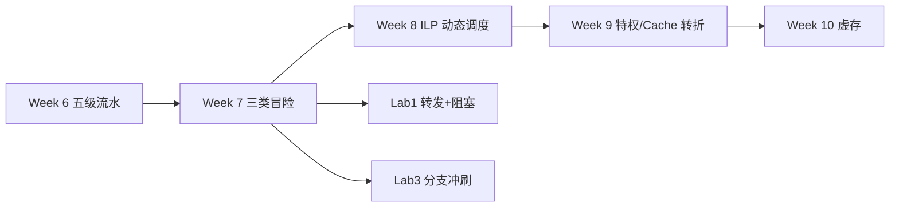
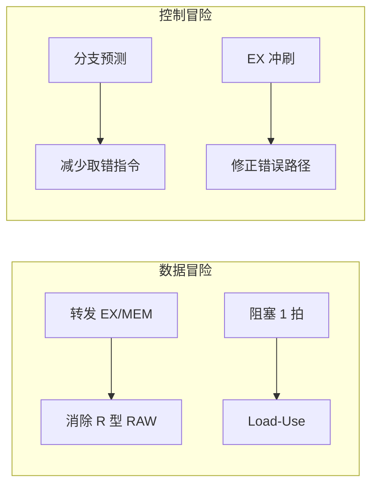
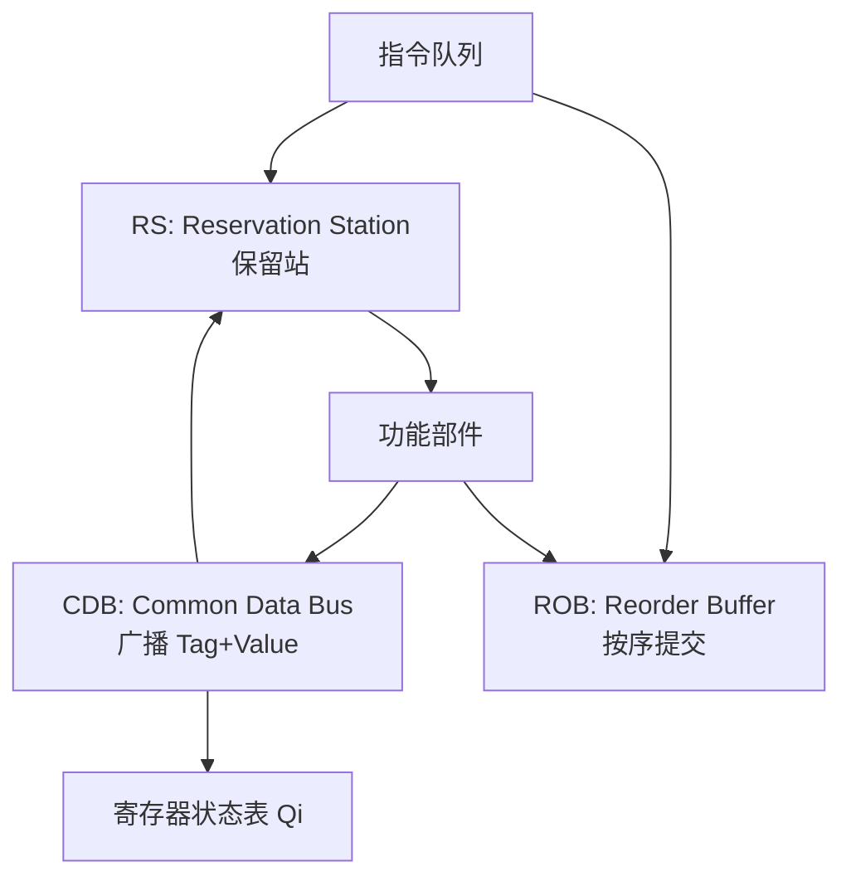

# Week 7–9 学习指南：流水线冒险 + ILP 动态调度

> **课程**：计算机组成与体系结构（H）
> **覆盖周次**：Week 7（流水线冒险）、Week 8（ILP/Scoreboard/Tomasulo）、Week 9（短周转折）
> **主要来源**：Week 7–9 课程记录、课件 06/5b、NotebookLM 分层问答
> **对应课件**：`6_指令流水线.pdf`、`5_指令级并行.pdf`、`7_层次结构存储系统.pdf`（Week 9 预告）
> **教材章节**：唐朔飞《计算机组成原理》第 2 版 **第 6、5 章（ILP）**；Patterson RISC-V 版 **第 4.6–4.8、5.1–5.3 章**
> **原始采集**：`notebooklm-raw/part3-week7-9/runs/20260616-151218/`（6 批）
> **知识图谱**：`notebooklm-raw/part3-week7-9/knowledge-graph.md`
> **整合日期**：2026-06-16（初版）；2026-06-24（二轮优化）
> **术语格式**：术语表及正文**首次出现**时，专业名词采用 **中文（English）**；英文缩写采用 **缩写（English full name，中文）**，便于对照英文课件、教材与开卷试题。

---

## 0. 术语表

| 术语 | 大白话 |
|------|--------|
| **冒险 (Hazard)** | 流水线里后续指令不能正确执行，必须停顿或补救 |
| **RAW / WAR / WAW** | 写后读（真相关）/ 读后写 / 写后写（后两者多为「假相关」） |
| **转发 (Forwarding)** | 结果还没写回寄存器，就从流水段寄存器旁路送到 ALU |
| **气泡 (Bubble)** | 插入空拍，相当于 NOP，用于阻塞或冲刷 |
| **ILP (Instruction-Level Parallelism)** | 指令级并行——多条指令重叠执行 |
| **保留站 RS (Reservation Station)** | 功能部件前的指令缓冲，等操作数就绪再发射 |
| **CDB (Common Data Bus)** | 公共数据总线，结果产生后广播给所有等待者 |
| **ROB (Reorder Buffer)** | 重排序缓冲区，乱序执行但按序提交 |
| **BHT (Branch History Table)** | 分支历史表，记录最近分支方向，常用 1 位或 2 位饱和计数器 |
| **BTB (Branch Target Buffer)** | 分支目标缓冲，取指阶段就预测跳转地址 |

### 高频缩写速查

| 缩写 | 解释 |
|------|------|
| **ILP** | Instruction-Level Parallelism，指令级并行 |
| **CPI / IPC** | Cycles Per Instruction / Instructions Per Cycle，每指令周期数 / 每周期指令数 |
| **RS** | Reservation Station，保留站 |
| **CDB** | Common Data Bus，公共数据总线 |
| **ROB** | Reorder Buffer，重排序缓冲区 |
| **BTB** | Branch Target Buffer，分支目标缓冲 |
| **BHT** | Branch History Table，分支历史表 |
| **CSR** | Control and Status Register，控制状态寄存器 |
| **IF / ID / EX / MEM / WB** | Instruction Fetch / Instruction Decode / Execute / Memory Access / Write Back，取指 / 译码或读寄存器 / 执行 / 访存 / 写回 |

---

## 1. 知识地图（L0）

### 1.1 这三周在学什么？

Week 1–3 已在 Lab 中搭好五级流水线骨架；Week 7 系统讲解**三类冒险**及**转发/阻塞/分支预测**等静态解法。Week 8 向上引入 **ILP 动态调度**——记分牌与 Tomasulo 算法、寄存器重命名、CDB 与 ROB。Week 9 为五一前短周，课程从「指令怎么跑快」转向**特权架构与存储层次**预告。（来源：L0-positioning、w9-short-week）

**期末笔试重心**：Week 8 明确后半学期（虚存/Cache/异常等）更适合笔试；流水线、记分牌、Tomasulo **主要通过 Lab1–3 考核**，但概念性推演（尤其 Tomasulo + ROB）仍可能出现在期末。（来源：L0-positioning、w79-mistakes）

**学完你能**：

1. 区分结构/数据/控制三类冒险并各举对策
2. 说明 Load-Use 为何不能仅靠转发，画出 1 拍阻塞时空图
3. 对比 Scoreboard 与 Tomasulo 对 WAR/WAW 的处理
4. 解释 CDB 与 ROB 在 Tomasulo 中的分工
5. 对照 Lab1/Lab3 说出转发 MUX 与 Flush 的触发条件

### 1.3 叙事线



### 1.4 课本与课件速查

| 指南节 | Week | 课件 | 唐朔飞（第 2 版） | P&H RISC-V |
|--------|------|------|-------------------|------------|
| §2.1 流水线冒险 | Week 7 | 课件 **06** 指令流水线 | **第 6 章** §6.2–6.4 冒险与转发 | **第 4 章** §4.6–4.7 流水线冒险 |
| §2.2 ILP 动态调度 | Week 8 | 课件 **5b** 指令级并行 | **第 5 章** ILP、动态调度 | **第 5 章** §5.1–5.3 动态调度 |
| §2.3 短周转折 | Week 9 | 课件 **07** 层次结构存储系统（预告） | **第 7 章** §7.1 存储层次 | **第 5 章** §5.1–5.2 Cache 入门 |
| §3 Lab1–3 | 实验 | `4_Lab/` + [26-Arch Wiki](https://github.com/26-Arch/26-Arch/wiki/) | — | **第 4 章** 流水线实现对照 |

---

## 2. 核心知识

### 2.1 流水线冒险（Week 7）

> **本节要回答**：三类冒险是什么？转发能解决什么？Load-Use 为何必须阻塞？

| 来源 | 位置 | 本节对应主题 |
|------|------|-------------|
| **课件 06** | 结构/数据/控制冒险、转发 | 时空图、加速比 |
| **唐朔飞** | **第 6 章** §6.2–6.4 | 冒险分类、阻塞与转发 |
| **P&H RISC-V** | **第 4 章** §4.6–4.7 | 数据冒险、分支预测 |
| **课程记录** | `week7-周一/周三-计组H.md` | Lab1 转发、分支预测 |

#### 2.1.1 先看问题：流水线为什么会“跑错”？

流水线把一条指令拆成 IF（Instruction Fetch，取指）、ID（Instruction Decode，译码/读寄存器）、EX（Execute，执行）、MEM（Memory Access，访存）、WB（Write Back，写回）五段，让多条指令重叠推进。理想情况下，m 段流水线吞吐加速比接近 $m$；但真实程序会共享硬件、共享寄存器数据、改变 PC（Program Counter，程序计数器），于是出现 **冒险（Hazard）**：如果硬件不处理，后续指令会拿到错误数据或沿错误路径执行。（来源：w7-pipeline-hazards）

**时空图** 横轴为时钟周期、纵轴为指令，用来观察每条指令在每个周期处于哪个流水段；它不是装饰图，而是判断“哪里插气泡、哪里冲刷”的主要工具。

| 冒险类型 | 成因 | 典型对策 |
|----------|------|----------|
| **结构冒险** | 多指令争用同一硬件（如单端口存储器） | 资源复制、停顿、哈佛架构 |
| **数据冒险** | 前后指令数据相关（RAW/WAR/WAW） | 转发为主；Load-Use 须阻塞 |
| **控制冒险** | 分支改变 PC，前端已取错误路径 | 冲刷、延迟槽、分支预测 |

> **边界说明：** 在五级顺序流水线里，最常见、最真实的数据冒险是 RAW（Read After Write，写后读）。WAR/WAW 往往在乱序或多发射机器中才成为关键问题，所以 Week 8 的 Tomasulo/ROB 会重新讨论它们。

#### 2.1.2 转发：结果没写回，也能先借给下一条用

**转发（Forwarding）** 要解决的问题是：前一条 ALU 指令的结果已经在 EX/MEM 或 MEM/WB 流水段寄存器里了，但还没到 WB 阶段写回寄存器堆；后一条指令如果在 EX 阶段才需要这个值，就可以直接从旁路 MUX 送入 ALU，不必等寄存器堆更新。

| RAW 场景 | 结果何时可用 | 是否能只靠转发 | 原因 |
|----------|--------------|----------------|------|
| `add` 后接使用结果的 `sub` | 前条 EX 末产生 ALU 结果 | 通常可以 | 后条到 EX 时，前条结果已在 EX/MEM 或 MEM/WB |
| `lw` 后接使用结果的 `add` | 前条 MEM 末才读出内存数据 | 不行，需 1 拍阻塞 | 后条原本下一拍 EX 就要数，但数据还没从内存出来 |

这里的 IF/ID、ID/EX、EX/MEM、MEM/WB 是相邻流水段寄存器名称，分别连接取指-译码、译码-执行、执行-访存、访存-写回阶段；图节点中的 EX/MEM 也按这个含义读。

#### 2.1.3 Load-Use 示例题：气泡插在哪里？

**题目场景**：五级流水线带 EX/MEM、MEM/WB 转发，但 load 数据在 MEM 末才有效。

**已知**：

```asm
lw  t0, 0(t1)
add t2, t0, t3
sub t4, t2, t5
```

**求**：`lw` 与 `add` 之间是否需要阻塞？若需要，时空图怎么填？

| 指令 / 周期 | C1 | C2 | C3 | C4 | C5 | C6 | C7 | C8 |
|-------------|----|----|----|----|----|----|----|----|
| `lw` | IF | ID | EX | MEM | WB |  |  |  |
| `add` |  | IF | ID | **Stall** | EX | MEM | WB |  |
| `sub` |  |  | IF | **Stall** | ID | EX | MEM | WB |

**步骤**：

1. `add` 在 EX 阶段需要 `t0`，而 `lw` 的 `t0` 到 MEM 末才产生。
2. 硬件冻结 PC 和 IF/ID，让 `add` 留在 ID；同时把 ID/EX 清成气泡。
3. 下一拍 `add` 进入 EX，此时可从 MEM/WB 转发 `lw` 的结果。
4. `sub` 依赖 `add` 的 ALU 结果，但 `add` 的结果在 EX 末已产生，后续可转发，不再额外阻塞。

**结果解释**：Load-Use 的核心不是“有 RAW 就停”，而是“消费者进入 EX 时，生产者的值是否已经产生”。ALU→ALU 常能转发，Load→Use 通常必须停 1 拍。

> **易错提醒：** 阻塞时不是把整条流水线清空，而是保持 PC/IF/ID，并向 ID/EX 注入一个 NOP 气泡；否则会丢指令或重复取错。

#### 2.1.4 控制冒险：Flush 与预测分别解决什么

分支指令要改变 PC，但真实方向和目标往往到 EX 才确定。此前 IF/ID 可能已经拿到错误路径指令，所以硬件需要 **Flush（冲刷）**：把错误路径指令变成 NOP，避免它们修改架构状态。分支预测则是另一条路线：在 IF 阶段先猜方向和目标，猜对就减少等待，猜错再冲刷。

| 策略 | 要点 |
|------|------|
| 静态预测 | 固定「总是跳」或「总是不跳」；循环中常预测跳转 |
| BHT（Branch History Table，分支历史表） | 记录历史方向；2 位饱和计数器要连续错两次才翻转 |
| BTB（Branch Target Buffer，分支目标缓冲） | 缓存分支 PC→目标地址，IF 阶段即可预测跳转目标 |

下面的图用于快速区分“数据冒险”和“控制冒险”的补救路径。EX/MEM、MEM/WB 是流水段寄存器名；Flush 表示冲刷错误路径，Stall 表示冻结等待。



> **读图提示：** 左半边先判 RAW 是否能转发，只有 Load-Use 这类值尚未产生的情况才插气泡；右半边先判 PC 是否走错，若分支预测错则 Flush 错误路径指令。

**Flush 示例题**：

| 项 | 内容 |
|----|------|
| **题目场景** | 分支在 EX 阶段决断，预测为不跳，但实际跳转 |
| **已知** | 分支进入 EX 时，后面两条顺序路径指令已在 IF/ID 附近 |
| **求** | 哪些指令需要冲刷，代价是什么 |
| **步骤** | EX 算出真实目标 → PC 改为目标地址 → IF/ID、ID/EX 中错误路径控制信号清零 |
| **结果解释** | 错误路径指令不再写寄存器/访存；代价是若干拍前端气泡 |

> **易错提醒：** Flush 是“清掉错误路径的副作用”，Stall 是“等正确数据/资源就绪”；两者控制信号相似但语义不同。

> **小结 → 下一节**：静态流水线解法（转发/阻塞/预测）有上限；Week 8 引入 **动态调度** 在运行时挖掘更多 ILP。

---

### 2.2 ILP 与动态调度（Week 8）

> **本节要回答**：为何双发射不能简单翻倍？Scoreboard 与 Tomasulo 差在哪？ROB 干什么？

| 来源 | 位置 | 本节对应主题 |
|------|------|-------------|
| **课件 5b** | 记分牌、Tomasulo、ROB | 保留站、CDB、乱序提交 |
| **唐朔飞** | **第 5 章** ILP 与动态调度 | 寄存器重命名、发射策略 |
| **P&H RISC-V** | **第 5 章** §5.1–5.3 | Tomasulo、推测执行 |
| **课程记录** | `week8-周一/周二/周三-计组H.md` | 期末范围说明、双发射 |

#### 2.2.1 先看问题：为什么多发射不能直接把 IPC 翻倍？

**ILP（Instruction-Level Parallelism，指令级并行）** 追求同一线程内多条指令并行推进。直觉上，双发射好像能让 IPC（Instructions Per Cycle，每周期指令数）翻倍；但实际会遇到三重限制：硬件资源是否够、两条指令类型能否配对、数据相关是否允许同时执行。（来源：w8-ilp-scheduling）

| 限制 | 例子 | 后果 |
|------|------|------|
| 资源限制 | 只有一个乘法器或寄存器写口 | 即使指令独立也不能同拍执行 |
| 配对限制 | 机器规定每拍只能 ALU + Load/Store | 两条 ALU 可能不能同拍发射 |
| 相关限制 | 后条读前条结果 | RAW 必须等待，不能靠发射宽度解决 |

> **直观理解：** 双发射像两个收银窗口，不等于结账速度一定翻倍；如果顾客都等同一台刷卡机、同一个商品扫码结果，窗口再多也会排队。

#### 2.2.2 Scoreboard：集中记账，冲突就等

**记分牌（Scoreboard）** 用一张集中状态表记录功能部件是否忙、哪个寄存器将被写、操作数是否就绪。它的优点是结构直观；缺点是遇到 WAR/WAW 这类名字冲突时，通常靠阻塞保守处理。

| 机制 | 控制方式 | 对 WAR/WAW | 核心组件 |
|------|----------|------------|----------|
| **记分牌 (Scoreboard)** | 集中式 | 遇冲突则**阻塞** | 功能部件状态表 |
| **Tomasulo** | 分布式 | **寄存器换名**消除假相关 | 保留站 + CDB |

#### 2.2.3 Tomasulo：用 Tag 等结果，用 CDB 广播结果

**Tomasulo 算法** 的关键不是“更复杂的转发”，而是把等待对象从“寄存器名”改成“产生该值的保留站 Tag”。保留站 RS（Reservation Station，保留站）保存操作码、已就绪操作数 Vj/Vk、未就绪操作数来源 Qj/Qk；CDB（Common Data Bus，公共数据总线）在结果产生后广播 Tag+Value，所有等待该 Tag 的 RS 同时捕获。

**寄存器重命名直觉**：逻辑寄存器名只是“储物柜编号”。WAR/WAW 是争用同一编号造成的**假相关**；Tomasulo 用 RS Tag 表示“最新值将由谁产生”，从而只保留真正的数据流 RAW。（来源：w8-ilp-scheduling）



> **读图提示：** 指令发射后先进 RS 等操作数；功能部件完成后不只写某个寄存器，而是通过 CDB 广播“哪个 Tag 的结果好了”。ROB 另管提交顺序，避免乱序结果过早改架构状态。

#### 2.2.4 ROB：乱序执行可以，提交必须按序

**ROB（Reorder Buffer，重排序缓冲区）** 要解决的是精确异常和推测回滚：功能部件可以乱序完成，但只有 ROB 队首指令确认无异常后，才把结果提交到架构寄存器或内存。这样一旦发生异常，机器状态看起来就像“顺序执行到出错指令之前”。

| 阶段 | Tomasulo/ROB 要检查什么 |
|------|--------------------------|
| 发射 | RS 是否空闲；ROB 是否有项；目的寄存器 Qi 指向新 Tag |
| 执行 | Qj/Qk 是否为 0；功能部件是否空闲 |
| 写回 | CDB 是否空闲；广播 Tag+Value，更新等待者 |
| 提交 | ROB 队首是否完成；是否有异常；按序写架构状态 |

**示例题：同写 F0 的 MUL/ADD**

| 项 | 内容 |
|----|------|
| **题目场景** | `MUL.D F0,F2,F4` 后接 `ADD.D F0,F0,F6`，两条都写 F0 |
| **已知** | 乘法先发射，ADD 后发射；ADD 的源 F0 应读乘法结果 |
| **求** | Qi、Qj/Qk 如何填，WAW 是否会错写 |
| **步骤** | 乘法发射时 Qi[F0]=Mult1；ADD 发射时读取 F0 发现 Qi[F0]=Mult1，因此 Add1.Qj=Mult1，同时 Qi[F0] 改为 Add1 |
| **结果解释** | ADD 等待乘法结果，保留 RAW；最终 F0 对外应由后发射的 ADD 写，消除 WAW |

> **易错提醒：** Qi 是寄存器状态表里的“谁将写这个寄存器”；Qj/Qk 是某个 RS 里“我还在等谁的操作数”。两者不在同一张表，别把 Qi[F0]=Add1 误写成 Add1.Qj=Add1。

> **小结 → 下一节**：ILP 在单核内挖潜有天花板；Week 9 短周把视角转向 **特权架构与存储层次**——为虚存与 Cache 铺路。

---

### 2.3 Week 9 短周转折

> **本节要回答**：为何从 CPU 执行转向特权与存储？

| 来源 | 位置 | 本节对应主题 |
|------|------|-------------|
| **课件 07** | 存储层次、Cache 映射预告 | 存储墙、直接映射 |
| **唐朔飞** | **第 7 章** §7.1–7.2 | 层次结构、Cache 原理 |
| **P&H RISC-V** | **第 5 章** §5.1–5.2 | Cache 基础 |
| **课程记录** | `week9-周一/周二-计组H.md` | 特权动机、Lab4 预告 |

五一前短周、荣誉班无期中。课程引入**特权架构**三大动机：高效处理外部输入、支持多任务 OS、内存隔离与虚存映射。同时以 **Cache 替换策略**（直接映射、组相联）量化分析，点出处理器与主存的速度鸿沟，为 Week 10 虚存与 Week 12 Cache 铺路。Lab 进度预告：Lab4（CSR）→ Lab6（中断/特权）。（来源：w9-short-week）

> **小结 → 下一节**：Week 10 从 **虚拟地址空间** 入手，解决容量与隔离；后半学期笔试重心自此展开。

---

## 3. Lab1–3 与课堂对照

| 来源 | 位置 | 说明 |
|------|------|------|
| **Lab Wiki** | [26-Arch Wiki](https://github.com/26-Arch/26-Arch/wiki/) Lab-1 ~ Lab-3 | 转发、冲刷、握手 |
| **课件** | `4_Lab/Lab1–3*.pdf` | 实验讲义 |
| **个人报告** | `26-Arch/Doc/Lab{1..3}/report.md` | 实现要点 |

| 模块 | Lab 实现要点 | 课堂/考点对应 |
|------|-------------|---------------|
| **Lab1 数据冒险** | EX/MEM、MEM/WB 旁路 MUX | Week 7 转发，消除 R 型 RAW |
| **Lab1 Load-Use** | ID 检测 EX 段 Load 冲突；PC/IF/ID 保持，ID/EX 清零 | Week 7 阻塞插气泡 |
| **Lab2 访存** | mem_wait 握手、结构冒险 | 存储器端口争用 |
| **Lab3 控制冒险** | 分支 EX 决断；改 PC + 冲刷 ID/EX 等 | Week 7 控制冒险、延迟损失 |

本节只保留 Lab1–3 与课堂概念的轻量对照；完整实验实现、代码路径和调试方法见 [`计组-Lab1-6-整合指南.md`](计组-Lab1-6-整合指南.md)。

**Lab3 分支因果链**：`beq`/`bne` 到 EX 才确定跳转 → 前端已预取 2–3 条错误指令 → 必须 **Flush** 保证架构状态正确。（来源：lab-pipeline-crossref）

---

## 4. 易混淆概念

| 对比组 | 正确理解 |
|--------|----------|
| RAW vs WAR/WAW | RAW 是真数据流，必须保序；WAR/WAW 多为同名假相关 |
| Scoreboard vs Tomasulo | 前者集中阻塞；后者 RS+换名，可乱序消除假相关 |
| 静态 vs 动态分支预测 | 前者不记历史；后者 BHT/BTB，准确率更高 |
| 精确 vs 不精确异常 | 精确：现场等同顺序执行到该指令；乱序无 ROB 则不精确 |
| RS vs ROB | RS 管发射与等操作数；ROB 管按序提交与异常回滚 |

（来源：w79-mistakes）

---

## 5. 与前后模块衔接

- **前接**：Week 1–3 单周期/ISA + Lab1–3 五级流水实践
- **期中复习外延**（非本周核心）：IEEE 754、中断协作、阿姆达尔定律、循环展开（来源：L0-positioning）
- **后接**：Week 10 虚存/页表；Week 12 Cache；Lab4 CSR → Lab6 页错误与特权

---

## 6. 自检问题

读完本章你应能：

1. 区分结构/数据/控制三类冒险，并说明 Stall 与 Flush 的不同语义
2. 对 `lw` 后接消费者的指令序列画出 1 拍阻塞时空图
3. 判断 ALU→ALU RAW 何时可由 EX/MEM 或 MEM/WB 转发解决
4. 对比 Scoreboard 与 Tomasulo 对 WAR/WAW 的处理
5. 填写 Tomasulo 中 Qi 与 RS 的 Qj/Qk，并解释 CDB 与 ROB 的分工
6. 对照 Lab1/Lab3 说出转发 MUX 与 Flush 的触发条件

---

## 7. 追问块

> **追问 1**：给定 `lw t0,0(t1)` 紧跟 `add t2,t0,t3`，转发能否消除冒险？硬件应做什么？
>
> **答**：不能仅靠转发。`lw` 数据在 MEM 末才就绪，下一条 `add` 在 EX 就要 `t0`——须 **阻塞 1 拍**（保持 PC/IF/ID，ID/EX 插气泡），之后可从 MEM/WB 转发。

> **追问 2**：Tomasulo 中一条乘法结果上 CDB 时，哪些保留站会同时更新？为何仍需 ROB？
>
> **答**：所有 Qj 或 Qk 指向该乘法 RS 的保留站会**同时**捕获结果。ROB 保证**按序提交**与**精确异常**——乱序执行的结果不能随意写回架构寄存器/内存。

> **追问 3**：Lab3 若在 MEM 而非 EX 判定分支，控制冒险代价如何变化？
>
> **答**：错误路径多预取 **1–2 条**指令（EX→MEM 才决断），冲刷范围更大、分支惩罚更高；但 ALU 比较结果若依赖访存则 MEM 决断有时更合理——trade-off 是指令语义与前端带宽。

---

## 8. 资料索引

| 类型 | 文件 / 路径 | 说明 |
|------|-------------|------|
| 课程记录 | `week7-周一/周三-计组H.md` | Week 7 流水线冒险 |
| 课程记录 | `week8-周一/周二/周三-计组H.md` | Week 8 ILP/Tomasulo |
| 课程记录 | `week9-周一/周二-计组H.md` | Week 9 短周转折 |
| 课件 | `3_课件/6_指令流水线.pdf` | 冒险、转发、预测 |
| 课件 | `3_课件/5_指令级并行.pdf` | 记分牌、Tomasulo |
| 课件 | `3_课件/7_层次结构存储系统.pdf` | Week 9 Cache 预告 |
| 教材 | 唐朔飞第 2 版 | **第 6 章** 流水线；**第 5 章** ILP |
| 教材 | Patterson RISC-V 版 | **第 4 章** §4.6–4.8；**第 5 章** §5.1–5.3 |
| 实验 | `4_Lab/`、`26-Arch/Doc/Lab{1..3}/` | Lab1–3 |
| 知识图谱 | `notebooklm-raw/part3-week7-9/knowledge-graph.md` | 整合前置 |
| 原始问答 | `notebooklm-raw/part3-week7-9/runs/latest/*.answer.md` | 6 批 raw |
| 周次索引 | `guides/计组课程-16周内容梳理.md` | 课纲对照 |
