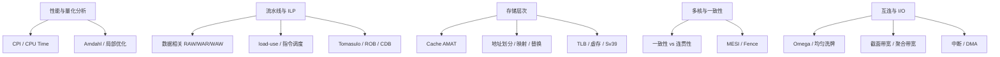

# 计组作业答案考点整理

> **课程**：计算机组成与体系结构（H）
> **直接来源**：`guides/原始作业withAnswer.md`（四次作业：性能分析、流水线/动态调度、Cache/TLB、互连网络）
> **辅助对照**：`guides/计组课程-16周内容梳理.md`、`guides/计组-Week16-学习指南.md`、`guides/计组-课件梳理索引.md`
> **重点口径**：期末开卷偏体系结构题；方法和推理过程比单个数值更重要。

---

## 0. 来源与覆盖范围

### 0.1 找到的作业答案资料

| 来源 | 覆盖内容 | 对应课程模块 | 备注 |
|------|----------|--------------|------|
| `guides/原始作业withAnswer.md` 作业一 | CPI/执行时间、替换优化、Amdahl 定律、局部优化比例 | 性能公式、CPU/数据通路前置 | 直接作业答案主源 |
| `guides/原始作业withAnswer.md` 作业二 | 数据相关、寄存器重命名、load-use、双发射 Tomasulo + ROB 时序 | 流水线、ILP、Tomasulo/ROB | 题目 3 是最长的过程推演题 |
| `guides/原始作业withAnswer.md` 作业三 | AMAT、CPU 时间、Cache 地址划分、FIFO、TLB 位域、LRU 替换 | Cache、虚拟存储、TLB | 与 Week10-12/课件 07b 高度重合 |
| `guides/原始作业withAnswer.md` 作业四 | Omega/均匀洗牌、多级互连冲突、截面带宽、聚合带宽 | 互连网络、多处理器扩展性 | 与课件 7a/Week16 互连补充对照 |
| `notebooklm-raw/part8-week16/runs/20260619-171058/*.answer.md` | Tomasulo、AMAT/LFU、TLB Reach、MESI/Fence、互连/DMA | 期末高频题型 | 用于校准“哪些最可能考” |
| `guides/计组-Week10-11/12/13-14/15/16-学习指南.md` | Sv39/SATP/SFENCE、Cache、MESI、I/O/DMA、期末复习 | 周次与 Lab 对照 | 用于补课件/周次/实验来源 |
| `guides/计组-课件梳理索引.md` | 12 章课件与 Week/Lab 映射 | 课件轨索引 | 用于定位课件编号 |

### 0.2 覆盖边界

本整理以“作业带答案”为主，优先归纳作业中实际出现的题型。期末高频但未在四次作业中直接出现的内容，如 **MESI 状态迁移、Sv39 三级页表、SFENCE.VMA、DMA/中断完整流程**，在 Week16/Week10-15 指南中补入，标为“期末补强”。

---

## 1. 知识模块地图（从大到小）

### 1.1 全局地图



### 1.2 模块拆解表

| 顶层模块 | 中层知识点 | 细颗粒技能点 | 对应作业/答案 | 对应课件/周次/指南 |
|----------|------------|--------------|---------------|--------------------|
| 性能与量化分析 | CPU 性能公式 | 加权 CPI；`CPU Time = IC × CPI / Frequency`；比较不同机器/编译器 | 作业一题 1 | Week6；课件 05；`计组课程-16周内容梳理.md` Week6 |
| 性能与量化分析 | 指令替换优化 | 用执行时间差换算周期差；再除以单条指令 CPI 差 | 作业一题 2 | Week6；课件 05 |
| 性能与量化分析 | Amdahl 定律 | 分清“原时间占比”和“优化后占比”；局部加速可能被其他部分拖回 | 作业一题 3、4；Week15 复习优先级 | Week15/16；性能公式高频 |
| 数据表示/运算 | 浮点与整数背景 | 浮点单元加速、乘除单元优化、补码/IEEE 754 作为中频补充 | 作业一题 3、4；Week15 中频补充 | 课件 02、03；Week4-6 |
| 指令系统 | ISA 与编译器影响 | 相同 IC 下，不同指令比例改变加权 CPI；CISC/RISC 作概念题背景 | 作业一题 1 | 课件 04；Week3 |
| CPU/数据通路 | 单周期/多周期性能 | 关键路径、CPI、周期时间三者不可混用 | 作业一题 1、2 | 课件 05；Week2/6 |
| 流水线/ILP | 数据相关分类 | RAW 真相关不可消；WAR/WAW 可由重命名消除 | 作业二题 1；Week16 Tomasulo | 课件 5b、06；Week7-9/16 |
| 流水线/ILP | load-use 冒险 | 编译器调度/插 NOP；硬件检测 `ID/EX.MemRead` 且目标寄存器命中 `IF/ID` 源寄存器 | 作业二题 2 | 课件 06；Week7；Lab1-3 |
| 流水线/ILP | 指令调度 | 在 load 与 use 之间插入无关 load/计算，减少停顿；保持依赖与内存语义 | 作业二题 2 | 课件 06；Week7 |
| 流水线/ILP | Tomasulo | RS 字段 `Vj/Vk/Qj/Qk`；Qi 指向最新写者；RAW 等待 CDB；CDB 单写冲突 | 作业二题 3；Week16 `w16-tomasulo` | 课件 5b；Week8-9/16 |
| 流水线/ILP | ROB/硬件推测 | 双发射、按序提交、store 提交访存、分支采纳、功能单元非流水 | 作业二题 3 | 课件 5b；Week16 |
| 存储层次/Cache | AMAT 与 CPU 时间 | `AMAT = HitTime + MissRate × MissPenalty`；CPU 时间要把访存次数乘进去 | 作业三题 1；Week16 `w16-cache-amat` | 课件 07b；Week12/16 |
| 存储层次/Cache | Cache 地址划分 | Offset 位数 = `log2(block size)`；Index 位数看行数/组数；Tag 为剩余高位 | 作业三题 2 | 课件 07b；Week12 |
| 存储层次/Cache | 替换与访问序列 | 顺序访问先算总请求，再按块大小算冷缺失；FIFO/LRU/LFU 状态逐步更新 | 作业三题 2；Week16 LFU | 课件 07b；Week12/16 |
| 虚存/TLB | TLB 位域 | 页内偏移由页大小决定；VPN 再拆 TLB 组号与标志位 | 作业三题 2 | 课件 07b；Week10-11 |
| 虚存/TLB | TLB 替换 | 组号 = VPN mod 组数；每组独立维护 LRU | 作业三题 2 | 课件 07b；Week10-11 |
| 虚存/TLB | Sv39/SATP/SFENCE | VA 拆 VPN[2:0]+offset；satp Mode/ASID/PPN；SFENCE 四种范围 | Week10-11 指南；Week16 补强 | 课件 07b；Lab4-6 |
| 多核一致性 | 一致性 vs 连贯性 | 同一地址副本值 vs 不同地址全局可见顺序 | Week12/13-14/16 指南 | 课件 08；Week12-14/16 |
| 多核一致性 | MESI/Fence | M/E/S/I 状态含义；自旋锁加锁后/解锁前 Fence；AMO/LR-SC 原子性 | Week13-14/16 指南 | 课件 08；Week13-14 |
| 互连网络 | Omega/均匀洗牌 | 二进制源/目的；每级 shuffle；按目的位决定直连/交换；判断端口冲突 | 作业四题 1 | 课件 7a；Week16 |
| 互连网络 | 网络带宽 | 截面带宽、聚合带宽；总线不可扩展 vs 2D 环/网格可扩展 | 作业四题 2；Week16 互连参数 | 课件 7a；Week16 |
| I/O/中断/DMA | 中断流程 | 关-开-关-开；保存/恢复现场；支持嵌套时机 | Week16 `w16-interconnect-dma` | Week15-16；课件 I/O 补充 |
| I/O/中断/DMA | DMA | CPU 初始化、DMA 直传主存、完成中断；周期挪用导致 CPU 有效 CPI 变差 | Week16 `w16-interconnect-dma` | Week15-16 |
| 向量/复习 | SIMD/向量/GPU | 作业中未直接覆盖；作为期末低-中频补充 | 课件指南补充 | 课件 10；Week15-16 |

---

## 2. 考查题型与方法重点

### 2.1 题型总览

| 题型 | 常见问法 | 解题步骤 | 易错点 | 对应模块 | 代表来源 |
|------|----------|----------|--------|----------|----------|
| 概念辨析 | “一致性 vs 连贯性”“WAR/WAW/RAW 哪些可消除” | 先写定义边界，再给最小例子 | 把同地址一致性和不同地址顺序混为一谈 | 流水线、MESI、存储模型 | 作业二题 1；Week16 §5 |
| 选择/判断 | “哪种优化更快”“哪种 Cache 更优” | 用公式量化，不凭直觉 | 只看频率/命中率，不看 CPI/周期/缺失损失 | 性能、Cache | 作业一题 1；作业三题 1 |
| 手算题 | CPI、Amdahl、AMAT、TLB 位数、带宽 | 写公式 → 代入 → 单位检查 → 比较 | 百分比、ns/GHz、KiB/KB 混用 | 性能、Cache、TLB、互连 | 作业一、三、四题 2 |
| 流程/时序表 | Tomasulo 每条指令发射/执行/写 CDB/提交 | 建资源表和依赖表；逐周期推进；记录暂停原因 | 忽略 CDB 单写、非流水功能单元、按序提交 | Tomasulo/ROB | 作业二题 3 |
| 状态机推演 | MESI 状态迁移、load-use 检测、MMU FSM | 明确事件输入，再更新状态 | 把 E/M 混淆；忘记 BusUpgr/Invalidate | MESI、流水线、Sv39 | Week13-14；作业二题 2 |
| 地址划分/映射 | Cache Tag/Index/Offset；TLB tag/set/PPN | 先算块/页 offset，再算行数/组数，最后剩余为 tag | 全相联无 Index；组相联 Index 看“组数”不是“行数” | Cache/TLB | 作业三题 2 |
| 替换序列模拟 | FIFO/LRU/LFU 命中缺失与淘汰项 | 逐次列每组内容；命中更新策略；缺失再替换 | LRU 是组内独立；LFU 平频再按 LRU | Cache/TLB | 作业三题 2；Week16 LFU |
| 性能公式 | CPU Time、Amdahl、AMAT、带宽 | 分母分子先统一单位；区分原始占比与优化后占比 | 把优化后比例当原比例；忘记 clock 变慢 | 性能、Cache、互连 | 作业一；作业三题 1；作业四题 2 |
| 开放解释题 | “为什么总线不可扩展”“为什么 DMA 需要中断配合” | 先给机制，再给瓶颈/权衡，再给场景 | 只背定义，不说明 trade-off | 互连、I/O、多核 | 作业四题 2；Week16 DMA |
| 实验/Lab 关联题 | “SFENCE 为什么要 flush”“trap 为何 WB 处理” | 把课堂机制映射到 Lab 实现点 | 只写 Lab 现象，不解释体系结构原因 | Sv39、异常、中断 | Week10-12/15 指南 |

### 2.2 期末高频专项

| 高频专项 | 作业是否覆盖 | 需要掌握到什么程度 | 对照来源 |
|----------|--------------|--------------------|----------|
| Cache/AMAT | 强覆盖 | 会比较直接映射/组相联的 AMAT 与 CPU 时间；会拆 Tag/Index/Offset；会模拟替换 | 作业三题 1-2；Week12/16 |
| Sv39/TLB/SFENCE | 作业覆盖 TLB，Sv39/SFENCE 需补强 | 会拆 VA/PTE/TLB 位域；会解释 TLB miss vs Page Fault；会列 SFENCE 四种范围 | 作业三题 2；Week10-11/16 |
| Tomasulo/ROB | 强覆盖 | 会填时序表；会说明 RAW、结构冒险、CDB 冲突、按序提交 | 作业二题 3；Week16 |
| MESI/一致性 vs 连贯性 | 作业未直接覆盖，期末高频 | 会写 M/E/S/I 含义；会解释 Fence 与原子操作；会区分 coherence/consistency | Week13-14/16 |
| DMA/中断 | 作业未直接覆盖，Week16 点名 | 会写 DMA 流程、周期挪用、完成中断；会写中断“关-开-关-开” | Week15/16 |
| 流水线冒险 | 中强覆盖 | 会识别 load-use；会写硬件检测条件；会做指令调度 | 作业二题 2；Week7/15 |
| 互连网络 | 强覆盖 | 会做 Omega 路由冲突；会算截面/聚合带宽并解释扩展性 | 作业四题 1-2；Week16 |

---

## 3. 高频题型解题模板

### 3.1 CPI / CPU Time / 编译器比例

1. 算加权 CPI：`CPI_avg = Σ(比例_i × CPI_i)`。
2. 执行时间：`T = IC × CPI_avg / f`。
3. 若指令总数相同，只比较 `CPI_avg / f`。
4. 写结论时说明“频率高不一定快，取决于 CPI 与编译器指令比例”。

代表题：作业一题 1。

### 3.2 指令替换优化

1. 先由加速比反推新执行时间。
2. 时间差乘频率得到节省周期数。
3. 节省周期数除以单次替换节省的 CPI。

代表题：作业一题 2。

### 3.3 Amdahl 定律

1. 设原执行时间为 1 或 `t`。
2. 未优化部分保留原比例。
3. 优化部分除以加速倍数；若有变慢部分，乘以变慢倍数。
4. 新加速比 `S = T_old / T_new`。
5. 若问优化后占比，用“优化后的该部分时间 / 新总时间”，不要沿用原占比。

代表题：作业一题 3、4。

### 3.4 load-use 与指令调度

硬件检测模板：

```text
if ID/EX.MemRead
and ID/EX.RegisterRt == IF/ID.RegisterRs or IF/ID.RegisterRt
then stall one cycle
```

调度模板：

1. 找 `lw` 后紧邻使用该寄存器的指令。
2. 在两者之间插入不相关指令。
3. 确认 store、分支、异常语义未改变。

代表题：作业二题 2。

### 3.5 Tomasulo / ROB 时序表

1. 列资源：发射宽度、功能单元数量、功能单元是否流水、CDB 数量、提交宽度。
2. 列依赖：RAW 必等；WAR/WAW 由重命名/ROB 消除。
3. 逐周期推进：
   - Issue：按发射宽度与分支限制。
   - Execute：操作数就绪且功能单元空闲。
   - Memory：load 访存，store 通常到提交阶段访问内存。
   - Write CDB：同周期只能一条则按到达顺序。
   - Commit：ROB 按序提交，不能越过未完成老指令。
4. 暂停原因要写具体：RAW、结构冒险、CDB 冲突、ROB/提交阻塞。

代表题：作业二题 3；Week16 Tomasulo。

### 3.6 Cache AMAT / CPU 时间

1. AMAT：`HitTime + MissRate × MissPenalty`。
2. CPU 时间若题目给“每条指令平均访存次数”，要写：
   `CPU time = base_cycles × cycle_time + IC × memory_accesses_per_inst × miss_rate × miss_penalty`。
3. 若组相联让周期变长，要把新的 hit time / clock cycle 纳入。

代表题：作业三题 1。

### 3.7 Cache / TLB 地址划分

Cache：

1. `offset = log2(block_size)`。
2. 直接映射：`index = log2(cache_size / block_size)`。
3. N 路组相联：`index = log2(cache_lines / N)`。
4. 全相联：无 Index，剩余高位全是 Tag。

TLB：

1. `page_offset = log2(page_size)`。
2. `VPN = VA_bits - page_offset`。
3. `set_index = log2(TLB_entries / associativity)`。
4. `TLB_tag = VPN_bits - set_index`。
5. `PPN = PA_bits - page_offset`。

代表题：作业三题 2。

### 3.8 替换序列模拟

1. 先确定映射组：`block_number mod set_count` 或 `VPN mod set_count`。
2. 命中：更新 LRU/LFU 状态。
3. 缺失：若有空位则填入；无空位按 FIFO/LRU/LFU 选牺牲项。
4. 每个组独立维护队列，不能跨组替换。

代表题：作业三题 2；Week16 LFU。

### 3.9 Omega / 多级互连冲突

1. 把源端、目的端写成二进制。
2. 每一级做均匀洗牌 `σ`。
3. 按目标位决定开关直连/交换。
4. 同时连接时，检查同一级同一开关的同一输出端口是否被争抢。

代表题：作业四题 1。

### 3.10 截面带宽 / 聚合带宽

1. 截面带宽：把网络尽量均分成两半，数跨切口链路条数 × 单链路带宽。
2. 聚合带宽：全网同时可用链路的总吞吐；无向链路注意除以 2。
3. 扩展性解释：总线带宽不随节点数增长；Mesh/环网链路数随节点数增长，但平均跳数也增加。

代表题：作业四题 2；Week16 互连参数。

---

## 4. 易错点与二轮复习建议

### 4.1 作业答案中需要复核的细节

| 位置 | 现象 | 建议处理 |
|------|------|----------|
| 作业一题 4 解答 | b 方案表达式写成 `35%+15%`，但题意应是乘法 `30%` + 除法 `15%`，后续方程使用 `0.45` 是合理口径 | 复习时按受影响比例 `45%` 计算 |
| 作业三题 2 解答 | TLB LRU 第 5 步“组 6 填入 [11,19]”应为组 3 的命中状态更新 | 复习时按 VPN mod 8 的组号独立维护 |

### 4.2 高频易错点

| 易错点 | 正确口径 | 复习动作 |
|--------|----------|----------|
| 频率高就一定快 | 比较 `CPI / f` 或完整 CPU Time | 作业一题 1 重做一遍 |
| Amdahl 用错比例 | 原比例用于算新时间；新占比要用新总时间作分母 | 作业一题 3、4 对照 |
| RAW/WAR/WAW 混淆 | RAW 是真数据流；WAR/WAW 是名字冲突，可重命名消除 | 作业二题 1 + Week16 Tomasulo |
| Tomasulo 忘记 CDB 冲突 | CDB 单写会顺延写回，影响依赖指令启动 | 作业二题 3 只复盘最终表即可 |
| load-use 调度破坏语义 | 只能移动无关指令，不能越过相关 store/branch 改变结果 | 作业二题 2 |
| Cache 组相联 Index 算错 | Index 看组数，不看总行数 | 作业三题 2 |
| AMAT 与 CPU 时间混用 | AMAT 是平均访存时间；CPU 时间还要乘访存次数/指令数 | 作业三题 1 |
| TLB miss 当 Page Fault | TLB miss 可继续 page walk；Page Fault 是页/权限异常 | Week10-11 |
| 一致性与连贯性混用 | 一致性管同一地址，连贯性管不同地址顺序 | Week12-16 |
| E/M 状态混淆 | E 独占干净；M 独占脏，替换时需写回 | Week13-14 |
| DMA 与中断割裂 | DMA 完成通常用中断通知 CPU，周期挪用会拖慢 CPU | Week16 |

### 4.3 二轮复习顺序

1. **先刷作业三**：Cache/TLB 是最像期末量化题的模块。
2. **再刷作业二题 3**：只看最终时序表与暂停原因，掌握推演法，不必背长过程。
3. **补 Week16 五大板块**：Tomasulo、Cache/TLB、MESI/Fence、互连、中断/DMA。
4. **回看 Lab4-6**：SATP、Sv39、Trap、SFENCE、异常/中断是开卷题的实验支点。
5. **最后刷作业一/四**：性能公式与互连带宽适合快速拿分。

---

## 5. 与课件/周次指南对照

| 作业/题目 | 主要考点 | 课件 | 周次指南 | Lab/实验关联 |
|-----------|----------|------|----------|--------------|
| 作业一题 1 | 加权 CPI、执行时间、编译器指令比例 | 课件 05；课件 04 背景 | Week3、Week6 | — |
| 作业一题 2 | 指令替换、周期差、CPI 差 | 课件 05 | Week6 | — |
| 作业一题 3 | Amdahl、局部加速与副作用 | 课件 03/05 | Week4-6；Week15 复习 | — |
| 作业一题 4 | Amdahl 反推局部加速倍数 | 课件 03/05 | Week15/16 复习 | — |
| 作业二题 1 | RAW/WAR/WAW、重命名 | 课件 5b | Week8-9；Week16 | — |
| 作业二题 2 | load-use、硬件检测、编译器调度 | 课件 06 | Week7-9 | Lab1-3 流水线 |
| 作业二题 3 | 双发射 Tomasulo、ROB、CDB、按序提交 | 课件 5b | Week8-9；Week16 | — |
| 作业三题 1 | AMAT、缺失率、CPU 时间 | 课件 07b | Week12；Week16 | Lab2 访存背景 |
| 作业三题 2 | Cache 地址划分、FIFO、TLB 位域、LRU | 课件 07b | Week10-12；Week16 | Lab5 MMU/TLB 背景 |
| 作业四题 1 | Omega 网络、均匀洗牌、冲突 | 课件 7a | Week16 | — |
| 作业四题 2 | 截面带宽、聚合带宽、可扩展性 | 课件 7a | Week16 | — |
| 期末补强 | Sv39、SATP、SFENCE.VMA | 课件 07b | Week10-11；Week16 | Lab4-6 |
| 期末补强 | MESI、Fence、AMO/LR-SC | 课件 08 | Week13-14；Week16 | — |
| 期末补强 | 中断、DMA、周期挪用 | I/O 复习；课件 10 辅助 | Week15-16 | Lab6 中断/异常 |

### 5.1 开卷索引建议

| 现场遇到的问题 | 先查 | 再查 |
|----------------|------|------|
| 算 CPI / Amdahl | 本文件 §3.1-3.3 | `guides/原始作业withAnswer.md` 作业一 |
| 填 Tomasulo 表 | 本文件 §3.5 | `guides/计组-Week16-学习指南.md` §2；原始作业作业二题 3 |
| 算 AMAT / Cache 位域 | 本文件 §3.6-3.8 | `guides/计组-Week12-学习指南.md`；原始作业作业三 |
| 算 TLB/Sv39 | 本文件 §3.7 | `guides/计组-Week10-11-学习指南.md` |
| 解释 MESI/Fence | 本文件 §2.2、§4.2 | `guides/计组-Week13-14-学习指南.md`；`guides/计组-Week16-学习指南.md` |
| 算互连带宽 | 本文件 §3.9-3.10 | 原始作业作业四；`guides/计组-课件07a-学习指南.md` |
| 写 DMA/中断流程 | 本文件 §2.2、§4.2 | `guides/计组-Week16-学习指南.md` §6 |

---

*本整理优先服务期末开卷：先用题型模板定位方法，再回原始作业答案核数值过程。*
