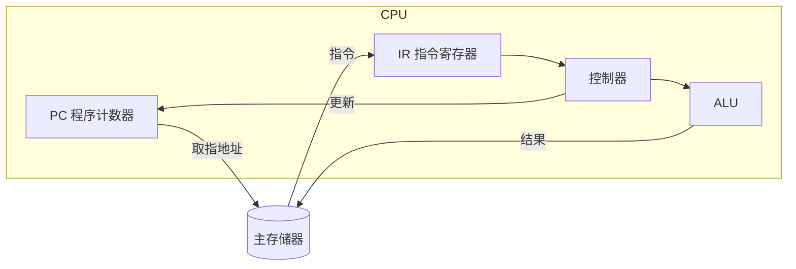
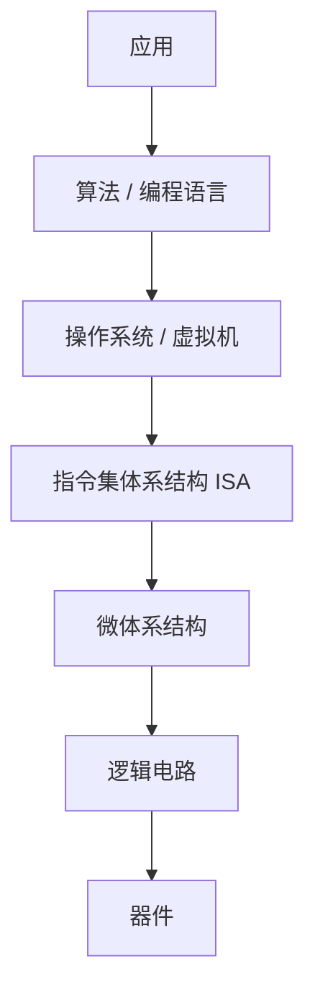

# 课件 01 — 计算机系统概述 学习指南

> **课程**：计算机组成与体系结构（H）
> **课件**：`1_计算机系统概述.pdf`｜NotebookLM `课件01-计算机系统概述`
> **原则**：按课件原序、按知识点分块、**课件板块无遗漏**
> **课堂**：Week 1（冯·诺依曼、层次结构、性能公式）；Part D 在 Week 4 深化；Part C 在 Week 10 回顾
> **Lab**：Lab1（系统观与数据通路背景）
> **教材章节**：唐朔飞《计算机组成原理》第 2 版 **第 1 章**；Patterson RISC-V 版 **第 1 章**
> **周次指南交叉引用**：[计组-Week1-3-学习指南](计组-Week1-3-学习指南.md)（§2.1 冯·诺依曼）、[计组-Week4-6-学习指南](计组-Week4-6-学习指南.md)（`hello.c` 编译链）、[计组-Week10-11-学习指南](计组-Week10-11-学习指南.md)（ISA 层次回顾）、[计组-Week16-学习指南](计组-Week16-学习指南.md)（性能公式复习）
> **原始采集**：`notebooklm-raw/kejian01/runs/20260619-232332/`（6/6 batch ✅）
> **结构图**：`notebooklm-raw/kejian/runs/latest/kejian01-structure.answer.md`
> **监修标准**：[计组-课件学习指南监修标准](计组-课件学习指南监修标准.md)
> **首轮监修**：2026-06-21｜状态：已首轮监修（A-）｜重点：性能公式、ISA 层次、Lab1 系统观
> **整合日期**：2026-06-19

---

## 课件内容覆盖索引

| 课件原序 | 课件板块 | Slide（约） | 本指南 | 状态 |
|----------|----------|-------------|--------|------|
| 1 | 导论与系统思维 | 1–9 | Part A · 块 A.1–A.2 | ✅ |
| 2 | 硬件基础与冯·诺依曼 | 9–12 | Part B · 块 B.1–B.3 ⭐ | ✅ |
| 3 | 系统层次结构与 ISA | 13–14, 16 | Part C · 块 C.1–C.3 ⭐ | ✅ |
| 4 | 程序编译与执行流 | 14–15 | Part D · 块 D.1–D.2 | ✅ |
| 5 | 性能评价与量化 | 17–20 | Part E · 块 E.1–E.3 ⭐ | ✅ |

---

## Part A — 导论与系统思维

> **本节要回答**：为何计组是「桥梁」？两个经典案例说明了什么？

### 块 A.1 课程定位与系统观

计组是连接**上层算法/程序**与**底层电路/器件**的桥梁，建立完整**整机概念**。（来源：kejian01-partA-intro）

### 块 A.2 系统思维案例

| 案例 | 现象 | 根因 |
|------|------|------|
| C 比较 `-2147483648 < 2147483647` 为 false | 违反直觉 | C90 中 `2147483648` 为无符号；有符号提升后与 `-2147483648` 的位模式 `100…00` 作为极大无符号数比较 |
| 功能相同的两段循环性能差 **21 倍** | 访存模式不同 | 顺序访问利于 **Cache**；跨步访问导致频繁失效 |

（来源：kejian01-partA-intro、[Week1-3 指南](计组-Week1-3-学习指南.md)）

### 块 A.3 发展简史要点

- **分代**：真空管（ENIAC/IAS）→ 晶体管 → 集成电路（IBM 360/PDP-8）→ VLSI。
- **IAS / 存储程序**：指令与数据以二进制**同存于内存**，自动逐条执行。
- **IBM 360**：**兼容机**——相同 ISA 保证软件跨档次运行。
- **ARM**：移动终端主流，**RISC** 路线。（来源：kejian01-partA-intro）

---

## Part B — 硬件基础与冯·诺依曼（期末基石 ⭐）

> **本节要回答**：五大部件各做什么？取指—执行循环如何闭环？

### 块 B.1 软硬件划分

| 类别 | 内容 |
|------|------|
| **硬件** | CPU、主存、I/O 等物理实体 |
| **系统软件** | OS、编译/汇编器、语言处理程序 |
| **应用软件** | 解决具体问题的程序 |

（来源：kejian01-partB-vonneumann）

### 块 B.2 五大部件与存储程序

| 部件 | 职责 |
|------|------|
| **运算器 ALU** | 算术与逻辑运算 |
| **控制器 CU** | 译码、产生控制信号、指挥自动运行 |
| **存储器** | 存放程序与数据 |
| **输入 / 输出** | 人机/机外信息转换 |

**存储程序**：程序与数据等地位存于存储器，按 PC 自动取指执行。（来源：kejian01-partB-vonneumann、[Week1-3 指南](计组-Week1-3-学习指南.md) §2.1）

### 块 B.3 指令驱动执行循环

1. **取指**：按 PC 从存储器取指令 → IR
2. **译码**：识别操作码，产生控制信号
3. **取操作数**：按寻址方式读寄存器/存储器
4. **执行**：ALU 运算
5. **回写**：结果写寄存器或存储器
6. **更新 PC**：顺序 +1 或跳转

（来源：kejian01-partB-vonneumann）

---

## Part C — 系统层次结构与 ISA（期末核心 ⭐）

> **本节要回答**：层次从上到下是什么？ISA 与微体系结构、API 与 ABI 边界在哪？

### 块 C.1 层次结构（自上而下）

| 层次 | 角色 |
|------|------|
| 应用（问题） | 用户可见软件 |
| 算法 / 高级语言 | 经编译器、汇编器下降 |
| OS / 虚拟机 | 资源管理与系统调用 |
| **ISA** | **软硬件交界面**，软件可见的最高硬件抽象 |
| 微体系结构 | ISA 的物理实现（流水线、Cache 等） |
| 逻辑电路 / 功能部件 | 加法器、寄存器堆等 |
| 器件 | 晶体管 |

（来源：kejian01-partC-hierarchy）

### 块 C.2 ISA vs 微体系结构

| 维度 | **ISA（可见）** | **微体系结构（透明）** |
|------|-----------------|------------------------|
| 内容 | 指令格式、寄存器、寻址、异常语义 | 流水线级数、是否乱序、乘法实现方式 |
| 性能 | 影响 IC、CPI（通过指令选择） | 主要影响 **CPI**、时钟频率 |
| 兼容 | 同 ISA 二进制可移植 | 不同实现可共享 ISA |

（来源：kejian01-partC-hierarchy、kejian01-mistakes、[Week10-11 指南](计组-Week10-11-学习指南.md)）

### 块 C.3 API vs ABI 与软硬件契约

| 接口 | 层次 | 兼容粒度 |
|------|------|----------|
| **API** | 应用 ↔ OS/库 | **源码**级（如 C 标准库） |
| **ABI** | 应用 ↔ ISA/OS | **二进制**级：调用约定、寄存器、目标文件格式 |
| **ISA** | 软件 ↔ 硬件 | 指令与机器资源契约 |

（来源：kejian01-partC-hierarchy、kejian01-mistakes）

---

## Part D — 程序编译与执行流

> **本节要回答**：`hello.c` 如何变成屏幕上的输出？

### 块 D.1 编译链接链（Week 4 主线）

| 阶段 | 产物 | 要点 |
|------|------|------|
| 预处理 | `.i` | `#include` 等宏展开 |
| 编译 | `.s` | 高级语言 → 汇编 |
| 汇编 | `.o` | 机器码，**地址未完全绑定** |
| 链接 | 可执行文件 | 合并库、确定虚拟地址 |

（来源：kejian01-partD-compile、[Week4-6 指南](计组-Week4-6-学习指南.md)）

### 块 D.2 加载与运行 `./hello`

1. Shell 经内核加载可执行文件到内存（代码段/数据段映射）
2. 首条指令地址写入 **PC**
3. 取指 → 译码 → 执行：将 `"hello, world\n"` 经 I/O 路径送至显示设备

（来源：kejian01-partD-compile）

---

## Part E — 性能评价与量化（期末核心 ⭐）

> **本节要回答**：响应时间与吞吐率有何区别？$T=IC \times CPI \times T_{clock}$ 如何用于算题？

### 块 E.1 响应时间 vs 吞吐率

| 指标 | 别名 | 含义 |
|------|------|------|
| **响应时间** | 执行时间、延迟 | 完成**单个任务**的总时间 |
| **吞吐率** | 带宽 | **单位时间**完成的任务量 |

加核可提高吞吐率，但**不一定**缩短单任务响应时间。（来源：kejian01-partE-performance、kejian01-mistakes）

### 块 E.2 CPU 时间公式

$$T_{CPU} = IC \times CPI \times T_{clock} = \frac{IC \times CPI}{f}$$

- **IC**：指令条数（受语言、编译器、ISA 影响）
- **CPI**：每条指令平均时钟周期（受组织、ISA 影响）
- **$T_{clock}$**：时钟周期 = $1/f$（受工艺影响）

（来源：kejian01-partE-performance、[Week16 指南](计组-Week16-学习指南.md)）

### 块 E.3 算题示例（机器 A → B）

已知：A 上 10s，$f_A=400\text{MHz}$；目标 B 上 6s，且 B 总时钟周期为 A 的 **1.2** 倍。

1. $Cycles_A = 10 \times 400\text{M} = 4000\text{M}$
2. $Cycles_B = 1.2 \times 4000\text{M} = 4800\text{M}$
3. $f_B = 4800\text{M} / 6\text{s} = 800\text{MHz}$

频率翻倍但加速仅 $10/6 \approx 1.67$ 倍——**CPI 恶化**抵消部分主频收益。（来源：kejian01-partE-performance）

### 块 E.4 谁影响公式三因子

| 因素 | IC | CPI | $T_{clock}$ |
|------|:--:|:---:|:-----------:|
| 编程语言 / 编译器 / ISA | ✓ | ✓ | |
| 计算机组织（微结构） | | ✓ | ✓ |
| 实现技术 | | | ✓ |

（来源：kejian01-partE-performance）

---

## 易混概念对比（期末速查）

| 概念组 | 易混原因 | 正确理解 |
|--------|----------|----------|
| 响应时间 vs 吞吐率 | 都说「快」 | 前者单任务延迟；后者单位时间工作量 |
| ISA vs 微体系结构 | 都属「硬件」 | ISA 程序员可见；微结构实现透明 |
| API vs ABI | 都是「接口」 | API 源码兼容；ABI 二进制与调用约定 |
| CPI vs 时钟周期 | 都在性能公式里 | CPI 是**每条指令**平均周期数；$T_{clock}$ 是**一个脉冲**宽度 |
| 编译 vs 汇编 vs 链接 | 都「生成机器码」 | 编译 HLL→汇编；汇编 asm→`.o`；链接 `.o`→可执行 |

（来源：kejian01-mistakes）

---

## 与周次指南对照

| 本指南 Part | 周次指南 | 说明 |
|-------------|----------|------|
| Part A/B | [Week1-3](计组-Week1-3-学习指南.md) §2.1 | Week 1 冯·诺依曼与系统观 |
| Part C | [Week1-3](计组-Week1-3-学习指南.md)、[Week10-11](计组-Week10-11-学习指南.md) | ISA 层次；Week 10 抽象回顾 |
| Part D | [Week4-6](计组-Week4-6-学习指南.md) | `hello.c` 编译链接执行流（Week 4） |
| Part E | [Week1-3](计组-Week1-3-学习指南.md)、[Week16](计组-Week16-学习指南.md) | 性能公式与算题 |

---

## 复习优先级

| 优先级 | 范围 | 说明 |
|--------|------|------|
| **极高** | Part C、E | ISA 层次、$T=IC \times CPI \times T_{clock}$ |
| 高 | Part B、D | 冯·诺依曼循环、编译执行流 |
| 中 | Part A | 系统思维案例（补码、Cache） |
| 中 | 易混对比表 | 开卷速查 |

---

## 追问块

> **追问 1**：主频从 400MHz 提到 800MHz，为何程序加速比达不到 2 倍？

> **答**：若 CPI 随实现变差（总周期数增至 1.2 倍），$T = IC \times CPI / f$ 中分子分母同时变化，实际加速 $10/6 \approx 1.67$ 倍。须**三因子联立**分析。（来源：kejian01-partE-performance）

> **追问 2**：同一 ISA 的两款 CPU，一款有 Cache、一款无 Cache，对程序员可见的 ISA 有变化吗？

> **答**：**无**。Cache 属微体系结构，对 ISA **透明**；可见的是访存延迟差异带来的性能变化，而非指令语义变化。（来源：kejian01-partC-hierarchy）

> **追问 3**：`hello.o` 能否直接运行？为什么必须链接？

> **答**：`.o` 为可重定位目标，外部符号（如 `printf`）地址未解析；**链接器**合并多个 `.o` 与库并绑定地址，才得到完整可执行映像。（来源：kejian01-partD-compile）

> **追问 4**：提高吞吐率（如多核并行批处理）是否总能降低用户感受到的响应时间？

> **答**：**不一定**。批处理并行提高单位时间完成任务数，但单个任务仍可能排队或受同步限制；响应时间与吞吐率是**不同维度**。（来源：kejian01-mistakes）

> **追问 5**：C90 中 `-2147483648 < 2147483647` 为 false，与补码大小关系如何？

> **答**：右侧常量被当作无符号；左侧有符号提升后位模式 `100…00` 作为无符号极大值，比较结果为 false。说明**语言规则 + 位级表示**会直接影响语义。（来源：kejian01-partA-intro）

---

## 监修自检（首轮）

| 维度 | 状态 | 本章结论 |
|------|------|----------|
| 来源/覆盖 | 通过 | 课件覆盖索引、deep raw、structure-map 与周次指南均已列出；首轮按 `计组-课件学习指南监修标准.md` 核对。 |
| 结构完整 | 通过 | 元信息、覆盖索引、Part 正文、易混对比、复习优先级、追问/资料索引齐全。 |
| 难点讲解 | 通过 | 已保留本章核心机制、公式或状态流程，避免只列术语。 |
| 图示/数值例 | 通过 | 首轮已补足可开卷查用的图示或手算例；非主考章节保持轻量。 |
| Lab/复习交叉 | 通过 | 已标注相关 Lab 与周次指南；Lab4-6 相关内容按期末重点突出。 |

> **二轮 review 建议**：二轮核对 Week16 性能公式题和教材章§细粒度。

---

## 资料索引

| 类型 | 文件 / 路径 | 说明 |
|------|-------------|------|
| 课件 | `3_课件/1_计算机系统概述.pdf` | 本指南主线 |
| 周次指南 | `guides/计组-Week1-3-学习指南.md` | Week 1 课堂主线 |
| 周次指南 | `guides/计组-Week4-6-学习指南.md` | 编译链 |
| 周次指南 | `guides/计组-Week10-11-学习指南.md` | ISA 层次回顾 |
| 实验 | [26-Arch Wiki Lab1](https://github.com/26-Arch/26-Arch/wiki/)、`26-Arch/Doc/Lab1/report.md` | 系统观与通路背景 |
| deep raw | `notebooklm-raw/kejian01/runs/20260619-232332/` | 6 batch 深采 ✅ |
| discovery raw | `notebooklm-raw/kejian/runs/latest/kejian01-structure.answer.md` | L0 结构 ✅ |
| 结构图 | `notebooklm-raw/kejian/structure-map.md` §01 | Part 边界 |
| 课件索引 | `guides/计组-课件梳理索引.md` | 双轨进度 |
| 教材 | 唐朔飞第 2 版 **第 1 章**；P&H RISC-V **第 1 章** | 概述与性能 |
