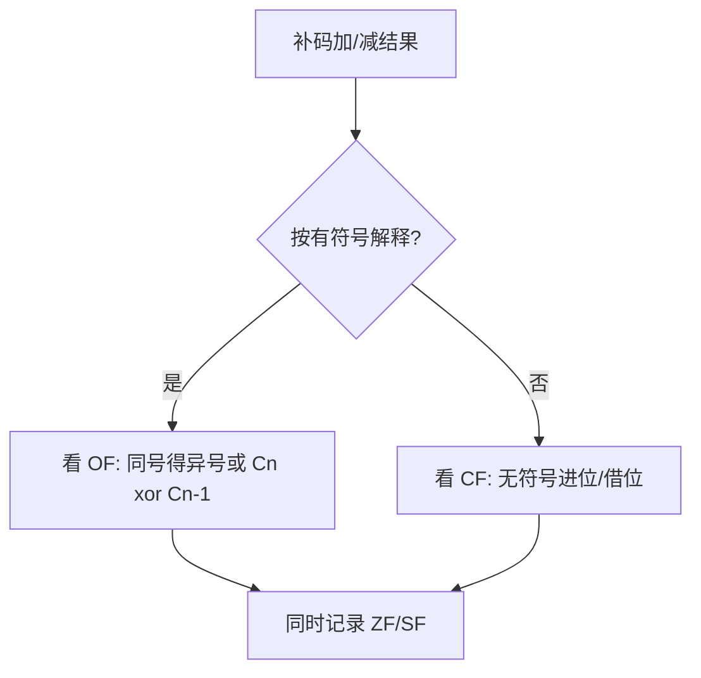

# 课件 03 — 运算方法和运算部件 学习指南

> **课程**：计算机组成与体系结构（H）
> **课件**：`3_运算方法和运算部件.pdf`｜NotebookLM `课件03-运算方法和运算部件`
> **原则**：按课件原序、按知识点分块、**课件板块无遗漏**
> **课堂**：Week 4–5（ALU、标志位、乘除法背景）
> **Lab**：Lab1（EX 阶段 ALU、`alu_op` 控制）
> **教材章节**：唐朔飞《计算机组成原理》第 2 版 **第 6 章**；Patterson RISC-V 版 **第 3 章**
> **周次指南交叉引用**：[计组-Week4-6-学习指南](计组-Week4-6-学习指南.md)（运算背景）
> **原始采集**：`notebooklm-raw/kejian03/runs/20260619-234517/`（5/5 batch ✅）
> **结构图**：`notebooklm-raw/kejian/structure-map.md` §03
> **监修标准**：[计组-课件学习指南监修标准](计组-课件学习指南监修标准.md)
> **首轮监修**：2026-06-21｜状态：已首轮监修（A-）｜重点：ALU/标志位手算、Lab1 对照
> **整合日期**：2026-06-19
> **术语格式**：术语表及正文**首次出现**时，专业名词采用 **中文（English）**；英文缩写采用 **缩写（English full name，中文）**，便于对照英文课件、教材与开卷试题。

---

## 课件内容覆盖索引

| 课件原序 | 课件板块 | Slide（约） | 本指南 | 状态 |
|----------|----------|-------------|--------|------|
| 1 | ALU 结构与 ALUop | 板块 1 | Part 1 · 块 1.1–1.3 | ✅ |
| 2 | 定点加减与标志位 | 板块 2 | Part 2 · 块 2.1–2.3 ⭐ | ✅ |
| 3 | Booth 乘法与恢复余数除法 | 板块 3 | Part 3 · 块 3.1–3.3 | ✅ |
| 4 | 浮点运算（对阶、规格化、舍入） | 板块 4 | Part 4 · 块 4.1–4.3 | ✅ |

---

## 缩写速查

| 缩写 | 解释 |
|------|------|
| **ALU** | Arithmetic Logic Unit，算术逻辑单元 |
| **CU** | Control Unit，控制器 |
| **CPU** | Central Processing Unit，中央处理器 |
| **RF** | Register File，寄存器堆 |

---

## 本章怎么用（开卷复习路径）

1. **ALU 题先看标志位语义**：OF 管有符号溢出，CF 管无符号进/借位；不要只看最高位是否变化。
2. **乘除题先列初态**：Booth 题先写 A/Q/Q-1/M，除法题先写余数寄存器和恢复条件，再逐拍推演。
3. **浮点运算按流程查**：对阶 → 尾数运算 → 规格化 → 舍入 → 溢出/下溢判断；不要只写最后结果。
4. **Lab1 对齐**：课件 ALUop 与 Lab1 `alu_op` 概念一致，但二轮仍建议核对实验命名和 W 后缀符号扩展。

| 定位 | 使用方式 |
|------|----------|
| 课件 | `3_运算方法和运算部件.pdf`，按 ALU → 补码标志 → 乘除 → 浮点运算查 |
| 教材 | 唐朔飞第 3 章与 P&H 第 3 章补运算部件和算术细节 |
| Lab | Lab1 对 EX 阶段 ALU、控制编码和标志语义做实现级核对 |
| 周次 | Week4–5 讲数据表示和运算背景，授课顺序晚于部分 CPU/ISA 内容 |

---

## Part 1 — ALU 架构（Lab1 对照）

> **本节要回答**：1-bit ALU 如何扩展为 n 位？串行与并行进位有何区别？Lab1 ALU 如何对应？

### 块 1.1 从 1-bit 到 n 位

| 结构 | 特点 |
|------|------|
| **1-bit ALU** | 全加器 FA + MUX 选操作 |
| **串行 n 位** | 进位逐级传递，简单但慢 |
| **并行 n 位 (CLA)** | 进位生成/传递函数并行产生进位，$O(\log n)$ 延迟 |

（来源：kejian03-part1-alu）

### 块 1.2 ALUop 与标志位

- **ALUop**：3 位可选 8 种操作（如 000=And, 010=Add, 110=Sub）
- **标志位**：ZF（零）、SF（符号）、OF（有符号溢出）、CF（无符号进位/借位）
- 乘除等复杂运算在**加法器+移位器**基础上用控制逻辑实现

（来源：kejian03-part1-alu）

### 块 1.3 Lab1 对照

| 课件 03 | Lab1 |
|---------|------|
| 门级 ALU / CLA | `core_alu.sv` 组合逻辑模块 |
| ALUop | 译码阶段 `alu_op` 信号 |
| 32 位示例 | **64 位** + W 后缀指令符号扩展 |

（来源：kejian03-part1-alu、Lab1 report）

---

## Part 2 — 补码运算与标志位（手算重点 ⭐）

> **本节要回答**：补码加减规则？OF/CF 如何判断？手算一例。

### 块 2.1 运算规则

| 运算 | 规则 |
|------|------|
| 加法 | $[x+y]_补 = [x]_补 + [y]_补 \pmod{2^n}$，符号位参与，进位丢弃 |
| 减法 | $[x-y]_补 = [x]_补 + [-y]_补$ |
| 求负 | 各位取反，末位加 1（含符号位） |

（来源：kejian03-part2-addflags）

### 块 2.2 标志位产生条件

| 标志 | 条件 | 适用 |
|------|------|------|
| **ZF** | 结果 = 0 | 通用 |
| **SF** | = 结果最高位 | 通用 |
| **OF** | $C_n \oplus C_{n-1}$；同号相加得异号 | **有符号** |
| **CF** | $C_{out} \oplus Sub$ | **无符号** |



> **监修提醒**：同一 8 位结果可同时有「有符号溢出」与「无符号有效」两种解释，考试先问清 signed/unsigned。（首轮监修补强）

### 块 2.3 数值例：$107 + 46$（8 位补码）

```
   0110 1011  (107)
+  0010 1110  (46)
--------------
   1001 1001  → SF=1, ZF=0, OF=1（两正得负，溢出）, CF=0
```

有符号解释：结果错误（溢出）；无符号解释：153 正确。（来源：kejian03-part2-addflags）

---

## Part 3 — Booth 乘法与恢复余数除法

> **本节要回答**：Booth 算法每步做什么？恢复余数法如何上商？

### 块 3.1 Booth 补码一位乘法

```mermaid
flowchart TD
  INIT[P=0, y_-1=0] --> JUDGE{看 y_i y_{i-1}}
  JUDGE -->|01| ADD[P += X]
  JUDGE -->|10| SUB[P += -X]
  JUDGE -->|00/11| NOP[不操作]
  ADD --> SHIFT[算术右移 P,Y,y_-1]
  SUB --> SHIFT
  NOP --> SHIFT
  SHIFT --> JUDGE
```

| $y_i y_{i-1}$ | 操作 |
|---------------|------|
| 01 | P ← P + [X]补 |
| 10 | P ← P + [−X]补 |
| 00/11 | 不变 |
| 每步后 | P、Y、$y_{-1}$ 算术右移一位 |

重复 n 次（n = 位数）。（来源：kejian03-part3-muldiv）

### 块 3.2 恢复余数除法

1. R、Q 左移一位
2. R ← R − Y（试减）
3. 若 R ≥ 0：上商 1；若 R < 0：上商 0，**R ← R + Y 恢复**

### 块 3.3 Booth 推演起点

$[X]_补=1101(-3)$，$[Y]_补=0110(6)$：初始 P=0000, Y=0110, $y_{-1}$=0；首步 $y_0y_{-1}=00$ 不操作后算术右移。（来源：kejian03-part3-muldiv）

---

## Part 4 — 浮点运算步骤

> **本节要回答**：对阶原则？左规/右规何时发生？默认舍入模式？

### 块 4.1 对阶与规格化

| 步骤 | 规则 |
|------|------|
| **对阶** | **小阶向大阶看齐**，小阶尾数右移 |
| **左规** | 结果高位为 0 时尾数左移、阶码减 1 |
| **右规** | 尾数进位（1x.xxxx）时尾数右移、阶码加 1（加减最多一次） |

对阶可能导致**大数吃小数**精度损失。（来源：kejian03-part4-floatop）

### 块 4.2 舍入模式（IEEE 754）

| 模式 | 行为 |
|------|------|
| **就近偶数（默认）** | <1/2 截断；>1/2 进位；=1/2 舍入到偶数 |
| 其他 | 向 ±∞、向 0 截断 |

### 块 4.3 CLA 加速

进位生成 $G_i = A_i B_i$，传递 $P_i = A_i \oplus B_i$，各级进位并行 → 浮点/定点加法加速。（来源：kejian03-part4-floatop）

---

## 易混概念对比（期末速查）

（来源：kejian03-mistakes）

| 概念组 | 关键区分 |
|--------|----------|
| OF vs CF | OF=有符号溢出；CF=无符号进位/借位 |
| Booth vs 阵列乘法 | 迭代省硬件 vs 组合逻辑并行快 |
| 恢复 vs 不恢复余数 | 试商负时是否加回除数 |
| 串行 vs 并行 ALU | 行波进位 $O(n)$ vs CLA $O(\log n)$ |
| 浮点对阶 vs 定点扩展 | 小阶尾数右移 vs 符号/零扩展保真值 |

---

## 与周次指南对照

| 本指南 Part | 周次指南 | 说明 |
|-------------|----------|------|
| Part 1 | [Week1-3](计组-Week1-3-学习指南.md) §3 | Lab1 EX 阶段 ALU |
| Part 2 | [Week4-6](计组-Week4-6-学习指南.md) | 标志位与补码手算 |
| Part 3–4 | [Week4-6](计组-Week4-6-学习指南.md) | 乘除与浮点运算背景 |

---

## 复习优先级

| 优先级 | 范围 | 说明 |
|--------|------|------|
| **极高** | Part 2 | OF/CF 判断与手算 |
| 高 | Part 1 | ALU 结构与 Lab1 对照 |
| 中 | Part 3、4 | Booth/除法流程、浮点对阶 |

---

## 追问块

> **追问 1**：OF=1 时 CPU 一定报错吗？

> **答**：取决于 ISA/OS。硬件置 OF 标志；是否触发异常由程序或 OS 决定。考试中须区分**有符号语义**下结果无效。（来源：kejian03-part2-addflags）

> **追问 2**：Booth 算法为何用算术右移而非逻辑右移？

> **答**：处理**补码有符号乘数**，右移时符号位填入高位以保持负数正确扩展。（来源：kejian03-part3-muldiv）

> **追问 3**：恢复余数法比不恢复法慢在哪？

> **答**：试商为负时需额外**加回除数**一步；不恢复法用加减交替口诀省掉恢复周期。（来源：kejian03-mistakes）

> **追问 4**：浮点对阶为何不让大阶向小阶看齐？

> **答**：大阶尾数右移会丢失更多有效位；**小阶向大阶看齐**使精度损失最小。（来源：kejian03-part4-floatop）

> **追问 5**：Lab1 的 `alu_op` 与课件 ALUop 是一回事吗？

> **答**：**是**。译码产生 `alu_op` 选择 EX 阶段 ALU 功能，概念与课件 03 的 ALUop 完全对应。（来源：kejian03-part1-alu）

---

## 监修自检（首轮）

| 维度 | 状态 | 本章结论 |
|------|------|----------|
| 来源/覆盖 | 通过 | 课件覆盖索引、deep raw、structure-map 与周次指南均已列出；首轮按 `计组-课件学习指南监修标准.md` 核对。 |
| 结构完整 | 通过 | 元信息、覆盖索引、Part 正文、易混对比、复习优先级、追问/资料索引齐全。 |
| 难点讲解 | 通过 | 已保留本章核心机制、公式或状态流程，避免只列术语。 |
| 图示/数值例 | 通过 | 首轮已补足可开卷查用的图示或手算例；非主考章节保持轻量。 |
| Lab/复习交叉 | 通过 | 已标注相关 Lab 与周次指南；Lab4-6 相关内容按期末重点突出。 |
| 二轮升级 | 完成 | 已补「本章怎么用」并明确 OF/CF、Booth/除法初态、浮点运算流程和 Lab1 对齐入口。 |

> **二轮 review 建议**：二轮核对 Lab1 `alu_op` 命名、W 后缀符号扩展细节。

---

## 资料索引

| 类型 | 文件 / 路径 | 说明 |
|------|-------------|------|
| 课件 | `3_课件/3_运算方法和运算部件.pdf` | 本指南主线 |
| 周次指南 | `guides/计组-Week4-6-学习指南.md` | Week 4–5 背景 |
| 实验 | [26-Arch Wiki Lab1](https://github.com/26-Arch/26-Arch/wiki/)、`26-Arch/Doc/Lab1/report.md` | ALU 实现 |
| deep raw | `notebooklm-raw/kejian03/runs/20260619-234517/` | 5 batch 深采 ✅ |
| discovery raw | `notebooklm-raw/kejian/runs/latest/kejian03-structure.answer.md` | L0 结构 ✅ |
| 结构图 | `notebooklm-raw/kejian/structure-map.md` §03 | Part 边界 |
| 课件索引 | `guides/计组-课件梳理索引.md` | 双轨进度 |
| 教材 | 唐朔飞第 2 版 **第 6 章**；P&H RISC-V **第 3 章** | 运算方法 |
