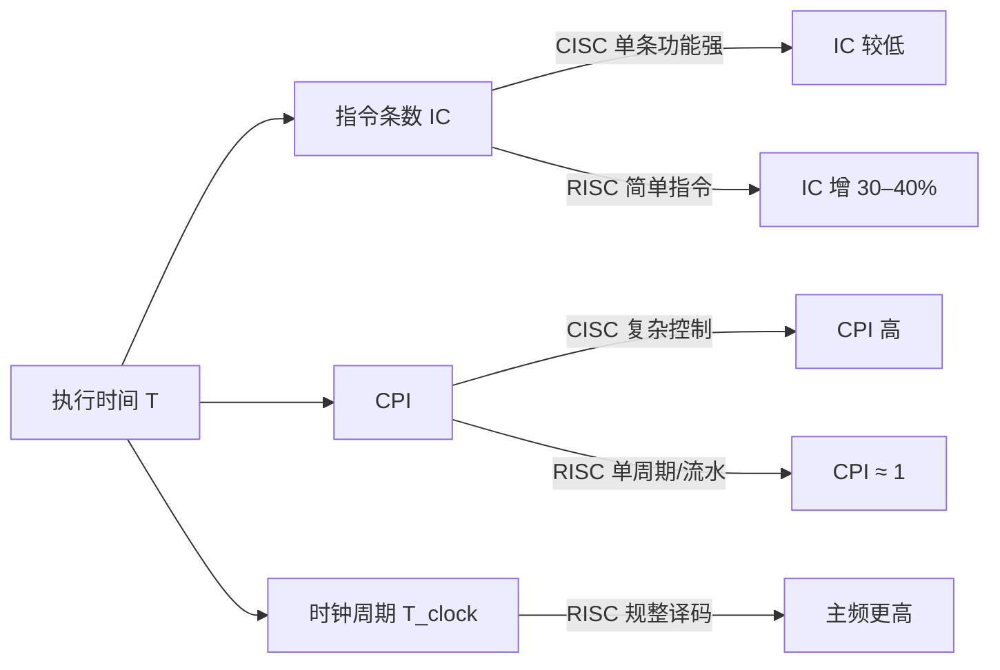

# 课件 04 — 指令系统 学习指南

> **课程**：计算机组成与体系结构（H）
> **课件**：`4_指令系统.pdf`｜NotebookLM `课件04-指令系统`
> **原则**：按课件原序、按知识点分块、**课件板块无遗漏**
> **课堂**：Week 3（CISC/RISC、RISC-V 格式与寻址）
> **Lab**：Lab2–3（指令编码、访存与分支）
> **教材章节**：唐朔飞《计算机组成原理》第 2 版 **第 4 章**；Patterson RISC-V 版 **第 2 章** §2.2–2.7
> **周次指南交叉引用**：[计组-Week1-3-学习指南](计组-Week1-3-学习指南.md)（§2.3 CISC/RISC 与 ISA）
> **原始采集**：`notebooklm-raw/kejian04/runs/20260619-232932/`（5/5 batch ✅）
> **结构图**：`notebooklm-raw/kejian/structure-map.md` §04
> **监修标准**：[计组-课件学习指南监修标准](计组-课件学习指南监修标准.md)
> **首轮监修**：2026-06-21｜状态：已首轮监修（A-）｜重点：RISC-V 格式、寻址、Lab2-3
> **整合日期**：2026-06-19

---

## 课件内容覆盖索引

| 课件原序 | 课件板块 | Slide（约） | 本指南 | 状态 |
|----------|----------|-------------|--------|------|
| 1 | ISA 理论与设计目标 | 1–7 | Part A · 块 A.1–A.3 ⭐ | ✅ |
| 2 | RISC-V 子集与六种格式 | 9 | Part B · 块 B.1–B.3 ⭐ | ✅ |
| 3 | Load/Store、MIPS 机器级表示 | 8, 10–11 | Part C · 块 C.1–C.3 | ✅ |
| 4 | 寻址方式与编码 | 6, 10–11 | Part D · 块 D.1–D.3 ⭐ | ✅ |

---

## 本章怎么用（开卷复习路径）

1. **先看 ISA 契约**：题目若问软硬件边界、兼容性、异常/虚存支持，先回 Part A；不要只背 CISC/RISC 特征表。
2. **机器码题按格式填字段**：先判 R/I/S/B/U/J，再查字段位置；B/J 立即数分散且隐含低位 0，是二轮最容易出错的边界。
3. **寻址题先写基准**：`lw/sw` 用 base+offset，分支用 PC+4 加偏移；链接装入题要区分虚拟地址与物理地址。
4. **Lab2–3 对齐**：Lab 以 RISC-V 为主，MIPS 仅作课件对照；遇到差异时优先按 RISC-V 字段和实验报告。

| 定位 | 使用方式 |
|------|----------|
| 课件 | `4_指令系统.pdf`，按 ISA 理论 → RISC-V 格式 → Load/Store → 寻址查 |
| 教材 | 唐朔飞第 4 章与 P&H 第 2 章补 ISA、指令编码与寻址 |
| Lab | Lab2–3 对 RISC-V 指令编码、访存、分支和 Flush 做实现级核对 |
| 周次 | Week3 是课堂主线；课件 04 的概念与 01/05/06 前后交叉 |

---

## Part A — ISA 理论与 CISC/RISC 权衡

> **本节要回答**：ISA 在软硬件之间扮演什么角色？现代 ISA 设计目标有哪些？CISC 与 RISC 如何权衡 IC、CPI、时钟周期？

### 块 A.1 ISA 定义与软硬件界面

**ISA（Instruction Set Architecture）** 是软件与硬件的交界面，定义指令编码、地址空间、异常/中断处理及存储管理等运行环境。（来源：kejian04-partA-isa）

| 角色 | 视角 |
|------|------|
| 硬件设计者 | ISA 是 CPU 必须实现的功能需求 |
| 系统程序员 | 通过 ISA 利用硬件资源（编译器、OS） |
| 产业标准 | 决定应用程序与 OS 的**二进制兼容性** |

### 块 A.2 现代 ISA 设计目标

| 目标 | 要点 |
|------|------|
| **并行性支持** | SIMD、向量运算、多核同步/通信指令 |
| **OS 支持** | 特权级、虚存/页保护、TLB、异常返回（如 ERTN）、虚拟机硬件辅助 |
| **编译器友好** | 寻址与操作**正交**；≥16 个通用寄存器利于寄存器分配；「Less is more」——只保留基本通用操作 |

（来源：kejian04-partA-isa）

### 块 A.3 CISC vs RISC 权衡

| 维度 | **CISC** | **RISC** |
|------|----------|----------|
| 指令长度 | 可变 | 固定 32 位 |
| 访存 | 运算指令可直接访存 | **Load/Store** 结构 |
| 执行 | 功能强、周期长 | 大多数单周期完成 |
| 硬件 | 微程序控制复杂 | 硬布线、利于流水线 |
| 性能 | 80% 时间花在 20% 简单指令 | IC 略增，CPI↓ + 主频↑ 综合更优 |

$$T = IC \times CPI \times T_{clock}$$

（来源：kejian04-partA-isa、[Week1-3 指南](计组-Week1-3-学习指南.md) §2.3）

---

## Part B — RISC-V RV32I 与六种指令格式（Lab2–3 核心 ⭐）

> **本节要回答**：32 个寄存器 ABI 如何约定？六种格式各用于什么指令？如何把 `addi` 编成机器码？

### 块 B.1 RV32I 与 ABI 寄存器约定

RV32I 含 32 个通用寄存器 x0–x31；汇编器用 ABI 名表达调用约定：

| ABI 名 | 硬件编号 | 用途 | 保存责任 |
|--------|----------|------|----------|
| zero | x0 | 恒为 0 | — |
| ra | x1 | 返回地址 | 调用者保存 |
| sp | x2 | 栈指针 | 被调用者保存 |
| s0/fp | x8 | 保存寄存器/帧指针 | 被调用者保存 |
| a0–a1 | x10–x11 | 参数/返回值 | 调用者保存 |
| t0–t6 | x5–x7, x28–x31 | 临时寄存器 | 调用者保存 |

（来源：kejian04-partB-riscv、Lab2–3）

### 块 B.2 六种基本格式

所有指令 **32 位定长**；rs1、rs2、rd 字段位置固定以简化译码。

| 格式 | 典型指令 | 关键字段 |
|------|----------|----------|
| **R** | add, sub, slt | funct7, rs2, rs1, funct3, rd, opcode |
| **I** | addi, lw, jalr | imm[11:0], rs1, funct3, rd, opcode |
| **S** | sw, sb, sh | imm[11:5], rs2, rs1, funct3, imm[4:0], opcode |
| **B** | beq, bne, blt | 分散 imm, rs2, rs1, funct3, opcode |
| **U** | lui, auipc | imm[31:12], rd, opcode |
| **J** | jal | 分散 imm, rd, opcode |

> **注意**：B/J 型立即数须**左移 1 位**（指令 16 位对齐）。（来源：kejian04-partB-riscv）

### 块 B.3 数值例：`addi x5, x5, 1` → 机器码

| 步骤 | 内容 |
|------|------|
| 1 定格式 | I-type |
| 2 查编码 | opcode=`0010011`, funct3=`000`, rd=rs1=x5=`00101`, imm=`000000000001` |
| 3 拼接 | imm \| rs1 \| funct3 \| rd \| opcode |
| 4 十六进制 | **`0x00128293`** |

（来源：kejian04-partB-riscv、Lab2）

---

## Part C — Load/Store 结构与 MIPS 对照

> **本节要回答**：为何 RISC 坚持 Load/Store？MIPS 与 RISC-V 格式有何异同？机器码在链接/装入时如何定址？

### 块 C.1 Load/Store 型结构

| 规则 | 说明 |
|------|------|
| 访存 | **仅** load/store 可访问主存 |
| 运算 | ALU 操作数来自寄存器或立即数，结果写回寄存器 |
| 优势 | 指令步骤规整，利于**流水线**实现 |

（来源：kejian04-partC-loadstore）

### 块 C.2 MIPS vs RISC-V 格式对照

| 维度 | MIPS | RISC-V |
|------|------|--------|
| 指令长度 | 32 位定长 | 32 位定长 |
| 基本格式 | R / I / J 三种 | R / I / S / B / U / J 六种 |
| 设计差异 | I 型兼访存与分支 | **独立 S/B 型**，保持 rs1/rs2 位置固定 |

（来源：kejian04-partC-loadstore）

### 块 C.3 机器级表示与链接装入

- **链接时**：确定指令与数据的**虚拟地址**（如 MIPS 代码段常从 `0x00400000` 起）
- **装入时**：OS 通过页表建立虚址→物理址映射

（来源：kejian04-partC-loadstore）

---

## Part D — 寻址方式与手算（期末 + Lab2–3 ⭐）

> **本节要回答**：四种基本寻址如何计算 EA？定长/扩展操作码有何取舍？`lw` 与 `beq` 如何手算？

### 块 D.1 常见寻址方式

| 方式 | 公式/含义 | 典型指令 |
|------|-----------|----------|
| **立即寻址** | 操作数在指令中 | addi |
| **寄存器寻址** | 操作数在寄存器 | add |
| **基址+偏移** | EA = R[base] + offset | lw, sw |
| **PC 相对** | EA = PC + offset | beq, jal |

（来源：kejian04-partD-addressing）

### 块 D.2 定长 vs 扩展操作码

| 类型 | 优点 | 缺点 |
|------|------|------|
| **定长操作码**（MIPS 6 位） | 译码简单、速度快 | 编码冗余，扩展受限 |
| **扩展操作码**（x86） | 空间利用率高、指令多 | 译码复杂、耗时长 |

### 块 D.3 数值例 A：`lw $t0, 32($s3)`

已知 `$s3 = 0x1000`：

1. 偏移量 `32` = `0x0020`
2. 符号扩展至 32 位：`0x00000020`
3. EA = `0x1000 + 0x20` = **`0x1020`**
4. 将 `0x1020` 处字载入 `$t0`

### 块 D.4 数值例 B：`beq $s1, $s2, 25`（PC = `0x2000`）

1. 基准 PC+4 = `0x2004`
2. 偏移 25 条指令 × 4 字节 = `0x64`
3. Target = `0x2004 + 0x64` = **`0x2068`**
4. 若 `$s1 == $s2`，下一条从 `0x2068` 取指

（来源：kejian04-partD-addressing、Lab2–3）

---

## 易混概念对比（期末速查）

| 概念组 | 易混原因 | 正确理解 |
|--------|----------|----------|
| 六种格式适用场景 | I/S/B 都含立即数 | I=运算/加载；S=存储；B=条件分支；U=高位立即数；J=无条件跳转 |
| x 编号 vs ABI 名 | 同一物理寄存器两套名字 | x 编号供硬件译码；ABI 名规定调用约定（a0 传参、ra 返回） |
| 立即寻址 vs PC 相对 | 都「在指令里带数」 | 前者操作数即立即数；后者 EA 相对 PC，支持位置无关代码 |
| CISC vs RISC 访存 | 都能访问内存 | CISC 运算可直接访存；RISC 必须经 Load/Store |
| ISA vs ABI | 都是「接口」 | ISA=软硬件指令契约；ABI=二进制模块互操作（调用约定、对齐） |

（来源：kejian04-mistakes）

---

## 与周次指南对照

| 本指南 Part | 周次指南 | 说明 |
|-------------|----------|------|
| Part A | [Week1-3](计组-Week1-3-学习指南.md) §2.3 | ISA 设计哲学、CISC vs RISC |
| Part B/D | [Week1-3](计组-Week1-3-学习指南.md) §2.3 | RISC-V 六种格式、寻址（Week 3） |
| Part C | [Week1-3](计组-Week1-3-学习指南.md) §3 | Lab2–3 Load/Store 与机器码 |

---

## 复习优先级

| 优先级 | 范围 | 说明 |
|--------|------|------|
| **极高** | Part B、D | RISC-V 格式与寻址，Lab2–3 直接对应 |
| 高 | Part A | CISC/RISC 权衡、ISA 设计目标 |
| 中 | Part C | MIPS 对照、链接装入流程 |

---

## 追问块

> **追问 1**：RISC 指令条数比 CISC 多 30–40%，为何整体仍更快？

> **答**：$T = IC \times CPI \times T_{clock}$。RISC 虽 IC 略增，但 CPI 显著降低（接近 1）且时钟周期更短（规整译码利于流水），三因子联立后总时间更优。（来源：kejian04-partA-isa）

> **追问 2**：为何 RISC-V 要把 Store/Branch 从 I 型拆成 S/B 型？

> **答**：保持 **rs1、rs2 在所有格式中的位域位置固定**，硬件只需一套译码逻辑即可识别源寄存器，降低控制复杂度。（来源：kejian04-partC-loadstore）

> **追问 3**：`beq` 手算时为何用 PC+4 而非当前 PC？

> **答**：取指阶段 PC 已自增；分支偏移相对**下一条指令地址**计算，与流水线取指时序一致。（来源：kejian04-partD-addressing、Lab2）

> **追问 4**：`.o` 目标文件中的地址是最终物理地址吗？

> **答**：**否**。链接时确定**虚拟地址**；装入时 OS 经页表映射到物理地址。（来源：kejian04-partC-loadstore）

> **追问 5**：x0 能否被写入非零值？

> **答**：**不能**。x0 硬连线为 0，写入被忽略；这是 RISC-V 简化译码与常数生成的关键设计。（来源：kejian04-partB-riscv）

---

## 监修自检（首轮）

| 维度 | 状态 | 本章结论 |
|------|------|----------|
| 来源/覆盖 | 通过 | 课件覆盖索引、deep raw、structure-map 与周次指南均已列出；首轮按 `计组-课件学习指南监修标准.md` 核对。 |
| 结构完整 | 通过 | 元信息、覆盖索引、Part 正文、易混对比、复习优先级、追问/资料索引齐全。 |
| 难点讲解 | 通过 | 已保留本章核心机制、公式或状态流程，避免只列术语。 |
| 图示/数值例 | 通过 | 首轮已补足可开卷查用的图示或手算例；非主考章节保持轻量。 |
| Lab/复习交叉 | 通过 | 已标注相关 Lab 与周次指南；Lab4-6 相关内容按期末重点突出。 |
| 二轮升级 | 完成 | 已补「本章怎么用」并突出六格式字段、PC 相对寻址、虚实地址和 Lab2-3 口径。 |

> **二轮 review 建议**：二轮可补 B/J 型立即数拆位图与更多 Lab2 编码例。

---

## 资料索引

| 类型 | 文件 / 路径 | 说明 |
|------|-------------|------|
| 课件 | `3_课件/4_指令系统.pdf` | 本指南主线 |
| 周次指南 | `guides/计组-Week1-3-学习指南.md` | Week 3 课堂主线 |
| 实验 | [26-Arch Wiki Lab2–3](https://github.com/26-Arch/26-Arch/wiki/)、`26-Arch/Doc/Lab2/report.md`、`26-Arch/Doc/Lab3/report.md` | 指令编码与访存 |
| deep raw | `notebooklm-raw/kejian04/runs/20260619-232932/` | 5 batch 深采 ✅ |
| discovery raw | `notebooklm-raw/kejian/runs/latest/kejian04-structure.answer.md` | L0 结构 ✅ |
| 结构图 | `notebooklm-raw/kejian/structure-map.md` §04 | Part 边界 |
| 课件索引 | `guides/计组-课件梳理索引.md` | 双轨进度 |
| 教材 | 唐朔飞第 2 版 **第 4 章**；P&H RISC-V **第 2 章** | ISA 与 RISC-V |
