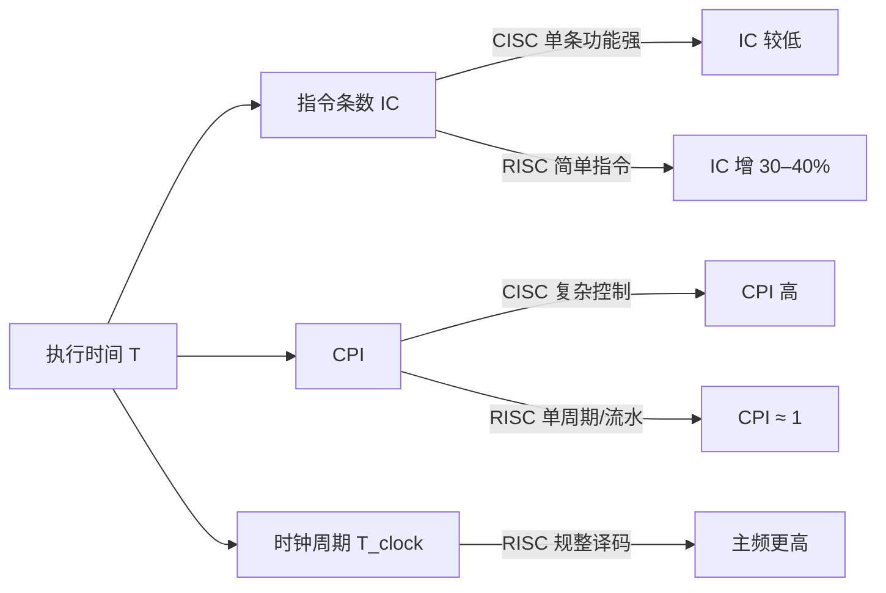
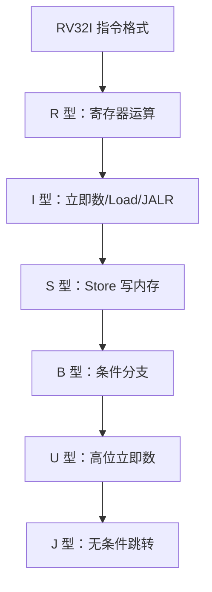
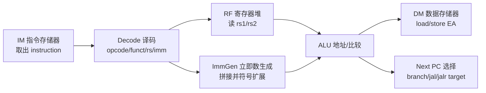

# 课件 04 — 指令系统 学习指南

> **课程**：计算机组成与体系结构（H）
> **课件**：`4_指令系统.pdf`｜NotebookLM `课件04-指令系统`
> **原则**：按课件原序、按知识点分块、**课件板块无遗漏**
> **课堂**：Week 3（CISC/RISC、RISC-V 格式与寻址）
> **Lab**：Lab2–3（指令编码、访存与分支）
> **教材章节**：唐朔飞《计算机组成原理》第 2 版 **第 4 章**；Patterson RISC-V 版 **第 2 章** §2.2–2.7
> **周次指南交叉引用**：[计组-Week1-3-学习指南](计组-Week1-3-学习指南.md)（§2.3 CISC/RISC 与 ISA）
> **原始采集**：`notebooklm-raw/kejian04/runs/20260619-232932/`（5/5 batch ✅）
> **补采 raw**：`notebooklm-raw/kejian04-supplement-machine-representation/runs/diagnostic-20260624-1553-first/`（MIPS 示例与字段 2/5 ✅；程序/内存/寄存器链路待补采）
> **结构图**：`notebooklm-raw/kejian/structure-map.md` §04
> **监修标准**：[计组-课件学习指南监修标准](计组-课件学习指南监修标准.md)
> **首轮监修**：2026-06-21｜状态：已首轮监修（A-）｜重点：RISC-V 格式、寻址、Lab2-3
> **整合日期**：2026-06-19
> **术语格式**：术语表及正文**首次出现**时，专业名词采用 **中文（English）**；英文缩写采用 **缩写（English full name，中文）**，便于对照英文课件、教材与开卷试题。

---

## 课件内容覆盖索引

| 课件原序 | 课件板块 | Slide（约） | 本指南 | 状态 |
|----------|----------|-------------|--------|------|
| 1 | ISA 理论与设计目标 | 1–7 | Part A · 块 A.1–A.3 ⭐ | ✅ |
| 2 | RISC-V 子集与六种格式 | 9 | Part B · 块 B.1–B.7 ⭐ | ✅ |
| 3 | Load/Store、MIPS 机器级表示 | 8, 10–11 | Part C · 块 C.1–C.5 | 部分补强，程序/内存/寄存器链路待补采 |
| 4 | 寻址方式与编码 | 6, 10–11 | Part D · 块 D.1–D.8 ⭐ | ✅ |

---

## 缩写速查

| 缩写 | 解释 |
|------|------|
| **ISA** | Instruction Set Architecture，指令集体系结构 |
| **RISC / CISC** | Reduced / Complex Instruction Set Computer，精简 / 复杂指令集计算机 |
| **RISC-V / MIPS** | 教学常用 ISA；本课程 Lab 以 RISC-V 为主，MIPS 用于课件对照 |
| **RV32I** | RISC-V 32-bit Integer base ISA，RISC-V 32 位整数基础指令集 |
| **ABI** | Application Binary Interface，应用程序二进制接口 |
| **PC** | Program Counter，程序计数器 |
| **EA** | Effective Address，有效地址 |
| **MMIO** | Memory-Mapped I/O，内存映射输入输出 |
| **Difftest** | Differential Testing，差分测试 |
| **SIMD** | Single Instruction Multiple Data，单指令多数据 |
| **TLB** | Translation Lookaside Buffer，地址转换后备缓冲 |

---

## 本章怎么用（开卷复习路径）

1. **先看 ISA 契约**：题目若问软硬件边界、兼容性、异常/虚存支持，先回 Part A；不要只背 CISC/RISC 特征表。
2. **机器码题按格式填字段**：先判 R/I/S/B/U/J，再查字段位置；B/J 立即数分散且隐含低位 0，是二轮最容易出错的边界。
3. **MIPS 例子看思想，不混字段**：MIPS 的 R/I/J 三格式适合说明“汇编如何落到机器码字段”；Lab2–3 写实现时仍按 RISC-V 六格式、寄存器名和立即数拼接口径。
4. **寻址题先写基准**：`lw/sw` 用 base+offset，分支用 PC+4 加偏移；链接装入题要区分虚拟地址与物理地址。
5. **Lab2–3 对齐**：Lab 以 RISC-V 为主，MIPS 仅作课件对照；遇到差异时优先按 RISC-V 字段和实验报告。

| 定位 | 使用方式 |
|------|----------|
| 课件 | `4_指令系统.pdf`，按 ISA 理论 → RISC-V 格式 → Load/Store → 寻址查 |
| 教材 | 唐朔飞第 4 章与 P&H 第 2 章补 ISA、指令编码与寻址 |
| Lab | Lab2–3 对 RISC-V 指令编码、访存、分支和 Flush 做实现级核对 |
| 周次 | Week3 是课堂主线；课件 04 的概念与 01/05/06 前后交叉 |

---

## Part A — ISA 理论与 CISC/RISC 权衡

> **本节要回答**：ISA 在软硬件之间扮演什么角色？现代 ISA 设计目标有哪些？CISC 与 RISC 如何权衡 IC、CPI、时钟周期？

### 块 A.1 ISA 定义与软硬件界面

**ISA（Instruction Set Architecture）** 是软件与硬件的交界面，定义指令编码、地址空间、异常/中断处理及存储管理等运行环境。（来源：kejian04-partA-isa）

| 角色 | 视角 |
|------|------|
| 硬件设计者 | ISA 是 CPU 必须实现的功能需求 |
| 系统程序员 | 通过 ISA 利用硬件资源（编译器、OS） |
| 产业标准 | 决定应用程序与 OS 的**二进制兼容性** |

### 块 A.2 现代 ISA 设计目标

| 目标 | 要点 |
|------|------|
| **并行性支持** | SIMD、向量运算、多核同步/通信指令 |
| **OS 支持** | 特权级、虚存/页保护、TLB、异常返回（如 ERTN）、虚拟机硬件辅助 |
| **编译器友好** | 寻址与操作**正交**；≥16 个通用寄存器利于寄存器分配；「Less is more」——只保留基本通用操作 |

（来源：kejian04-partA-isa）

### 块 A.3 CISC vs RISC 权衡

下面的图要解决“为什么不能只用指令条数 IC 判断 ISA 快慢”。IC、CPI、$T_{clock}$ 三个因子共同决定执行时间。



> **读图提示：** CISC 可能降低 IC，但复杂译码会推高 CPI 或拉长时钟周期；RISC 可能让 IC 增加，但规整编码和 Load/Store 结构让流水线更容易接近 CPI=1。

| 维度 | **CISC** | **RISC** |
|------|----------|----------|
| 指令长度 | 可变 | 固定 32 位 |
| 访存 | 运算指令可直接访存 | **Load/Store** 结构 |
| 执行 | 功能强、周期长 | 大多数单周期完成 |
| 硬件 | 微程序控制复杂 | 硬布线、利于流水线 |
| 常用指令分布 | 程序中约 80% 的指令出现频度集中在指令集约 20% 的简单常用指令上 | 优先优化简单高频指令；IC 略增但 CPI↓ + 主频↑ 综合更优 |

$$T = IC \times CPI \times T_{clock}$$

> **边界说明：** 这里的 80/20 是“常用指令频度集中”的经验性说法，不是在描述执行时间占比。RISC 的设计动机是把硬件资源集中服务简单、高频、规整的指令，从而降低译码复杂度并改善流水线性能。

（来源：kejian04-partA-isa、[Week1-3 指南](计组-Week1-3-学习指南.md) §2.3）

---

## Part B — RISC-V RV32I 与六种指令格式（Lab2–3 核心 ⭐）

> **本节要回答**：RV32I 为什么叫“基础”指令集？六种格式为什么要牺牲人类可读性来固定字段？读一条机器码时怎样从 opcode 推回语义，并落到 Lab2–3 的访存、跳转、flush 与 Difftest 调试？

### 块 B.1 先看设计动机：固定字段布局是在服务硬件

**RV32I（RISC-V 32-bit Integer base ISA，RISC-V 32 位整数基础指令集）** 是 RISC-V 最小且最稳定的整数执行底座：`RV32` 表示通用寄存器和地址计算以 32 位为基本宽度，`I` 表示 Integer base ISA，即整数基础指令集。它之所以叫“基础”，不是因为内容“简单到不重要”，而是因为后续乘除法、原子、浮点、压缩指令、特权指令等扩展都要建立在这套基本取指、译码、寄存器读写、ALU、访存和控制转移规则上。Lab1–3 也是先实现这条主线：能读 RV32I 风格的字段，才能让 `lw/sw/beq/jal/jalr` 在流水线中正确推进。（来源：kejian04-partB-riscv、Week1-3 指南 §2.3）

RISC-V 的 32 位指令看似有六种格式，但核心目标不是“造六张表”，而是让硬件在 ID（Instruction Decode，指令译码）阶段少做事：

1. **译码简单**：`opcode` 固定在最低 7 位，控制器先看它即可判断大类，再由 `funct3/funct7` 细分具体操作。
2. **流水线比较寄存器号方便**：`rs1/rs2/rd` 尽量固定在相同 bit 段，hazard 检测、forwarding、load-use 判断可以直接比较字段，不必为每种格式重排。
3. **硬件复用**：寄存器堆读端口、写回编号提取、立即数生成、ALU 加法器和 PC 重定向逻辑能在多类指令间共用。

> **直观理解：** RISC-V 把复杂性从“每条指令变长、字段位置飘动”转成“少数几种定长格式，立即数有时拆开”。这对人手算不一定最顺眼，但对硬件译码和流水线控制非常友好。

### 块 B.2 字段词典：先认字段，再认格式

下面这些字段是读 RV32I 机器码的公共语言。题目给机器码时，第一步不是猜汇编，而是先把这些字段按位取出来。

| 字段 | 全称/含义 | 固定位置与作用 |
|------|-----------|----------------|
| `opcode` | operation code，操作码 | bit[6:0]；决定指令大类，如整数运算、load、store、branch、jal。 |
| `rd` | destination register，目标寄存器 | bit[11:7]；写回寄存器编号。S/B 型不写 rd，因此这里让给立即数字段。 |
| `funct3` | function 3-bit，3 位功能码 | bit[14:12]；在同一 opcode 下区分宽度、比较类型或 ALU 小类，如 `lw/sw` 的访问宽度、`beq/bne` 的比较条件。 |
| `rs1` | source register 1，源寄存器 1 | bit[19:15]；常作 ALU 第一个操作数、访存基址、`jalr` 基址或分支比较左操作数。 |
| `rs2` | source register 2，源寄存器 2 | bit[24:20]；常作第二个寄存器操作数、store 待写数据或分支比较右操作数。 |
| `funct7` | function 7-bit，7 位功能码 | bit[31:25]；配合 `funct3` 区分如 `add/sub` 这类 opcode 和 funct3 相同的运算。 |
| `imm` | immediate，立即数字段 | 位置随格式变化；进入执行前要拼接、符号扩展，有的控制流偏移还隐含最低位 0。 |

`rs1/rs2/rd` 固定位置的意义尤其重要：Lab 的译码模块可以用统一切片读出寄存器号；hazard 单元可以直接比较 `rd_ex == rs1_id/rs2_id`；forwarding 单元也能把 EX/MEM 或 MEM/WB 的写回目标与当前 EX 的源寄存器相比较。S/B/J 的立即数被拆开，很多时候正是为了不挪动这些寄存器字段。（来源：kejian04-partB-riscv、kejian04-partC-loadstore、Lab1-6 整合指南 Part Lab1–3）

### 块 B.3 六种格式：用途、字段与 Lab 入口

这张表不是背诵清单，而是开卷时的“格式定位表”。表中的 `imm` 指 immediate，立即数；`PC` 指 Program Counter，程序计数器；`ALU` 指 Arithmetic Logic Unit，算术逻辑单元。

| 格式 | 典型指令 | 解决什么问题 | 关键字段与立即数 | Lab 中怎么用 |
|------|----------|--------------|------------------|--------------|
| **R 型（Register）** | `add`, `sub`, `slt` | 两个寄存器参与 ALU 运算，结果写 rd。 | `funct7 -> rs2 -> rs1 -> funct3 -> rd -> opcode`；无立即数。 | Lab1/3 的 ALU 与比较类指令，依赖 `funct3/funct7` 生成 ALU 控制。 |
| **I 型（Immediate）** | `addi`, `lw`, `jalr` | 一个寄存器 + 12 位立即数；可做立即数运算、load 地址、寄存器间接跳转。 | `imm[11:0] -> rs1 -> funct3 -> rd -> opcode`；立即数连续放在高 12 位，符号扩展。 | Lab2 的 load 地址 `rs1 + imm`；Lab3 的 `jalr` 目标 `(rs1 + imm) & ~1`，写回 `pc+4`。 |
| **S 型（Store）** | `sw`, `sh`, `sb` | store 需要读基址 rs1 和待写数据 rs2，但不写 rd。 | `imm[11:5] -> rs2 -> rs1 -> funct3 -> imm[4:0] -> opcode`；把 12 位偏移拆到高低两段。 | Lab2 的 store 立即数生成、地址计算、`strobe` 字节写使能和 rs2 数据 forwarding。 |
| **B 型（Branch）** | `beq`, `bne`, `blt` | 比较 rs1/rs2，条件成立则 PC 相对跳转。 | 分散偏移 + `rs2/rs1/funct3/opcode`；编码保存 imm[12,10:5,4:1,11]，最低位 imm[0] 隐含为 0。 | Lab3 的 branch target、比较结果、EX 阶段重定向与 flush。 |
| **U 型（Upper immediate）** | `lui`, `auipc` | 构造高 20 位常量，或生成较远 PC 相对地址。 | `imm[31:12] -> rd -> opcode`；低 12 位补 0。 | Lab2/3 中常见 `lui/auipc` 参与地址常量生成；`auipc` 常与 `jalr` 组合形成长距离跳转。 |
| **J 型（Jump）** | `jal` | 无条件 PC 相对跳转，并把返回地址写 rd。 | 分散偏移 + `rd/opcode`；编码保存 imm[20,10:1,11,19:12]，最低位 imm[0] 隐含为 0。 | Lab3 的 jump target、`pc+4` 写回、错误路径 flush。 |

> **边界说明：** I/S/B 型在 32 位定长指令中给立即数字段预留的信息量本质上都是 12 bit。I 型是连续的 12 位有符号立即数，常用于 `addi` 的小常量或 `lw` 的地址偏移，范围通常是 `-2048 ~ 2047`。S 型也是 12 位有符号偏移，只是拆成 `imm[11:5]` 和 `imm[4:0]` 两段，目的是保持 `rs1/rs2/funct3/opcode` 在固定位置，方便译码、寄存器读端口和 forwarding/hazard 判断复用，并不是为了扩大范围。B 型编码携带约 12 位偏移信息，但分支目标按 2 字节对齐，最低位恒为 0 不编码，硬件拼接时补低位 `0`，所以实际 byte offset 覆盖约 `-4096 ~ 4094`。设计取舍是：短立即数直接放进指令，大常数或远跳转交给 U/J 型，或用 `lui + addi`、`auipc + jalr` 组合完成；对应追问可回看文末追问 2 和追问 4。

> **易错提醒：** I/S/B 都可能“带立即数”，但用途不同：I 型多是第二操作数或 load/jalr 偏移；S 型是 store 的地址偏移；B 型是控制流偏移。不能只看到 `imm` 就套同一套拼接。

### 块 B.4 为什么 S/B/J 的立即数要拆开或看起来“打乱”

先看一张“六种格式的用途地图”。图只帮助你先分清每类格式解决什么问题；字段细节不要塞进 Mermaid 节点里背，紧接着看下面的布局表。



| 格式 | 字段布局（bit[31] → bit[0]） | 读法 | 备注 |
|------|-------------------------------|------|------|
| R 型 | `funct7 -> rs2 -> rs1 -> funct3 -> rd -> opcode` | 两个源寄存器进 ALU，结果写 `rd`。 | 没有立即数，`funct7/funct3` 共同区分运算。 |
| I 型 | `imm[11:0] -> rs1 -> funct3 -> rd -> opcode` | `rs1` 加 12 位立即数，或把立即数当 ALU 第二操作数。 | 立即数连续放在高 12 位，符号扩展；范围边界见上一节说明。 |
| S 型 | `imm[11:5] -> rs2 -> rs1 -> funct3 -> imm[4:0] -> opcode` | `rs1 + imm` 算地址，把 `rs2` 写入内存。 | 不写 `rd`，所以 bit[11:7] 被复用为低位立即数。 |
| B 型 | `imm[12,10:5] -> rs2 -> rs1 -> funct3 -> imm[4:1,11] -> opcode` | 比较 `rs1/rs2`，成立则按 PC 相对偏移跳转。 | 不编码 `imm[0]`，硬件补 0；byte offset 覆盖边界见上一节说明。 |
| U 型 | `imm[31:12] -> rd -> opcode` | 把高 20 位立即数写入 `rd`，低 12 位补 0。 | 用于 `lui/auipc`，常配合 I/J 型扩展常量或跳转范围。 |
| J 型 | `imm[20,10:1,11,19:12] -> rd -> opcode` | PC 相对无条件跳转，同时把 `pc+4` 写入 `rd`。 | 也不编码 `imm[0]`；`rd=x1/ra` 时就是函数调用返回地址。 |

> **读图/读表提示：** 先用图判断“这一类指令要解决什么问题”，再在表里按 bit[31] 到 bit[0] 读字段。重点纵向对齐 `opcode`、`rd`、`rs1`、`rs2`：S 型没有 rd，是因为 store 不写寄存器，于是把 bit[11:7] 用来放 `imm[4:0]`；B 型也不写 rd，于是复用这块空间放分支偏移的一部分。J 型没有源寄存器，只保留 rd 用于写返回地址。

立即数“拆开/打乱”主要有三层原因：

1. **为寄存器字段让路**：S/B 型必须同时读 `rs1` 和 `rs2`，所以不能像 I 型那样把 imm 连续压在 `rs2` 所在位置。
2. **复用符号位和加法器输入**：大多数立即数的符号位放在 bit[31]，硬件做符号扩展时路径更统一。
3. **利用对齐节省位宽**：B/J 是控制流偏移，目标地址至少按 2 字节对齐，所以机器码不存 imm[0]，硬件拼接时在最低位补 0，相当于偏移乘 2。

> **直观理解：为什么 B/J 的 imm 看起来“不顺”？** 基本目的是硬件设计友好：寄存器字段固定、符号位固定、立即数生成路径规整，最终 PC-relative offset 也好拼。B 型复用 S 型原有的高/低两块立即数字段：`inst[31]` 仍作符号位 `imm[12]`，`inst[30:25]` 接 `imm[10:5]`，`inst[11:8]` 接 `imm[4:1]`，剩下的 `imm[11]` 放到 `inst[7]`；这不是为了人类按顺序读，而是为了少移动、复用硬件路径。J 型同理，`inst[31]` 是符号位 `imm[20]`，低位 `0` 不编码，若干连续位段直接放到最终 PC-relative offset 的对应位置，同时保留 `rd/opcode` 固定。若把 B 型改成看似顺眼的 `12:6 / 5:1`，反而会让它与 S 型原有低/高立即数字段映射错开，不如现有方案硬件拼接友好。

分支偏移为什么按 2 字节对齐，而不是总说“4 字节”？RISC-V 基础指令通常 32 位，但 ISA 还预留了压缩指令扩展（16 位指令）的生态；因此 B/J 偏移以 2 字节为最小编码单位，最低位恒为 0。对 Lab 中只跑 32 位基础指令的常见场景，合法目标仍通常要求 4 字节对齐；Lab3 后续还会检查跳转目标非 4 字节对齐的异常边界。（来源：kejian04-partB-riscv、Lab1-6 整合指南 Part Lab3）

### 块 B.5 U/J 格式：大立即数与长跳转的关系

RV32I 的一条指令只有 32 位，不可能同时塞下任意 32 位常量、两个源寄存器、目标寄存器和操作码。因此 RISC-V 用 U 型和 J 型处理“大范围”问题：

- **U 型 `lui`**：把 20 位立即数放入 rd 的高 20 位，低 12 位补 0。它常与 `addi` 组合构造完整 32 位常量。
- **U 型 `auipc`**：把高 20 位立即数左移 12 位后加到当前 PC，用于生成 PC 相对地址，支持位置无关代码。
- **J 型 `jal`**：提供比 B 型更大的 PC 相对跳转范围，同时把 `pc+4` 写入 rd；当 rd=`x1/ra` 时就是函数调用的返回地址。
- **`auipc + jalr`**：常用于更长距离或链接器重定位后的跳转/调用，`auipc` 先构造近似 PC 相对高位，`jalr` 再用低 12 位修正并跳转。

> **边界说明：** U/J 不是“高级格式”，而是解决立即数位宽和控制流范围问题。Lab3 调 `jal/jalr` 时，既要算 target，也要保证 rd 写回 `pc+4`；否则 Difftest 可能表现为返回地址或后续 PC 错。

### 块 B.6 读一条指令编码的解题模板

开卷做机器码题或检查 Lab 译码 bug 时，可以按固定模板走：

1. **先看 `opcode`**：取 bit[6:0]，判断是 R/I/S/B/U/J 哪一类。
2. **确定格式**：根据 opcode 决定哪些 bit 是 `rd/rs1/rs2/funct3/funct7/imm`。
3. **取字段**：寄存器号转成 x 编号；ABI（Application Binary Interface，应用程序二进制接口）名字只用于汇编可读性，机器码里只存编号。
4. **拼立即数**：按格式把 imm 各段放回语义顺序；B/J 末尾补 `0`；再按符号位做符号扩展。
5. **解释语义**：写成“读哪些寄存器、是否访存、是否写 rd、PC 是否改变、Lab 中哪些控制信号会动”。

```text
opcode -> 格式 -> 字段 -> imm 拼接/符号扩展 -> 指令语义 -> Lab 控制路径
```

> **易错提醒：** 不要先从汇编助记符反推字段再去硬套机器码。考试给二进制/十六进制时，最低 7 位 `opcode` 才是入口；Lab 调试时也应先看译码输出是否把格式和立即数生成选对。

### 块 B.7 具体例子：`sw x6, -16(x5)` 的 S 型字段拆解

**题目场景**：给定一条 RISC-V store 指令，说明它在机器码中如何拆立即数，以及 Lab2 如何用这些字段生成访存请求。

**已知**：`sw x6, -16(x5)`；`sw` 为 S 型，`opcode=0100011`，`funct3=010`；`rs1=x5=00101` 作基址，`rs2=x6=00110` 作待写数据；偏移 `-16` 需要编码成 12 位二进制补码。

**求**：S 型关键字段与语义。

| 步骤 | 内容 |
|------|------|
| 1 定格式 | `sw` 是 S 型：没有 rd，必须读 rs1 和 rs2。 |
| 2 编立即数 | `-16` 的 12 位补码是 `111111110000`，即 imm[11:5]=`1111111`，imm[4:0]=`10000`。 |
| 3 填字段 | 从高位到低位填入 `imm[11:5] -> rs2=00110 -> rs1=00101 -> funct3=010 -> imm[4:0]=10000 -> opcode=0100011`。 |
| 4 解释语义 | 有效地址 `EA = R[x5] + sign_extend(-16)`；把 `R[x6]` 的低 32 位按 `sw` 宽度写到该地址。 |
| 5 对应 Lab | 译码生成 S 型立即数；EX 用 ALU 加出地址；MEM 根据 `funct3=010` 生成 word store 的 `strobe`，必要时对 rs2 写数据做 forwarding。 |

> **结果解释：** S 型把立即数拆成两段，不是随意打乱，而是为了把 `rs2` 留在 bit[24:20]、`rs1` 留在 bit[19:15]。这样 store 和 R 型/branch 能共用寄存器读端口位置，Lab2 的 decode 与 forwarding 判断也更统一。

（来源：kejian04-partB-riscv、kejian04-partC-loadstore、Lab1-6 整合指南 Part Lab2–3）

---

## Part C — 程序的机器级表示与 MIPS 对照

> **本节要回答**：为何 RISC 坚持 Load/Store？课件为什么用 MIPS 说明程序的机器级表示？MIPS 汇编字段如何落到机器码？哪些内容能迁移到 RISC-V Lab，哪些不能混用？

### 块 C.1 Load/Store 型结构

| 规则 | 说明 |
|------|------|
| 访存 | **仅** load/store 可访问主存 |
| 运算 | ALU 操作数来自寄存器或立即数，结果写回寄存器 |
| 优势 | 指令步骤规整，利于**流水线**实现 |

（来源：kejian04-partC-loadstore）

### 块 C.2 MIPS 为什么适合作为“机器级表示”的例子

MIPS 的价值不是让本课程 Lab 改学 MIPS，而是用一套更简洁的 RISC ISA 展示“程序如何被机器表示”：指令 32 位定长，基本格式压缩到 R/I/J 三类，字段位置规整，配合 Load/Store 结构，能把第一讲里抽象的 ISA 设计原则落到第二讲的汇编、机器码与译码过程。（来源：`kejian04-supp-mips-isa-example`）

| 第一讲 ISA 设计原则 | 在 MIPS 例子中的体现 | 学习意义 |
|--------------------|----------------------|----------|
| 规整、简单，利于硬件实现 | R/I/J 三类定长格式，主 opcode 位置固定 | 先看字段即可理解译码入口 |
| RISC 的 Load/Store 思想 | 算术运算主要在寄存器间完成，访存交给 `lw/sw` | 把“运算”和“访问内存”拆成清晰阶段 |
| 面向流水线的简单控制 | 字段短、格式少、译码路径清楚 | 与后续 CPU 数据通路/控制信号衔接 |

> **边界说明：** 课件用 MIPS 讲“机器如何表示程序”这条通用链路；Lab2–3 用 RISC-V 写译码和执行。两者同属 RISC 思想，但字段名、位域位置、立即数拼接和寄存器命名不能互相套用。

### 块 C.3 MIPS 汇编到机器码字段：R/I/J 三类

MIPS 指令都是 32 位定长。开卷遇到 MIPS 字段题时，先判格式，再填字段；不要把 RISC-V 的 `funct3/funct7/rd/rs1/rs2` 位置直接搬过来。（来源：`kejian04-supp-mips-fields`）

| 类型 | bit[31:26] | bit[25:21] | bit[20:16] | bit[15:11] | bit[10:6] | bit[5:0] |
|------|------------|------------|------------|------------|-----------|----------|
| R 型 | `op` | `rs` | `rt` | `rd` | `shamt` | `funct` |
| I 型 | `op` | `rs` | `rt` | `immediate / address`（16 位） | - | - |
| J 型 | `op` | `target address`（26 位） | - | - | - | - |

字段语义可以按“谁决定操作、谁提供操作数、谁接收结果”记：

| 字段 | 含义 | 易错点 |
|------|------|--------|
| `op` | 主操作码；R 型常用 `op=0` 后再看 `funct` | 不能只看 `op=0` 就知道具体运算 |
| `rs` / `rt` | 源寄存器；I 型中 `rt` 也可能是 load 目标或 store 源 | `rt` 在不同指令里角色会变 |
| `rd` | R 型目标寄存器 | I 型没有独立 `rd` 字段 |
| `shamt` | 移位量 | 非移位 R 型通常为 0 |
| `funct` | R 型细分功能码，如 `add/sub` | 对应 RISC-V 的细分思想，但字段位置和命名不同 |
| `immediate/address` | 立即数、访存偏移或分支偏移 | 题目必须说明按 MIPS 口径还是 RISC-V 口径解释 |
| `target address` | J 型跳转目标字段 | 最终 PC 计算还依赖高位拼接/对齐规则 |

**例：`add $t0, $s1, $s2` 的 R 型填字段**

| 步骤 | 内容 |
|------|------|
| 1 定格式 | `add` 是 R 型，`op=000000`，用 `funct` 区分具体加法。 |
| 2 找寄存器 | `$s1` 作 `rs`，`$s2` 作 `rt`，`$t0` 作 `rd`。 |
| 3 填移位量 | 非移位指令，`shamt=00000`。 |
| 4 拼字段 | `op | rs | rt | rd | shamt | funct`，raw 示例给出的十六进制结果为 `0x02324020`。 |

> **直观理解：** MIPS R 型把“两个源寄存器 + 一个目标寄存器 + 一个功能码”摊在固定位置；这正好说明汇编不是神秘文本，而是字段化后进入硬件译码的位串。

### 块 C.4 MIPS vs RISC-V 格式对照

| 维度 | MIPS | RISC-V |
|------|------|--------|
| 指令长度 | 32 位定长 | 32 位定长 |
| 基本格式 | R / I / J 三种 | R / I / S / B / U / J 六种 |
| 设计差异 | I 型兼访存与分支 | **独立 S/B 型**，保持 rs1/rs2 位置固定 |
| 寄存器命名 | `$t0/$s1` 等 MIPS ABI 名 | `x0..x31` 及 `ra/sp/a0` 等 RISC-V ABI 名 |
| 字段细分 | `op + funct`、`rs/rt/rd` | `opcode + funct3/funct7`、`rs1/rs2/rd` |
| 复习口径 | 用于理解课件第二讲的机器级表示例子 | 用于 Lab2–3 的译码、访存与分支实现 |

（来源：kejian04-partC-loadstore、`kejian04-supp-mips-isa-example`、`kejian04-supp-mips-fields`）

> **待补采说明：** v2 的 `kejian04-supp-mips-vs-riscv-boundary` 未运行成功；本块只整合已成功 raw 中可支撑的边界，后续仍需 NotebookLM 单独补采 MIPS/RISC-V 迁移表。

### 块 C.5 机器级表示与链接装入

下面的图要解决“源程序到内存映射经过哪些层次”。图中的虚拟地址由链接/装入过程确定，最终物理地址由 OS 页表映射，和 Week10–11 虚存衔接。


> **读图提示：** `.o` 还不是最终可运行映像；链接器决定符号和段的虚拟地址，OS 装入后再通过页表映射到物理内存。不要把链接地址直接当 PA（Physical Address，物理地址）。

- **链接时**：确定指令与数据的**虚拟地址**（如 MIPS 代码段常从 `0x00400000` 起）
- **装入时**：OS 通过页表建立虚址→物理址映射

（来源：kejian04-partC-loadstore）

> **待补采说明：** v2 的 `kejian04-supp-program-to-instructions` 与 `kejian04-supp-register-vs-memory` 已因 unknown 失败停止，尚无新的 raw 可支撑“高级语言语句 → 汇编 → 机器码 → 指令内存/数据内存 → 寄存器状态变化”的完整链路。本指南暂不编造该链路，后续补采成功后再扩展本块。

---

## Part D — 寻址方式与手算（期末 + Lab2–3 ⭐）

> **本节要回答**：指令中的“地址/操作数”到底如何被解释成有效地址 EA？为什么同样是立即数，`addi`、`lw/sw`、`beq/jal` 的硬件路径不同？开卷遇到寻址题、控制转移题或 Lab2–3 访存/flush bug 时，应按什么模板定位？

Part D 的核心问题是：**指令编码只给了一些字段，CPU 必须把这些字段解释成操作数、内存地址或下一条 PC**。这正是 ISA 和微结构的交界处：编译器用寻址方式生成可重定位、可调用的代码；硬件用 ALU、PC 加法器和立即数生成器把字段变成地址；Lab2–3 则用这些地址驱动访存请求、分支重定向、flush 和 Difftest 边界。

### 块 D.1 术语与问题背景：EA、PC 与 offset 分别是什么

**EA（Effective Address，有效地址）** 是指令真正要访问或跳转到的地址。对 load/store，它通常是数据地址；对 branch/jump，它是下一次取指可能使用的目标地址。**PC（Program Counter，程序计数器）** 保存当前取指地址，顺序执行时通常更新为 `PC+4`，控制转移时更新为目标地址。

| 术语 | 含义 | 谁使用它 |
|------|------|----------|
| `base` | 基址寄存器，常来自 `rs1` | `lw/sw/jalr` 用它作为地址起点 |
| `offset` | 偏移立即数，需符号扩展 | 编译器用它访问栈帧、数组局部范围或相对跳转 |
| EA | Effective Address，有效地址 | ALU 算出后交给数据存储器或 PC 选择逻辑 |
| `PC+4` | 顺序下一条指令地址，也是 `jal/jalr` 常写回的链接地址 | IF 取指、branch 基准、函数返回 |

> **直观理解：** 寻址方式不是“数学公式汇总”，而是在回答三个硬件问题：操作数在哪里？ALU 要加谁和谁？PC 下一拍走顺序路径还是重定向路径？

### 块 D.2 四种常见寻址方式：解决什么问题

| 方式 | 解决的问题 | 机制步骤 | 典型指令 | Lab/编译器视角 |
|------|------------|----------|----------|----------------|
| **立即寻址（Immediate Addressing）** | 小常量直接参与运算，避免额外访存。 | 从指令取 imm → 符号/零扩展 → 送 ALU。 | `addi`, `andi` | 编译器生成小常量；硬件选 ALUSrc=imm。 |
| **寄存器寻址（Register Addressing）** | 快速读取 CPU 内部操作数。 | 用 `rs1/rs2` 编号读寄存器堆 → 送 ALU/比较器。 | `add`, `sub`, `slt` | forwarding/hazard 主要比较寄存器号。 |
| **基址+偏移寻址（Base + Displacement）** | 访问栈帧、结构体、数组附近数据。 | `EA = R[rs1] + sign_extend(offset)` → 访问数据存储器。 | `lw`, `sw` | Lab2 生成 `dreq.addr`、宽度、`strobe` 与 load 扩展。 |
| **PC 相对寻址（PC-relative Addressing）** | 让分支/跳转不依赖程序被装入的绝对地址。 | `target = PC 或 PC+4 + sign_extend(offset)` → 条件成立则改 PC。 | `beq`, `jal`, `auipc` | Lab3 生成 redirect target，清掉错误路径指令。 |

> **边界说明：** 课件中的 MIPS 例题常写 `Target = PC+4 + offset×4`；RISC-V Lab 中 B/J 型立即数的编码和拼接不同，且偏移最低位隐含 0。复习时要区分“寻址思想相同”和“机器码位域不同”。

### 块 D.3 机制流程：从字段到地址

下面的图把 Part B 的“字段”接到 Part D 的“地址计算”。图中 IM（Instruction Memory，指令存储器）提供指令，RF（Register File，寄存器堆）提供寄存器值，ALU（Arithmetic Logic Unit，算术逻辑单元）负责加法或比较。



> **读图提示：** `lw/sw` 和 `beq/jal` 都会经过 ImmGen，但后续用途不同：访存指令把 ALU 结果交给 DM（Data Memory，数据存储器）；控制转移指令把目标交给 Next PC 选择，并可能触发 flush。Lab2 主要检查 DM 请求是否正确，Lab3 主要检查 PC 重定向和错误路径清除是否正确。

### 块 D.4 解题模板：寻址/控制转移题怎么读

遇到“给指令和寄存器/PC，求地址或语义”的题，按这个模板写：

1. **定类型**：立即数运算、load/store、branch、jump 还是 `jalr`。
2. **找基准**：load/store 和 `jalr` 看 `rs1`；branch/jump 看 PC 或 PC+4；`auipc` 看当前 PC。
3. **处理 offset**：按指令格式拼接立即数，符号扩展；B/J 型注意隐含低位 0。
4. **套公式**：访存算 EA；控制转移算 target；`jal/jalr` 还要写回 `pc+4`。
5. **解释副作用**：是否读/写内存，是否写 rd，是否改 PC，流水线中是否需要 flush。

> **易错提醒：** 题目若是 MIPS 风格 `beq $s1,$s2,25`，常把 25 当“指令条数”再乘 4；题目若是 RISC-V 机器码，则立即数已经按 B/J 格式编码，解码后得到的是字节偏移语义，不要再重复乘错。

### 块 D.5 操作码编码：定长 vs 扩展操作码

操作码设计决定“硬件多久能知道这条指令要干什么”。这里的 **MIPS（Microprocessor without Interlocked Pipeline Stages，教学常用 RISC ISA）** 和 x86（典型 CISC ISA）只是对照，Lab 主线仍以 RISC-V 为准。

| 类型 | 代表 | 优点 | 缺点 | 与本章关系 |
|------|------|------|------|------------|
| **定长操作码** | MIPS 固定主 opcode；RISC-V 低 7 位 opcode 固定入口 | 译码快、硬件简单，适合流水线早期判断控制信号 | 编码空间可能有冗余，需要 funct 字段继续细分 | 支撑 Part B 的固定字段布局和 Lab 译码。 |
| **扩展操作码** | x86 可变长编码 | 编码空间利用率高，能容纳大量历史指令 | 取指边界、译码长度和控制逻辑复杂 | 用于理解 CISC/RISC 权衡，不作为 Lab 编码口径。 |

> **直观理解：** 定长不是“节省机器码空间”，而是“节省译码时间和硬件复杂度”。这也是 RISC-V 选择固定 `opcode/rs/rd/funct` 位置的同一条设计线。

### 块 D.6 数值例 A：RISC-V `lw x10, 32(x5)`

**题目场景**：Load 指令采用基址+偏移寻址，先算 EA（Effective Address，有效地址），再从内存读 word 并写回 rd。

**已知**：`R[x5] = 0x1000`，指令为 `lw x10, 32(x5)`；`lw` 是 I 型，offset 为 12 位有符号立即数。

**求**：EA、写回目标与 Lab2 中的访存含义。

**公式**：`EA = R[rs1] + sign_extend(offset)`。

1. `rs1 = x5`，基址 `R[x5] = 0x1000`。
2. offset `32 = 0x020`，符号扩展后仍为 `0x00000020`。
3. EA = `0x1000 + 0x20 = 0x1020`。
4. CPU 从 `0x1020` 读 4 字节 word，按 `lw` 语义符号扩展后写入 `rd=x10`。
5. Lab2 中 EX 阶段通常用 ALU 算出 `dreq.addr=0x1020`；MEM 阶段根据 `funct3=010` 选择 word 宽度；WB 阶段把 load 数据写回 x10。

> **易错提醒：** offset 是字节偏移，不是 word 下标；`32(x5)` 表示离基址 32 字节，不是第 32 个 word。Lab2 的地址低位还会参与 byte/half/word 的 strobe 与数据对齐，不应随手清零。

### 块 D.7 数值例 B：MIPS 风格 `beq $s1, $s2, 25`（PC = `0x2000`）

**题目场景**：课件/教材常用 MIPS 风格题说明 PC 相对寻址：条件成立时从顺序下一条的地址加偏移得到目标。

**已知**：`beq $s1, $s2, 25`，当前 PC = `0x2000`，这里的 25 表示相对下一条指令的 25 条指令距离。

**求**：若相等，目标地址是多少。

**公式**：`Target = PC + 4 + offset × 4`。

1. 顺序下一条地址 `PC+4 = 0x2004`。
2. 偏移 `25 × 4 = 100 = 0x64` 字节。
3. 目标地址 `Target = 0x2004 + 0x64 = 0x2068`。
4. 若 `$s1 == $s2`，下一次取指从 `0x2068` 开始；否则继续取 `0x2004`。

> **与 RISC-V Lab 的区别：** RISC-V B 型也做 PC 相对分支，但机器码立即数字段是 `imm[12,10:5,4:1,11]` 分散编码，最低位隐含 0；Lab3 还要在 EX 阶段分支成立时 flush IF/ID 和 ID/EX 中的错误路径指令。

### 块 D.8 与 Lab2/Lab3/后续 Lab 的轻量对照

| 机制 | 对应 Lab | 复习时抓什么 |
|------|----------|--------------|
| `lw/sw` 基址+偏移 | Lab2 | S/I 型立即数生成、`EA=rs1+imm`、访存宽度、`strobe`、load 扩展。 |
| `beq/bne/blt` PC 相对 | Lab3 | B 型立即数拼接、比较条件、target 生成、branch taken 后 flush。 |
| `jal/jalr` 跳转链接 | Lab3 | `pc+4` 写回 rd、`jalr` 目标最低位清零、跳转目标对齐。 |
| MMIO 与 Difftest | Lab3 | MMIO 设备副作用不能总与参考模型逐条严格对比，skip 条件要收窄到设备区访存。 |
| 异常/系统指令 | Lab4–6 | CSR、MMU、异常会继续使用“改 PC + flush + 精确提交”的控制流思想；详细实现看 Lab 专章。 |

（来源：kejian04-partD-addressing、kejian04-mistakes、Week1-3 指南 §2.3、Lab1-6 整合指南 Part Lab2–3）

---

## 易混概念对比（期末速查）

| 概念组 | 易混原因 | 正确理解 |
|--------|----------|----------|
| 六种格式适用场景 | I/S/B 都含立即数 | I=运算/加载；S=存储；B=条件分支；U=高位立即数；J=无条件跳转 |
| x 编号 vs ABI 名 | 同一物理寄存器两套名字 | x 编号供硬件译码；ABI 名规定调用约定（a0 传参、ra 返回） |
| rd vs rs1/rs2 | 都是 5 位寄存器编号 | rd 是写回目标；rs1/rs2 是读源。S/B 型不写 rd，但必须读 rs1/rs2。 |
| S/B/J 立即数拆位 | 看起来像随机打乱 | 主要为保持寄存器字段固定、复用符号扩展与利用控制流对齐；解码时必须按格式重新拼接。 |
| B/J 偏移最低位 | 容易忘记隐含 0 | 控制流目标按 2 字节对齐，机器码不存 imm[0]；Lab 中常见 32 位指令仍要注意 4 字节对齐异常。 |
| 立即寻址 vs PC 相对 | 都「在指令里带数」 | 前者操作数即立即数；后者 EA 相对 PC，支持位置无关代码 |
| CISC vs RISC 访存 | 都能访问内存 | CISC 运算可直接访存；RISC 必须经 Load/Store |
| ISA vs ABI | 都是「接口」 | ISA=软硬件指令契约；ABI=二进制模块互操作（调用约定、对齐） |

（来源：kejian04-mistakes）

---

## 与周次指南对照

| 本指南 Part | 周次指南 | 说明 |
|-------------|----------|------|
| Part A | [Week1-3](计组-Week1-3-学习指南.md) §2.3 | ISA 设计哲学、CISC vs RISC |
| Part B/D | [Week1-3](计组-Week1-3-学习指南.md) §2.3 | RISC-V 六种格式、寻址（Week 3） |
| Part C | [Week1-3](计组-Week1-3-学习指南.md) §3 | Lab2–3 Load/Store 与机器码 |

---

## 复习优先级

| 优先级 | 范围 | 说明 |
|--------|------|------|
| **极高** | Part B | RV32I 固定字段、六格式用途、S/B/J 立即数拆位、机器码阅读模板，直接对应 Lab2–3 译码。 |
| **极高** | Part D | EA/PC 相对寻址、load/store 地址、branch/jal/jalr target、flush 与 Difftest 边界。 |
| 高 | Part A | CISC/RISC 权衡、ISA 设计目标 |
| 中 | Part C | MIPS 对照、链接装入流程 |

---

## 追问块

> **追问 1**：RISC 指令条数比 CISC 多 30–40%，为何整体仍更快？

> **答**：$T = IC \times CPI \times T_{clock}$。RISC 虽 IC 略增，但 CPI 显著降低（接近 1）且时钟周期更短（规整译码利于流水），三因子联立后总时间更优。（来源：kejian04-partA-isa）

> **追问 2**：为何 RISC-V 要把 Store/Branch 从 I 型拆成 S/B 型？

> **答**：Store 要读基址 `rs1` 和待写数据 `rs2`，Branch 要比较 `rs1/rs2`，但二者都不写 `rd`。RISC-V 因此把 `rd` 位置让给立即数的一部分，同时保持 `rs1/rs2` 在固定 bit 段，硬件只需一套寄存器读号提取、hazard 比较和 forwarding 判断逻辑。（来源：kejian04-partB-riscv、kejian04-partC-loadstore）

> **追问 3**：读 RISC-V 机器码时，为什么必须先看 `opcode`？

> **答**：`opcode` 固定在 bit[6:0]，它决定后续 bit 应按 R/I/S/B/U/J 哪种格式解释。若先猜指令名，容易把 S 型的 imm[4:0] 当成 rd，或把 B/J 型分散立即数按连续立即数处理。正确模板是 `opcode → 格式 → 字段 → imm 拼接/符号扩展 → 语义`。（来源：kejian04-partB-riscv、Lab2–3）

> **追问 4**：B/J 型立即数为什么最低位隐含 0？

> **答**：控制流目标至少按 2 字节对齐，最低地址位恒为 0，机器码不必保存 imm[0]。这等价于把编码出的偏移左移 1 位再参与 PC 相对地址计算；在只实现 32 位基础指令的 Lab 场景中，还要额外注意目标是否 4 字节对齐，否则后续异常机制会处理不对齐跳转。（来源：kejian04-partB-riscv、Lab1-6 整合指南 Part Lab3）

> **追问 5**：`beq` 手算时为何常用 PC+4 而非当前 PC？

> **答**：教材和 MIPS 风格例题常把分支偏移定义为相对下一条指令地址，取指阶段顺序路径也已经准备好 `PC+4`；因此公式写作 `Target = PC+4 + offset×4`。RISC-V 机器码题则应先按 B 型拼接立即数，再结合本课程/Lab 口径计算 target，不要机械套 MIPS 位域。（来源：kejian04-partD-addressing、Lab2–3）

> **追问 6**：`.o` 目标文件中的地址是最终物理地址吗？

> **答**：**否**。链接时确定**虚拟地址**；装入时 OS 经页表映射到物理地址。（来源：kejian04-partC-loadstore）

> **追问 7**：x0 能否被写入非零值？

> **答**：**不能**。x0 硬连线为 0，写入被忽略；这是 RISC-V 简化译码与常数生成的关键设计。（来源：kejian04-partB-riscv）

---

## 监修自检（首轮）

| 维度 | 状态 | 本章结论 |
|------|------|----------|
| 来源/覆盖 | 通过 | 课件覆盖索引、deep raw、structure-map 与周次指南均已列出；首轮按 `计组-课件学习指南监修标准.md` 核对。 |
| 结构完整 | 通过 | 元信息、覆盖索引、Part 正文、易混对比、复习优先级、追问/资料索引齐全。 |
| 难点讲解 | 通过 | Part B 已按固定字段动机、字段词典、六格式用途、立即数拆位、U/J 大立即数与解题模板展开；Part D 已按 EA/PC/offset、寻址机制、控制转移模板和例题展开。 |
| 图示/数值例 | 通过 | 已补 RV32I 格式布局 mermaid、字段到地址计算 mermaid、`sw` S 型拆位例、RISC-V `lw` EA 例与 MIPS 风格 `beq` PC 相对例。 |
| Lab/复习交叉 | 通过 | 已明确 Lab2 的 load/store 立即数、访存宽度和 `strobe`，Lab3 的 branch/jal/jalr target、flush、MMIO/Difftest 边界；后续 Lab 只作轻量承接。 |
| 二轮升级 | 完成 | 已补「本章怎么用」并完成 Part B/D 重点章节级重构，突出六格式字段、B/J 拆位、PC 相对寻址、虚实地址和 Lab2-3 口径。 |

> **二轮 review 记录**：本轮已完成原建议中的 B/J 型立即数拆位图与 Lab2/Lab3 关联例；后续若用户继续复查，可重点核对具体 opcode/funct 表是否需要扩展到附录级速查。

---

## 资料索引

| 类型 | 文件 / 路径 | 说明 |
|------|-------------|------|
| 课件 | `3_课件/4_指令系统.pdf` | 本指南主线 |
| 周次指南 | `guides/计组-Week1-3-学习指南.md` | Week 3 课堂主线 |
| 实验 | [26-Arch Wiki Lab2–3](https://github.com/26-Arch/26-Arch/wiki/)、`26-Arch/Doc/Lab2/report.md`、`26-Arch/Doc/Lab3/report.md` | 指令编码与访存 |
| deep raw | `notebooklm-raw/kejian04/runs/20260619-232932/` | 5 batch 深采 ✅ |
| discovery raw | `notebooklm-raw/kejian/runs/latest/kejian04-structure.answer.md` | L0 结构 ✅ |
| 结构图 | `notebooklm-raw/kejian/structure-map.md` §04 | Part 边界 |
| 课件索引 | `guides/计组-课件梳理索引.md` | 双轨进度 |
| 教材 | 唐朔飞第 2 版 **第 4 章**；P&H RISC-V **第 2 章** | ISA 与 RISC-V |
