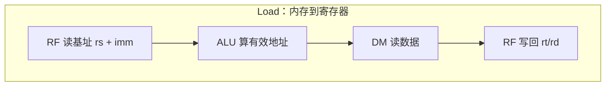
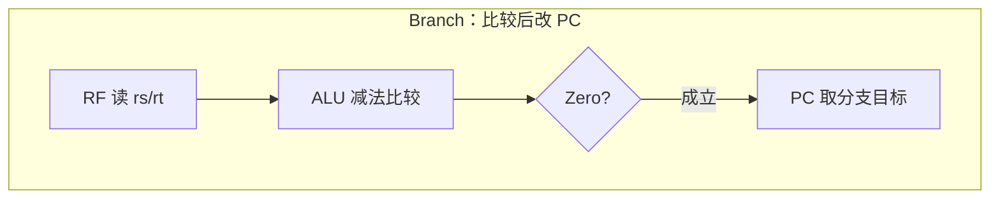
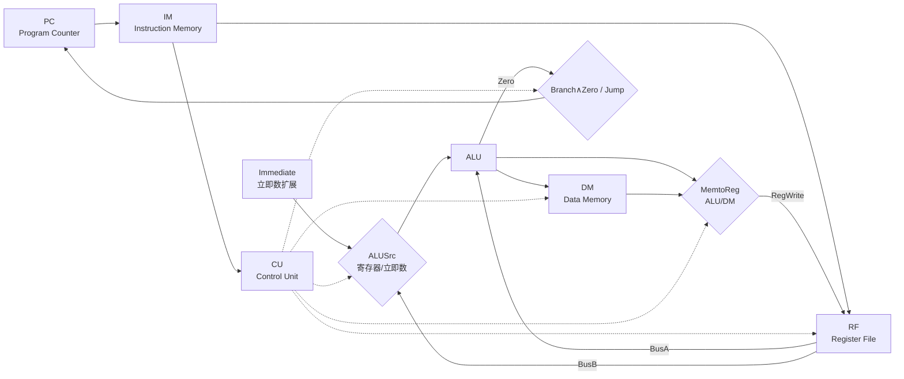
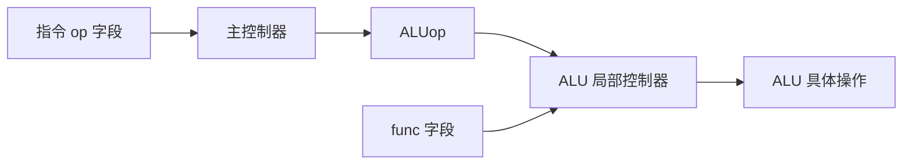
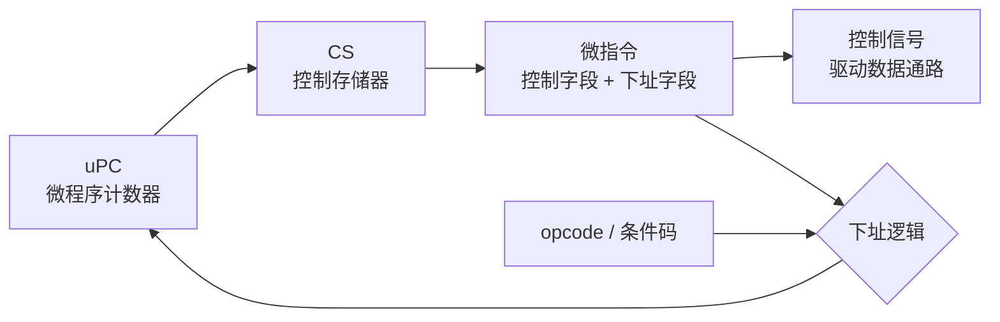
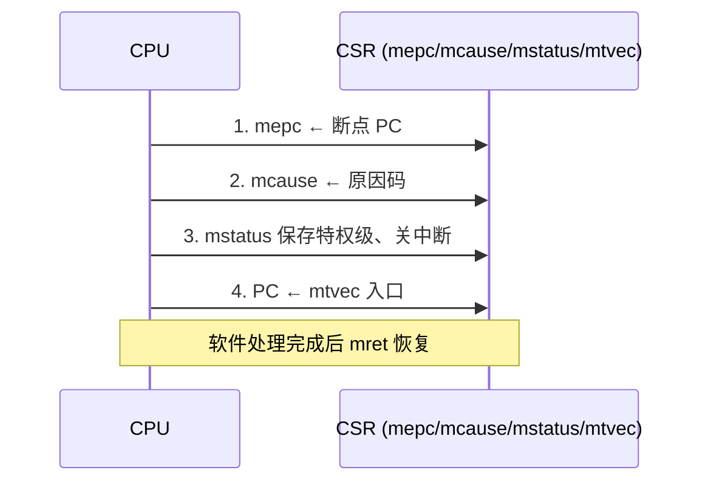

# 课件 05 — 中央处理器 学习指南

> **课程**：计算机组成与体系结构（H）
> **课件**：`5_中央处理器.pdf`｜NotebookLM `课件05-中央处理器`
> **原则**：按课件原序、按知识点分块、**课件板块无遗漏**
> **课堂**：Week 2（单周期数据通路）、Week 6（多周期 FSM）
> **Lab**：Lab1（五级流水 + 转发/阻塞，与单周期/多周期概念衔接）
> **教材章节**：唐朔飞《计算机组成原理》第 2 版 **第 5 章**；Patterson RISC-V 版 **第 4 章**
> **周次指南交叉引用**：[计组-Week1-3-学习指南](计组-Week1-3-学习指南.md)（§2.2 单周期通路）、[计组-Week4-6-学习指南](计组-Week4-6-学习指南.md)（§2.x 多周期）
> **原始采集**：`notebooklm-raw/kejian05/runs/20260619-233409/`（5/5 batch ✅）
> **结构图**：`notebooklm-raw/kejian/structure-map.md` §05
> **监修标准**：[计组-课件学习指南监修标准](计组-课件学习指南监修标准.md)
> **首轮监修**：2026-06-21｜状态：已首轮监修（A-）｜重点：数据通路、控制信号、异常/CSR
> **整合日期**：2026-06-19
> **术语格式**：术语表及正文**首次出现**时，专业名词采用 **中文（English）**；英文缩写采用 **缩写（English full name，中文）**，便于对照英文课件、教材与开卷试题。

---

## 课件内容覆盖索引

| 课件原序 | 课件板块 | Slide（约） | 本指南 | 状态 |
|----------|----------|-------------|--------|------|
| 1 | 单周期数据通路（CPU 功能、执行过程、R/M/分支通路） | ≈1–15 | Part A · 块 A.1–A.3 ⭐ | ✅ |
| 2 | 单周期控制器（控制信号、ALU 局部控制） | ≈16–25 | Part B · 块 B.1–B.3 ⭐ | ✅ |
| 3 | 多周期处理器（阶段划分、FSM） | ≈26–40 | Part C · 块 C.1–C.3 | ✅ |
| 4 | 微程序控制器与异常/中断 | ≈41+ | Part D · 块 D.1–D.3 ⭐ | ✅ |

---

## 缩写速查

| 缩写 | 解释 |
|------|------|
| **CPU** | Central Processing Unit，中央处理器 |
| **ALU** | Arithmetic Logic Unit，算术逻辑单元 |
| **CU** | Control Unit，控制器 |
| **PC** | Program Counter，程序计数器 |
| **RF** | Register File，寄存器堆 |
| **IM / DM** | Instruction Memory / Data Memory，指令存储器 / 数据存储器 |
| **IF / ID / EX / MEM / WB** | Instruction Fetch / Instruction Decode / Execute / Memory Access / Write Back，取指 / 译码或读寄存器 / 执行 / 访存 / 写回 |
| **CSR** | Control and Status Register，控制状态寄存器 |

---

## 本章怎么用（开卷复习路径）

1. **先查数据通路图**：R/Load/Branch 三类指令先沿 PC、寄存器堆、ALU、存储器、写回 MUX 走一遍。
2. **控制信号题先定指令类型**：先判 R/I/Load/Store/Branch/Jump，再填 RegWrite、ALUSrc、MemWrite、MemtoReg 等信号。
3. **多周期题看 FSM**：先写公共前缀 IF/ID，再按 lw/sw/R/beq/j 走不同状态；不要把多周期和流水线混成多指令重叠。
4. **异常/CSR 作为 Lab5–6 铺垫**：本章给硬件保存现场流程，虚存和 Page Fault 细节回到 [课件 7b](计组-课件07b-学习指南.md)。

| 定位 | 使用方式 |
|------|----------|
| 课件 | `5_中央处理器.pdf`，按单周期 → 控制器 → 多周期 FSM → 异常/中断查 |
| 教材 | 唐朔飞第 5 章与 P&H 第 4 章补处理器组织 |
| Lab | Lab1 对数据通路；Lab5–6 对 CSR/异常路径做后续交叉 |
| 周次 | Week2 讲单周期，Week6 讲多周期；课件原序与授课周次不完全一致 |

---

## Part A — 单周期数据通路（Lab1 基础 ⭐）

> **本节要回答**：为什么学完 ISA（Instruction Set Architecture，指令集体系结构）后要进入数据通路？CPU 内部哪些模块负责“存状态”、哪些模块负责“算结果”、哪些模块负责“选路径”？单周期 CPU 如何让一条指令在一个周期内完成 IF→WB？

### 块 A.1 从 ISA 到数据通路：把“指令语义”落成硬件路径

课件 04 已经回答“指令长什么样、字段如何编码、软件能看到哪些寄存器和内存操作”。课件 05 接着回答更低一层的问题：给定一条已经取出的指令，硬件如何在一个时钟周期内把它变成寄存器读、ALU 运算、访存、写回和 PC 更新。这里的关键不是背模块名，而是建立三条边界：

| 抽象层 | 本章关注点 | 边界 |
|--------|------------|------|
| **ISA** | 指令格式、寄存器编号、立即数、Load/Store 语义 | 软件可见；告诉硬件“要做什么” |
| **数据通路（Datapath）** | PC、IM、RF、ALU、DM、MUX 等连接 | 硬件组织；提供“数据能怎么走” |
| **控制器（Control Unit）** | 根据 opcode/funct 产生控制信号 | 选择本条指令“实际走哪条路” |

> **边界说明：** ISA 规定 `lw rd, offset(rs1)` 的语义是“从 `rs1+offset` 地址取数写入 `rd`”；数据通路必须提供“读 rs1 → ALU 算地址 → DM 读数 → RF 写回”的硬件路径；控制器则负责让 ALUSrc、MemtoReg、RegWrite 等信号选中这些路径。（来源：kejian05-partA-datapath）

### 块 A.2 指令执行五阶段：一条指令的硬件任务拆解

单周期 CPU（Single-cycle CPU，单周期处理器）的约束是：一条指令从取指到写回都在同一个时钟周期内完成。IF/ID/EX/MEM/WB 是理解任务顺序的名字，不表示这里真的有五个时钟周期。

| 阶段缩写 | 英文全称 | 中文名 | 本阶段回答的问题 |
|----------|----------|--------|------------------|
| **IF** | Instruction Fetch | 取指 | PC 指向哪条指令？如何同时准备顺序地址 PC+4？ |
| **ID** | Instruction Decode | 译码 / 读寄存器 | opcode/funct 说明什么操作？源寄存器读出哪些值？ |
| **EX** | Execute | 执行 | ALU 做运算、比较，还是计算访存有效地址？ |
| **MEM** | Memory Access | 访存 | Load/Store 是否访问数据存储器？读还是写？ |
| **WB** | Write Back | 写回 | 最终写回 RF 的是 ALU 结果还是内存数据？ |

> **易错提醒：** 单周期里“五阶段”是逻辑任务分段，不是流水线重叠执行。真正的流水线会让多条指令分处不同阶段，课件 06 和 Lab1 再展开。（来源：kejian05-partA-datapath、kejian05-mistakes）

### 块 A.3 数据通路元件：谁保存状态，谁做组合计算？

| 模块 | 类型 | 主要职责 | 读图时关注 |
|------|------|----------|------------|
| **PC（Program Counter，程序计数器）** | 时序状态 | 保存当前指令地址，在时钟边沿更新为 PC+4、分支目标或跳转目标 | 下一条 PC 从哪一路 MUX 来 |
| **IM（Instruction Memory，指令存储器）** | 组合读接口 | 用 PC 取出指令，给 RF/CU/立即数扩展器提供字段 | 指令字段同时送往多个模块 |
| **RF（Register File，寄存器堆）** | 双读组合、单写时序 | 读 rs/rt 两个源操作数，周期末按 RegWrite 写目的寄存器 | 哪条指令写寄存器、写哪个字段 |
| **ALU（Arithmetic Logic Unit，算术逻辑单元）** | 组合逻辑 | 做算术逻辑运算、地址计算、分支比较并产生 Zero | 第二操作数来自寄存器还是立即数 |
| **DM（Data Memory，数据存储器）** | 读写存储接口 | Load 读数据，Store 写数据 | 是否启用 MemWrite/MemRead |
| **MUX（Multiplexer，多路选择器）** | 组合选路 | 在多个候选输入间选一路 | 每个 MUX 对应哪个控制信号 |
| **CU（Control Unit，控制单元）** | 组合译码 | 由指令字段产生控制信号 | 它不搬数据，只发“开关/选路” |

单周期常把 IM 与 DM 分离，是因为同一周期内既要取指又可能访存；若只有单端口统一存储器，`lw/sw` 会和 IF 争同一个端口，形成结构冲突。（来源：kejian05-partA-datapath、kejian05-mistakes）

> **直观理解：** 数据通路像“道路网”，PC/RF/DM 是能保存状态的站点，ALU/MUX/扩展器是周期内部的组合加工与选路，CU 则根据当前指令发红绿灯。

### 块 A.4 三类指令数据流：先按用途读路径

下面的图要解决“R 型、Load、Branch 三类指令在单周期通路里分别走哪些硬件”。RF 表示 Register File（寄存器堆），DM 表示 Data Memory（数据存储器），Zero 是 ALU 比较结果标志。

图中三条路径分别回答三类高频题：

| 类型 | 核心数据流 | 关键区别 | 关键控制 |
|------|------------|----------|----------|
| **R 型** | RF → ALU → RF | 不访问 DM；写回 ALU 结果 | RegWrite=1, ALUSrc=0, MemtoReg=0 |
| **Load** | RF + imm → ALU → DM → RF | 多走一次 DM 读；写回内存数据 | RegWrite=1, ALUSrc=1, MemtoReg=1 |
| **分支** | RF → ALU 比较 → PC | 通常不写 RF/DM；只可能改 PC | Branch=1, ALU 做减法，结合 Zero |

> **读图提示：** 不要把三条路径叠成“一条指令全都走”。`add` 不读 DM，`lw` 不用 ALU 结果直接写回，`beq` 主要关心 Zero 与 PC 选择。做题时先判指令类型，再沿对应路径找控制信号。（来源：kejian05-partA-datapath）

### 块 A.5 为什么 `lw` 常成为单周期关键路径？

`lw`（Load Word，按字读取）被反复拿来讲，不是因为它语义最复杂，而是因为它在单周期实现里经过的硬件最多：PC 取指、RF 读基址、ALU 算地址、DM 读数据、RF 写回都必须在同一个周期内完成。

| 指令 | 主要硬件路径 | 对时钟周期的影响 |
|------|--------------|------------------|
| `add` | PC → IM → RF → ALU → RF | 不访问 DM，路径较短 |
| `sw` | PC → IM → RF → ALU → DM | 不写回 RF，但要写 DM |
| `lw` | PC → IM → RF → ALU → DM → RF | 读 DM 后还要写回 RF，通常最长 |

> **直观理解：** 单周期时钟像统一关门时间。短指令提前做完也不能先进入下一条，必须等最慢的 `lw` 也能完成，主频因此被关键路径限制。（来源：kejian05-partA-datapath、kejian05-partC-multicycle）

---

## Part B — 单周期控制器（Week 2 核心 ⭐）

> **本节要回答**：控制器如何把 opcode/funct 译成数据通路上的 MUX 选择与写使能？真值表为什么这样填？遇到控制信号题如何按固定步骤求解？

### 块 B.1 控制器的职责：不搬数据，只决定“开关与选路”

数据通路给出了所有可能路径，但同一条指令只会启用其中一部分。控制器（Control Unit，控制单元）读取指令中的 opcode/funct 字段，产生一组控制信号。可以把信号分成两类：**写使能**决定周期末是否改状态，**MUX 选择**决定组合路径选哪一路。

| 类别 | 信号 | 作用 | 常见为 1 的情况 |
|------|------|------|----------------|
| 写使能 | **RegWrite** | 周期末写 RF | R 型、`ori`、`lw` |
| 写使能 | **MemWrite** | 写 DM | `sw` |
| MUX 选择 | **ALUSrc** | ALU 第二操作数选立即数而非寄存器 BusB | `ori/lw/sw` |
| MUX 选择 | **RegDst** | 写寄存器地址选 rd 而非 rt | MIPS R 型 |
| MUX 选择 | **MemtoReg** | RF 写回数据选 DM 输出而非 ALU 结果 | `lw` |
| PC 选择 | **Branch** | 与 Zero 共同决定 PC 取分支目标 | `beq` |
| PC 选择 | **Jump** | PC 取无条件跳转目标 | `j` |
| 立即数处理 | **ExtOp** | 1=符号扩展，0=零扩展 | `lw/sw` 符号扩展，`ori` 零扩展 |

> **边界说明：** 本课件真值表以 MIPS 风格信号讲解，RISC-V Lab 中字段位置和部分控制名会不同，但思路相同：先确定写回、访存、ALU 操作数、PC 来源，再落到实现信号。Lab 细节见 `计组-Lab1-6-整合指南.md` 的 Lab1–3。（来源：kejian05-partB-control、guides/计组-Lab1-6-整合指南.md）

### 块 B.2 控制信号与数据通路图：图前先找 MUX

下面的图只保留控制信号最常落点。读图时先找两个写口（RF、DM），再找三个选择点（ALU 第二操作数、写回数据、下一条 PC）。

> **读图提示：** 虚线表示控制信号，不表示数据被 CU 搬运。CU 决定 MUX 选哪边、写口是否打开；真正的数据仍沿 PC/IM/RF/ALU/DM/RF 流动。（来源：kejian05-partB-control）

### 块 B.3 代表性指令控制真值表：先理解 `X`

表头中的 RegWr 是 RegWrite（寄存器写使能）的缩写，MemWr 是 MemWrite（数据存储器写使能）的缩写；RegDst/MemtoReg 是 MIPS 课件常用控制信号，RISC-V Lab 中会因六种格式和统一 rd 字段而改名或消失。

| 指令 | RegWr | RegDst | ALUSrc | MemWr | MemtoReg | Branch | Jump | ExtOp |
|------|:-----:|:------:|:------:|:-----:|:--------:|:------:|:----:|:-----:|
| add/sub | 1 | 1 | 0 | 0 | 0 | 0 | 0 | X |
| ori | 1 | 0 | 1 | 0 | 0 | 0 | 0 | 0 |
| lw | 1 | 0 | 1 | 0 | 1 | 0 | 0 | 1 |
| sw | 0 | X | 1 | 1 | X | 0 | 0 | 1 |
| beq | 0 | X | 0 | 0 | X | 1 | 0 | X |
| jump | 0 | X | X | 0 | X | 0 | 1 | X |

`X` 表示 don't care（无关项）：该指令不会使用这个选择结果。例如 `sw` 不写寄存器，所以 RegDst/MemtoReg 选什么都不会被写口采纳；`beq` 不写回 RF，所以 MemtoReg 无意义。

**课件 MIPS 信号 vs RISC-V/Lab 口径（轻量边界）**：

| 课件信号 | MIPS 语境 | RISC-V / Lab 注意 |
|----------|-----------|-------------------|
| RegDst | 选择 rt/rd 作为写回寄存器 | RISC-V 各格式 rd 字段位置更统一，Lab 常直接译出 rd |
| Jump | MIPS `j` 绝对/伪直接跳转 | RISC-V 主要是 `jal`/`jalr`，还要写回 `pc+4` |
| ExtOp | 零扩展/符号扩展选择 | RISC-V 立即数生成更细，按 I/S/B/U/J 格式拼接并符号扩展 |

> **易错提醒：** `MemWrite=0` 不等于“完全不访问内存”。`lw` 需要读 DM，但课件表有时不单列 MemRead；若题目要求 MemRead，应给 `lw=1`、其他通常为 0。若题目来自 Lab 或 RISC-V 指令编码，优先按实验实现和 Week1-3 的 RISC-V 数据通路口径。（来源：kejian05-partB-control）

### 块 B.4 解题模板：以 `lw` 控制信号为例

**题目场景**：单周期 MIPS 风格数据通路执行 `lw rt, imm(rs)`。

**已知**：`lw` 语义为 `Reg[rt] ← Mem[Reg[rs] + sign_ext(imm)]`；控制信号集合为 RegWrite、RegDst、ALUSrc、MemWrite、MemtoReg、Branch、Jump、ExtOp。

**求**：填写本条指令各控制信号。

步骤：

1. 判断是否写寄存器：`lw` 最终把内存数据写入 `rt`，所以 RegWrite=1，RegDst=0。
2. 判断 ALU 第二操作数：地址由 `rs + imm` 得到，第二操作数来自立即数，所以 ALUSrc=1，ExtOp=1。
3. 判断是否访存写：`lw` 是读内存，不写内存，所以 MemWrite=0；若题目列 MemRead，则 MemRead=1。
4. 判断写回来源：写回数据来自 DM，不是 ALU 结果，所以 MemtoReg=1。
5. 判断 PC 控制：不是条件分支也不是跳转，所以 Branch=0，Jump=0。

**结果解释**：`lw` 的控制信号会选中“RF 读基址 → ALU 算地址 → DM 读 → RF 写回”路径，也正因为它串过 IM/RF/ALU/DM/RF，常被用来说明单周期关键路径。（来源：kejian05-partB-control、Week1-3 §2.2）

> **易错提醒：** 做控制信号题不要从表格死背开头。先写出语义，再按“写不写 RF → ALU 操作数 → 读/写 DM → 写回来源 → PC 是否改变”的顺序推，遇到 RISC-V 字段差异也不容易乱。

### 块 B.5 两级译码：主控制与 ALU 局部控制分工

下面的图要解决“主控制器和 ALU 局部控制器为什么分两级”。OP 是 opcode（操作码）字段，func 是 MIPS R 型功能字段；RISC-V 中对应 funct3/funct7。

两级译码的目的，是避免主控制器把所有 ALU 细节都摊平处理：

| 层级 | 输入 | 输出 | 适合回答 |
|------|------|------|----------|
| **主控制器（Main Control）** | opcode / op 字段 | RegWrite、ALUSrc、MemWrite、Branch、Jump、ALUop 等 | 这类指令大体走哪条通路 |
| **ALU 局部控制器（ALU Control）** | ALUop + func 字段 | ALU 具体做 add/sub/and/or/slt 等 | R 型内部到底是哪种运算 |

> **读图提示：** `beq` 这类非 R 型指令不需要 func 字段，主控通过 ALUop 直接要求 ALU 做减法比较；R 型指令才需要 ALU 局部控制器继续看 func。（来源：kejian05-partB-control）

（来源：kejian05-partB-control、[Week1-3 指南](计组-Week1-3-学习指南.md) §2.2）

---

## Part C — 多周期处理器与 FSM（Week 6）

> **本节要回答**：单周期为何低效？多周期如何复用资源？各类指令 FSM 状态序列是什么？

### 块 C.1 单周期局限

| 问题 | 原因 |
|------|------|
| 时钟慢 | 周期宽度 = 最慢指令（lw） |
| 资源浪费 | 简单指令大部分时间在等 |
| 面积大 | 需多个加法器、分离 IM/DM |

### 块 C.2 多周期阶段与资源复用

- 将指令拆为 IF（Instruction Fetch，取指）/ ID（Instruction Decode，译码）/ EX（Execute，执行）/ MEM（Memory Access，访存）/ WB（Write Back，写回），每段一个较短时钟
- **同一 ALU** 可分时计算 PC+4、分支地址、运算
- 引入 **IR、MDR、A、B、ALUOut** 等中间锁存器保存段间数据

（来源：kejian05-partC-multicycle）

### 块 C.3 FSM 状态迁移

| 指令类型 | 状态序列（课件 05 编号） |
|----------|-------------------------|
| 公共前缀 | 0 取指 → 1 译码 |
| lw | 1 → 2 算址 → 3 读存 → 4 写回 |
| sw | 1 → 2 算址 → 5 写存 |
| R 型 | 1 → 6 执行 → 7 写回 |
| beq | 1 → 8 分支 |
| j | 1 → 9 跳转 |

CPI > 1，但时钟周期更短，整体往往优于单周期。（来源：kejian05-partC-multicycle、[Week4-6 指南](计组-Week4-6-学习指南.md)）

---

## Part D — 微程序控制与异常/中断（Lab5/6 铺垫 ⭐）

> **本节要回答**：复杂控制器为什么可以用“微程序”组织？异常/中断要解决什么问题？RISC-V 硬件如何保存现场、切换特权状态并跳到处理入口？

### 块 D.1 控制器实现问题：信号太多时怎么组织？

前面 Part B 的单周期主控制器可以看成一张组合逻辑真值表；Part C 的多周期控制器可以看成 FSM（Finite State Machine，有限状态机）。当 ISA 更复杂、每条机器指令内部要拆成很多小步骤时，直接用硬连线逻辑维护会很难，于是课件引入微程序控制：把“每拍发哪些控制信号、下一拍去哪”写成一条条微指令，存在控制存储器里。

| 维度 | 硬连线 | 微程序 |
|------|--------|--------|
| 实现 | PLA/FSM 组合逻辑 | 控制存储器 CS（Control Store，控制存储器）+ 微指令 |
| 速度 | 快 | 较慢（需访控存） |
| 灵活性 | 难改、难增指令 | 易维护扩展 |
| 适用 | RISC（MIPS/RISC-V） | CISC |

> **直观理解：** 硬连线像把控制流程焊死在电路里，适合规则、短路径的 RISC；微程序像在控制器内部跑一段“微代码”，适合把复杂机器指令拆成多个内部微操作。（来源：kejian05-partD-micro-exception、kejian05-mistakes）

### 块 D.2 微指令与下址：控制信号从哪里来、下一拍去哪？

微程序控制器每个周期做两件事：取出当前微指令，发出其中编码的微命令；再根据下址逻辑决定下一条微指令地址。

| 机制 | 含义 | 适用理解 |
|------|------|----------|
| **水平型微指令** | 一条微指令同时给出多个并行微命令，字长较长 | 执行步数少、并行度高，但控制字宽 |
| **垂直型微指令** | 微命令编码更规整，一条微指令携带的信息较少 | 控制字短，但微程序可能更长 |
| **增量法** | uPC 自动 +1 取下一条微指令 | 顺序微流程 |
| **断定法 / 下址字段法** | 微指令显式给下址，或按 opcode/条件码分支 | 分支、不同机器指令入口 |

> **读图提示：** 图里的 uPC 是微程序内部 PC，不是程序员可见的 PC。前者决定下一条“微指令”，后者决定下一条“机器指令”。混淆这两个 PC，容易把微程序流程和普通取指流程混在一起。（来源：kejian05-partD-micro-exception）

### 块 D.3 异常/中断：先看要解决的问题

正常执行流假设 PC 顺序前进或按分支跳转；异常/中断机制要处理的是“当前指令流必须被打断，但机器状态仍要可恢复、可解释、可安全返回”。因此硬件至少要回答四个问题：断点在哪里、为什么打断、接下来跳到哪里、返回时如何恢复特权与中断使能。

| 维度 | 异常（同步） | 中断（异步） |
|------|-------------|-------------|
| 来源 | CPU 内部，与当前指令相关 | 外部设备或计时器，与当前指令流不直接绑定 |
| 时机 | 指令执行过程中检出 | 通常在指令结束 / 提交边界采样 |
| 例子 | 非法指令、`ecall`、Page Fault、地址不对齐 | 定时器中断、外部 I/O 中断、软件中断 |
| PC 保存 | 通常保存受累指令 PC，便于重试或定位 | 通常保存下一条将执行的 PC，便于返回继续 |

> **边界说明：** Page Fault 是异常不是中断，因为它由当前取指或 Load/Store 的地址翻译触发，和当前指令同步。Sv39、PTE 权限、TLB 等细节不在本 Part 展开，复习时跳到 `计组-Lab1-6-整合指南.md` 的 Lab5–6 与课件 07b。（来源：kejian05-partD-micro-exception、guides/计组-Lab1-6-整合指南.md）

### 块 D.4 RISC-V 异常处理硬件流程：CSR 是现场记录本

CSR（Control and Status Register，控制状态寄存器）保存处理异常/中断所需的全局状态。这里重点抓四个寄存器：`mepc` 记录断点 PC，`mcause` 记录原因，`mstatus` 记录特权级与中断使能，`mtvec` 给出处理入口。

| 步骤 | 硬件动作 |
|------|----------|
| 保存断点 | mepc ← 受累/下条 PC |
| 记录原因 | mcause ← 异常/中断编号 |
| 切换特权 | mstatus 保存 MIE→MPIE，提升为 M 模式 |
| 跳转 | PC ← mtvec |
| 返回 | `mret` 恢复 PC 与 mstatus |

> **读图提示：** 这张图只画“进入 trap（陷入）”的硬件原子动作。真正的软件处理函数会从 `mtvec` 开始执行，检查 `mcause`，必要时读取 `mtval`，处理完成后执行 `mret` 返回；流水线 CPU 还必须 flush 年轻指令以保证精确异常，细节见 Lab6 专章。（来源：kejian05-partD-micro-exception、guides/计组-Lab1-6-整合指南.md）

### 块 D.5 示例题：`ecall` 进入 M 模式时硬件做什么？

**题目场景**：当前在 U 模式执行到地址 `0x8000_1040` 的 `ecall`，机器实现按 RISC-V trap 流程进入 M 模式。

**已知**：`mtvec = 0x8000_0100`；`ecall` 是同步异常；本题只问硬件必须更新的关键 CSR 与 PC，不要求写软件 handler。

**求**：`mepc`、`mcause`、`mstatus`、PC 的变化，以及返回依赖哪条指令。

步骤：

1. 判定事件类型：`ecall` 由当前指令主动触发，属于同步异常。
2. 保存断点：`mepc ← 0x8000_1040`，因为返回后通常要让软件决定如何推进或恢复。
3. 记录原因：`mcause ← ecall 对应原因码`；具体编码按特权规范或题目给定表填写。
4. 切换状态：`mstatus` 保存原中断使能和特权级，进入 M 模式并关闭全局中断。
5. 跳转入口：`PC ← mtvec = 0x8000_0100`，开始执行异常处理程序。
6. 返回：处理程序最后执行 `mret`，硬件从 `mepc` 恢复 PC，并恢复 `mstatus` 中的特权与中断使能字段。

**结果解释**：异常处理不是“只改 PC”。它同时保存断点、记录原因、切换特权状态、跳转处理入口；否则软件既不知道为什么进 handler，也无法安全返回。（来源：kejian05-partD-micro-exception、Lab5/6）

> **易错提醒：** 异常/中断题要先判同步/异步，再判保存哪个 PC；不要把 `mtvec` 当返回地址，`mtvec` 是入口，`mepc` 才是返回所依赖的断点。

### 块 D.6 与 Lab4–6 的轻量链接

| 机制 | 本 Part 讲到什么 | 详细复习入口 |
|------|------------------|--------------|
| CSR | `mepc/mcause/mstatus/mtvec` 的用途 | `计组-Lab1-6-整合指南.md` Part Lab4 |
| ECALL/MRET | trap 进入与返回的硬件动作 | `计组-Lab1-6-整合指南.md` Part Lab5 |
| 异常/中断精确处理 | 同步/异步、提交边界、flush 直觉 | `计组-Lab1-6-整合指南.md` Part Lab6 |

（来源：kejian05-partD-micro-exception、Lab5/6）

---

## 易混概念对比（期末速查）

| 概念组 | 易混原因 | 正确理解 |
|--------|----------|----------|
| 单周期 vs 多周期 vs 流水 | 都说「分阶段」 | 单周期=1 周期 1 指令；多周期=多周期 1 指令且可复用 ALU；流水=多指令重叠、需段间寄存器 |
| 组合 vs 时序逻辑 | 都在数据通路里 | 组合无记忆（ALU/MUX）；时序有记忆（PC/寄存器堆），靠时钟写 |
| 硬连线 vs 微程序 | 都产生控制信号 | 前者 PLA/FSM 直接出信号；后者从控存取微指令 |
| 异常 vs 中断 | 都打断正常流 | 异常同步、与当前指令相关；中断异步、外部触发 |
| 数据通路 vs 控制器 | 都是 CPU 部件 | 通路搬数据；控制器译码发控制信号 |

（来源：kejian05-mistakes）

---

## 与周次指南对照

| 本指南 Part | 周次指南 | 说明 |
|-------------|----------|------|
| Part A/B | [Week1-3](计组-Week1-3-学习指南.md) §2.2 | 单周期数据通路、控制信号（Week 2） |
| Part C | [Week4-6](计组-Week4-6-学习指南.md) | 多周期 CPU、FSM（Week 6） |
| Part D | [Week4-6](计组-Week4-6-学习指南.md)、Lab5/6 | 异常/中断、CSR |

---

## 复习优先级

| 优先级 | 范围 | 说明 |
|--------|------|------|
| **极高** | Part A/B | 单周期通路与控制真值表，Lab1 基础 |
| 高 | Part C | 多周期 FSM 状态序列 |
| 高 | Part D | 异常处理流程，Lab5/6 直接对应 |

---

## 追问块

> **追问 1**：单周期为何要把指令存储器和数据存储器分开？

> **答**：同一周期内既要取指又要访存，若共用单端口存储器会产生**结构冒险**；分离 IM/DM 可在单周期内并行完成 IF 与 MEM。（来源：kejian05-partA-datapath）

> **追问 2**：`lw` 指令为何决定单周期 CPU 的主频上限？

> **答**：单周期要求所有指令在**同一时钟宽度**内完成；`lw` 路径最长（取指+译码+算址+读存+写回），时钟周期必须容纳其全程。（来源：kejian05-partA-datapath、kejian05-partC-multicycle）

> **追问 3**：多周期为何能用同一个 ALU 做不同事？

> **答**：不同操作发生在**不同时钟周期**，资源**分时复用**；段间用 IR、ALUOut 等锁存器保存中间结果。（来源：kejian05-partC-multicycle）

> **追问 4**：主控制器为何不直接看 `func` 字段？

> **答**：采用**两级译码**：主控只看 `op` 简化逻辑；R 型具体运算由 ALU 局部控制器结合 `func` 决定，模块化且易扩展。（来源：kejian05-partB-control）

> **追问 5**：Page Fault 算异常还是中断？

> **答**：**异常**（同步）——由当前 load/store 指令触发，与指令执行同步检出；处理时保存 mepc 指向该条指令以便恢复。（来源：kejian05-partD-micro-exception、Lab6）

---

## 监修自检（首轮）

| 维度 | 状态 | 本章结论 |
|------|------|----------|
| 来源/覆盖 | 通过 | 课件覆盖索引、deep raw、structure-map 与周次指南均已列出；首轮按 `计组-课件学习指南监修标准.md` 核对。 |
| 结构完整 | 通过 | 元信息、覆盖索引、Part 正文、易混对比、复习优先级、追问/资料索引齐全。 |
| 难点讲解 | 通过 | 已保留本章核心机制、公式或状态流程，避免只列术语。 |
| 图示/数值例 | 通过 | 首轮已补足可开卷查用的图示或手算例；非主考章节保持轻量。 |
| Lab/复习交叉 | 通过 | 已标注相关 Lab 与周次指南；Lab4-6 相关内容按期末重点突出。 |
| 二轮升级 | 完成 | 已补「本章怎么用」并突出数据通路、控制信号、FSM 与异常/CSR 的复习分工。 |

> **二轮 review 建议**：二轮可补 RISC-V 实验控制信号与课件 MIPS 信号差异。

---

## 资料索引

| 类型 | 文件 / 路径 | 说明 |
|------|-------------|------|
| 课件 | `3_课件/5_中央处理器.pdf` | 本指南主线 |
| 周次指南 | `guides/计组-Week1-3-学习指南.md` | Week 2 课堂主线 |
| 周次指南 | `guides/计组-Week4-6-学习指南.md` | Week 6 多周期 |
| 实验 | [26-Arch Wiki Lab1](https://github.com/26-Arch/26-Arch/wiki/)、`26-Arch/Doc/Lab1/report.md` | 数据通路实现 |
| deep raw | `notebooklm-raw/kejian05/runs/20260619-233409/` | 5 batch 深采 ✅ |
| discovery raw | `notebooklm-raw/kejian/runs/latest/kejian05-structure.answer.md` | L0 结构 ✅ |
| 结构图 | `notebooklm-raw/kejian/structure-map.md` §05 | Part 边界 |
| 课件索引 | `guides/计组-课件梳理索引.md` | 双轨进度 |
| 教材 | 唐朔飞第 2 版 **第 5 章**；P&H RISC-V **第 4 章** | CPU 组织 |
