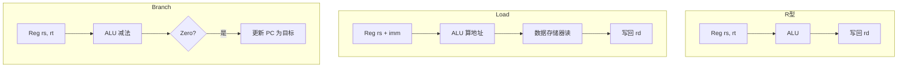
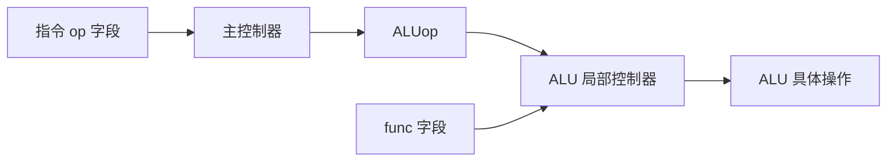
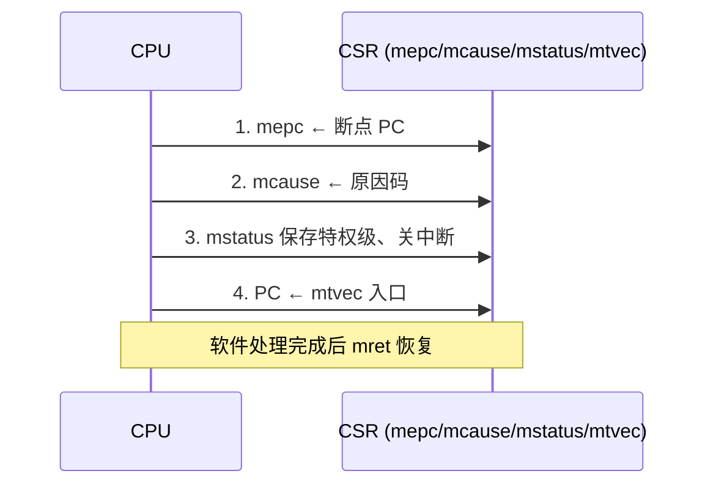

# 课件 05 — 中央处理器 学习指南

> **课程**：计算机组成与体系结构（H）  
> **课件**：`5_中央处理器.pdf`｜NotebookLM `课件05-中央处理器`  
> **原则**：按课件原序、按知识点分块、**课件板块无遗漏**  
> **课堂**：Week 2（单周期数据通路）、Week 6（多周期 FSM）  
> **Lab**：Lab1（五级流水 + 转发/阻塞，与单周期/多周期概念衔接）  
> **教材章节**：唐朔飞《计算机组成原理》第 2 版 **第 5 章**；Patterson RISC-V 版 **第 4 章**  
> **周次指南交叉引用**：[计组-Week1-3-学习指南](计组-Week1-3-学习指南.md)（§2.2 单周期通路）、[计组-Week4-6-学习指南](计组-Week4-6-学习指南.md)（§2.x 多周期）  
> **原始采集**：`notebooklm-raw/kejian05/runs/20260619-233409/`（5/5 batch ✅）  
> **结构图**：`notebooklm-raw/kejian/structure-map.md` §05  
> **整合日期**：2026-06-19

---

## 课件内容覆盖索引

| 课件原序 | 课件板块 | Slide（约） | 本指南 | 状态 |
|----------|----------|-------------|--------|------|
| 1 | 单周期数据通路（CPU 功能、执行过程、R/M/分支通路） | ≈1–15 | Part A · 块 A.1–A.3 ⭐ | ✅ |
| 2 | 单周期控制器（控制信号、ALU 局部控制） | ≈16–25 | Part B · 块 B.1–B.3 ⭐ | ✅ |
| 3 | 多周期处理器（阶段划分、FSM） | ≈26–40 | Part C · 块 C.1–C.3 | ✅ |
| 4 | 微程序控制器与异常/中断 | ≈41+ | Part D · 块 D.1–D.3 ⭐ | ✅ |

---

## Part A — 单周期数据通路（Lab1 基础 ⭐）

> **本节要回答**：单周期 CPU 如何完成 IF→WB？数据通路有哪些组合/时序元件？R/Load/分支三类指令数据流有何不同？

### 块 A.1 指令执行五阶段

| 阶段 | 缩写 | 动作 |
|------|------|------|
| 取指 | IF | 按 PC 读指令存储器，计算 PC+4 |
| 译码 | ID | 译码产生控制信号，读寄存器堆 |
| 执行 | EX | ALU 运算或算有效地址 |
| 访存 | MEM | Load/Store 读写数据存储器；其他指令空操作 |
| 写回 | WB | 结果写回目的寄存器 |

（来源：kejian05-partA-datapath）

### 块 A.2 数据通路元件

| 类型 | 元件 | 作用 |
|------|------|------|
| **组合逻辑** | ALU、MUX、扩展器 | 运算、选路、立即数符号/零扩展 |
| **时序逻辑** | PC、寄存器堆、存储器接口 | 状态保存；时钟边沿更新 |

单周期常将**指令存储器与数据存储器物理分离**，避免结构冒险。（来源：kejian05-partA-datapath）

### 块 A.3 三类指令数据流

| 类型 | 数据流 | 关键控制 |
|------|--------|----------|
| **R 型** | Reg→ALU→Reg | RegWrite=1, ALUSrc=0 |
| **Load** | Reg+imm→ALU→DM→Reg | MemtoReg=1, ALUSrc=1 |
| **分支** | Reg 比较→Zero→PC | Branch=1, ALU 做减法 |

> **局限**：时钟周期由最慢的 `lw` 决定，简单指令大量空等。（来源：kejian05-partA-datapath）

---

## Part B — 单周期控制器（Week 2 核心 ⭐）

> **本节要回答**：七大控制信号各控制什么？代表性指令真值表如何记？主控与 ALU 局部控制如何分工？

### 块 B.1 关键控制信号

| 信号 | 功能 |
|------|------|
| **RegWrite** | 写寄存器使能 |
| **ALUSrc** | ALU 第二操作数：0=寄存器，1=立即数 |
| **RegDst** | 写地址：0=rt(I 型)，1=rd(R 型) |
| **MemtoReg** | 写回数据：0=ALU 结果，1=存储器 |
| **MemWrite** | 存储器写使能 |
| **Branch** | 分支：1 且 Zero 则改 PC |
| **Jump** | 无条件跳转 |
| **ExtOp** | 0=零扩展，1=符号扩展 |

（来源：kejian05-partB-control）

### 块 B.2 代表性指令控制真值表

| 指令 | RegWr | RegDst | ALUSrc | MemWr | MemtoReg | Branch | Jump | ExtOp |
|------|:-----:|:------:|:------:|:-----:|:--------:|:------:|:----:|:-----:|
| add/sub | 1 | 1 | 0 | 0 | 0 | 0 | 0 | X |
| ori | 1 | 0 | 1 | 0 | 0 | 0 | 0 | 0 |
| lw | 1 | 0 | 1 | 0 | 1 | 0 | 0 | 1 |
| sw | 0 | X | 1 | 1 | X | 0 | 0 | 1 |
| beq | 0 | X | 0 | 0 | X | 1 | 0 | X |
| jump | 0 | X | X | 0 | X | 0 | 1 | X |

### 块 B.3 两级译码

- **主控**：只看 `op`，产生 RegWrite、ALUSrc 等及粗略 ALUop  
- **局部控**：R 型看 `func` 定 add/sub/and…；非 R 型由 ALUop 直接定操作  

（来源：kejian05-partB-control、[Week1-3 指南](计组-Week1-3-学习指南.md) §2.2）

---

## Part C — 多周期处理器与 FSM（Week 6）

> **本节要回答**：单周期为何低效？多周期如何复用资源？各类指令 FSM 状态序列是什么？

### 块 C.1 单周期局限

| 问题 | 原因 |
|------|------|
| 时钟慢 | 周期宽度 = 最慢指令（lw） |
| 资源浪费 | 简单指令大部分时间在等 |
| 面积大 | 需多个加法器、分离 IM/DM |

### 块 C.2 多周期阶段与资源复用

- 将指令拆为 IF / ID / EXE / MEM / WB，每段一个较短时钟  
- **同一 ALU** 可分时计算 PC+4、分支地址、运算  
- 引入 **IR、MDR、A、B、ALUOut** 等中间锁存器保存段间数据  

（来源：kejian05-partC-multicycle）

### 块 C.3 FSM 状态迁移

| 指令类型 | 状态序列（课件 05 编号） |
|----------|-------------------------|
| 公共前缀 | 0 取指 → 1 译码 |
| lw | 1 → 2 算址 → 3 读存 → 4 写回 |
| sw | 1 → 2 算址 → 5 写存 |
| R 型 | 1 → 6 执行 → 7 写回 |
| beq | 1 → 8 分支 |
| j | 1 → 9 跳转 |

CPI > 1，但时钟周期更短，整体往往优于单周期。（来源：kejian05-partC-multicycle、[Week4-6 指南](计组-Week4-6-学习指南.md)）

---

## Part D — 微程序控制与异常/中断（Lab5/6 铺垫 ⭐）

> **本节要回答**：硬连线 vs 微程序各适合什么 ISA？异常与中断有何区别？RISC-V 硬件如何处理异常？

### 块 D.1 硬连线 vs 微程序

| 维度 | 硬连线 | 微程序 |
|------|--------|--------|
| 实现 | PLA/FSM 组合逻辑 | 控制存储器 CS + 微指令 |
| 速度 | 快 | 较慢（需访控存） |
| 灵活性 | 难改、难增指令 | 易维护扩展 |
| 适用 | RISC（MIPS/RISC-V） | CISC |

微指令分**水平型**（并行微命令、字长）与**垂直型**（规整、程序长）。（来源：kejian05-partD-micro-exception）

### 块 D.2 异常 vs 中断

| 维度 | 异常（同步） | 中断（异步） |
|------|-------------|-------------|
| 来源 | CPU 内部（溢出、非法指令、ecall） | 外部设备（定时器、I/O） |
| 时机 | 指令执行过程中检出 | 通常在指令结束间采样 |
| 例子 | Page Fault、除零 | 键盘中断 |

### 块 D.3 RISC-V 异常处理硬件流程

| 步骤 | 硬件动作 |
|------|----------|
| 保存断点 | mepc ← 受累/下条 PC |
| 记录原因 | mcause ← 异常/中断编号 |
| 切换特权 | mstatus 保存 MIE→MPIE，提升为 M 模式 |
| 跳转 | PC ← mtvec |
| 返回 | `mret` 恢复 PC 与 mstatus |

（来源：kejian05-partD-micro-exception、Lab5/6）

---

## 易混概念对比（期末速查）

| 概念组 | 易混原因 | 正确理解 |
|--------|----------|----------|
| 单周期 vs 多周期 vs 流水 | 都说「分阶段」 | 单周期=1 周期 1 指令；多周期=多周期 1 指令且可复用 ALU；流水=多指令重叠、需段间寄存器 |
| 组合 vs 时序逻辑 | 都在数据通路里 | 组合无记忆（ALU/MUX）；时序有记忆（PC/寄存器堆），靠时钟写 |
| 硬连线 vs 微程序 | 都产生控制信号 | 前者 PLA/FSM 直接出信号；后者从控存取微指令 |
| 异常 vs 中断 | 都打断正常流 | 异常同步、与当前指令相关；中断异步、外部触发 |
| 数据通路 vs 控制器 | 都是 CPU 部件 | 通路搬数据；控制器译码发控制信号 |

（来源：kejian05-mistakes）

---

## 与周次指南对照

| 本指南 Part | 周次指南 | 说明 |
|-------------|----------|------|
| Part A/B | [Week1-3](计组-Week1-3-学习指南.md) §2.2 | 单周期数据通路、控制信号（Week 2） |
| Part C | [Week4-6](计组-Week4-6-学习指南.md) | 多周期 CPU、FSM（Week 6） |
| Part D | [Week4-6](计组-Week4-6-学习指南.md)、Lab5/6 | 异常/中断、CSR |

---

## 复习优先级

| 优先级 | 范围 | 说明 |
|--------|------|------|
| **极高** | Part A/B | 单周期通路与控制真值表，Lab1 基础 |
| 高 | Part C | 多周期 FSM 状态序列 |
| 高 | Part D | 异常处理流程，Lab5/6 直接对应 |

---

## 追问块

> **追问 1**：单周期为何要把指令存储器和数据存储器分开？

> **答**：同一周期内既要取指又要访存，若共用单端口存储器会产生**结构冒险**；分离 IM/DM 可在单周期内并行完成 IF 与 MEM。（来源：kejian05-partA-datapath）

> **追问 2**：`lw` 指令为何决定单周期 CPU 的主频上限？

> **答**：单周期要求所有指令在**同一时钟宽度**内完成；`lw` 路径最长（取指+译码+算址+读存+写回），时钟周期必须容纳其全程。（来源：kejian05-partA-datapath、kejian05-partC-multicycle）

> **追问 3**：多周期为何能用同一个 ALU 做不同事？

> **答**：不同操作发生在**不同时钟周期**，资源**分时复用**；段间用 IR、ALUOut 等锁存器保存中间结果。（来源：kejian05-partC-multicycle）

> **追问 4**：主控制器为何不直接看 `func` 字段？

> **答**：采用**两级译码**：主控只看 `op` 简化逻辑；R 型具体运算由 ALU 局部控制器结合 `func` 决定，模块化且易扩展。（来源：kejian05-partB-control）

> **追问 5**：Page Fault 算异常还是中断？

> **答**：**异常**（同步）——由当前 load/store 指令触发，与指令执行同步检出；处理时保存 mepc 指向该条指令以便恢复。（来源：kejian05-partD-micro-exception、Lab6）

---

## 资料索引

| 类型 | 文件 / 路径 | 说明 |
|------|-------------|------|
| 课件 | `3_课件/5_中央处理器.pdf` | 本指南主线 |
| 周次指南 | `guides/计组-Week1-3-学习指南.md` | Week 2 课堂主线 |
| 周次指南 | `guides/计组-Week4-6-学习指南.md` | Week 6 多周期 |
| 实验 | [26-Arch Wiki Lab1](https://github.com/26-Arch/26-Arch/wiki/)、`26-Arch/Doc/Lab1/report.md` | 数据通路实现 |
| deep raw | `notebooklm-raw/kejian05/runs/20260619-233409/` | 5 batch 深采 ✅ |
| discovery raw | `notebooklm-raw/kejian/runs/latest/kejian05-structure.answer.md` | L0 结构 ✅ |
| 结构图 | `notebooklm-raw/kejian/structure-map.md` §05 | Part 边界 |
| 课件索引 | `guides/计组-课件梳理索引.md` | 双轨进度 |
| 教材 | 唐朔飞第 2 版 **第 5 章**；P&H RISC-V **第 4 章** | CPU 组织 |
