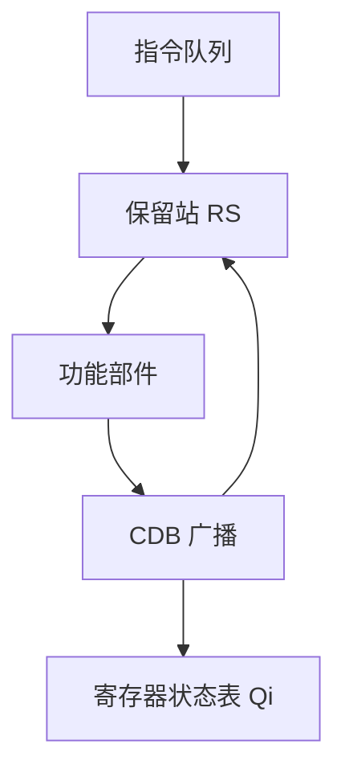
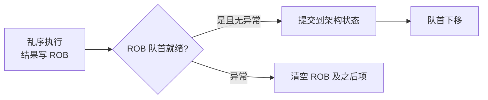

# 课件 5b — 指令级并行 学习指南

> **课程**：计算机组成与体系结构（H）
> **课件**：`5_指令级并行.pdf`｜NotebookLM `课件5b-指令级并行`
> **原则**：按课件原序、按知识点分块、**课件板块无遗漏**
> **课堂**：Week 8（ILP/Scoreboard/Tomasulo）、Week 9（短周转折）、Week 16（复习：时序表/保留站）
> **Lab**：无直接 Lab；概念与 **Lab1–3** 流水线冒险（转发/冲刷）衔接
> **教材章节**：唐朔飞《计算机组成原理》第 2 版 **第 5 章**（ILP、动态调度）；Patterson RISC-V 版 **第 5 章** §5.1–5.3（Tomasulo、推测执行）
> **周次指南交叉引用**：[计组-Week7-9-学习指南](计组-Week7-9-学习指南.md)（流水线冒险 → ILP 动态调度主线）
> **原始采集**：`notebooklm-raw/kejian05b/runs/20260619-222348/`（6/6 batch ✅）
> **结构图**：`notebooklm-raw/kejian/runs/latest/kejian05b-structure.answer.md`
> **监修标准**：[计组-课件学习指南监修标准](计组-课件学习指南监修标准.md)
> **首轮监修**：2026-06-21｜状态：已首轮监修（A）｜重点：Tomasulo、ROB、精确异常
> **整合日期**：2026-06-19

---

## 课件内容覆盖索引

| 课件原序 | 课件板块 | Slide（约） | 本指南 | 状态 |
|----------|----------|-------------|--------|------|
| 1 | 指令级并行的基本概念（ILP、CPI、相关与冒险） | 板块 1 | Part 1 · 块 1.1–1.3 | ✅ |
| 2 | 基本流水线调度与循环展开 | 板块 2 | Part 2 · 块 2.1–2.3 | ✅ |
| 3 | 用高级分支预测降低分支成本 | 板块 3 | Part 2 · 块 2.4 | ✅ |
| 4 | 用动态调度克服数据冒险（Tomasulo） | 板块 4 | Part 3 · 块 3.1–3.2 ⭐ | ✅ |
| 5 | Tomasulo 算法示例与时序表 | 板块 5 | Part 3 · 块 3.3–3.4 ⭐ | ✅ |
| 6 | 基于硬件的推测（ROB、精确异常） | 板块 6 | Part 4 · 块 4.1–4.3 ⭐ | ✅ |
| 7 | 多发射与静态调度（超标量、VLIW） | 板块 7 | Part 5 · 块 5.1–5.2 | ✅ |
| 8 | 融会贯通（Cortex-A8、Core i7） | 板块 8 | Part 5 · 块 5.3 | ✅ |

---

## Part 1 — ILP 基础：相关、冒险与 CPI

> **本节要回答**：什么是 ILP？相关与冒险有何区别？CPI 如何分解？

### 块 1.1 ILP 定义与 CPI 分解

**课件要点**：指令级并行（ILP）是指指令之间可以重叠执行的能力；流水线实际 CPI 可分解为理想 CPI 与各类停顿之和。

$$\text{CPI}_{\text{实际}} = \text{CPI}_{\text{理想}} + \text{结构冒险停顿} + \text{数据冒险停顿} + \text{控制冒险停顿}$$

| 分量 | 含义 |
|------|------|
| 理想 CPI | 流水线理论最高性能（如五级流水理想 CPI=1） |
| 结构冒险停顿 | 硬件资源争用（保留站满、CDB 竞争等） |
| 数据冒险停顿 | RAW 真相关导致等待操作数 |
| 控制冒险停顿 | 分支误预测、取错路径 |

> **直观理解**：快餐店流水线——不必等一个三明治完全交付，就可以开始准备下一个；但若只有一台烤面包机（结构冲突）或顾客改单（分支），流水线仍会「卡一下」。（来源：kejian05b-partA-ilp、课件 5b）

### 块 1.2 相关 vs 冒险

**核心区分**：**相关**是程序的属性；**冒险**是流水线结构的属性。

| 相关类型 | 定义 | 引发冒险 | 能否换名消除 |
|----------|------|----------|-------------|
| **数据相关（真相关）** | 指令 $j$ 使用指令 $i$ 产生的结果 | **RAW**（写后读） | 否，必须保序 |
| **反相关（名称相关）** | $j$ 写的名与 $i$ 读的名相同，无数据流 | **WAR**（读后写） | 是（寄存器重命名） |
| **输出相关（名称相关）** | $i$、$j$ 写相同的名，无数据流 | **WAW**（写后写） | 是（寄存器重命名） |
| **控制相关** | 分支决定后续指令是否执行 | **控制冒险** | 预测/推测 |

> **直观理解**：两个学生被分配了同一个临时储物柜（寄存器名）——存的书完全不同（无数据流），但若顺序搞反，后面的书会覆盖前面的 → 这就是 WAR/WAW 假相关。（来源：kejian05b-partA-ilp、[Week7-9 指南](计组-Week7-9-学习指南.md) §4）

### 块 1.3 结构冒险简介

当多条指令在同一时刻争用同一硬件资源（ALU、访存部件、保留站、CDB）时发生结构冒险。

| 场景 | 典型对策 |
|------|----------|
| 单端口存储器 | 哈佛架构、资源复制 |
| 保留站满 | 发射停顿，指令队列等待 |
| CDB 竞争 | 仲裁（先到先得），未获准推迟写回 |

（来源：kejian05b-partA-ilp、kejian05b-partC-tomasulo）

---

## Part 2 — 静态调度：编译器优化与分支预测

> **本节要回答**：编译器如何静态挖掘 ILP？循环展开与重命名如何消除假相关？分支预测如何降控制成本？

### 块 2.1 编译器指令调度

编译器通过**重新排列指令顺序**，使有数据相关的指令之间保持足够距离，用不相关指令填充原本产生的「气泡」（Stall）。


（来源：kejian05b-partB-static、课件 5b）

### 块 2.2 循环展开 (Loop Unrolling)

循环展开将循环体复制多次并调整结束条件，带来三重收益：

| 效果 | 说明 |
|------|------|
| 增大基本块 | 提供更多指令供编译器调度 |
| 降低开销 | 分支与指针更新占比下降 |
| 跨迭代调度 | 等待第 $i$ 次载入时执行第 $i+1$ 次载入，掩盖高延迟 |

**展开前后对比**（`x[i] = x[i] + s`，浮点加延迟 3 周期，载入延迟 1 周期）：

**展开前**（低 ILP，大量 stall）：
```mips
Loop: L.D    F0, 0(R1)
      stall
      ADD.D  F4, F0, F2
      stall
      stall
      S.D    F4, 0(R1)
      DADDIU R1, R1, #-8
      BNE    R1, R2, Loop
```

**展开 4 次 + 调度 + 重命名**（高 ILP，无停顿）：
```mips
Loop: L.D    F0, 0(R1)
      L.D    F6, -8(R1)
      L.D    F10, -16(R1)
      L.D    F14, -24(R1)
      ADD.D  F4, F0, F2
      ADD.D  F8, F6, F2
      ADD.D  F12, F10, F2
      ADD.D  F16, F14, F2
      S.D    F4, 0(R1)
      S.D    F8, -8(R1)
      S.D    F12, -16(R1)
      S.D    F16, -24(R1)
      DADDIU R1, R1, #-32
      BNE    R1, R2, Loop
```

（来源：kejian05b-partB-static）

### 块 2.3 静态寄存器重命名

展开后若仍共用同一逻辑寄存器，会引入 WAR/WAW 假相关。编译器为不同迭代分配**不同物理寄存器**，消除假相关，使指令可自由重叠。

> **局限**：物理寄存器数量有限时，展开因子受约束；此时需硬件动态换名（Tomasulo）。（来源：kejian05b-partB-static）

### 块 2.4 高级分支预测（降低控制冒险）

课件板块 3 强调用**高级分支预测**降低分支成本，与 Week 7 静态预测形成递进：

| 策略 | 要点 | 适用 |
|------|------|------|
| 静态预测 | 固定「总是跳」或「总是不跳」 | 简单、无历史 |
| 2 位动态预测 | 连续错两次才翻转方向；循环准确率 90%+ | BHT |
| BTB | 缓存分支 PC→目标地址，IF 阶段即可预测 | 减少取错路径 |

控制冒险代价 = 误预测惩罚 × 误预测率。动态调度 + 推测执行可进一步在误预测前乱序执行，但须 ROB 回滚。（来源：kejian05b-structure、[Week7-9 指南](计组-Week7-9-学习指南.md) §2.1）

---

## Part 3 — Tomasulo 动态调度（期末必考 ⭐）

> **本节要回答**：Tomasulo 如何消除假相关？保留站 7 字段何意？时序表怎么填？

### 块 3.1 动机：硬件动态寄存器换名

| 对比 | 记分牌 (Scoreboard) | Tomasulo |
|------|---------------------|----------|
| 控制 | 集中式 | 分布式（保留站） |
| WAR/WAW | 遇冲突**阻塞** | **寄存器换名**消除 |
| 执行序 | 较保守 | 操作数就绪即执行（乱序） |

Tomasulo 核心收益：消除 WAR/WAW；减少 RAW 停顿；隐藏访存/浮点长延迟。（来源：kejian05b-partC-tomasulo、kejian05b-mistakes）



### 块 3.2 保留站 7 字段

| 字段 | 含义 |
|------|------|
| **Busy** | Yes = 该 RS 已被占用 |
| **Op** | 操作码（ADD, MUL, DIV, L.D 等） |
| **Vj, Vk** | 源操作数**值**；仅当 Qj/Qk=0 时有效 |
| **Qj, Qk** | 产生该操作数的 **RS 编号**；0 = 操作数已就绪 |
| **A** | 访存指令地址；初存偏移，计算后存有效地址 |

> **口诀**：**Q 非零等数据，Q 为零看 V**。（来源：kejian05b-partC-tomasulo、kejian05b-mistakes）

### 块 3.3 CDB 广播与结构冲突

- **CDB**：所有功能部件结果经公共数据总线广播；所有 Qj/Qk 指向该 RS 的保留站**同时**捕获。
- **保留站满**：无法发射（Issue），指令队列等待 → 结构冒险。
- **CDB 竞争**：多部件同周期完成，仲裁决定写回优先级，其余推迟。

（来源：kejian05b-partC-tomasulo、[Week7-9 指南](计组-Week7-9-学习指南.md) §2.2）

### 块 3.4 完整时序表数值例（期末典型题型）

**给定**：Load 延迟 1，Add 2，Mul 6，Div 12；每周期发射 1 条；寄存器写前半周期、读后半周期。

**指令序列**：
1. `L.D F6, 32(R2)`
2. `L.D F2, 44(R3)`
3. `MUL.D F0, F2, F4`
4. `SUB.D F8, F2, F6`
5. `DIV.D F10, F0, F6`
6. `ADD.D F6, F8, F2`

| 指令 | 发射 Issue | 执行 Execute | 写回 Write Result | 备注 |
|------|:----------:|:------------:|:-----------------:|------|
| L.D F6, 32(R2) | 1 | 2 | 3 | 周期 3 CDB 广播 F6 |
| L.D F2, 44(R3) | 2 | 3 | 4 | 周期 4 CDB 广播 F2 |
| MUL.D F0, F2, F4 | 3 | 5–10 | 11 | 等周期 4 的 F2 |
| SUB.D F8, F2, F6 | 4 | 5–6 | 7 | 等 F6(3)、F2(4) |
| DIV.D F10, F0, F6 | 5 | 12–23 | 24 | 等周期 11 的 F0 |
| ADD.D F6, F8, F2 | 6 | 8–9 | 10 | 等周期 7 的 F8 |

**周期 4 结束快照**：

保留站：

| 名称 | Busy | Op | Vj | Vk | Qj | Qk | A |
|------|:----:|:--:|----|----|:--:|:--:|---|
| Load1 | No | | | | | | |
| Load2 | No | | | | | | |
| Add1 | Yes | SUB | | Mem[32+Regs[R2]] | **Load2** | 0 | |
| Mult1 | Yes | MUL | | Reg[F4] | **Load2** | 0 | |

寄存器 Qi：

| | F0 | F2 | F4 | F6 | F8 | F10 |
|--|:--:|:--:|:--:|:--:|:--:|:---:|
| **Qi** | Mult1 | 0 | 0 | 0 | Add1 | 0 |

（来源：kejian05b-partC-tomasulo、Week 16 复习）

---

## Part 4 — ROB 推测执行与精确异常（期末必考 ⭐）

> **本节要回答**：ROB 如何实现乱序执行、顺序提交？分支误预测如何回滚？

### 块 4.1 ROB 结构与作用

ROB 是 FIFO 缓冲队列，暂存已流出但未提交的指令结果；将「执行完成」与「架构状态更新（提交）」解耦。

| 字段 | 作用 |
|------|------|
| 指令类型 | 分支 / Store / 寄存器操作 |
| 目标地址 | 写回目标（寄存器号或存储器地址） |
| 数据值 | 执行结果，提交前暂存 |
| 就绪字段 | 是否已完成执行 |

（来源：kejian05b-partD-rob）

### 块 4.2 顺序提交与精确异常



- **执行**：乱序完成，结果写入 ROB 项，**不直接**改寄存器堆。
- **提交**：仅当 ROB **队首**完成且无异常，才写回架构寄存器/内存。
- **精确异常**：队首异常时清空该指令及之后所有 ROB 项（虽已乱序执行但未提交）→ 现场等同顺序执行到该指令。

（来源：kejian05b-partD-rob、[Week7-9 指南](计组-Week7-9-学习指南.md) §2.2）

### 块 4.3 分支误预测回滚

推测执行允许按预测结果先行取指执行。预测错误分支到达 ROB 队首时：清空整个 ROB、刷新寄存器状态表、按正确目标重新取指。

**数值例**（`L.D F6` → `ADD.D F0` → `BEQ` 预测跳转）：

| 周期 | 操作 | ROB 条目 1 | ROB 条目 2 |
|------|------|-----------|-----------|
| 1 | 分配 | Issue (F6, 未就绪) | — |
| 2 | 分配 | Execute | Issue (F0, 等 #1) |
| 3 | 执行 | Write Result (就绪) | Execute |
| 4 | 提交 | **已回收** | Write Result |

（来源：kejian05b-partD-rob）

---

## Part 5 — 超标量、VLIW 与案例

> **本节要回答**：超标量与 VLIW 有何区别？现代 CPU 如何榨取 ILP？为何转向多核？

### 块 5.1 超标量与多发射

- **多发射**：每周期流出多条指令，使 CPI < 1（IPC > 1）。
- **超标量 (Superscalar)**：每周期发射条数**不固定**（有上限），依代码并行度而定；可静态或动态调度。

| 维度 | 静态调度 | 动态调度 |
|------|----------|----------|
| 负责方 | **编译器**打包、冒险分析 | **硬件**（RS、CDB）实时检测 |
| 硬件 | 相对简单 | 复杂（Tomasulo/ROB） |
| 要求 | 编译器极强 | 对编译器要求较低 |

（来源：kejian05b-partE-superscalar）

### 块 5.2 VLIW 简介

**VLIW（超长指令字）**：多条可并行操作组装成一条极长指令，每字段直接控制一个功能部件；**全部由编译器静态安排**。

| 优点 | 缺点 |
|------|------|
| 硬件简单 | 代码膨胀（空槽多） |
| 编译期确定并行 | 二进制兼容性差 |

（来源：kejian05b-partE-superscalar）

### 块 5.3 融会贯通：Cortex-A8 vs Core i7

| 处理器 | 架构特点 |
|--------|----------|
| **ARM Cortex-A8** | 双发射、**按序**动态发射；5 级译码 + 流水线化执行单元 |
| **Intel Core i7** | 积极**乱序推测**；流水线深度约 14 级 |

> **趋势**：加深流水线（如 Pentium 4 >20 级）与提高发射率的 ILP 路线已接近尽头 → 现代架构转向**多核（TLP）**与 **GPU（DLP）**。（来源：kejian05b-partE-superscalar、kejian05b-structure）

---

## 易混概念对比（期末速查）

| 概念组 | 易混原因 | 正确理解 |
|--------|----------|----------|
| RAW / WAR / WAW | 均称「相关」 | RAW 真相关不可换名消除；WAR/WAW 为假相关 |
| 记分牌 vs Tomasulo | 都做动态调度 | 记分牌集中阻塞；Tomasulo RS+换名消除 WAR/WAW |
| Qj/Qk vs Vj/Vk | 字段成对出现 | Q≠0 等 RS 编号；Q=0 时 V 有效 |
| 乱序执行 vs 顺序提交 | 以为执行序=提交序 | 乱序执行提效；ROB 保证按序提交与精确异常 |
| 结构冒险 vs CDB 竞争 | 都导致停顿 | 前者争用功能部件/RS；后者争用唯一 CDB |
| 静态 vs 动态调度 | 与「静态分支预测」混淆 | 调度指指令发射打包；分支预测是另一维度 |
| RS vs ROB | 都在 Tomasulo 体系 | RS 管发射与等操作数；ROB 管按序提交与回滚 |

（来源：kejian05b-mistakes、[Week7-9 指南](计组-Week7-9-学习指南.md) §4）

---

## 与周次指南对照

| 本指南 Part | 周次指南 | 说明 |
|-------------|----------|------|
| Part 1 | [Week7-9](计组-Week7-9-学习指南.md) §2.1 | 冒险分类、CPI 背景 |
| Part 2 | [Week7-9](计组-Week7-9-学习指南.md) §2.1 | 分支预测、静态优化 |
| Part 3 | [Week7-9](计组-Week7-9-学习指南.md) §2.2 | Tomasulo 课堂主线 |
| Part 4 | [Week7-9](计组-Week7-9-学习指南.md) §2.2 | ROB、精确异常 |
| Part 5 | [Week7-9](计组-Week7-9-学习指南.md) §2.2–2.3 | 超标量、ILP 天花板 → Week 9 转折 |
| 时序表题型 | [Week16](计组-Week16-学习指南.md) | 复习课保留站/ROB 手算 |

---

## 复习优先级

| 优先级 | 范围 | 说明 |
|--------|------|------|
| **极高** | Part 3 Tomasulo 时序表 + RS/Qi 快照 | 期末必考，Week 16 强调 |
| **极高** | Part 4 ROB 顺序提交 + 精确异常 | 与 Tomasulo 组合考查 |
| 高 | Part 1 RAW/WAR/WAW 辨析 | 概念题基础 |
| 高 | Part 3 CDB 广播与结构冲突 | 填表时周期推迟原因 |
| 中 | Part 2 循环展开 + 静态重命名 | 理解 ILP 开发思路 |
| 中 | Part 5 超标量 vs VLIW、静态 vs 动态 | 对比题 |
| 低 | Part 5.3 处理器案例 | 了解趋势即可 |
| 中 | 易混对比表 | 开卷速查 |

---

## 追问块

> **追问 1**：Tomasulo 中一条乘法结果上 CDB 时，哪些保留站会同时更新？为何仍需 ROB？

> **答**：所有 **Qj 或 Qk 指向该乘法 RS** 的保留站会**同时**捕获结果（硬件级全局转发）。ROB 保证**按序提交**与**精确异常**——乱序执行的结果不能随意写回架构寄存器/内存；推测错误时须回滚未提交状态。（来源：kejian05b-partC-tomasulo、kejian05b-partD-rob、[Week7-9 指南](计组-Week7-9-学习指南.md)）

> **追问 2**：给定 DIV 延迟 12 周期，为何 DIV 指令的 Execute 从周期 12 才开始而非 11？

> **答**：DIV 依赖 F0（MUL 周期 11 写回）。写回在周期 11 后半段完成，操作数在周期 12 前半段才就绪 → Execute 从 12 起算，持续 12 周期至 23，周期 24 写回。（来源：kejian05b-partC-tomasulo）

> **追问 3**：循环展开 4 次后，若硬件只有 8 个浮点寄存器，静态重命名会遇到什么困难？

> **答**：每次迭代需独立 F0/F4/F6… 等寄存器，展开 4 次可能超出架构寄存器数量 → 编译器无法充分换名，假相关仍阻碍调度；需 Spill 到栈或降低展开因子，或依赖 Tomasulo 硬件动态换名。（来源：kejian05b-partB-static）

> **追问 4**：分支预测错误时，已乱序执行但未提交的指令为何不影响架构正确性？

> **答**：结果暂存 ROB，未写入架构寄存器/内存；误预测分支到队首时**清空 ROB** 并刷新状态表，等同从未执行过推测路径。（来源：kejian05b-partD-rob）

---

## 监修自检（首轮）

| 维度 | 状态 | 本章结论 |
|------|------|----------|
| 来源/覆盖 | 通过 | 课件覆盖索引、deep raw、structure-map 与周次指南均已列出；首轮按 `计组-课件学习指南监修标准.md` 核对。 |
| 结构完整 | 通过 | 元信息、覆盖索引、Part 正文、易混对比、复习优先级、追问/资料索引齐全。 |
| 难点讲解 | 通过 | 已保留本章核心机制、公式或状态流程，避免只列术语。 |
| 图示/数值例 | 通过 | 首轮已补足可开卷查用的图示或手算例；非主考章节保持轻量。 |
| Lab/复习交叉 | 通过 | 已标注相关 Lab 与周次指南；Lab4-6 相关内容按期末重点突出。 |

> **二轮 review 建议**：二轮用 Week16 复习题复核 Tomasulo/ROB 时序表。

---

## 资料索引

| 类型 | 文件 / 路径 | 说明 |
|------|-------------|------|
| 课件 | `3_课件/5_指令级并行.pdf` | 本指南主线 |
| 周次指南 | `guides/计组-Week7-9-学习指南.md` | 流水线 → ILP 课堂主线 |
| 周次指南 | `guides/计组-Week16-学习指南.md` | 期末时序表/保留站复习 |
| 关联课件 | `guides/计组-课件06-学习指南.md` | 流水线冒险（静态解法） |
| deep raw | `notebooklm-raw/kejian05b/runs/20260619-222348/` | 6 batch 深采 ✅ |
| discovery raw | `notebooklm-raw/kejian/runs/latest/kejian05b-structure.answer.md` | L0 结构 |
| 结构图 | `notebooklm-raw/kejian/structure-map.md` §5b | Part 边界 |
| 课件索引 | `guides/计组-课件梳理索引.md` | 双轨进度 |
| 教材 | 唐朔飞第 2 版 **第 5 章**；P&H RISC-V **第 5 章** §5.1–5.3 | ILP、Tomasulo |
