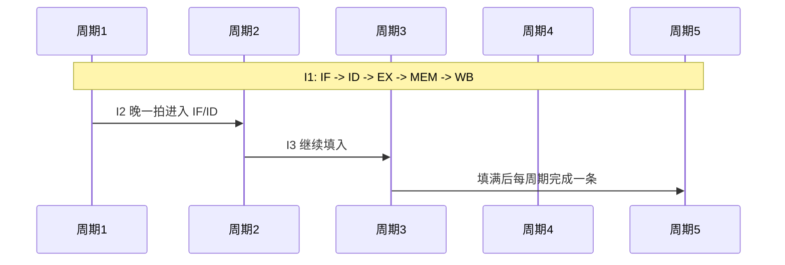
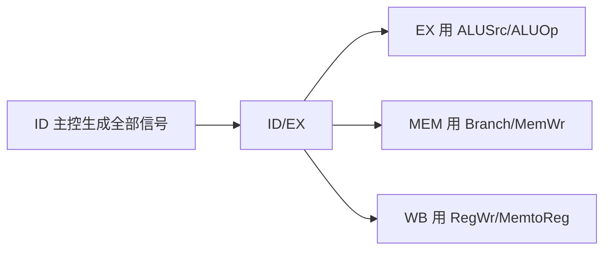

# 课件 06 — 指令流水线 学习指南

> **课程**：计算机组成与体系结构（H）
> **课件**：`6_指令流水线.pdf`｜NotebookLM `课件06-指令流水线`
> **原则**：按课件原序、按知识点分块、**课件板块无遗漏**
> **课堂**：Week 7–8（五级流水、冒险、转发/阻塞）
> **Lab**：Lab1–3（转发单元、Load-Use 阻塞、分支 Flush）
> **教材章节**：唐朔飞《计算机组成原理》第 2 版 **第 5 章**；Patterson RISC-V 版 **第 4 章** §4.5–4.8
> **周次指南交叉引用**：[计组-Week7-9-学习指南](计组-Week7-9-学习指南.md)（流水线冒险主线）
> **原始采集**：`notebooklm-raw/kejian06/runs/20260619-234941/`（6/6 batch ✅）
> **结构图**：`notebooklm-raw/kejian/structure-map.md` §06
> **监修标准**：[计组-课件学习指南监修标准](计组-课件学习指南监修标准.md)
> **首轮监修**：2026-06-21｜状态：已首轮监修（A-）｜重点：转发/阻塞/Flush、Lab1-3
> **整合日期**：2026-06-19
> **术语格式**：术语表及正文**首次出现**时，专业名词采用 **中文（English）**；英文缩写采用 **缩写（English full name，中文）**，便于对照英文课件、教材与开卷试题。

---

## 课件内容覆盖索引

| 课件原序 | 课件板块 | Slide（约） | 本指南 | 状态 |
|----------|----------|-------------|--------|------|
| 1 | 流水线概念、CPI、加速比 | 板块 1 | Part A · 块 A.1–A.3 | ✅ |
| 2 | 五级流水数据通路 | 板块 2 | Part B · 块 B.1–B.3 ⭐ | ✅ |
| 3 | 数据冒险、转发、阻塞 | 板块 3 | Part C · 块 C.1–C.4 ⭐ | ✅ |
| 4 | 控制冒险、Flush、分支延迟 | 板块 4 | Part D · 块 D.1–D.3 ⭐ | ✅ |
| 5 | 超流水、多发射、Tomasulo 衔接 | 板块 5 | Part E · 块 E.1–E.2 | ✅ |

---

## 缩写速查

| 缩写 | 解释 |
|------|------|
| **CPI / IPC** | Cycles Per Instruction / Instructions Per Cycle，每指令周期数 / 每周期指令数 |
| **PC** | Program Counter，程序计数器 |
| **ALU** | Arithmetic Logic Unit，算术逻辑单元 |
| **RF** | Register File，寄存器堆 |
| **IM / DM** | Instruction Memory / Data Memory，指令存储器 / 数据存储器 |
| **BTB / BHT** | Branch Target Buffer / Branch History Table，分支目标缓冲 / 分支历史表 |

---

## 本章怎么用（开卷复习路径）

1. **先画五级时空图**：横轴周期、纵轴指令，先标 IF/ID/EX/MEM/WB，再判断同周期谁需要同一资源或同一寄存器值。
2. **数据冒险按优先级查**：先看 EX/MEM 转发，再看 MEM/WB 转发；若是 `lw` 后继立即使用，直接插 1 个气泡。
3. **控制冒险看决断级**：EX 决断比 ID 决断多冲刷前级；Lab3 以 RISC-V 实现实验口径为准。
4. **与 05b 分工**：本章解决顺序五级流水的转发/阻塞/Flush；Tomasulo、ROB 和乱序执行去 [课件 5b](计组-课件05b-学习指南.md)。

| 定位 | 使用方式 |
|------|----------|
| 课件 | `6_指令流水线.pdf`，按基础性能 → 数据通路 → 数据冒险 → 控制冒险查 |
| 教材 | 唐朔飞第 5 章与 P&H 第 4 章补五级流水细节 |
| Lab | Lab1–3 对应转发单元、Load-Use 阻塞、分支 Flush |
| 周次 | Week7–9 是课堂主线，复习时先看本章再接 05b ILP |

---

## Part A — 流水线基础

> **本节要回答**：吞吐率与加速比如何定义？理想 CPI 为何是 1？

### 块 A.1 概念与性能

| 指标 | 定义 |
|------|------|
| **吞吐率** | 单位时间完成指令数；理想每周期 1 条 |
| **加速比** | 非流水时间 / 流水时间；m 级理想接近 m 倍 |
| **理想 CPI** | 无冒险时 = 1 |
| **实际 CPI** | 理想 CPI + 冒险惩罚周期 |

$$T_{CPU} = IC \times CPI \times T_{clock}$$

**数值例**：理想 CPI=1；程序 20% 为 load，Load-Use 后继使用概率 25%，每次罚 1 周期，则额外 CPI = $0.2 \times 0.25 \times 1 = 0.05$，实际 CPI ≈ **1.05**。这类题先拆「频率 × 触发概率 × 惩罚周期」。（首轮监修补强）

（来源：kejian06-partA-basics）

### 块 A.2 洗衣服类比

串行：一批洗完→烘干→折好才开始下一批；流水：烘干第一批时已开始洗第二批——**功能部件重叠利用**。（来源：kejian06-partA-basics）

### 块 A.3 时空图

横轴=时钟周期，纵轴=指令；展示多指令在各阶段**同时重叠**执行。（来源：kejian06-partA-basics）

> **读图口诀**：同一行看一条指令 latency；同一列看一个周期里哪些硬件同时忙。（首轮监修补强）

---

## Part B — 五级流水线数据通路（Lab1–2 ⭐）

> **本节要回答**：IF/ID/EX/MEM/WB 各做什么？控制信号如何传递？

### 块 B.1 五阶段

| 阶段 | 功能 |
|------|------|
| **IF** | 按 PC 取指，PC+4 |
| **ID** | 译码，读寄存器，立即数扩展 |
| **EX** | ALU 运算或算址 |
| **MEM** | Load/Store 访存 |
| **WB** | 写回寄存器 |

**段间寄存器**（IF/ID、ID/EX、EX/MEM、MEM/WB）保存段间状态。（来源：kejian06-partB-datapath）

### 块 B.2 控制信号传递

原则：**ID 生成，逐级传递**。（来源：kejian06-partB-datapath）

### 块 B.3 `lw` vs `add` 数据流

| 阶段 | lw | add |
|------|----|-----|
| EX | R[rs]+imm 算址 | ALU 加 rs,rt |
| MEM | 读存储器 | **空操作**（透传） |
| WB | 写 rt | 写 rd |

（来源：kejian06-partB-datapath、Lab2）

---

## Part C — 数据冒险（Lab1 核心 ⭐）

> **本节要回答**：RAW/WAR/WAW 各是什么？转发条件？Load-Use 为何必须阻塞？

### 块 C.1 冒险类型

| 类型 | 含义 | 五级顺序流水 |
|------|------|-------------|
| **RAW** | 写后读（真相关） | **最常见** |
| **WAR** | 读后写 | 通常不发生 |
| **WAW** | 写后写 | 通常不发生 |
| **Load-Use** | lw 后紧跟用该寄存器 | 转发无法解决 |

（来源：kejian06-partC-datahazard）

### 块 C.2 转发检测

| 来源 | 条件 |
|------|------|
| **EX 级** | EX/MEM.RegWrite ∧ Rd≠0 ∧ EX/MEM.Rd == ID/EX.Rs/Rt |
| **MEM 级** | MEM/WB.RegWrite ∧ Rd≠0 ∧ MEM/WB.Rd == ID/EX.Rs/Rt |
| **优先级** | EX 级 > MEM 级（数据更新） |

### 块 C.3 阻塞（Stall）

Load-Use 时：PC、IF/ID **冻结**；ID/EX 控制信号**清零** → 插入 **NOP 气泡**。（来源：kejian06-partC-datahazard）

### 块 C.4 时空图示例

| 指令 | 关键事件 |
|------|----------|
| add r1,r2,r3 → sub r4,r1,r5 | C4：**转发** r1 |
| lw r2,0(r6) → and r7,r2,r8 | C6：**阻塞** 1 周期 |
| and → or r9,r7,r10 | **转发** r7 |

（来源：kejian06-partC-datahazard、Lab1）

---

## Part D — 控制冒险（Lab3 ⭐）

> **本节要回答**：延迟槽 vs Flush？分支在何级决断？Lab3 如何实现？

### 块 D.1 两种策略

| 策略 | 做法 | 现状 |
|------|------|------|
| **分支延迟槽** | 编译器填有用指令 | RISC-V **已放弃** |
| **流水线冲刷** | 预测失败时前级变 NOP | 现代主流 |

### 块 D.2 决断时机与代价

| 决断位置 | 错误取指数 | 冲刷代价 |
|----------|-----------|----------|
| EX/MEM（标准） | 3 条 | 高 |
| ID（优化） | 1 条 | 低 |

### 块 D.3 Lab3 对应

- 分支比较、目标地址在 **EX 阶段**完成（可复用转发）
- 确认跳转后 **Flush** 错误路径前级寄存器
- `jal`/`jalr`：WB 写 `pc+4`，支持前递

（来源：kejian06-partD-controlhazard、Lab3）

---

## Part E — 高级流水线与期末衔接

| 技术 | 要点 |
|------|------|
| **超流水** | 段数↑，时钟周期↓，寄存器开销限制收益 |
| **静态多发射 (VLIW)** | 编译器打包发射 |
| **动态多发射 (超标量)** | 硬件运行时决定发射条数 |

与 **Tomasulo** 衔接：保留站+寄存器重命名消除 WAR/WAW，乱序执行挖掘 ILP → 见 [课件 5b 指南](计组-课件05b-学习指南.md)。（来源：kejian06-partE-advanced）

> **期末重点**：Tomasulo 时序表、Cache、虚存、MESI；Lab 侧重五级流水+CSR/异常。

---

## 易混概念对比（期末速查）

（来源：kejian06-mistakes）

| 概念组 | 关键区分 |
|--------|----------|
| 三大冒险 | 结构=资源冲突；数据=依赖；控制=改 PC |
| 转发 vs 阻塞 | 旁路不增 CPI；阻塞插气泡增延迟 |
| Flush vs Stall | Flush 丢错误路径指令；Stall 冻结等数据 |
| 吞吐率 vs 加速比 | 单位时间指令数 vs 时间比值 |
| 段间寄存器 vs GPR | 对程序员透明 vs 可见 |

---

## 与周次指南对照

| 本指南 Part | 周次指南 | 说明 |
|-------------|----------|------|
| Part A–B | [Week7-9](计组-Week7-9-学习指南.md) §3–4 | Week 7 五级流水 |
| Part C | [Week7-9](计组-Week7-9-学习指南.md) §4 | 转发/阻塞，Lab1 |
| Part D | [Week7-9](计组-Week7-9-学习指南.md) §4 | 分支 Flush，Lab3 |
| Part E | [Week7-9](计组-Week7-9-学习指南.md) §5 | 衔接 5b Tomasulo |

---

## 复习优先级

| 优先级 | 范围 | 说明 |
|--------|------|------|
| **极高** | Part C、D | 转发条件、Load-Use、Flush |
| 高 | Part B | 五级阶段与控制传递 |
| 中 | Part A、E | CPI 公式、高级技术了解 |

---

## 追问块

> **追问 1**：为何 Load-Use 不能仅靠转发解决？

> **答**：`lw` 数据在 **MEM 结束**才就绪，而下一条已在 EX 需要操作数——存在**时间错位**，必须阻塞 1 周期。（来源：kejian06-partC-datahazard）

> **追问 2**：EX 级与 MEM 级转发同时满足时选谁？

> **答**：选 **EX 级**——数据更新，优先级更高。（来源：kejian06-partC-datahazard）

> **追问 3**：分支在 EX 决断比 ID 决断多损失几个周期？

> **答**：约多 **2 个周期**（多取 2 条错误路径指令需冲刷）。（来源：kejian06-partD-controlhazard）

> **追问 4**：结构冒险在 Lab 中如何避免？

> **答**：哈佛架构分离 IM/DM；或寄存器堆读写端口分离；总线冲突时 **Stall**。（来源：kejian06-mistakes、Lab2）

> **追问 5**：理想 5 级流水加速比一定等于 5 吗？

> **答**：**不一定**。填充/排空阶段、冒险惩罚使实际加速比 < 5；且时钟周期可能因段间寄存器略有增加。（来源：kejian06-partA-basics）

---

## 监修自检（首轮）

| 维度 | 状态 | 本章结论 |
|------|------|----------|
| 来源/覆盖 | 通过 | 课件覆盖索引、deep raw、structure-map 与周次指南均已列出；首轮按 `计组-课件学习指南监修标准.md` 核对。 |
| 结构完整 | 通过 | 元信息、覆盖索引、Part 正文、易混对比、复习优先级、追问/资料索引齐全。 |
| 难点讲解 | 通过 | 已保留本章核心机制、公式或状态流程，避免只列术语。 |
| 图示/数值例 | 通过 | 首轮已补足可开卷查用的图示或手算例；非主考章节保持轻量。 |
| Lab/复习交叉 | 通过 | 已标注相关 Lab 与周次指南；Lab4-6 相关内容按期末重点突出。 |
| 二轮升级 | 完成 | 已补「本章怎么用」并明确时空图、转发优先级、Load-Use 与 Flush 的开卷判题路径。 |

> **二轮 review 建议**：二轮可补完整 IF/ID/EX/MEM/WB 时空表。

---

## 资料索引

| 类型 | 文件 / 路径 | 说明 |
|------|-------------|------|
| 课件 | `3_课件/6_指令流水线.pdf` | 本指南主线 |
| 周次指南 | `guides/计组-Week7-9-学习指南.md` | Week 7–8 课堂主线 |
| 实验 | Lab1–3 Wiki 与 `26-Arch/Doc/Lab{1,2,3}/report.md` | 转发/阻塞/Flush |
| deep raw | `notebooklm-raw/kejian06/runs/20260619-234941/` | 6 batch 深采 ✅ |
| 关联指南 | `guides/计组-课件05b-学习指南.md` | Tomasulo/超标量 |
| 课件索引 | `guides/计组-课件梳理索引.md` | 双轨进度 |
