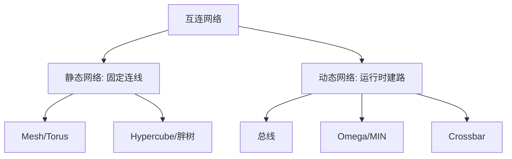

# 课件 7a — 互连网络 学习指南

> **课程**：计算机组成与体系结构（H）
> **课件**：`7_互连网络.pdf`｜NotebookLM `课件07a-互连网络`
> **原则**：按课件原序、按知识点分块、**课件板块无遗漏**
> **课堂**：Week 12/16 补充（片上网络、拓扑参数）
> **Lab**：—（与多核体系结构理论衔接）
> **教材章节**：唐朔飞《计算机组成原理》第 2 版 **第 9 章**（互连）；Patterson RISC-V 版 **第 6 章** 补充
> **周次指南交叉引用**：[计组-Week13-14-学习指南](计组-Week13-14-学习指南.md)（多核通信背景）
> **原始采集**：`notebooklm-raw/kejian07a/runs/20260619-235520/`（4/4 batch ✅）
> **结构图**：`notebooklm-raw/kejian/structure-map.md` §7a
> **监修标准**：[计组-课件学习指南监修标准](计组-课件学习指南监修标准.md)
> **首轮监修**：2026-06-21｜状态：已首轮监修（B+）｜重点：拓扑参数、互连函数、对剖带宽
> **整合日期**：2026-06-19

---

## 课件内容覆盖索引

| 课件原序 | 课件板块 | Slide（约） | 本指南 | 状态 |
|----------|----------|-------------|--------|------|
| 1 | 分类与评价参数 | 板块 1 | Part 1 · 块 1.1–1.3 | ✅ |
| 2 | 互连函数（Cube/Shuffle/Butterfly） | 板块 2 | Part 2 · 块 2.1–2.2 | ✅ |
| 3 | 静态/动态拓扑对比 | 板块 3 | Part 3 · 块 3.1–3.4 | ✅ |

---

## Part 1 — 分类与评价参数

> **本节要回答**：互连网络如何分类？五个核心参数如何计算？

### 块 1.1 三维分类

| 维度 | 类型 | 特点 |
|------|------|------|
| **定时** | 同步 / 异步 | 统一时钟 vs 握手协议 |
| **交换** | 电路 / 分组 | 专用通路 vs 包转发（数据中心主流） |
| **控制** | 集中 / 分散 | 全局控制器 vs 结点自主竞争 |

（来源：kejian07a-part1-params）

### 块 1.2 五个评价指标

| 参数 | 定义 |
|------|------|
| **规模 N** | 结点总数 |
| **结点度** | 与结点相连的边数 |
| **直径 D** | 任意两点最短路径的**最大值**（最坏延迟） |
| **对剖带宽 B** | 网络二等分时切口最少线数（全局瓶颈） |
| **平均延迟** | 均匀流量下各对最短路径长度均值 |

### 块 1.3 数值例：$n \times n$ 2D Mesh vs Torus（$N=n^2$）

| 拓扑 | 结点度 | 直径 D | 对剖带宽 B |
|------|--------|--------|-----------|
| **2D Mesh** | 2–4（非对称） | $2\sqrt{N}-2$ | $\sqrt{N}$ |
| **2D Torus** | 4（对称） | $\approx\sqrt{N}$ | $2\sqrt{N}$ |

Torus 直径更短、带宽翻倍；Mesh 布线更简单。（来源：kejian07a-part1-params）

---

## Part 2 — 互连函数手算

> **本节要回答**：Shuffle/Butterfly 如何映射？$x=110_2$ 的结果？

### 块 2.1 常用函数

| 函数 | 操作 |
|------|------|
| **Cube_k** | 第 k 位取反 |
| **Shuffle** | 二进制**循环左移**一位 |
| **Butterfly** | **最高位与最低位互换** |
| **反位序** | 位序前后颠倒 |
| **PM2I** | $(x \pm 2^i) \bmod N$ |

（来源：kejian07a-part2-functions）

### 块 2.2 数值例：$x = 110_2$

| 函数 | 计算 | 结果 |
|------|------|------|
| **Shuffle** | $(x_1 x_0 x_2)$ | **$101_2$** (5) |
| **Butterfly** | $(x_0 x_1 x_2)$ | **$011_2$** (3) |

Omega 网络级间采用 Shuffle 互连。（来源：kejian07a-part2-functions）

---

## Part 3 — 静态与动态拓扑

> **本节要回答**：Mesh/Torus/Hypercube 各有何特点？Crossbar 与 Omega 如何取舍？

> **监修提醒**：先判「固定连线还是开关网络」，再算直径/度/对剖带宽；不要把 Crossbar 的无阻塞性套到 Omega。（首轮监修补强）

### 块 3.1 静态网络

| 拓扑 | 直径 | 特点 |
|------|------|------|
| 线性阵列 | $N-1$ | 最简单，B=1 |
| 双向环 | $N/2$ | 对称 |
| 2D Mesh | $2(\sqrt{N}-1)$ | 非对称，边角度低 |
| 2D Torus | $\approx \sqrt{N}$ | Mesh+环回，对称；按双向最短路约为 Mesh 的一半 |
| 超立方体 | $n=\log_2 N$ | 度=n，扩展性好 |
| 胖树 | 层次 | 近根链路加粗，缓解瓶颈 |

### 块 3.2 动态网络

| 类型 | 特点 |
|------|------|
| **总线** | 共享介质，一次一对，成本低 |
| **Omega (MIN)** | $\log_2 N$ 级 $2\times2$ 开关，Shuffle 级间互连 |
| **Crossbar** | $N\times N$ 矩阵，**无阻塞**，成本 $O(N^2)$ |

（来源：kejian07a-part3-topology）

### 块 3.3 拓扑对比表

| 拓扑 | 度 | 直径 | 对剖带宽 | 对称 |
|------|-----|------|--------|------|
| 线性阵列 | 1–2 | $N-1$ | 1 | 否 |
| 双向环 | 2 | $N/2$ | 2 | 是 |
| 2D Mesh | 2–4 | $2(\sqrt{N}-1)$ | $\sqrt{N}$ | 否 |
| 超立方体 | $\log_2 N$ | $\log_2 N$ | $N/2$ | 是 |
| Crossbar | $N$ | 1 | $N/2$ | 是 |

### 块 3.4 直觉：Crossbar vs Omega

- **Crossbar**：全立交桥——任意入口到出口同时通行
- **Omega**：共用匝道——竞争同一开关端口时**阻塞**等待

（来源：kejian07a-part3-topology）

---

## 易混概念对比（期末速查）

（来源：kejian07a-mistakes）

| 概念组 | 关键区分 |
|--------|----------|
| 直径 vs 平均延迟 | 最坏 vs 平均 |
| 对剖带宽 vs 链路带宽 | 全局瓶颈 vs 单线速率 |
| 静态 vs 动态 | 固定连线 vs 运行时建路 |
| Mesh vs Torus | 非对称 vs 环回对称；Torus 直径约半 |
| Omega vs Crossbar | 阻塞、$N\log N$ vs 无阻塞、$N^2$ |

---

## 与周次指南对照

| 本指南 Part | 周次指南 | 说明 |
|-------------|----------|------|
| Part 1–3 | [Week13-14](计组-Week13-14-学习指南.md) | 多核互连背景 |
| Part 3 | [Week15-16](计组-Week15-16-学习指南.md) | 期末参数计算复习 |

---

## 复习优先级

| 优先级 | 范围 | 说明 |
|--------|------|------|
| 高 | Part 1 | 五参数定义与 Mesh/Torus 公式 |
| 中 | Part 2、3 | 互连函数手算、拓扑对比 |
| 低 | 胖树/Hypercube 细节 | 了解即可 |

---

## 追问块

> **追问 1**：$N=64$ 的 2D Mesh 直径是多少？

> **答**：$n=8$，$D = 2(n-1) = 14$。（来源：kejian07a-part1-params）

> **追问 2**：为何 Torus 对剖带宽是 Mesh 的两倍？

> **答**：环回使每一行切口处多一条环路通路，$B_{Torus}=2n$，$B_{Mesh}=n$。（来源：kejian07a-part1-params）

> **追问 3**：Omega 网络需要几级开关（$N=16$）？

> **答**：$\log_2 16 = 4$ 级。（来源：kejian07a-part3-topology）

> **追问 4**：Shuffle 做两次等于什么？

> **答**：对 $2^n$ 个端口，两次 Shuffle 等价于反位序置换（常用于 MIN 路由分析）。（来源：kejian07a-part2-functions）

> **追问 5**：互连网络与 Cache 一致性有何关系？

> **答**：多核间传递无效化/更新消息经互连网络；**对剖带宽**决定一致性流量上限，与 [课件 08](计组-课件08-学习指南.md) MESI 衔接。（来源：kejian07a-part1-params、[Week13-14 指南](计组-Week13-14-学习指南.md)）

---

## 监修自检（首轮）

| 维度 | 状态 | 本章结论 |
|------|------|----------|
| 来源/覆盖 | 通过 | 课件覆盖索引、deep raw、structure-map 与周次指南均已列出；首轮按 `计组-课件学习指南监修标准.md` 核对。 |
| 结构完整 | 通过 | 元信息、覆盖索引、Part 正文、易混对比、复习优先级、追问/资料索引齐全。 |
| 难点讲解 | 通过 | 已保留本章核心机制、公式或状态流程，避免只列术语。 |
| 图示/数值例 | 建议二轮增强 | 首轮已补足可开卷查用的图示或手算例；非主考章节保持轻量。 |
| Lab/复习交叉 | 通过 | 已标注相关 Lab 与周次指南；Lab4-6 相关内容按期末重点突出。 |

> **二轮 review 建议**：二轮重点复核 Torus/Hypercube 公式口径与课件表述。

---

## 资料索引

| 类型 | 文件 / 路径 | 说明 |
|------|-------------|------|
| 课件 | `3_课件/7_互连网络.pdf` | 本指南主线 |
| 周次指南 | `guides/计组-Week13-14-学习指南.md` | 多核背景 |
| deep raw | `notebooklm-raw/kejian07a/runs/20260619-235520/` | 4 batch 深采 ✅ |
| 关联指南 | `guides/计组-课件08-学习指南.md` | 多核一致性 |
| 课件索引 | `guides/计组-课件梳理索引.md` | 双轨进度 |
