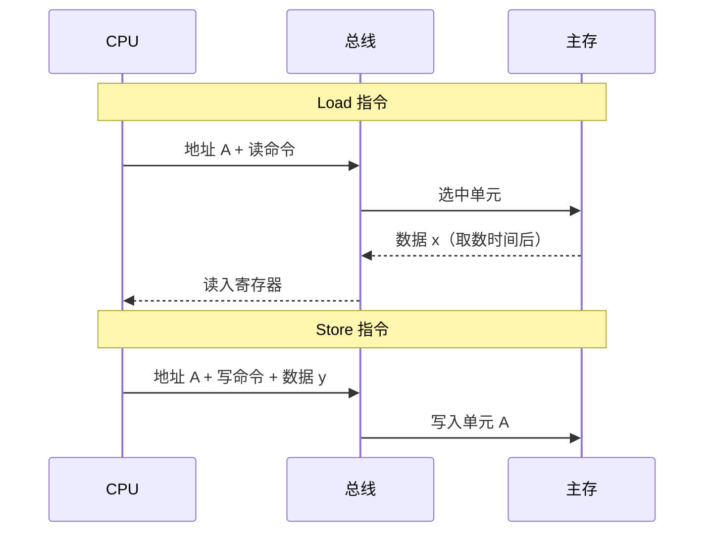
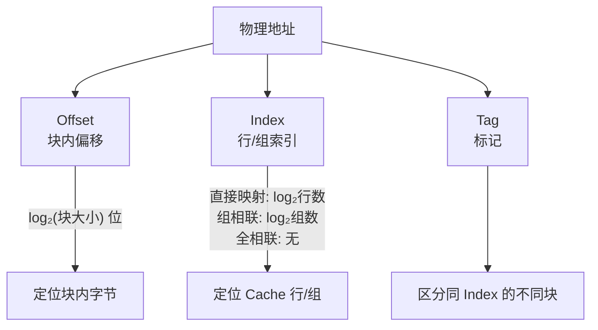
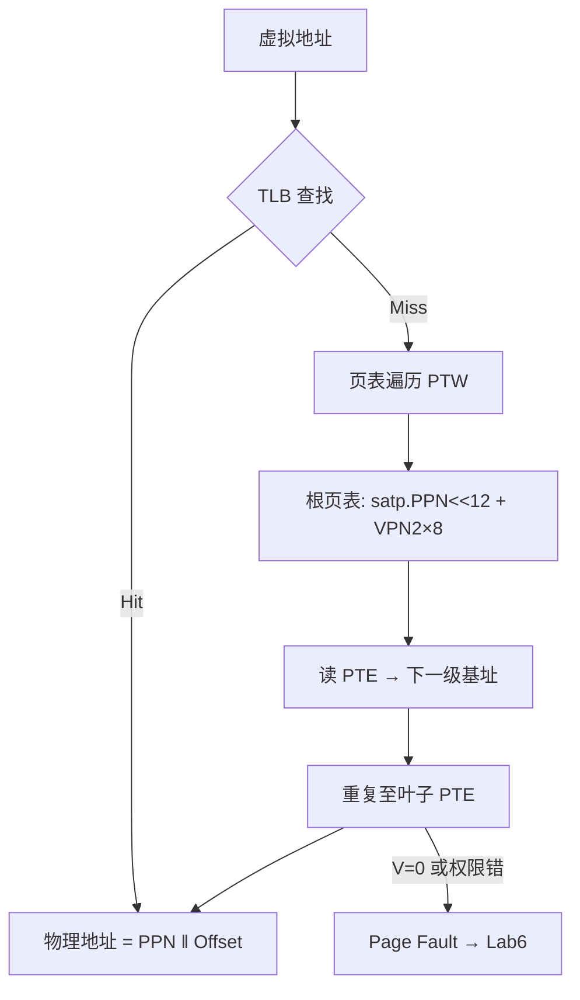

# 课件 7b — 层次结构存储系统 学习指南

> **课程**：计算机组成与体系结构（H）
> **课件**：`7_层次结构存储系统.pdf`｜NotebookLM `课件09-层次结构存储系统`
> **原则**：按课件原序、按知识点分块、**课件板块无遗漏**
> **课堂**：Week 10（Cache/存储实验）、Week 11（SATP/Sv39/TLB）、Week 12（复习衔接）
> **Lab**：**Lab4**（CSR/satp）、**Lab5**（MMU/Sv39 页表遍历）、**Lab6**（Page Fault/异常 flush）
> **教材章节**：唐朔飞《计算机组成原理》第 2 版 **第 4 章**（存储器）；Patterson RISC-V 版 **第 5 章**（Memory Hierarchy）
> **周次指南交叉引用**：[计组-Week10-11-学习指南](计组-Week10-11-学习指南.md)（虚存/SATP/TLB 课堂主线）
> **原始采集**：`notebooklm-raw/kejian07b/runs/20260619-221235/`（4/4 batch ✅）
> **结构图**：`notebooklm-raw/kejian/structure-map.md` §7b
> **监修标准**：[计组-课件学习指南监修标准](计组-课件学习指南监修标准.md)
> **首轮监修**：2026-06-21｜状态：已首轮监修（A）｜重点：Cache/Sv39/TLB、Lab4-6
> **整合日期**：2026-06-19
> **术语格式**：术语表及正文**首次出现**时，专业名词采用 **中文（English）**；英文缩写采用 **缩写（English full name，中文）**，便于对照英文课件、教材与开卷试题。

---

## 课件内容覆盖索引

| 课件原序 | 课件板块 | Slide（约） | 本指南 | 状态 |
|----------|----------|-------------|--------|------|
| 1 | 存储元、编址单位、存储阵列 | 板块 1 | Part 1 · 块 1.1 | ✅ |
| 2 | 主存与 CPU 连接、Load/Store 流程 | 板块 1–2 | Part 1 · 块 1.2 | ✅ |
| 3 | Cache 局部性、映射、AMAT | 板块 2 | Part 2 · 块 2.1–2.4 ⭐ | ✅ |
| 4 | 虚拟存储、Sv39、PTE、SATP、TLB | 板块 3–4 | Part 3 · 块 3.1–3.5 ⭐ | ✅ |

---

## 缩写速查

| 缩写 | 解释 |
|------|------|
| **AMAT** | Average Memory Access Time，平均访存时间 |
| **MMU** | Memory Management Unit，内存管理单元 |
| **TLB** | Translation Lookaside Buffer，地址转换后备缓冲 |
| **PTE** | Page Table Entry，页表项 |
| **VPN / PPN** | Virtual Page Number / Physical Page Number，虚页号 / 物理页号 |
| **VA / PA** | Virtual Address / Physical Address，虚拟地址 / 物理地址 |
| **SATP** | Supervisor Address Translation and Protection，监管者地址转换与保护寄存器 |
| **CSR** | Control and Status Register，控制状态寄存器 |

---

## 本章怎么用（开卷复习路径）

1. **先查 Part 3**：期末与 Lab5–6 最强相关，按「VA 拆位 → `satp` 根页表 → 三级 PTE → TLB Miss/Page Fault」顺序复习。
2. **再查 Part 2**：Cache 题先写地址位宽、块大小、组数，再拆 Tag/Index/Offset；AMAT 题先列 Hit Time / Miss Rate / Miss Penalty。
3. **最后对 Lab**：Lab4 看 CSR/Cache 状态机，Lab5 看 MMU/Sv39，Lab6 看 Page Fault 与流水线 flush；不要把课件原序误认为授课顺序。
4. **边界优先**：开卷时重点核对 TLB Miss vs Page Fault、`satp` vs `SFENCE.VMA`、PTE 权限位和 Page Fault 触发时机。

| 定位 | 使用方式 |
|------|----------|
| 课件 | `7_层次结构存储系统.pdf`，按存储物理 → Cache → 虚存原序查 |
| 教材 | 唐朔飞第 4 章补存储层次；P&H 第 5 章补 Cache/Virtual Memory 机制 |
| Lab | Lab4–6 对 CSR、MMU、TLB、异常 flush 做实现级核对 |
| 周次 | Week10–11 是课堂主线，优先用于核对 Sv39 与实验口径 |

---

## Part 1 — 存储物理与主存接口

> **本节要回答**：主存的最小组织单元是什么？Load/Store 如何在总线上完成？

### 块 1.1 存储元、编址与阵列

**课件要点**：存储元 (Cell) 是二进制 0/1 的最小物理单位；现代计算机普遍**字节编址**（8 bit = 1 地址）。

| 概念 | 含义 | 类比 |
|------|------|------|
| 存储元 (Cell) | 两种稳态的物理器件 | 电灯开关（开/关） |
| 编址单位 | 具有相同地址的一组位元 | 酒店房间（门牌号 = 地址，8 张床 = 8 bit） |
| 存储阵列/体 (Bank) | 所有存储单元构成的矩阵 | 整栋宿舍大楼 |

行译码器 + 列译码器定位具体单元。（来源：kejian07b-part1-physical、课件7b）

### 块 1.2 Load/Store 与总线数据流

CPU 与主存通过**总线**连接：地址线（选房间）、控制线（读/写）、数据线（搬数据）。

| 步骤 | Load（装入） | Store（存储） |
|------|-------------|--------------|
| 1 | CPU 送地址 A +「主存读」 | CPU 送地址 A +「主存写」 |
| 2 | 主存经取数时间将数据放到数据线 | CPU 将数据 y 放到数据线 |
| 3 | CPU 读入寄存器 | 主存经写入时间存入 A |

> **直观理解**：CPU 是「妈妈」，主存是「厨房外的架子」——按编号（地址）取菜（Load）或放回（Store）。（来源：kejian07b-part1-physical、Week10 记录）

---

## Part 2 — Cache 映射与 AMAT（期末重点）

> **本节要回答**：Cache 为何能加速？如何拆分地址？AMAT 怎么手算？

### 块 2.1 局部性原理

| 类型 | 含义 | 典型场景 |
|------|------|----------|
| **时间局部性** | 刚访问的数据很快再访问 | 循环变量 `sum` |
| **空间局部性** | 邻近单元很快被访问 | 数组 `A[i], A[i+1]` |

Cache 位于 CPU 与主存之间（SRAM），以**块 (Block/Line)** 为单位调入数据：命中 (Hit) 直接读；缺失 (Miss) 从主存整块加载。（来源：kejian07b-part2-cache、课件7b）

### 块 2.2 三种映射与 Tag/Index/Offset

下面的图要解决“一个物理地址进入 Cache 后，哪些位用于找位置，哪些位用于确认身份”。图节点中的 Tag/Index/Offset 分别是标记、行/组索引、块内偏移；表格里的 N-way 表示 N 路组相联。

> **读图提示：** 先读 Offset：它只在命中后选块内字节；再读 Index：直接映射用它定位唯一行，组相联用它定位一组；最后读 Tag：同一 Index 下可能映射来很多主存块，必须用 Tag 比较确认是不是目标块。

| 映射方式 | Index 含义 | 特点 |
|----------|-----------|------|
| 直接映射 | 唯一行号 | 实现简单，易冲突 |
| 组相联 (N-way) | 组号；组内 N 路并行比较 Tag | 折中方案，期末常考 |
| 全相联 | 无 Index | 任意块可放任意行，成本高 |

**位数公式**（来源：kejian07b-part2-cache、唐朔飞第4章、P&H第5章）：

- Offset 位数 = $\log_2(\text{块大小})$
- Index 位数 = $\log_2(\text{行数或组数})$
- Tag 位数 = 物理地址总位数 − Index − Offset

### 块 2.3 AMAT 手算

$$\text{AMAT} = \text{Hit Time} + \text{Miss Rate} \times \text{Miss Penalty}$$

**示例题：AMAT 平均访存时间**

**题目场景**：某一级 Cache 命中很快，但缺失时要到下一级/主存取整块数据。

**已知**：Hit Time = 1 周期，Miss Rate = 5%，Miss Penalty = 100 周期。

**求**：AMAT（Average Memory Access Time，平均访存时间）。

**公式**：$\text{AMAT} = \text{Hit Time} + \text{Miss Rate} \times \text{Miss Penalty}$。

**步骤**：代入 $1 + 0.05 \times 100 = 6$ 周期。

**结果解释**：即使命中只需 1 周期，5% 的高代价缺失也会把平均访问时间拉到 6 周期；优化 Miss Rate 和 Miss Penalty 都很关键。（来源：kejian07b-part2-cache）

> **易错提醒：** Miss Rate 要用小数 0.05，不是 5；Miss Penalty 是“额外缺失惩罚”时可直接套公式，若题目给的是“缺失总时间”，需先分清是否已包含 Hit Time。

### 块 2.4 数值例：32KB 四路组相联

**题目场景**：CPU 给出一个 32 位物理地址，Cache 控制器要判断它落在哪一组、块内哪个字节，以及用多少位 Tag 比较。

**已知**：32KB Cache，4-way，块 64B，物理地址 32 位；查地址 `0x00012345`。

**求**：Offset、Index、Tag 位数与该地址对应字段。

| 步骤 | 计算 | 结果 |
|------|------|------|
| Offset | $\log_2(64)=6$ 位 | [5:0] → **0x05** |
| 组数 | $32\text{KB}/64\text{B}=512$ 块；$512/4=128$ 组 | — |
| Index | $\log_2(128)=7$ 位 | [12:6] → **0x08** |
| Tag | $32-7-6=19$ 位 | [31:13] → **0x00009** |

**命中判定**（Lab4 Cache 状态机背景）：

1. **IDLE** → 接收地址
2. **COMPARE_TAG** → 用 Index 0x08 索引第 8 组，4 路并行比 Tag
3. Tag 匹配且 Valid=1 → **Hit**，按 Offset 0x05 返回；否则 **Miss** → ALLOCATE/REPLACE，Dirty 则先 WRITE_BACK

（来源：kejian07b-part2-cache、Lab4 报告）

> **易错提醒：** 4-way 会减少 Index 位、增加 Tag 位；不要仍按直接映射的总行数算 Index。Lab4 细节这里只保留状态名轻量引用，完整 Cache 状态机以后看 Lab 专章。

### 块 2.5 写策略与替换（开卷补查）

| 主题 | 选项 | 期末要点 |
|------|------|----------|
| 写命中 | Write-through / Write-back | 写直达主存一致但慢；写回需 Dirty 位，替换时才写主存 |
| 写缺失 | Write-allocate / No-write-allocate | 写回 Cache 常配写分配；写直达常配非写分配 |
| 替换 | LRU / FIFO / Random | 组相联题常需说明被替换路与 Dirty 写回 |

> **Lab 交叉**：Lab4/存储状态机若出现 `WRITE_BACK`、`ALLOCATE`，本质就是 Dirty 行替换和缺失装入的硬件化流程。（首轮监修补强）

---

## Part 3 — Sv39、SATP、TLB（期末核心 · Lab4–6）

> **本节要回答**：虚拟地址如何变成物理地址？TLB 与 Page Fault 有何区别？

### 块 3.1 Sv39 地址格式

| 字段 | 位数 | 含义 |
|------|------|------|
| VPN[2]（课件记 VPN[4]） | 9 | 一级（根）页表索引 [38:30] |
| VPN[1]（课件记 VPN[5]） | 9 | 二级页表索引 [29:21] |
| VPN[0] | 9 | 三级页表索引 [20:12] |
| Page Offset | 12 | 页内偏移 [11:0]（4KB 页） |

Sv39：VA 39 位，PA 56 位。（来源：kejian07b-part3-sv39、Week11 记录）

### 块 3.2 PTE 与 satp

**PTE（64 位）关键位**：

| 位 | 含义 |
|----|------|
| V | 有效；V=0 → Page Fault |
| R/W/X | 读/写/执行；全 0 表示非叶子，指向下一级 |
| U | 用户页；配合 SUM 控制 S 模式访问 |
| A/D | 访问/脏位 |
| PPN | 物理页号或下级页表基址 |

**satp 寄存器**：

| 字段 | 含义 |
|------|------|
| MODE | 0=Bare；8=Sv39；9=Sv48 |
| ASID | 地址空间 ID，减少 TLB 冲刷 |
| PPN | 根页表物理页号 |

WARL：写入任意值，读回合法值。（来源：kejian07b-part3-sv39、Lab4 报告）

### 块 3.3 TLB 与三级页表遍历

下面的图要解决“TLB 命中、TLB 缺失、Page Fault 三条路径如何分叉”。TLB 是 Translation Lookaside Buffer（地址转换后备缓冲），PTW 是 Page Table Walk（页表遍历）。

> **读图提示：** 先看 TLB Hit：直接拼 PPN 和 Offset 得 PA；再看 TLB Miss：只是快表没条目，硬件仍可走 PTW 查页表；最后看 Page Fault：只有 PTE 无效或权限不符等条件才进入异常路径。图中 PF 指向 Lab6 仅是轻量 ref，实验异常管线详见后续 Lab 专章。

- **TLB Miss**：页表项不在快表，页可能仍在内存，走慢表遍历
- **Page Fault**：PTE.V=0 或权限不符，需 OS 调页（来源：kejian07b-mistakes、Week10-11 指南 §2）

### 块 3.4 地址转换数值例

**题目场景**：Sv39 开启后，一条 load 指令给出 VA，硬件需要从 `satp` 指向的根页表开始查三层 PTE。

**已知**：`satp = 0x8000000000001000`（MODE=8，PPN=0x1000）；VA = `0x0000002040608ABC`；三级读出的 PPN 如下表。

**求**：最终 PA。

**公式**：每级 PTE 地址 = `(当前页表 PPN << 12) + VPN[i] × 8`；最终 PA = `(叶子 PPN << 12) | offset`。

| 级 | PTE 地址计算 | 假设读出 PPN |
|----|-------------|-------------|
| 一级 | `0x1000<<12 + VPN[2]×8` = `0x1000408` | 0x2000 |
| 二级 | `0x2000<<12 + VPN[1]×8` = `0x2000010` | 0x3000 |
| 三级 | `0x3000<<12 + VPN[0]×8` = `0x3000040` | 0x5555（叶子） |

**步骤**：先从 `satp.PPN=0x1000` 得根页表基址；依次用 VPN[2]、VPN[1]、VPN[0] 索引；最后把叶子 PPN `0x5555` 与 offset `0xABC` 拼接。

**PA** = `(0x5555 << 12) | 0xABC` = **`0x5555ABC`**。（来源：kejian07b-part3-sv39）

> **结果解释：** PA 的低 12 位来自 VA offset，不被页表改写；页表只负责把虚页号换成物理页号。

> **易错提醒：** 若中途 PTE 的 R/W/X 全 0，则它是非叶子；若 V=0 或权限不符，不能继续套 PA 公式，应转 Page Fault 判定。

### 块 3.5 Lab4–6 交叉点

| Lab | 与本课件对应 |
|-----|-------------|
| **Lab4** | 实现 `satp`、`mstatus` 等 CSR 读写 |
| **Lab5** | MMU 状态机实现 Sv39 三级遍历；M 模式旁路 MMU |
| **Lab6** | V=0 或 R/W/X 权限错时在 WB 触发 Page Fault，流水线 flush |

> **追问**：为何 Page Fault 在 WB 处理？
> **答**：此时指令已走完执行阶段，可精确报告 faulting VA 并保存现场；若在 IF 就 trap 会误报尚未确认的取指。（来源：kejian07b-part3-sv39、Lab6 报告、[Week10-11 指南](计组-Week10-11-学习指南.md) §3）

---

## 易混概念对比（期末速查）

| 概念组 | 易混原因 | 正确理解 |
|--------|----------|----------|
| PA / VA / LA | 简单分页中 LA≈VA | LA=程序员视角；VA=MMU 输入；PA=内存条真实地址 |
| 3C 缺失 | 容量 vs 冲突难辨 | 强制=首次必缺；容量=Cache 太小；冲突=映射策略导致顶替 |
| TLB Miss vs Page Fault | 都表现为翻译失败 | TLB Miss 页或在内存；Page Fault 需 OS 调页 |
| R/W/X vs U | 忽视 SUM 覆盖 | S 模式 SUM=0 时不可访问 U=1 页 |
| satp.MODE | 决定遍历级数 | Mode 0 旁路；8=Sv39 三级；9=Sv48 四级 |

（来源：kejian07b-mistakes）

---

## 与周次指南对照

| 本指南 Part | 周次指南 | 说明 |
|-------------|----------|------|
| Part 1 | [Week10-11](计组-Week10-11-学习指南.md) §1 | 存储墙背景 |
| Part 2 | [Week10-11](计组-Week10-11-学习指南.md) §2.4 | Cache 映射（Week 12 深化） |
| Part 3 | [Week10-11](计组-Week10-11-学习指南.md) §2.1–2.3 | Sv39/SATP/TLB 课堂主线 |

---

## 复习优先级

| 优先级 | 范围 | 说明 |
|--------|------|------|
| **极高** | Part 2 AMAT + 地址拆分 | 期末计算题高频 |
| **极高** | Part 3 Sv39 手算 + PTE/satp | Lab5 核心，期末必考 |
| 高 | Part 3 TLB vs Page Fault | 概念辨析 |
| 中 | Part 1 Load/Store 流程 | 基础理解 |
| 中 | 易混对比表 | 开卷速查 |

---

## 追问块

> **追问 1**：直接映射 Cache 为什么容易冲突？

> **答**：多个主存块若 Index 相同，只能竞争同一 Cache 行，即使其他行空着也必须互相顶替；组相联通过同组多路降低冲突缺失。（来源：kejian07b-part2-cache）

> **追问 2**：TLB Miss 与 Page Fault 的恢复主体分别是谁？

> **答**：TLB Miss 通常由硬件页表遍历器或软件 refill 例程补快表，页本身仍可能在内存；Page Fault 需要 OS 处理权限/缺页、更新 PTE 后再恢复执行。（来源：kejian07b-part3-sv39、Lab5/6）

> **追问 3**：修改 `satp` 后为什么还要 `SFENCE.VMA`？

> **答**：`satp` 改变根页表或地址空间，但 TLB 可能仍缓存旧 VPN→PPN；`SFENCE.VMA` 保证后续地址翻译不继续使用旧条目，是 Lab5–6 与期末虚存题的关键边界。（来源：[课件08](计组-课件08-学习指南.md)、Week10-11 指南）

---

## 监修自检（首轮）

| 维度 | 状态 | 本章结论 |
|------|------|----------|
| 来源/覆盖 | 通过 | 课件覆盖索引、deep raw、structure-map 与周次指南均已列出；首轮按 `计组-课件学习指南监修标准.md` 核对。 |
| 结构完整 | 通过 | 元信息、覆盖索引、Part 正文、易混对比、复习优先级、追问/资料索引齐全。 |
| 难点讲解 | 通过 | 已保留本章核心机制、公式或状态流程，避免只列术语。 |
| 图示/数值例 | 通过 | 首轮已补足可开卷查用的图示或手算例；非主考章节保持轻量。 |
| Lab/复习交叉 | 通过 | 已标注相关 Lab 与周次指南；Lab4-6 相关内容按期末重点突出。 |
| 二轮升级 | 完成 | 已补「本章怎么用」并把 Cache/Sv39/Lab4-6 开卷路径显式化。 |

> **二轮 review 建议**：建议用户重点 review，特别是 Sv39 地址拆位、PTE 权限、TLB Miss vs Page Fault 与 Lab6 fault 时机。

---

## 资料索引

| 类型 | 文件 / 路径 | 说明 |
|------|-------------|------|
| 课件 | `3_课件/7_层次结构存储系统.pdf` | 本指南主线 |
| 周次指南 | `guides/计组-Week10-11-学习指南.md` | 课堂 Sv39/TLB 详解 |
| 实验 | [26-Arch Wiki Lab4–6](https://github.com/26-Arch/26-Arch/wiki/)、`26-Arch/Doc/Lab{4,5,6}/report.md` | MMU/异常实现 |
| deep raw | `notebooklm-raw/kejian07b/runs/20260619-221235/` | 4 batch 深采 ✅ |
| discovery raw | `notebooklm-raw/kejian/runs/latest/kejian07b-structure.answer.md` | L0 结构 |
| 结构图 | `notebooklm-raw/kejian/structure-map.md` §7b | Part 边界 |
| 课件索引 | `guides/计组-课件梳理索引.md` | 双轨进度 |
