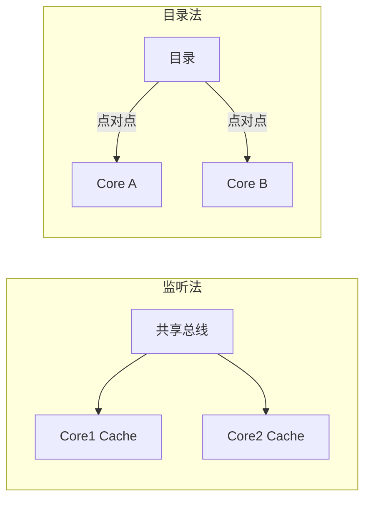
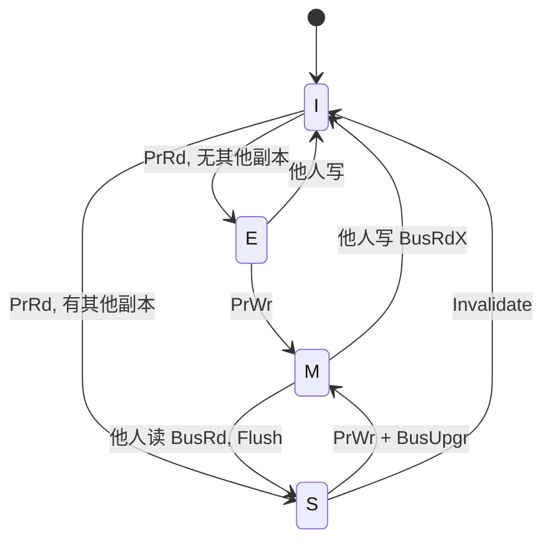
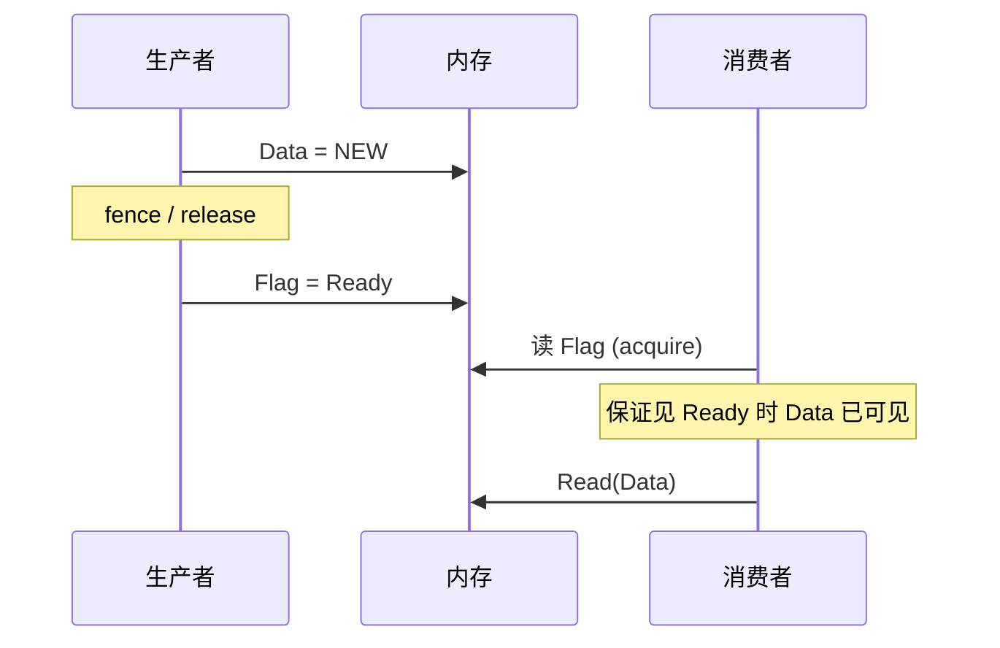

# 课件 08 — 线程级并行 学习指南

> **课程**：计算机组成与体系结构（H）
> **课件**：`8_线程级并行.pdf`｜NotebookLM `课件08-线程级并行`
> **原则**：按课件原序、按知识点分块、**课件板块无遗漏**
> **课堂**：Week 13（一致性协议、MESI）、Week 14（连贯性、Fence、同步原语）、Week 16（复习：MESI 状态表）
> **Lab**：无直接 Lab；`SFENCE.VMA` 与 **Lab4–6** 虚存/TLB 刷新衔接
> **教材章节**：唐朔飞《计算机组成原理》第 2 版 **第 8 章**（并行、多核）；Patterson RISC-V 版 **第 6 章** §6.2–6.5（多核一致性、同步）
> **周次指南交叉引用**：[计组-Week13-14-学习指南](计组-Week13-14-学习指南.md)（MESI/NUMA + 连贯性/Fence 课堂主线）
> **原始采集**：`notebooklm-raw/kejian08/runs/20260619-222348/`（5/5 batch ✅）
> **结构图**：`notebooklm-raw/kejian/runs/latest/kejian08-structure.answer.md`
> **监修标准**：[计组-课件学习指南监修标准](计组-课件学习指南监修标准.md)
> **首轮监修**：2026-06-21｜状态：已首轮监修（A）｜重点：MESI/Fence/SFENCE.VMA
> **整合日期**：2026-06-19
> **术语格式**：术语表及正文**首次出现**时，专业名词采用 **中文（English）**；英文缩写采用 **缩写（English full name，中文）**，便于对照英文课件、教材与开卷试题。

---

## 课件内容覆盖索引

| 课件原序 | 课件板块 | Slide（约） | 本指南 | 状态 |
|----------|----------|-------------|--------|------|
| 1 | 并行计算机分类（Flynn、TLP） | 板块 1 | Part 1 · 块 1.1 | ✅ |
| 2 | 通信与存储模型（共享/非共享） | 板块 2 | Part 1 · 块 1.2 | ✅ |
| 3 | 存储连贯性 vs 存储一致性（双维度） | 板块 3 | Part 1 · 块 1.3 | ✅ |
| 4 | Cache 一致性协议（MSI→MESI→MOESI） | 板块 4 | Part 2 · 块 2.1–2.3 ⭐ | ✅ |
| 5 | 性能分析（真共享、伪共享） | 板块 5 | Part 2 · 块 2.4 | ✅ |
| 6 | 存储连贯性模型（SC、弱模型、Fence） | 板块 6 | Part 3 · 块 3.1–3.4 ⭐ | ✅ |
| 7 | 同步机制（互斥、LR/SC、AMO） | 板块 7 | Part 4 · 块 4.1–4.3 | ✅ |

---

## 缩写速查

| 缩写 | 解释 |
|------|------|
| **TLP** | Thread-Level Parallelism，线程级并行 |
| **SIMD / MIMD** | Single Instruction Multiple Data / Multiple Instruction Multiple Data，单指令多数据 / 多指令多数据 |
| **MSI / MESI** | Modified-Shared-Invalid / Modified-Exclusive-Shared-Invalid，缓存一致性状态协议 |
| **UMA / NUMA** | Uniform / Non-Uniform Memory Access，均匀 / 非均匀访存 |
| **NoC** | Network-on-Chip，片上网络 |
| **GPU** | Graphics Processing Unit，图形处理器 / 通用并行加速器 |

---

## 本章怎么用（开卷复习路径）

1. **先定两个“一致性”**：Coherence 管同一地址副本，Consistency 管不同地址的全局可见顺序；做题先判题目问的是哪个维度。
2. **MESI 题先画状态**：按「本地读/写」和「监听他人读/写」四类事件查 Part 2，不要只背 M/E/S/I 名字。
3. **Fence 题先找同步点**：普通数据同步看 `fence` / `.aq` / `.rl`，页表或 `satp` 修改后看 `SFENCE.VMA`；二者不能互相替代。
4. **和 07b/Lab 交叉**：`SFENCE.VMA` 的实验语境在 Lab5–6 与 [课件 7b](计组-课件07b-学习指南.md)，本章只提供多核/内存序视角。

| 定位 | 使用方式 |
|------|----------|
| 课件 | `8_线程级并行.pdf`，按 Flynn/共享存储 → MESI → Consistency/Fence → 同步原语查 |
| 教材 | 唐朔飞第 8 章与 P&H 第 6 章补多核一致性、同步与内存模型 |
| Lab | 无直接 Lab；只把 `SFENCE.VMA` 回连 Lab5–6 的 TLB 刷新 |
| 周次 | Week13–14 是课堂主线；Week16 用于核 MESI 状态表题 |

---

## Part 1 — 并行体系结构基础

> **本节要回答**：Flynn 如何分类？共享存储与消息传递有何区别？一致性与连贯性差在哪？

### 块 1.1 Flynn 分类与 TLP

| 类型 | 指令流 | 数据流 | 典型实例 |
|------|--------|--------|----------|
| **SISD** | 单 | 单 | 传统串行计算机 |
| **SIMD** | 单 | 多 | GPU 向量、广播体操 |
| **MISD** | 多 | 单 | 几乎无商业实现 |
| **MIMD** | 多 | 多 | 通用多核（本课重点） |

**TLP（线程级并行）**：MIMD 下多个 PC 并行执行相对独立线程；并行粒度比 ILP 更粗。（来源：kejian08-partA-parallel、课件 08）

> **直观理解**：SIMD 像广播体操——领操员喊一个口号，全校同时做同一动作；MIMD 像多个厨师各做各的菜。（来源：kejian08-partA-parallel）

### 块 1.2 共享存储 vs 非共享存储

| 模型 | 通信方式 | 类比 | 典型架构 |
|------|----------|------|----------|
| **共享存储 (Shared Memory)** | Load/Store 隐式通信 | BBS 论坛发帖，所有人刷新可见 | UMA/SMP、NUMA/DSM |
| **非共享存储 (Message Passing)** | 显式消息传递 | 电子邮件，须明确收件人 | 集群、多计算机 |

- **UMA/SMP**：均匀访存，总线连接，小规模。
- **NUMA/DSM**：非均匀访存，分布式存储，大规模。

（来源：kejian08-partA-parallel、[Week13-14 指南](计组-Week13-14-学习指南.md) §2.2、§2.4）

### 块 1.3 一致性 (Coherence) vs 连贯性 (Consistency)

多核访存的**双维度**概念，互为补充：

| 维度 | **一致性 Coherence** | **连贯性 Consistency** |
|------|------------------------|------------------------|
| 关注点 | **相同**存储单元（同一 Cache 块） | **不同**存储单元（全局访存顺序） |
| 定义 | 读总能返回「最近写的那个值」 | 确定写操作的值何时对他人可见 |
| 处理 | 局部序（同地址副本同步） | 全序/全局序 |
| 类比 | 多名证人对「同一场车祸」描述须吻合 | 警察须确定「先开枪还是先倒地」 |

> **简而言之**：一致性保证所有核看到的数据映像唯一；连贯性规定数据更新在时间线上的可见顺序。（来源：kejian08-partA-parallel、kejian08-mistakes）

---

## Part 2 — Cache 一致性协议（期末核心 ⭐）

> **本节要回答**：MSI 为何演进到 MESI/MOESI？MESI 四态如何迁移？伪共享如何诊断？

### 块 2.1 一致性定义与实现方案

**Cache Coherence 须满足**：
- **写传播 (Write Propagation)**：修改须传播到其他处理器副本。
- **写串行化 (Write Serialization)**：对同一单元的写，所有处理器看到的顺序相同。

| 方案 | 机制 | 适用 | 瓶颈 |
|------|------|------|------|
| **监听法 (Snoopy)** | 各 Cache 监听共享总线广播 | 小规模 SMP（4–8 核） | 总线带宽 |
| **目录法 (Directory)** | 目录记录块状态与持有者，点对点消息 | 大规模 NUMA/DSM | 目录复杂度 |

（来源：kejian08-partB-mesi、[Week13-14 指南](计组-Week13-14-学习指南.md) §2.2）



### 块 2.2 协议演进：MSI → MESI → MOESI

| 演进 | 引入状态 | 动机 |
|------|----------|------|
| MSI → **MESI** | **E (Exclusive)** | 独占读时不必每次写都发总线；E→M 本地写无总线事务 |
| MESI → **MOESI** | **O (Owned)** | M 态共享时可直接 Cache-to-Cache 传脏数据，无需先写回主存 |

**MESI 四态**：

| 状态 | 描述 | 内存是否最新 |
|------|------|:------------:|
| **M** Modified | 独占且已修改（Dirty） | 否 |
| **E** Exclusive | 独占且干净（Clean） | 是 |
| **S** Shared | 可能多副本，与主存一致 | 是 |
| **I** Invalid | 块无效 | — |



（来源：kejian08-partB-mesi、[Week13-14 指南](计组-Week13-14-学习指南.md) §2.4）

### 块 2.3 MESI 数值模拟示例

地址 A 初值 5，Cache 采用 MESI，初始全 I：

| 步骤 | 动作 | P1 | P2 | 总线事务 | 数据来源 |
|------|------|:--:|:--:|----------|----------|
| 1 | P1 读 A | **E** | I | BusRd | 内存 (5) |
| 2 | P2 读 A | **S** | **S** | BusRd | 内存/P1 |
| 3 | P1 写 A=10 | **M** | **I** | BusRdX | 本地修改 |
| 4 | P2 读 A | **S** | **S** | BusRd + **Flush** | P1 提供 (10)，内存更新 |

**核心迁移规则**：
- 本地读命中 M/E/S：无总线动作。
- 本地写：E 直接→M；S 须 BusUpgr/BusRdX 使他人 Invalid。
- 监听 BusRd：M 态须 Flush 并降级 S。
- 监听 BusRdX：作废本地，M 态须先 Flush。

（来源：kejian08-partB-mesi）

### 块 2.4 真共享 vs 伪共享 (False Sharing)

| 类型 | 原因 | 是否必要 |
|------|------|----------|
| **真共享缺失** | 多核读写**同一变量** | 必要通信 |
| **伪共享** | 多核访问**同一 Cache 行内不同变量** | 额外开销，可优化 |

**伪共享特征**：缺失率随 CPU 数上升，但变量间无逻辑关联。P1 写 X 导致 P2 整行失效，P2 读 Y（同行未变）仍 miss。

**避免**：数据填充 (Padding)、结构体对齐、编译器优化使热点变量分居不同 Cache 行。（来源：kejian08-partB-mesi、[Week13-14 指南](计组-Week13-14-学习指南.md) §2.1）

---

## Part 3 — 存储连贯性模型与 Fence（期末核心 ⭐）

> **本节要回答**：顺序一致性 SC 是什么？为何需要弱模型？Fence 加在哪？

### 块 3.1 顺序一致性 (SC)

**Lamport (1979) 定义**：所有处理器操作按**程序顺序**执行，且所有处理器看到的**全局执行顺序**一致。

> **洗牌模型**：几叠扑克牌（各处理器指令流）随机洗牌合并——每叠内部顺序不变，叠间可任意交错；内存读写一旦写入即全局可见。（来源：kejian08-partC-consistency）

### 块 3.2 放松模型与性能动机

SC 极其严苛：禁止写缓冲、乱序执行、流水线重叠访存 → 须等前一条访存完全完成才能执行下一条。

放松模型允许重排序（如写后读乱序），在等待慢速访存时重叠后续操作，大幅提升利用率。（来源：kejian08-partC-consistency）

### 块 3.3 多核乱序反例

**反例一：R1=0, R2=0**

P1：`A=1; R1=B;`　P2：`B=1; R2=A;`（初值 A=B=0）

写缓冲 + 提前读 → 可能出现 R1=0 且 R2=0（SC 下不可能）。

**反例二：生产者-消费者旗语失效**

生产者：`Data=NEW; Flag=Ready;`
消费者：`while(Flag!=Ready); Read(Data);`

若 `Flag` 写入先于 `Data` 写入对消费者可见 → 读到旧 Data。

（来源：kejian08-partC-consistency）

### 块 3.4 内存屏障 / Fence 与 Lab 关联

在放松模型下，程序员须在同步点显式强制顺序：

| 位置 | 屏障类型 | 作用 |
|------|----------|------|
| **获取锁之后** | Acquire (`.aq`) | 临界区内访存不重排到获锁之前 |
| **释放锁之前** | Release (`.rl`) | 临界区内写入在释锁前全局可见 |

**RISC-V 指令**：
- **`fence`**：普通内存/I/O 访存顺序同步。
- **`SFENCE.VMA`**：虚存同步——修改 PTE 或 `satp` 后**必须**执行，刷新 TLB；否则可能用旧地址映射（**Lab5–6** 场景）。（来源：kejian08-partC-consistency、[Week10-11 指南](计组-Week10-11-学习指南.md)）

| 指令 | 管什么顺序 | 典型错误 |
|------|------------|----------|
| `fence rw,rw` | 普通 load/store 与 I/O 访存 | 锁释放前写入尚未对其他核可见 |
| `.aq` / `.rl` | 原子指令周围的 acquire/release | 临界区访存被重排到锁外 |
| `SFENCE.VMA` | 页表/TLB 翻译结果 | 改 PTE 后仍命中旧 TLB，访问旧物理页 |

> **Lab 交叉**：`SFENCE.VMA` 不解决多核普通数据竞争，它解决的是「页表内存已改，但地址翻译缓存未同步」；这是 Lab5–6 虚存路径的开卷易混点。（首轮监修补强）



---

## Part 4 — 同步与原子操作

> **本节要回答**：为何 Load/Store 不够实现互斥？LR/SC 与 AMO 有何区别？自旋锁如何配 Fence？

### 块 4.1 互斥与原子读-改-写 (RMW)

仅用常规 Load/Store 实现互斥（如 Dijkstra 算法）极易死锁或竞争。

| 原语 | 行为 |
|------|------|
| **Test&Set** | 原子读当前值并置 1 |
| **Swap** | 原子互换寄存器与内存 |
| **Fetch&Add** | 原子读原值并加增量 |

硬件保证「读-改-写」不可中断，是锁与信号量基础。（来源：kejian08-partD-sync）

### 块 4.2 MIPS LL/SC 与 RISC-V LR/SC、AMO

| 体系 | 指令 | 语义 |
|------|------|------|
| MIPS | `ll` / `sc` | 加载并注册保留；`sc` 仅在保留未被破坏时写入 |
| RISC-V | `lr.w/d` / `sc.w/d` | 同 LL/SC |
| RISC-V | `amoswap`, `amoadd` 等 | 单条指令完成 RMW |

**LL/SC vs CAS**：
- **LL/SC 失败**：目标地址被修改或发生中断/上下文切换。
- **CAS 失败**：内存当前值与预期比较值不符。

AMO 在多核系统中可扩展性更好，指令流更简洁（无需 SC 重试循环）。（来源：kejian08-partD-sync、kejian08-mistakes）

### 块 4.3 自旋锁与 Fence 配合

```c
// 获取锁（示意）
while (amoswap.w.aq(lock, 1) != 0) { /* spin */ }
// 临界区
// 释放锁
amoswap.w.rl(lock, 0);
```

| 位 | 作用 |
|----|------|
| **`.aq` (acquire)** | 临界区内访存不重排到获锁之前 |
| **`.rl` (release)** | 临界区内访存在释锁前完成并全局可见 |

RISC-V 默认允许访存乱序，同步点**必须**插入屏障或带 aq/rl 的原子指令。（来源：kejian08-partD-sync、[Week13-14 指南](计组-Week13-14-学习指南.md)）

---

## 易混概念对比（期末速查）

| 概念组 | 易混原因 | 正确理解 |
|--------|----------|----------|
| Coherence vs Consistency | 均译「一致性」 | Coherence 管**同地址**；Consistency 管**全局访存序** |
| MESI: E vs S | 均可读命中 | E 独占干净，写无需总线；S 可能多副本，写须 BusUpgr |
| MESI: E vs M | 均可能独占 | E 与主存一致；M 已修改，替换须写回 |
| 真共享 vs 伪共享 | 都导致 Coherence Miss | 真共享必要；伪共享同行不同变量，可 Padding 避免 |
| SC vs 弱一致性 | 都讨论多核序 | SC 严格程序序+全局序；弱模型靠 Fence 约束同步点 |
| 写作废 vs 写更新 | 都维护副本 | 写作废广播 Invalidate（主流）；写更新每次广播新数据 |
| Snoopy vs Directory | 都实现 Coherence | 广播 vs 点对点；小规模 SMP vs 大规模 NUMA |
| LL/SC vs CAS | 都可能「失败」 | LL/SC 因地址被改/中断；CAS 因比较值不符 |
| `fence` vs `SFENCE.VMA` | 都刷新「一致性」 | `fence` 管普通访存序；`SFENCE.VMA` 管 TLB/页表（Lab5–6） |

（来源：kejian08-mistakes、[Week13-14 指南](计组-Week13-14-学习指南.md) §4）

---

## 与周次指南对照

| 本指南 Part | 周次指南 | 说明 |
|-------------|----------|------|
| Part 1 | [Week13-14](计组-Week13-14-学习指南.md) §1–2.1 | Flynn、一致性问题动机 |
| Part 2 | [Week13-14](计组-Week13-14-学习指南.md) §2.2–2.4 | 监听/目录、MESI、NUMA |
| Part 3 | [Week13-14](计组-Week13-14-学习指南.md) §4 追问 | SC、Fence、连贯性 |
| Part 4 | [Week13-14](计组-Week13-14-学习指南.md) | 同步原语、自旋锁 |
| SFENCE.VMA | [Week10-11](计组-Week10-11-学习指南.md) §2–3 | 虚存/TLB 与 Lab4–6 |
| 复习 | [Week16](计组-Week16-学习指南.md) | MESI 状态表必背 |

---

## 复习优先级

| 优先级 | 范围 | 说明 |
|--------|------|------|
| **极高** | Part 2 MESI 状态迁移 + 数值模拟 | 期末高频，Week 16 强调 |
| **极高** | Part 1 Coherence vs Consistency | 概念辨析必考 |
| 高 | Part 2 伪共享诊断与避免 | 性能分析题 |
| 高 | Part 3 Fence 位置（acquire/release） | 与自旋锁配合 |
| 高 | Part 3 `SFENCE.VMA` 与 Lab5–6 | 虚存实验交叉 |
| 中 | Part 2 监听 vs 目录、MSI→MOESI 动机 | 对比题 |
| 中 | Part 4 LR/SC vs AMO | RISC-V 实现细节 |
| 低 | Part 1 Flynn 分类 | 基础了解 |
| 中 | 易混对比表 | 开卷速查 |

---

## 追问块

> **追问 1**：若系统采用**写更新**而非写作废，P1 连续 100 次写同一变量，总线上会发生什么？与 MESI 写作废对比如何？

> **答**：写更新会广播 **100 次新数据**，总线带宽爆炸。MESI 写作废下首次写发 Invalidate，后续 99 次若他人已 Invalid 则**无需总线事务**——写密集场景带宽优势巨大。（来源：kejian08-partB-mesi、[Week13-14 指南](计组-Week13-14-学习指南.md)）

> **追问 2**：一致性保证了「读 X 能见到最新 X」，为何仍可能出现「线程 A 写 X、写 Y，线程 B 先看到 Y 再看到 X」？

> **答**：这是 **Memory Consistency（连贯性）** 问题——Coherence 不管**不同地址**间的全局可见顺序。宽松模型下写缓冲/乱序可导致 B 观察到与程序序不同的交叉；须 Fence 或 SC 模型约束。（来源：kejian08-partC-consistency、kejian08-mistakes）

> **追问 3**：P1 处于 M 态，P2 发起 BusRd 读同一行，P1 应做什么？P1、P2 最终各是什么状态？

> **答**：P1 须将数据 **Flush** 到总线（并写回主存），自身降级为 **S**；P2 获得数据后进入 **S**。两者均为 Shared，与主存一致。（来源：kejian08-partB-mesi）

> **追问 4**：修改页表 PTE 后只改内存、不执行 `SFENCE.VMA`，会出现什么问题？

> **答**：硬件 TLB 仍缓存旧 VPN→PPN 映射，CPU 可能用**错误物理地址**访存或触发权限违例。Lab5–6 修改 `satp`/PTE 后必须 `SFENCE.VMA` 刷新 TLB。（来源：kejian08-partC-consistency、[Week10-11 指南](计组-Week10-11-学习指南.md)）

> **追问 5**：两个线程分别写同一 Cache 行内的 `int x` 和 `int y`（相邻），无逻辑共享，为何会性能骤降？

> **答**：**伪共享**——写 x 使整行在其他核失效，读 y 触发 Coherence Miss，尽管 y 未被对方修改。解决：Padding 使 x、y 分居不同 Cache 行。（来源：kejian08-partB-mesi）

---

## 监修自检（首轮）

| 维度 | 状态 | 本章结论 |
|------|------|----------|
| 来源/覆盖 | 通过 | 课件覆盖索引、deep raw、structure-map 与周次指南均已列出；首轮按 `计组-课件学习指南监修标准.md` 核对。 |
| 结构完整 | 通过 | 元信息、覆盖索引、Part 正文、易混对比、复习优先级、追问/资料索引齐全。 |
| 难点讲解 | 通过 | 已保留本章核心机制、公式或状态流程，避免只列术语。 |
| 图示/数值例 | 通过 | 首轮已补足可开卷查用的图示或手算例；非主考章节保持轻量。 |
| Lab/复习交叉 | 通过 | 已标注相关 Lab 与周次指南；Lab4-6 相关内容按期末重点突出。 |
| 二轮升级 | 完成 | 已补「本章怎么用」并突出 MESI、Fence、`SFENCE.VMA` 的判题边界。 |

> **二轮 review 建议**：建议用户重点 review，特别是 MESI 状态迁移、Fence 与 `SFENCE.VMA` 适用边界。

---

## 资料索引

| 类型 | 文件 / 路径 | 说明 |
|------|-------------|------|
| 课件 | `3_课件/8_线程级并行.pdf` | 本指南主线 |
| 周次指南 | `guides/计组-Week13-14-学习指南.md` | MESI/NUMA + Fence 课堂主线 |
| 周次指南 | `guides/计组-Week16-学习指南.md` | 期末 MESI 状态表复习 |
| 关联课件 | `guides/计组-课件07b-学习指南.md` | Cache 组织（Week 12 前置） |
| 关联课件 | `guides/计组-课件07a-学习指南.md` | 互连网络/NUMA 扩展 |
| 实验 | [26-Arch Wiki Lab4–6](https://github.com/26-Arch/26-Arch/wiki/)、`26-Arch/Doc/Lab{5,6}/report.md` | `SFENCE.VMA`、TLB |
| deep raw | `notebooklm-raw/kejian08/runs/20260619-222348/` | 5 batch 深采 ✅ |
| discovery raw | `notebooklm-raw/kejian/runs/latest/kejian08-structure.answer.md` | L0 结构 |
| 结构图 | `notebooklm-raw/kejian/structure-map.md` §08 | Part 边界 |
| 课件索引 | `guides/计组-课件梳理索引.md` | 双轨进度 |
| 教材 | 唐朔飞第 2 版 **第 8 章**；P&H RISC-V **第 6 章** §6.2–6.5 | 多核一致性 |
