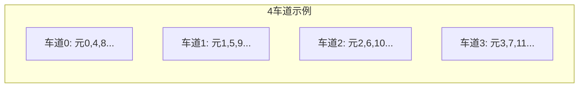

# 课件 10 — 向量体系结构 学习指南

> **课程**：计算机组成与体系结构（H）
> **课件**：`10_向量体系结构.pdf`｜NotebookLM `课件10-向量体系结构`
> **原则**：按课件原序、按知识点分块、**课件板块无遗漏**
> **课堂**：Week 15–16（DLP、SIMD、GPU、期末复习）
> **Lab**：—（与 [课件 7a](计组-课件07a-学习指南.md) 互连、[课件 08](计组-课件08-学习指南.md) 多核衔接）
> **教材章节**：唐朔飞《计算机组成原理》第 2 版 **第 9 章**；Patterson RISC-V 版 **第 4 章** §4.8–4.9、**附录 E**（RVV）
> **周次指南交叉引用**：[计组-Week15-16-学习指南](计组-Week15-16-学习指南.md)
> **原始采集**：`notebooklm-raw/kejian10/runs/20260620-000359/`（6/6 batch ✅）
> **结构图**：`notebooklm-raw/kejian/structure-map.md` §10
> **监修标准**：[计组-课件学习指南监修标准](计组-课件学习指南监修标准.md)
> **首轮监修**：2026-06-21｜状态：已首轮监修（A-）｜重点：Convoy/Chime、SIMD/SIMT
> **整合日期**：2026-06-20
> **术语格式**：术语表及正文**首次出现**时，专业名词采用 **中文（English）**；英文缩写采用 **缩写（English full name，中文）**，便于对照英文课件、教材与开卷试题。

---

## 课件内容覆盖索引

| 课件原序 | 课件板块 | Slide（约） | 本指南 | 状态 |
|----------|----------|-------------|--------|------|
| 1 | ILP 局限与 DLP、Flynn、Cray-1 | 板块 1 | Part 1 · 块 1.1–1.3 | ✅ |
| 2 | 向量寄存器、车道、链接、启动 | 板块 2 | Part 2 · 块 2.1–2.3 | ✅ |
| 3 | 多体交叉、Stride、Gather-Scatter | 板块 3 | Part 3 · 块 3.1–3.3 | ✅ |
| 4 | Convoy、Chime、Strip-mining、Mask | 板块 4 | Part 4 · 块 4.1–4.4 ⭐ | ✅ |
| 5 | GPU/SIMT、NVLink、期末衔接 | 板块 5 | Part 5 · 块 5.1–5.3 | ✅ |

---

## 缩写速查

| 缩写 | 解释 |
|------|------|
| **ILP / DLP / TLP** | Instruction-/Data-/Thread-Level Parallelism，指令级 / 数据级 / 线程级并行 |
| **SIMD / MIMD** | Single Instruction Multiple Data / Multiple Instruction Multiple Data，单指令多数据 / 多指令多数据 |
| **GPU** | Graphics Processing Unit，图形处理器 / 通用并行加速器 |
| **NoC** | Network-on-Chip，片上网络 |
| **PCIe** | Peripheral Component Interconnect Express，高速外设互连总线 |

---

## 本章怎么用（开卷复习路径）

1. **先定位为 DLP 收束章**：本章承接 05b 的 ILP 天花板和 08 的多核/TLP，说明为什么还需要 SIMD/向量/GPU。
2. **手算题先看 VL/MVL/Lane**：Convoy、Chime、Strip-mining 题先写向量长度、最大向量长度和车道数，再算轮数与周期。
3. **存储题看 stride 与 bank**：先算 `stride mod Bank数`，再判断是否集中到少数存储体；Gather/Scatter 属非连续访问补充。
4. **权重提醒**：向量体系结构是 Week15–16 串联章，优先级低于 Tomasulo、Cache/虚存、MESI，但 Chime/Strip-mining 手算仍值得保留模板。

| 定位 | 使用方式 |
|------|----------|
| 课件 | `10_向量体系结构.pdf`，按 DLP 动机 → 向量硬件 → 存储支持 → Convoy/Chime → GPU 查 |
| 教材 | 唐朔飞向量/I/O 延伸与 P&H 第 6 章并行体系结构背景 |
| Lab | 无直接 Lab；与 07a 互连、08 多核和 05b ILP 天花板衔接 |
| 周次 | Week15–16 收束复习，主要用于开卷补充和体系结构总览 |

---

## Part 1 — DLP 动机与 Flynn

> **本节要回答**：为何从 ILP 转向 DLP？SIMD 与 MIMD 如何取舍？

### 块 1.1 ILP 瓶颈

| 问题 | 后果 |
|------|------|
| 深流水/多发射 | 控制复杂、分支代价大 |
| 程序内在相关 | 每周期多条译码困难 |
| 科学计算访存 | 局部性差，Cache 难隐藏延迟 |

→ 转向**数据级并行**：一条指令处理多个独立数据。（来源：kejian10-part1-dlp）

### 块 1.2 Flynn 与能耗

| 类型 | 特点 |
|------|------|
| **SIMD** | 单指令多数据；程序员顺序思维+并行加速；**能耗优于 MIMD** |
| **MIMD** | 多 PC 异步；灵活但取指/同步开销大 |

（来源：kejian10-part1-dlp、[课件 08](计组-课件08-学习指南.md)）

### 块 1.3 Cray-1 要点

- 标量单元 + 向量扩展，Load/Store 结构
- **向量寄存器** + 深度流水功能部件
- **多体交叉存储**，无 Data Cache（硬件直供带宽）
- 向量长度与操作码分离，编程/编译器支持优雅

（来源：kejian10-part1-dlp）

---

## Part 2 — 向量硬件架构

> **本节要回答**：VL 与 MVL 何用？多车道如何分布元素？链接技术是什么？

### 块 2.1 向量寄存器与 VL

| 概念 | 说明 |
|------|------|
| **VRegs** | 固定最大长度 MVL 的向量缓冲（VMIPS 8×64 元素；RVV v0–v31） |
| **VL** | 控制**当前**指令实际操作元素个数 |
| **Strip-mining** | $n > MVL$ 时拆成多段循环处理 |

（来源：kejian10-part2-hardware）

### 块 2.2 多车道 (Lane)

元素条带化分布各车道，空间并行提吞吐。（来源：kejian10-part2-hardware）

### 块 2.3 链接与启动时间

| 概念 | 含义 |
|------|------|
| **Chaining（链接）** | 类似转发：首元素产出即开始下游运算 |
| **Startup** | 发射到流水线填满、首结果写回的时间 |
| **影响** | 短向量 startup 占比大；长向量才接近峰值 $R_\infty$ |

（来源：kejian10-part2-hardware）

---

## Part 3 — 存储系统支持

> **本节要回答**：为何要多体交叉？Stride 访存何意？Bank Conflict 如何判？

### 块 3.1 多体交叉存储

低位交叉编址：连续地址分散到不同 Bank，并行/流水访存，提升带宽。（来源：kejian10-part3-memory）

### 块 3.2 Stride 与 Gather-Scatter

| 模式 | 场景 |
|------|------|
| **Unit-stride** | 连续元素，效率最高 |
| **Stride** | 固定间隔（如矩阵按列访问行优先存储） |
| **Gather** | 按索引从非连续地址采集到密集 VReg |
| **Scatter** | 按索引写回稀疏位置 |

（来源：kejian10-part3-memory）

### 块 3.3 存储体冲突

步幅为 Bank 数倍数时，每次访问同一 Bank → 停顿，性能可降至 1/5 以下。（来源：kejian10-part3-memory）

**数值例**：8 个 Bank、低位交叉，按元素地址 `base + i × stride` 访问。

| stride | Bank 序列 | 结论 |
|--------|-----------|------|
| 1 | 0,1,2,3,4,5,6,7 | 连续分散，带宽最高 |
| 2 | 0,2,4,6,0,2,4,6 | 只用半数 Bank |
| 8 | 0,0,0,0... | 全部打到同一 Bank，严重冲突 |

> **开卷口诀**：看 `stride mod Bank数`，若与 Bank 数不互素，访问会集中到部分 Bank。（首轮监修补强）

---

## Part 4 — Convoy、Chime 与手算（期末 ⭐）

> **本节要回答**：护航组如何划分？$A=B\times s$（n=200, MVL=64, 4 Lane）要多少周期？

### 块 4.1 Convoy 与 Chime

| 术语 | 定义 |
|------|------|
| **Convoy（护航组）** | 可重叠执行、无结构冒险的向量指令集 |
| **Chaining** | RAW 相关指令可进同一 Convoy |
| **Chime（钟鸣）** | 执行一个 Convoy 的时间单位 |

执行时间 ≈ $m(\text{chimes}) \times n(\text{元素})$ 周期。（来源：kejian10-part4-convoy）

### 块 4.2 Strip-mining 次数

$\lceil n / MVL \rceil = \lceil 200/64 \rceil = 4$ 次。（来源：kejian10-part4-convoy）

### 块 4.3 向量 Mask

谓词比较生成 Mask（1 执行/0 屏蔽），将 **if 分支转为数据流**，避免分支预测惩罚。（来源：kejian10-part4-convoy）

### 块 4.4 数值例：$A = B \times s$，n=200，MVL=64，Lanes=4

| 步骤 | 计算 |
|------|------|
| 条带次数 | 4 |
| 单 Convoy 周期（忽略 startup） | $n / \text{Lanes} = 200/4 = $ **50** |
| 含循环开销 | $4 \times (\text{控制+startup}) + 50$ |

（来源：kejian10-part4-convoy）

---

## Part 5 — GPU/SIMT 与期末衔接

### 块 5.1 SIMD vs SIMT

| 维度 | 向量/SIMD | GPU SIMT |
|------|-----------|----------|
| 编程 | 显式向量指令 | 标量线程，硬件组 **Warp** |
| 延迟掩盖 | 深度流水 | **多 Warp** 切换（~1 周期） |
| 寄存器 | 一向量一寄存器 | 多 Lane 分布 |

（来源：kejian10-part5-gpu）

### 块 5.2 现代 AI 互连

- **NVLink**：GPU 直连，高带宽、统一地址空间
- **HBM**：数百 GB/s 匹配算力密度
- 大规模集群需 **胖树/超立方体** 拓扑 → [课件 7a](计组-课件07a-学习指南.md)

（来源：kejian10-part5-gpu）

### 块 5.3 期末交叉考点

| 主题 | 关联指南 |
|------|----------|
| 吞吐率 vs 响应时间 | [课件 01](计组-课件01-学习指南.md) |
| 拓扑参数计算 | [课件 7a](计组-课件07a-学习指南.md) |
| MESI / 一致性 | [课件 08](计组-课件08-学习指南.md) |
| Tomasulo / ILP | [课件 5b](计组-课件05b-学习指南.md) |

（来源：kejian10-part5-gpu）

---

## 易混概念对比（期末速查）

（来源：kejian10-mistakes）

| 概念组 | 关键区分 |
|--------|----------|
| ILP vs DLP | 指令重叠 vs 一条指令多数据 |
| SIMD vs SIMT | 固定向量寄存器 vs Warp 动态分组 |
| Stride vs 连续 | 跨步 vs 单位步长 |
| Chime vs CPI | 护航组时间单位 vs 单指令平均周期 |
| VL vs Strip-mining | 寄存器数值 vs 超长向量循环技术 |

---

## 与周次指南对照

| 本指南 Part | 周次指南 | 说明 |
|-------------|----------|------|
| Part 1–4 | [Week15-16](计组-Week15-16-学习指南.md) | DLP/向量期末复习 |
| Part 5 | [Week15-16](计组-Week15-16-学习指南.md) | GPU 与全册串联 |

---

## 复习优先级

| 优先级 | 范围 | 说明 |
|--------|------|------|
| 高 | Part 4 | Convoy/Chime 手算 |
| 中 | Part 1–3、5 | DLP 动机、存储冲突、SIMT |
| 低 | Cray-1 历史细节 | 了解 |

---

## 追问块

> **追问 1**：向量处理器为何常不用 Data Cache？

> **答**：科学计算流式访问，多体交叉直供带宽；Cache 对跨步/稀疏访问帮助有限。（来源：kejian10-part1-dlp）

> **追问 2**：Strip-mining 与 VL 寄存器如何配合？

> **答**：每轮循环将 VL 设为 min(剩余, MVL)；Strip-mining 是**外层循环控制**，VL 是**内层执行宽度**。（来源：kejian10-part4-convoy）

> **追问 3**：SIMT 分支发散如何处理？

> **答**：Warp 内线程走不同分支时，硬件**串行执行**各路径并 Mask 屏蔽，效率下降。（来源：kejian10-part5-gpu）

> **追问 4**：Chime 数为 3、向量长 100、无 Lane 并行，约多少周期？

> **答**：约 $3 \times 100 = 300$ 周期（忽略 startup）。（来源：kejian10-part4-convoy）

> **追问 5**：期末向量与体系结构何者优先？

> **答**：**Tomasulo、Cache/虚存、MESI** 权重更高；向量作 Week15–16 串联与手算补充。（来源：kejian10-part5-gpu）

---

## 监修自检（首轮）

| 维度 | 状态 | 本章结论 |
|------|------|----------|
| 来源/覆盖 | 通过 | 课件覆盖索引、deep raw、structure-map 与周次指南均已列出；首轮按 `计组-课件学习指南监修标准.md` 核对。 |
| 结构完整 | 通过 | 元信息、覆盖索引、Part 正文、易混对比、复习优先级、追问/资料索引齐全。 |
| 难点讲解 | 通过 | 已保留本章核心机制、公式或状态流程，避免只列术语。 |
| 图示/数值例 | 通过 | 首轮已补足可开卷查用的图示或手算例；非主考章节保持轻量。 |
| Lab/复习交叉 | 通过 | 已标注相关 Lab 与周次指南；Lab4-6 相关内容按期末重点突出。 |
| 二轮升级 | 完成 | 已补「本章怎么用」并明确 DLP 收束定位、Convoy/Chime 手算和 bank conflict 路径。 |

> **二轮 review 建议**：二轮可补 RVV 指令例与 bank conflict 更完整手算。

---

## 资料索引

| 类型 | 文件 / 路径 | 说明 |
|------|-------------|------|
| 课件 | `3_课件/10_向量体系结构.pdf` | 本指南主线 |
| 周次指南 | `guides/计组-Week15-16-学习指南.md` | 期末复习 |
| deep raw | `notebooklm-raw/kejian10/runs/20260620-000359/` | 6 batch ✅ |
| 关联指南 | `guides/计组-课件07a-学习指南.md`、`guides/计组-课件08-学习指南.md` | 互连与一致性 |
| 课件索引 | `guides/计组-课件梳理索引.md` | 双轨进度 |
