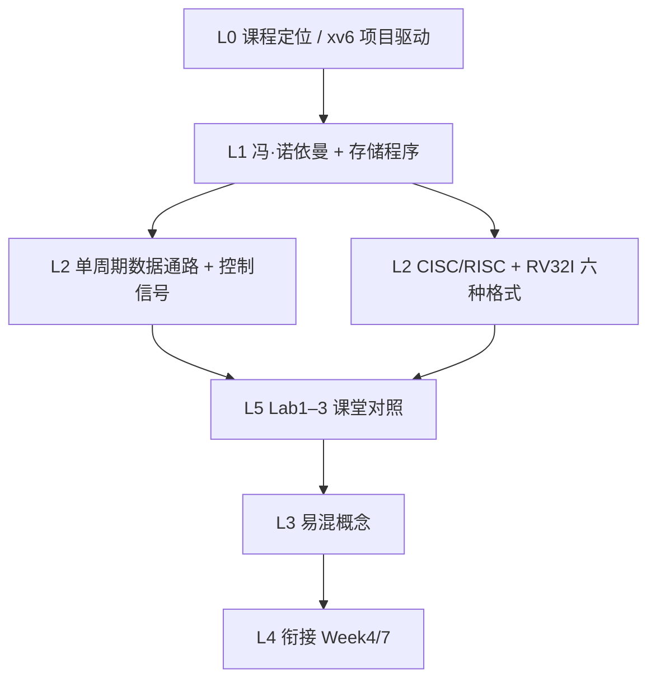

# Part 1（Week 1–3）知识图谱

> **run**：`notebooklm-raw/part1-week1-3/runs/20260616-150636/`（6/6）
> **指南**：`guides/计组-Week1-3-学习指南.md`
> **生成**：2026-06-16

## 通读审计

| 项 | 结论 |
|----|------|
| batch | 6/6 完成 |
| 期末权重 | **中** — 前三周为 Lab1–3 奠基；笔试多考 ISA/数据通路概念，深度在 Lab 调试 |
| 素材质量 | 冯·诺依曼、单周期控制信号、CISC/RISC 对比、Lab 对照表完整；w1 已含五级流水线预览（与 Week 7 有重叠，指南中标注） |
| 课纲偏差 | L0 将 Lab1 对应 Week 2、流水线冒险对应 Week 3，与「先单周期后流水」课件顺序一致；Week 7 专题在 raw 中仅 bridge 提及 |
| 必读 batch | `w2-datapath-controls`、`w3-cisc-risc-isa`、`lab13-crossref`、`w13-mistakes-bridge` |

## 认知阶梯

顺序说明：采集顺序为 L0→w1→w2→w3→lab→bridge；认知上应先建立系统全貌（L0/L1），再并行掌握「硬件怎么跑指令」（w2）与「指令长什么样」（w3），最后落到 Lab 实践与易混辨析。

## 节点清单

| 认知目标 | batch | 关键素材 | Agent 须补充 |
|----------|-------|----------|--------------|
| 前三周在整课中的位置 | L0-positioning | xv6 先搭骨架；Week4+ 理论回溯 | 与 Week10–11 虚存形成对比：前半动手、后半存储/异常 |
| 冯·诺依曼五大部件 + 存储程序 | w1-von-neumann | 五部件、IF–WB 五级预览 | 单周期 vs 五级流水的时间线澄清 |
| 单周期通路 + 四类控制信号 | w2-datapath-controls | PC/IM/RF/ALU/DM/CU；lw 关键路径 | RegWrite/ALUSrc/MemtoReg/Branch 真值表直觉 |
| CISC/RISC + Load/Store | w3-cisc-risc-isa | 六格式字段表、访存限制 | 与 Lab2 lw/sw 字段对应 |
| Lab1–3 验证点 | lab13-crossref | RAW/转发/停顿、握手、Flush、MMIO | load-use、mem_wait 调试提示 |
| 易混 + 后续衔接 | w13-mistakes-bridge | 4 组对比、Week4/7 桥接 | 哈佛架构解决结构冒险 |

## 叙事承接表

| 章节 | 要回答 | 承接 | 引出 | raw |
|------|--------|------|------|-----|
| §0 术语 | 体系结构/组成/ISA 各指什么 | 课程导论 | §1 知识地图 | w13-mistakes-bridge |
| §1 知识地图 | 前三周学什么、为何项目驱动 | Hello World 系统观 | §2 核心知识 | L0-positioning |
| §2.1 冯·诺依曼 | 五部件、存储程序、五级流水 | 计算机抽象层次 | §2.2 数据通路 | w1-von-neumann |
| §2.2 数据通路 | 模块职责、控制信号、lw 瓶颈 | 存储程序如何执行 | §2.3 ISA | w2-datapath-controls |
| §2.3 CISC/RISC | 设计哲学、六种格式、Load/Store | 译码需要认指令 | §3 Lab 对照 | w3-cisc-risc-isa |
| §3 Lab 对照 | Lab1–3 各验证什么 | 理论→RTL | §4 易混、§5 衔接 | lab13-crossref |
| §4–6 易混/衔接/自检 | 辨析 + Week4/7 预告 | 前三周闭环 | Week 4 数据表示 | w13-mistakes-bridge |

## batch → 指南章节映射

| batch | layer | 指南节 | 整合深度 |
|-------|-------|--------|----------|
| L0-positioning | L0 | §1 | 叙事框架，不逐条复述 |
| w1-von-neumann | L1+L2 | §2.1 | 五部件表 + 流水线 mermaid |
| w2-datapath-controls | L2 | §2.2 | 控制信号表 + lw 五步链 |
| w3-cisc-risc-isa | L2 | §2.3 | CISC/RISC 表 + 六格式表 |
| lab13-crossref | L5 | §3 | 三 Lab 对照表全文整合 |
| w13-mistakes-bridge | L3+L4 | §0、§4、§5 | 易混表 + 衔接段 |

## 课纲审计

| 偏差 | 处理 |
|------|------|
| w1 已讲五级流水线，课件 Week 7 才专题展开 | 指南 §2.1 仅作预览，标注「Lab1 骨架」 |
| w3 batch 标题含 CISC/RISC，但 Lab3 重点是分支/控制冒险 | §3 按 lab13-crossref 写控制流，ISA 格式放 §2.3 |
| raw 未覆盖 ABA、性能公式 | 指南 §5 轻量提及吞吐率，不展开 CPI 公式（留 Week 7） |
