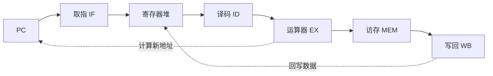

### 冯·诺依曼架构与五级流水线

#### 1. 冯·诺依曼架构五大部件
根据冯·诺依曼结构，计算机由以下五个基本部件组成 [1-3]：
*   **运算器 (ALU)**：执行加、减、乘、除等算术运算及逻辑运算 [1, 2, 4]。
*   **控制器 (CU)**：自动从存储器中取出指令并执行，指挥程序运行 [1, 2, 5]。
*   **存储器 (Memory)**：统一存放指令和数据，两者在形式上没有区别 [1, 2, 6]。
*   **输入设备 (Input)**：将程序和原始数据输入计算机 [1, 2]。
*   **输出设备 (Output)**：将运算结果输出给用户 [1, 2]。

#### 2. 存储程序 (Stored-program) 概念
这是冯·诺依曼结构的核心思想 [7-9]：
*   **统一存储**：程序（指令序列）和数据以二进制形式存放在存储器中 [1, 10]。
*   **自动执行**：计算机一旦启动，能无需人工干预，自动、逐条地从内存中取出指令并执行 [7, 8, 11]。

#### 3. 五级流水线各阶段功能
经典的五级流水线将指令执行分为以下阶段 [12-15]：
1.  **取指 (IF)**：根据 PC 的值从指令存储器中取指令，并计算 $PC+4$ [12, 16, 17]。
2.  **译码 (ID)**：对指令进行译码，并从寄存器堆中读取源操作数 [12, 17, 18]。
3.  **执行 (EX)**：在 ALU 中进行算术/逻辑运算，或计算分支转移目标地址 [12, 13, 17]。
4.  **访存 (MEM)**：若是访存指令（Load/Store），则进行数据存储器的读写操作 [13, 17, 19]。
5.  **写回 (WB)**：将运算结果或从内存读出的数据写回到目标寄存器中 [12, 17, 19]。

#### 数据通路草图 (Mermaid)

以上内容是否清晰？如果您想深入了解某一阶段（如“译码”时如何生成控制信号），我们可以继续讨论。