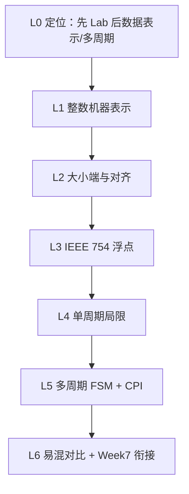

# Part 2（Week 4–6）知识图谱

> **run**：`notebooklm-raw/part2-week4-6/runs/20260616-151745/`（5/5）
> **指南**：`guides/计组-Week4-6-学习指南.md`
> **生成**：2026-06-16

## 通读审计

| 项 | 结论 |
|----|------|
| batch | 5/5 完成 |
| 期末权重 | **中高** — 整数/浮点手算、CPI 计算、多周期 FSM 为笔试常考；与 Lab1–3 数据通路互补 |
| 素材质量 | w4 手算例完整（-10/-123/-7）；w5 含 FP32/FP64 特殊值与 FP16/BF16；w6 CPI=4.04 数值例完整；L0 正确点出「先实验后理论」 |
| 偏差 | w5 延伸 BF16/LLM 超出课纲核心，指南中作拓展脚注；L0 提及 Week 7 Tomasulo 为前瞻，非本周考点 |
| 必读 batch | `w4-integer-repr`、`w5-ieee754`、`w6-multicycle-fsm`、`w46-mistakes-bridge` |

## 认知阶梯



```
L0 定位（系统先行、与 Lab1–3 衔接）
  → L1 原/反/补/移码手算
  → L2 大小端 + 数据对齐访存代价
  → L3 IEEE 754 格式、特殊值、隐含位
  → L4 单周期瓶颈（最长路径、资源冗余）
  → L5 多周期硬件复用 + FSM + CPI 公式
  → L3+L4 易混四组 + 流水线伏笔
```

## 节点清单

| 认知目标 | batch | 关键素材 | Agent 须补充 |
|----------|-------|----------|--------------|
| 理解「先实验后补理论」安排 | L0-positioning | Lab1 先行、Week4–6 回填 | 与 Lab3 分支 flush 挂钩 |
| 四种整数编码手算 | w4-integer-repr | -10 原/反/补；-123 补码；n=4 移码 -7 | 补码减法统一为加法直觉 |
| 大小端与对齐 | w4-integer-repr | 0x12345678 @100H 表；addr=6 需 2 次访存 | RISC-V 小端、对齐例外 |
| IEEE 754 编解码 | w5-ieee754 | FP32/64 位域；0.5、10.0 例；±0/∞/NaN | 非规格化数略提 |
| FP16/BF16 区别 | w5-ieee754 | 阶码 5 vs 8 位 | 标为拓展，非期末核心 |
| 单周期 vs 多周期 | w6-multicycle-fsm | lw 定周期；IM/DM 合并；IR/MDR 等 | 数据通路 mermaid |
| FSM 控制器 | w6-multicycle-fsm | 12 状态→4 位；Moore 机 | 状态转移草图 |
| CPI 加权计算 | w6-multicycle-fsm | 混合比→CPI=4.04 | 与单周期 CPI=1 对比 |
| 四组易混 + Week7 | w46-mistakes-bridge | 补码/移码、规格化/隐含位、CPI、FSM | 段间寄存器 vs 临时寄存器 |

## 叙事承接表

| 章节 | 要回答 | 承接 | 引出 | raw |
|------|--------|------|------|-----|
| §1 知识地图 | 为何 Week4–6 才讲数据表示？ | Week1–3 Lab 感性认识 | 整数→浮点→CPU 模式 | L0 |
| §2.1 整数表示 | 原/反/补/移码怎么手算？ | C 语言有符号比较陷阱 | 移码衔接浮点阶码 | w4 |
| §2.2 大小端对齐 | 多字节怎么存？不对齐代价？ | 访存指令硬件路径 | IEEE 754 字节序 | w4 |
| §2.3 IEEE 754 | 32/64 位怎么拆？特殊值？ | 移码 = 阶码表示 | 浮点运算单元（后续章） | w5 |
| §2.4 多周期 FSM | 为何不用单周期？CPI 怎么算？ | Lab1 单周期体验 | Week7 流水线重叠 | w6 |
| §4 易混/衔接 | 补码≠移码？临时寄存器≠段间寄存器？ | Week4–6 汇总 | 冒险/转发/乱序 | w46 |

## batch → 章节映射

| 指南节 | raw batch | 整合深度 |
|--------|-----------|----------|
| §0 术语表 | 综合 | Agent 编写 |
| §1 知识地图 | L0-positioning | 轻整合 |
| §2.1 整数表示 | w4-integer-repr | 深整合 + 手算表 |
| §2.2 大小端对齐 | w4-integer-repr | 深整合 |
| §2.3 IEEE 754 | w5-ieee754 | 深整合；BF16 脚注 |
| §2.4 多周期 FSM | w6-multicycle-fsm | 深整合 + mermaid |
| §3 Lab 对照 | L0 + w6 | Agent 补充 Lab1–3 |
| §4 易混概念 | w46-mistakes-bridge | 直引 + 表 |
| §5 前后衔接 | w46-mistakes-bridge | Agent 串联 Week7 |
| §6–7 自检/追问 | 综合 | Agent 编写 |

## 课纲审计

| 课纲要点（课件 02 + CPU 章） | raw 覆盖 | 备注 |
|------------------------------|----------|------|
| 原/反/补/移码 | ✅ w4 | 完整 |
| 大小端、对齐 | ✅ w4 | 完整 |
| IEEE 754 单/双精度 | ✅ w5 | 完整 |
| 特殊值 NaN/Inf | ✅ w5 | 完整 |
| 单周期局限 | ✅ w6 | 完整 |
| 多周期 FSM、CPI | ✅ w6 | 完整 |
| 浮点加减乘除电路 | ❌ 未采 | 属后续运算部件章，可 supplement |
| 非规格化数细节 | ⚠️ 略 | w5 仅提全 0 阶码 |

## 叙事承接

- **前接**：Week1–3 五级流水 Lab1–3，已有 CPU 全局观但缺数据表示理论
- **后接**：Week7 流水线（理想 CPI=1 + 短周期）；冒险/转发；Week8+ ILP
