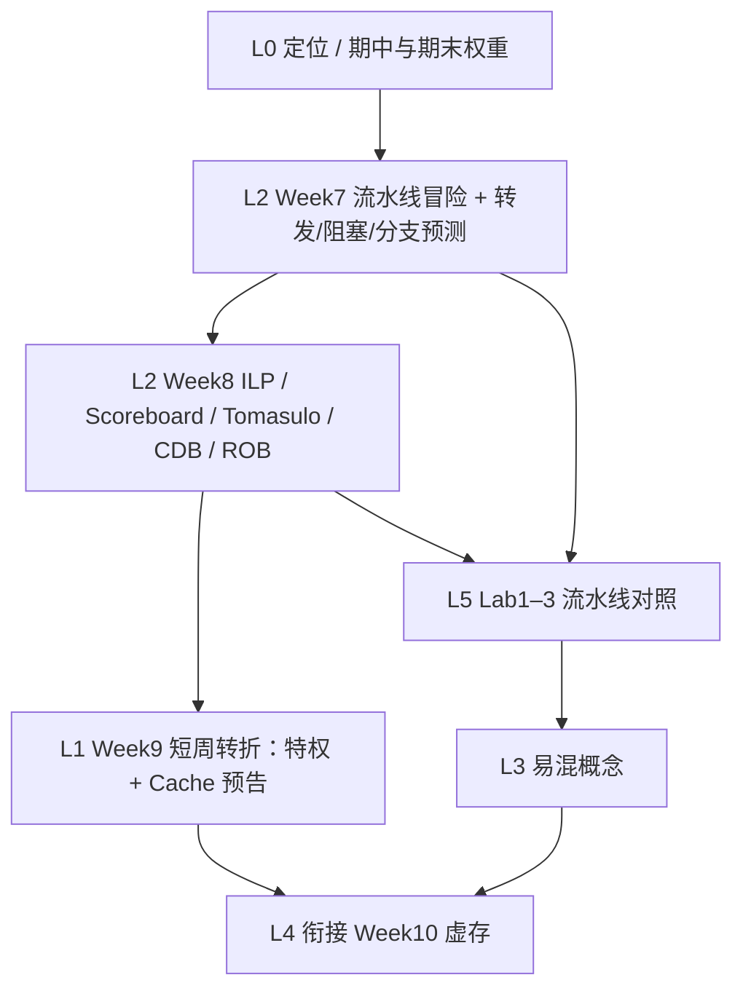

# Part 3（Week 7–9）知识图谱

> **run**：`notebooklm-raw/part3-week7-9/runs/20260616-151218/`（6/6）
> **指南**：`guides/计组-Week7-9-学习指南.md`
> **生成**：2026-06-16

## 通读审计

| 项 | 结论 |
|----|------|
| batch | 6/6 完成 |
| 期末权重 | **中偏低（笔试）/ 高（Lab）** — Week 8 明确流水线/记分牌/Tomasulo 期末笔试不作重点，主要靠 Lab1–3 考核；但期中复习笔记仍列 Tomasulo、转发为考点 |
| 素材质量 | 三类冒险、转发/阻塞、分支预测、Scoreboard/Tomasulo/CDB/ROB 完整；Lab 对照清晰；w9 偏过渡周（特权/Cache 预告） |
| 课纲偏差 | L0 与 w9 均提及特权/Cache，属 Week 9 短周预告，非本周核心；期中笔记混入 IEEE 754/中断等前序内容，指南中单独标注 |
| 必读 batch | `w7-pipeline-hazards`、`w8-ilp-scheduling`、`lab-pipeline-crossref`、`w79-mistakes` |

## 认知阶梯

顺序说明：采集顺序为 L0→w7→w8→w9→lab→mistakes；认知上应先掌握**冒险与静态流水线解法**（Week 7），再上升到**动态调度与乱序执行**（Week 8），Week 9 作转折桥接，Lab 对照贯穿验证。

## 节点清单

| 认知目标 | batch | 关键素材 | Agent 须补充 |
|----------|-------|----------|--------------|
| Week 7–9 在整课中的位置 | L0-positioning | 突破流水线瓶颈→乱序→存储/特权 | 期中 vs 期末权重矛盾澄清 |
| 时空图、加速比、三类冒险 | w7-pipeline-hazards | RAW/WAR/WAW；结构/数据/控制 | Load-Use 必须 stall 的直觉 |
| 转发、阻塞、分支预测 | w7-pipeline-hazards | EX/MEM 旁路；2 位预测器；BTB | 与 Lab1/Lab3 硬件对应 |
| 双发射、寄存器重命名 | w8-ilp-scheduling | 资源/配对/依赖三重限制 | 「储物柜编号」类比 |
| Scoreboard vs Tomasulo | w8-ilp-scheduling | 集中阻塞 vs 分布式 RS+换名 | CDB 广播、ROB 顺序提交 |
| Week 9 短周转折 | w9-short-week | 特权三动机；Cache 量化案例 | 不展开 Sv39（留 Week 10） |
| Lab1–3 流水线实践 | lab-pipeline-crossref | 转发 MUX；load-use stall；EX flush | mem_wait 与结构冒险 |
| 五组易混 + 期中要点 | w79-mistakes | RAW vs 名相关；RS vs ROB | 精确异常与推测执行 |

## 叙事承接表

| 章节 | 要回答 | 承接 | 引出 | raw |
|------|--------|------|------|-----|
| §0 术语 | 冒险/转发/保留站各指什么 | Week 1–3 单周期/ISA | §1 知识地图 | w79-mistakes |
| §1 知识地图 | 三周学什么、期末考不考 | Lab1–3 已实践流水线 | §2 核心知识 | L0-positioning |
| §2.1 流水线冒险 | 三类冒险怎么识别、怎么解 | 五级流水时空图 | §2.2 ILP | w7-pipeline-hazards |
| §2.2 ILP 动态调度 | Scoreboard/Tomasulo 差异 | 转发解决不了所有相关 | §2.3 Week9 转折 | w8-ilp-scheduling |
| §2.3 Week9 短周 | 特权动机、Cache 预告 | Tomasulo 理论收官 | Week 10 虚存 | w9-short-week |
| §3 Lab 对照 | Lab1 数据冒险、Lab3 控制冒险 | 理论→RTL | §4 易混 | lab-pipeline-crossref |
| §4–7 易混/衔接/自检 | 辨析 + 期中笔记 | Week 7–9 闭环 | Week 10 存储层次 | w79-mistakes, L0 |

## batch → 指南章节映射

| batch | layer | 指南节 | 整合深度 |
|-------|-------|--------|----------|
| L0-positioning | L0 | §1、§5 | 叙事框架 + 期中/期末权重 |
| w7-pipeline-hazards | L2 | §2.1 | 三类冒险表 + 转发/阻塞 + 分支预测 |
| w8-ilp-scheduling | L2 | §2.2 | Scoreboard/Tomasulo/CDB/ROB 全文整合 |
| w9-short-week | L1 | §2.3 | 短周转折段，不展开特权指令 |
| lab-pipeline-crossref | L5 | §3 | Lab1/Lab3 对照表 |
| w79-mistakes | L3+L4 | §0、§4、§6 | 五组易混表 + 自检 |

## 课纲审计

| 偏差 | 处理 |
|------|------|
| L0 期中笔记含 IEEE 754、中断、阿姆达尔等前序内容 | 指南 §5 单列「期中复习外延」，不混入 §2 核心 |
| Week 8 说流水线/Tomasulo 期末笔试不重点，但 w79 称 Tomasulo 期末重点 | 指南 §1 并列说明：笔试重心在后半存储/异常，Tomasulo 概念仍可能考推演 |
| w9 提前讲特权/Cache，课件 Week 10 才专题虚存 | §2.3 仅作动机预告，细节指向 Week 10–11 指南 |
| raw 未给 Tomasulo 逐步推演数值例 | 指南 §7 追问块引导手推保留站状态 |
