### 流水线时空图与加速比

流水线通过在同一时刻重叠执行不同指令的多个阶段来提高性能[1]。**时空图**（Space-Time Diagram）是分析流水线行为的直观工具，横轴表示时钟周期，纵轴表示指令序列[2, 3]。

```mermaid
gantt
    title 五级流水线理想执行时空图
    dateFormat  X
    axisFormat  %s
    section 指令 1
    IF: 0, 1
    ID: 1, 2
    EX: 2, 3
    MEM: 3, 4
    WB: 4, 5
    section 指令 2
    IF: 1, 2
    ID: 2, 3
    EX: 3, 4
    MEM: 4, 5
    WB: 5, 6
    section 指令 3
    IF: 2, 3
    ID: 3, 4
    EX: 4, 5
    MEM: 5, 6
    WB: 6, 7
```

**加速比 ($S_p$)** 定义为非流水线执行时间与流水线执行时间之比[4]。在理想情况下，一个 $m$ 段流水线的加速比等于流水段数 $m$[5]。

---

### 流水线三类冒险

流水线因无法正确执行后续指令而导致的停顿称为**冒险**[6]：

1.  **结构冒险 (Structural Hazard)**：多条指令同时竞争同一硬件资源（如只有一个存储器端口同时进行取指和访存）[6, 7]。
2.  **数据冒险 (Data Hazard)**：指令依赖前序指令尚未写回的结果。主要包含写后读（RAW）、读后写（WAR）和写后写（WAW）[8, 9]。
3.  **控制冒险 (Control Hazard)**：分支指令改变程序流，导致在确定跳转目标前已取入错误的指令[10, 11]。

---

### 转发 (Forwarding) 与 阻塞 (Stall)

这是解决**数据冒险**（特别是 RAW）的核心技术：

*   **转发**：不必等待结果写回寄存器，直接从流水段寄存器（如 EX/MEM 或 MEM/WB）将数据旁路送到 ALU 输入端[12, 13]。这能消除大部分由于 R 型指令引起的数据冒险[14]。
*   **阻塞**：当数据尚未生成（如 **Load-Use 冒险**）时，硬件必须插入“气泡”[15, 16]。实现方式是保持 PC 和 IF/ID 寄存器不变，同时将 ID/EX 段的控制信号清零，迫使后续指令延迟执行[17, 18]。

---

### 分支预测入门

分支预测用于降低**控制冒险**的开销：

*   **静态预测**：简单假设分支“总是跳转”或“总是不跳转”。对于循环结构，通常预测跳转准确率更高[15, 19, 20]。
*   **动态预测**：根据执行历史记录进行预测。**2 位动态预测器**最为常用，只有连续两次预测错误才会改变预测方向，对循环的预测准确率通常可达 90% 以上[21-23]。
*   **BTB (分支目标缓冲)**：缓存分支指令的地址及其跳转目标，使取指阶段即可完成预测[24, 25]。

这些内容涵盖了流水线设计的核心逻辑，您是否需要通过具体的指令序列（如一段汇编代码）来练习如何画出含冒险处理的时空图？[26, 27]