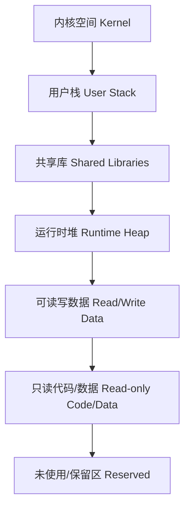

### 什么是虚拟存储

**直觉理解**：虚拟存储就像给每个程序发了一个“无限额度的信用卡”（逻辑地址空间），程序觉得自己拥有很大且连续的内存，但实际上银行（操作系统和硬件）只在它真正花钱（访问数据）时，才从金库（物理内存）里拨一点钱给它 [1, 2]。它在不好用的物理硬件和友好的用户界面之间架起了一座“桥梁” [3]。

**术语定义**：虚拟存储是磁盘和主存之间的缓存管理机制 [4]。它将主存看作外存的缓存，仅保存当前活动的程序段和数据，使得程序能在比实际物理空间大得多的逻辑地址空间中运行 [5, 6]。

---

### 存储墙/功耗墙与虚拟内存的关系

1.  **存储墙（Memory Wall）**：指数据传输速度远跟不上计算速度 [1]。虚拟存储利用程序的局部性原理，通过层次化存储结构（寄存器-Cache-主存-磁盘）尽量将活跃数据留在靠近 CPU 的层级，以缓解带宽瓶颈 [7, 8]。
2.  **功耗墙（Power Wall）**：指高密度计算带来的散热和电力挑战 [1]。虚拟化技术虽然带来了约 10%-15% 的性能开销，但通过资源隔离和动态分配，提高了多核系统的整体能效比和资源利用率 [1, 9]。

---

### 核心思想

*   **逻辑地址空间（Logical Address Space）**：每个进程都拥有独立、统一且连续的虚拟地址范围（如 32 位系统的 0-4GB） [1, 10]。这实现了“内存无关型”编程，简化了链接和加载过程 [1, 11]。
*   **按需分页（Demand Paging）**：不一次性将程序全部装入内存，而是仅在指令访问到缺失的页面时，才通过“缺页异常”从磁盘调入主存 [5, 12]。
*   **页表（Page Table）**：实现虚拟页（VPN）向物理页框（PPN）转换的核心映射字典 [10, 13]。每个进程维护自己的页表，记录装入位、修改位、访问权限等关键信息 [13, 14]。

#### 虚拟地址空间层次结构

*(注：地址从高到低生长 [15-17])*

这些概念清楚了吗？如果需要，我们可以深入讨论页表在 RISC-V 中的具体实现。