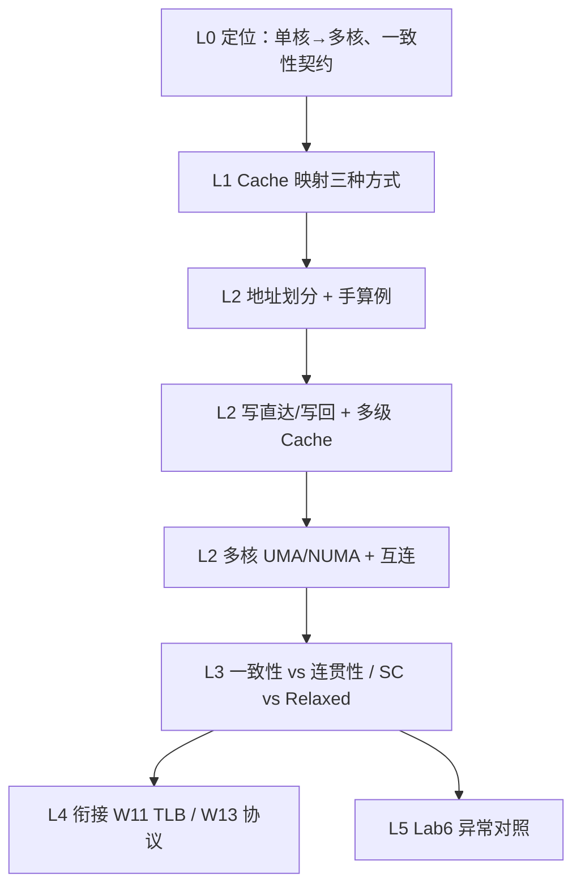

# Part 5（Week 12）知识图谱

> **run**：`notebooklm-raw/part5-week12/runs/20260616-152241/`（5/5）
> **指南**：`guides/计组-Week12-学习指南.md`
> **生成**：2026-06-16

## 通读审计

| 项 | 结论 |
|----|------|
| batch | 5/5 完成 |
| 期末权重 | **极高** — Cache 映射手算、写策略、多核一致性契约为笔试核心 |
| 素材质量 | 映射数值例完整（32b/64KB/16B）；写策略与多核架构清晰；Lab6 对照表实用 |
| 缺口 | raw 未展开 MSI/MESI 协议细节（属 Week 13）；VIPT 仅 bridge 提及，指南须补一句 |
| 必读 batch | `w12-cache-org`、`w12-write-policy`、`w12-mistakes-bridge`、`lab6-crossref` |

## 认知阶梯

## 节点清单

| 认知目标 | batch | 关键素材 | Agent 须补充 |
|----------|-------|----------|--------------|
| 周次定位与期末权重 | L0-positioning | TLP 转折、一致性契约 | 叙事线 mermaid |
| 直接/组相联/全相联 | w12-cache-org | 映射公式、Tag/Index/Offset | 对比表、地址划分图 |
| 手算地址位域 | w12-cache-org | 32b/64KB/16B/直接&4路 | 完整演算步骤 |
| 写直达 vs 写回 | w12-write-policy | Dirty bit、带宽 | 与一致性关系一句 |
| 多核 Cache 层级 | w12-write-policy | L1/L2 私有、L3 共享 | 层次 mermaid |
| UMA / NUMA | w12-write-policy | 集中/分布式共享 | 大白话类比 |
| 易混三组对比 | w12-mistakes-bridge | Coherence/Consistency、SC/Relaxed、ILP/TLP | 表格化 |
| W11/W13 衔接 | w12-mistakes-bridge | sfence.vma、MSI/MESI 预告 | 承接句 |
| Lab6 期末考点 | lab6-crossref | WB 精确异常、MMIO、对齐 | 对照表 |

## 叙事承接表

| 章节 | 要回答 | 承接 | 引出 | raw |
|------|--------|------|------|-----|
| §1 知识地图 | Week 12 学什么？为何期末重点？ | W10–11 虚存/TLB 解容量 | W13 缓存一致性协议 | L0 |
| §2.1 映射 | 三种映射如何划分地址？ | 存储层次局部性 | 手算与冲突缺失 | w12-cache-org |
| §2.2 写策略 | 写直达/写回各利弊？ | 单核 Cache 行为 | 多核脏块写回 | w12-write-policy |
| §2.3 多核模型 | 私有/共享 Cache？UMA/NUMA？ | 单核访存路径 | 一致性契约 | w12-write-policy, mistakes |
| §3 Lab6 | 异常与 Week 12 何关系？ | Lab4–5 MMU/trap | 期末综合 | lab6-crossref |
| §4 易混 | 三组概念怎么分？ | — | W13 协议实现 | w12-mistakes-bridge |
| §5 衔接 | 与 W11/W13 如何串？ | TLB 多核同步 | MSI/MESI | w12-mistakes-bridge |

## batch → 指南节映射

| 指南节 | raw batch | 整合深度 |
|--------|-----------|----------|
| §0 术语表 | 多 batch 提炼 | Agent 补 |
| §1 知识地图 | L0-positioning | 叙事 + mermaid |
| §2.1 Cache 映射 | w12-cache-org | 公式 + 数值例 |
| §2.2 写策略/多级 | w12-write-policy | 对比 + 层次图 |
| §2.3 多核存储模型 | w12-write-policy, mistakes | 契约定义 |
| §3 Lab6 对照 | lab6-crossref | 表格 |
| §4 易混 | w12-mistakes-bridge | 三组表 |
| §5–7 衔接/自检/追问 | mistakes + L0 | Agent 补 |

## 课纲审计

| 课件/周次预期 | raw 覆盖 | 偏差 |
|---------------|----------|------|
| Cache 映射（直接/组相联/全相联） | ✅ w12-cache-org | 无 |
| 写策略（写直达/写回） | ✅ w12-write-policy | 无 |
| 多核基本架构 | ✅ w12-write-policy | 无 |
| 一致性 vs 连贯性 | ✅ mistakes + L0 | 无 |
| 缓存一致性协议（MSI/MESI） | ⚠️ 仅预告 | 归 Week 13，指南标注即可 |
| Lab6 异常 | ✅ lab6-crossref | 与 Week 12 主题为「对照」非主课，合理 |

## 叙事承接（一句话）

- **前接**：Week 11 SATP/TLB 解决单核地址转换 → Week 12 转向多核私有 Cache 与共享主存
- **后接**：Week 13 用 MSI/MESI 等协议**实现** Week 12 定义的一致性契约
