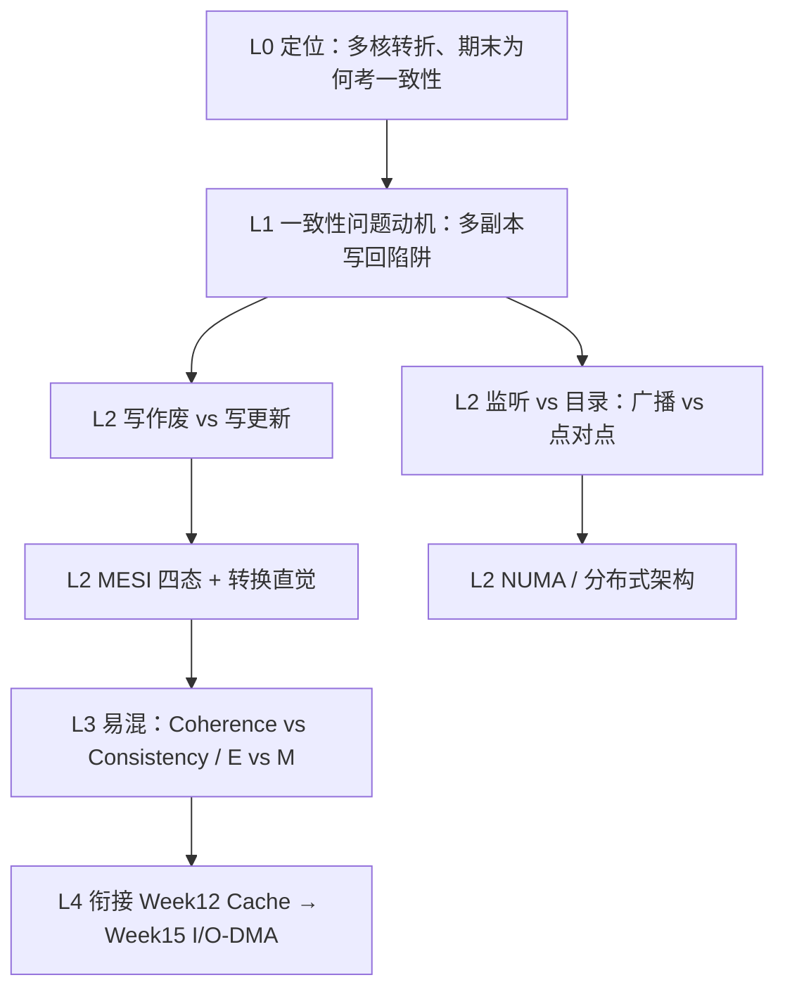

# Part 6（Week 13–14）知识图谱

> **run**：`notebooklm-raw/part6-week13-14/runs/20260616-145543/`（6/6）
> **指南**：`guides/计组-Week13-14-学习指南.md`
> **生成**：2026-06-16

## 通读审计

| 项 | 结论 |
|----|------|
| batch | 6/6 完成（`run.meta.json` 全 ok） |
| 期末权重 | **极高** — 一致性协议/状态转换/对比题为笔试核心；Lab 为单核，无法实操考核 |
| 素材质量 | 问题动机、监听/目录对比、写更新/写作废时序、MESI 四态、NUMA 扩展性完整；**缺** MSI 完整状态图数值推演、假共享量化例、存储连贯性（SC/放松模型）专节 |
| 必读 batch | `w13-coherence-problem`、`w13-directory-vs-snoop`、`w13-write-update-invalidate`、`w14-mesi-numa`、`w1314-mistakes-bridge` |

### 课纲偏差

| 偏差 | 说明 | 处理 |
|------|------|------|
| L0 将 Week 14 主标题写成「存储连贯性 Consistency」 | 课纲 Week 14 核心是**分布式架构 + 目录式一致性 + MESI + NUMA**；连贯性模型在课纲中属延伸概念 | 指南以课纲为准；连贯性 vs 一致性对比保留于易混节（来源 `w1314-mistakes-bridge`） |
| 假共享 | L0 提及，raw 无专 batch | 指南 §1 一笔带过，标注待补采 |
| MSI 协议 | 课纲与 L0 提及，raw 仅 MESI | 指南说明 MSI 为 MESI 子集（无 E 态） |

---

## 认知阶梯

整合顺序按读者认知阶梯，**≠** manifest 采集顺序。

---

## 节点清单

| 认知目标 | batch | 关键素材 | Agent 须补充 |
|----------|-------|----------|--------------|
| 多核为何出现不一致 | w13-coherence-problem | P1/P2 读写 X 时序；写回策略 | 与 Week 12 写回策略承接句 |
| 监听法瓶颈 | w13-coherence-problem, w13-directory-vs-snoop | 总线带宽、扇出、广播风暴 | SMP/UMA 适用场景标注 |
| 目录法原理与优劣 | w13-directory-vs-snoop, w14-mesi-numa | 对比表；点对点消息；共享向量 | 集中 vs 分布式目录一句 |
| 写作废 vs 写更新 | w13-write-update-invalidate | 连续写带宽对比；时序四步 | 与 MESI BusUpgr 挂钩 |
| MESI 四态含义与转换 | w14-mesi-numa | M/E/S/I 定义；PrRd/PrWr/Bus Snoop | mermaid 状态图 |
| NUMA 与扩展性 | w14-mesi-numa | 本地/远程延迟；Mesh 互连 | 程序员数据局部性提示 |
| 四组易混对比 | w1314-mistakes-bridge | 对比表 + 详解 | 追问块 ≥3 |
| 模块定位与期末 | L0-positioning | 单核→多核桥梁；DMA 预告 | 全景节「学完你能」 |

---

## 叙事承接表

| 指南节 | 要回答 | 承接 | 引出 | raw |
|--------|--------|------|------|-----|
| §0 术语表 | 一致性/连贯性/监听/目录各是什么 | Week 12 Cache 组织 | §1 全景 | w1314-mistakes-bridge |
| §1 知识地图 | 两周学什么、为何期末重点 | Week 12 多核 Cache | §2 机制 | L0-positioning |
| §2.1 一致性问题 | 为何多副本会矛盾 | 写回策略（Week 12） | 协议分类 | w13-coherence-problem |
| §2.2 监听 vs 目录 | 何时用哪种、瓶颈在哪 | 共享总线 SMP | 写维护策略 | w13-directory-vs-snoop |
| §2.3 写作废 vs 写更新 | 带宽与典型应用 | 监听协议前提 | MESI | w13-write-update-invalidate |
| §2.4 MESI + NUMA | 四态转换、大规模扩展 | E 态优化私有写 | Week 15 I/O | w14-mesi-numa |
| §3 Lab 对照 | 单核 Lab 与多核理论关系 | Lab1–6 无一致性硬件 | 笔试 vs 实验 | L0-positioning |
| §4 易混 / §5 衔接 | 四组对比、前后模块 | — | Week 15 DMA | w1314-mistakes-bridge |
| §6–7 自检 / 追问 | 可检验能力 | — | — | Agent 补 |

---

## batch → 章节映射

| batch | 整合深度 | 目标指南节 |
|-------|----------|------------|
| L0-positioning | 摘要 + 衔接 | §1.1–1.3 |
| w13-coherence-problem | 全文 | §2.1 |
| w13-directory-vs-snoop | 对比表 + 要点 | §2.2 |
| w13-write-update-invalidate | 时序 + 带宽分析 | §2.3 |
| w14-mesi-numa | 四态 + NUMA + 目录优势 | §2.4 |
| w1314-mistakes-bridge | 对比表 + 详解 | §4、§0 术语 |

---

## 叙事线（章级）

- **前接**：Week 12 解决单核 Cache 速度与容量；多核每核私有 Cache → 同一地址多副本
- **本周**：Week 13 建立一致性问题与协议族（监听/目录、写作废/写更新）；Week 14 落到 MESI 状态机与 NUMA 扩展
- **后接**：Week 15 I/O（DMA 直访主存 vs Cache 副本）；存储连贯性模型（课纲延伸，待补采）
