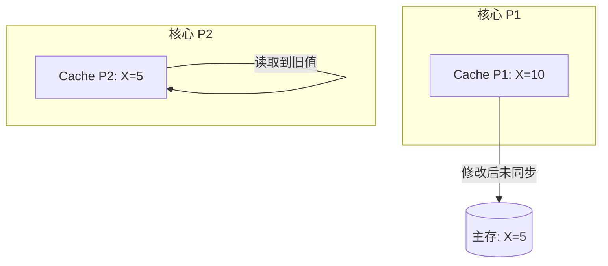

### 1. 为什么会出现缓存一致性问题？

**直觉理解：**
在多核系统中，每个核心（Core）都有自己“私有”的高速缓存（Cache），而主存是“共有”的[1, 2]。这就像几个厨师（核心）共用一个大仓库（主存），但每人都有自己的小推车（Cache）。如果厨师A从小推车里修改了某个食材的配方，但没有立刻放回大仓库，厨师B从小推车里拿出的还是旧配方，两人的数据视图就产生了矛盾[2, 3]。

**具体例子：**
假设内存中变量 `X = 5`：
1.  **核心 P1** 读取 `X` 到其 Cache 中[4]。
2.  **核心 P2** 也读取 `X` 到其 Cache 中。此时两个 Cache 里的 `X` 都是 5。
3.  **核心 P1** 修改 `X = 10`。由于采用写回（Write-back）策略，这个 10 可能只保存在 P1 的 Cache 里，还没更新到主存[3, 5]。
4.  **核心 P2** 再次读取 `X`，如果它直接从自己的 Cache 拿，读到的依然是旧值 5。此时，系统就出现了**缓存不一致**[2, 3]。

#### 双核共享变量场景模拟 (Mermaid)

---

### 2. 共享总线架构的瓶颈

监听协议（Snooping Protocol）依赖于共享总线来广播状态变更消息[4]。当核心数量增加时，这种架构会遇到以下瓶颈：

*   **带宽争用（Bandwidth Contention）：** 总线是唯一的公共路径。所有的读写请求、失效信号（Invalidate）和数据传输都必须通过总线。随着核数增加，总线会变得极其繁忙，成为严重的性能瓶颈[6, 7]。
*   **扩展性受限（Scalability Limit）：** 监听协议要求每个核心都要“盯着”总线上的每一个动作。当核数扩展到几十甚至上百个时，广播产生的通信量（广播风暴）会呈指数级上升，导致系统效率急剧下降[6, 8]。
*   **物理限制：** 总线在物理层面上的扇出系数（Fan-out）有限，限制了能够连接的处理器核心数目[7]。

**总结：** 共享总线架构在小规模多核（如4-8核）下非常高效，但在高性能大规模并行系统中，必须转向基于目录（Directory-based）的一致性协议以解决总线瓶颈[6, 8]。

您是否想深入了解如何通过“MESI协议”的具体状态转换来解决上述的不一致问题？