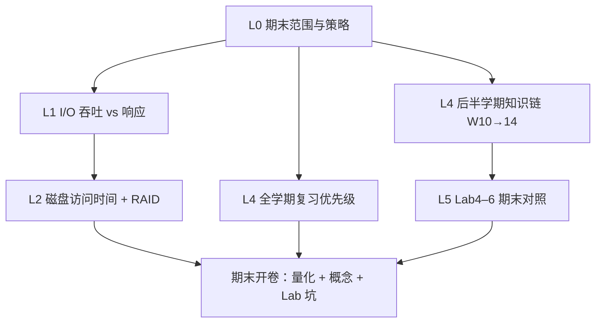

# Part 7（Week 15）知识图谱

> **run**：`notebooklm-raw/part7-week15/runs/20260616-150120/`（5/5）
> **指南**：`guides/计组-Week15-学习指南.md`
> **生成**：2026-06-16

## 通读审计

| 项 | 结论 |
|----|------|
| batch | 5/5 完成 |
| 期末权重 | **收官周** — I/O/RAID 为 Week 15 新内容；其余 batch 服务期末总复习 |
| 素材质量 | 期末范围、复习优先级、Lab4–6 对照表完整；`w15-io-disk-raid` 未覆盖 DMA/MMIO 细节，指南须从 Week 8–14 与 Lab 报告补链 |
| 必读 batch | `L0-final-scope`、`w15-review-backend`、`lab-final-crossref`、`w15-study-priority` |
| 课纲偏差 | `w15-io-disk-raid` 末尾追问 DMA，本模块 manifest 未单独采集；MMIO 在 `w15-study-priority` 中仅中优先级提及 |

## 认知阶梯



```
L0 期末定位（权重、开卷策略）
  → L1 I/O 性能矛盾（吞吐 vs 延迟）
  → L2 磁盘三段时间 + RAID 级别直觉
  → L4 存储链串联（虚存→TLB→Cache→一致性）
  → L4 全学期优先级清单（极高/高/中）
  → L5 Lab4–6 与笔试考点对照
```

## 节点清单

| 认知目标 | batch | 关键素材 | Agent 须补充 |
|----------|-------|----------|--------------|
| 期末考什么、怎么复习 | L0-final-scope | 后半学期偏重、开卷 30%、练习题 | 与 Week 8 范围说明对齐叙事 |
| I/O 性能权衡 | w15-io-disk-raid | 卡车 vs 网线类比；缓冲掩盖延迟 | MMIO/DMA 一笔带过（Lab3 链） |
| 磁盘访问量化 | w15-io-disk-raid | 寻道+旋转+传输；7200RPM 数值例 | 强调寻道为主瓶颈 |
| RAID 级别直觉 | w15-io-disk-raid | RAID 0/1/5/6/10 特性表 | 无计算细节，笔试以概念为主 |
| W10–14 存储链 | w15-review-backend | mermaid 四步衔接 | 与 Week10–11 指南去重、突出收官视角 |
| 复习优先级 | w15-study-priority | 极高：流水线冒险、Cache、Sv39、MESI | 标注各极高项对应 Lab |
| Lab4–6 考点 | lab-final-crossref | CSR/SATP/PageWalk/Trap/SFENCE | 扩展 Lab1–3 在优先级中的角色 |

## 叙事承接表

| 章节 | 要回答 | 承接 | 引出 | raw |
|------|--------|------|------|-----|
| §0 术语 | RAID、寻道、AMAT 等大白话 | Week 14 一致性收束 | §1 知识地图 | Agent |
| §1 知识地图 | Week 15 学什么？期末怎么考？ | 全学期 Lab1–6 实践 | §2 I/O/磁盘 | L0-final-scope |
| §2 I/O 与磁盘 | 吞吐/延迟矛盾？磁盘多慢？RAID 干嘛？ | Week 12 Cache 速度层 | §3 存储链复习 | w15-io-disk-raid |
| §3 后半学期链 | W10→14 每步解决啥？ | Week 10–11 指南细节 | §4 优先级 | w15-review-backend |
| §4 复习优先级 | 极高考点与 Lab 配合 | 全学期 Part 分布 | §5 Lab 对照 | w15-study-priority |
| §5 Lab4–6 | 实验能力↔考题类型 | Lab1–3 流水线基础 | §6 易混/自检 | lab-final-crossref |

## batch → 章节映射

| 指南节 | raw batch | 整合深度 |
|--------|-----------|----------|
| §1.1–1.3 知识地图 | L0-final-scope | 叙事化 |
| §2.1–2.2 I/O/磁盘/RAID | w15-io-disk-raid | 保留数值例 + 补全景 |
| §3 存储链 | w15-review-backend | 压缩复述，指向 Week10–11 指南 |
| §4 复习优先级 | w15-study-priority | 表格化 + Lab 标注 |
| §5 Lab 对照 | lab-final-crossref | 扩展为 Lab1–6 全景表 |
| §6–7 易混/自检/追问 | L0 + 各 batch | Agent 原创 |

## 课纲审计

| 预期（Week 15） | raw 覆盖 | 处理 |
|-----------------|----------|------|
| I/O 系统（吞吐/延迟） | ✅ w15-io-disk-raid | 写入 §2.1 |
| 磁盘性能 + RAID | ✅ w15-io-disk-raid | 写入 §2.2 |
| 期末总复习 | ✅ L0、w15-review-backend、w15-study-priority | §1、§3、§4 |
| Lab4–6 期末对照 | ✅ lab-final-crossref | §5 |
| DMA / 中断驱动 I/O | ⚠️ 仅 study-priority 提及 MMIO | 指南 §2.3 简要补链 Lab3 |
| 向量体系结构（课件11） | ❌ 未采集 | 期末了解级，指南不展开 |
| 互连网络拓扑 | ⚠️ L0 提及、priority 标「了解」 | §4 优先级表保留 |

## 前后模块衔接

- **前接**：Week 13–14 多核一致性收束；Lab6 中断/异常完成
- **本模块**：I/O 与磁盘放存储层次最底；期末整合全学期
- **后接**：期末考试（开卷 30%）；无后续周次
