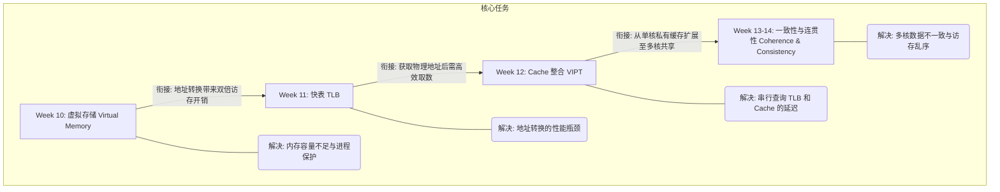

以下是串联 Week 10 至 Week 14 的计算机存储体系知识链条：

### 知识链条概览与衔接逻辑

---

### 步骤详解

#### 1. Week 10：虚拟存储 (Virtual Memory)
*   **解决问题**：主存容量受限与多进程安全隔离 [1, 2]。它为每个进程提供独立、连续的虚拟地址空间，实现了“内存无关型”编程 [1]。
*   **衔接机制**：通过**页表 (Page Table)** 记录映射关系 [3]。但逻辑上每次访存需先查页表、再取数据，导致访存耗时翻倍 [4, 5]。

#### 2. Week 11：快表 (TLB)
*   **解决问题**：地址转换的性能损耗 [4, 6]。
*   **实现方式**：利用局部性原理，在 CPU 内部设立一个小的硬件缓存 (TLB)，存放最近使用的页表项 (PTE) [3, 7]。
*   **衔接机制**：TLB 命中可立即获得物理地址 (PA)，但随后需进入缓存层次以获取实际数据 [8]。

#### 3. Week 12：Cache 整合 (VIPT)
*   **解决问题**：TLB 查询与 Cache 查询的串行延迟 [9, 10]。
*   **实现方式**：采用 **VIPT (虚索引物理标签)** 技术。利用虚拟地址中在转换过程中不变的“页内偏移”部分直接索引 Cache，同时并行查询 TLB 获取物理标签进行比对，隐藏了地址转换延迟 [9, 11, 12]。
*   **衔接机制**：在单核中该机制极高效，但在多核系统中，相同数据可能存在于多个私有 Cache 中，引发数据状态冲突 [13, 14]。

#### 4. Week 13-14：一致性与连贯性 (Coherence & Consistency)
*   **解决问题**：多核环境下的数据视图统一与访存定序 [15, 16]。
    *   **一致性 (Coherence)**：确保所有处理器对同一地址看到相同的值。通过**监听协议 (Snooping)** 或**目录协议 (Directory)** 维护数据状态（如 MSI/MESI）[13, 17, 18]。
    *   **连贯性 (Consistency)**：规定不同地址访存操作的可见顺序。通过**存储一致性模型**（如顺序一致性 SC 或放松模型）指导程序员编写正确的并行程序 [15, 19]。

这个链条完整展示了存储系统如何从“功能实现”进化到“单核性能优化”，最终解决“多核协同”挑战。你是否需要针对其中某个协议（如 MESI）进行更深入的探讨？