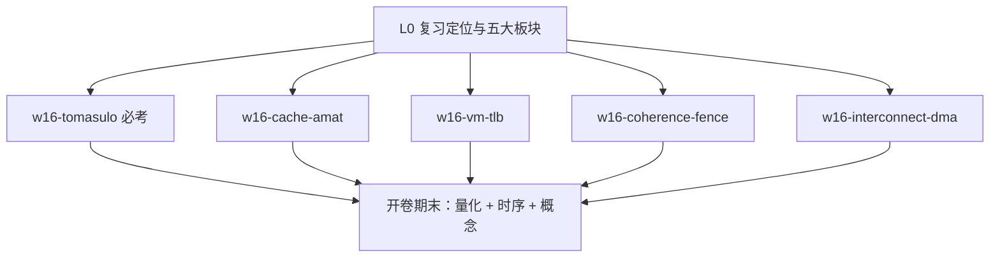

# Part 8（Week 16）知识图谱

> **run**：`notebooklm-raw/part8-week16/runs/20260619-171058/`（6/6）
> **指南**：`guides/计组-Week16-学习指南.md`
> **生成**：2026-06-19

## 通读审计

| 项 | 结论 |
|----|------|
| batch | 6/6 完成 |
| 期末权重 | **最后一周期末复习指导** — 老师明确五大板块 + Tomasulo 必考 |
| 素材质量 | 各 batch 与 Week 16 周一 FiCS 记录高度一致；周三课录音差，无额外知识点 batch |
| 必读 batch | `L0-w16-review-scope`、`w16-tomasulo`、`w16-cache-amat`、`w16-vm-tlb` |
| 课纲偏差 | Week 15 指南已覆盖 I/O/RAID；Week 16 深化 Tomasulo/互连/DMA，不重复 Week 15 §2 |

## 认知阶梯

## 节点清单

| 认知目标 | batch | 关键素材 | Agent 须补充 |
|----------|-------|----------|--------------|
| 五大复习板块、3–4 天节奏 | L0-w16-review-scope | 开卷 30%、体系结构偏重 | 与 Week 15 指南去重 |
| Tomasulo 时序与 RS 字段 | w16-tomasulo | MUL/ADD 示例、Qi/CDB | CDB 竞争一笔带过 |
| AMAT + LFU 模拟 | w16-cache-amat | 1ns/100ns/2% 例 | 与 Week 12 指南交叉引用 |
| TLB Reach + 大页权衡 | w16-vm-tlb | 64 项 DTLB、1GiB 扫描 | Lab5 Sv39 手算链 |
| 一致性 vs 连贯性、Fence | w16-coherence-fence | MESI 表、自旋锁 | Week 13–14 指南链接 |
| 互连/中断/DMA | w16-interconnect-dma | 环 n/4、关开流程 | Week 15 I/O 衔接 |

## batch → 章节映射

| 指南节 | raw batch | 整合深度 |
|--------|-----------|----------|
| §1 知识地图 | L0-w16-review-scope | 叙事化 |
| §2 Tomasulo | w16-tomasulo | 保留表格 + 时序思路 |
| §3 Cache/AMAT | w16-cache-amat | 数值例 + 映射对比表 |
| §4 TLB/大页 | w16-vm-tlb | 计算题模板 |
| §5 一致性/Fence | w16-coherence-fence | MESI + 锁语义 |
| §6 互连/中断/DMA | w16-interconnect-dma | 公式 + 流程 |
| §7–8 易混/自检/追问 | 各 batch | Agent 原创 |

## 课纲审计

| 预期（Week 16） | raw 覆盖 | 处理 |
|-----------------|----------|------|
| Tomasulo 必考 | ✅ w16-tomasulo | §2 |
| Cache AMAT/LFU | ✅ w16-cache-amat | §3 |
| TLB reach/大页 | ✅ w16-vm-tlb | §4 |
| MESI/连贯性/Fence | ✅ w16-coherence-fence | §5 |
| 互连/中断/DMA | ✅ w16-interconnect-dma | §6 |
| Lab+ 截止 6/28 | 📋 仅 L0 提及 | 指南脚注 |
